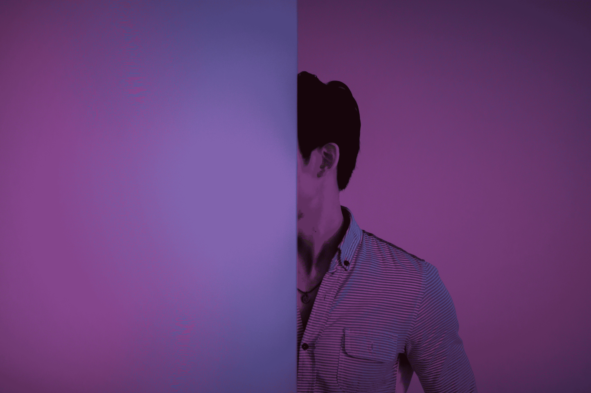
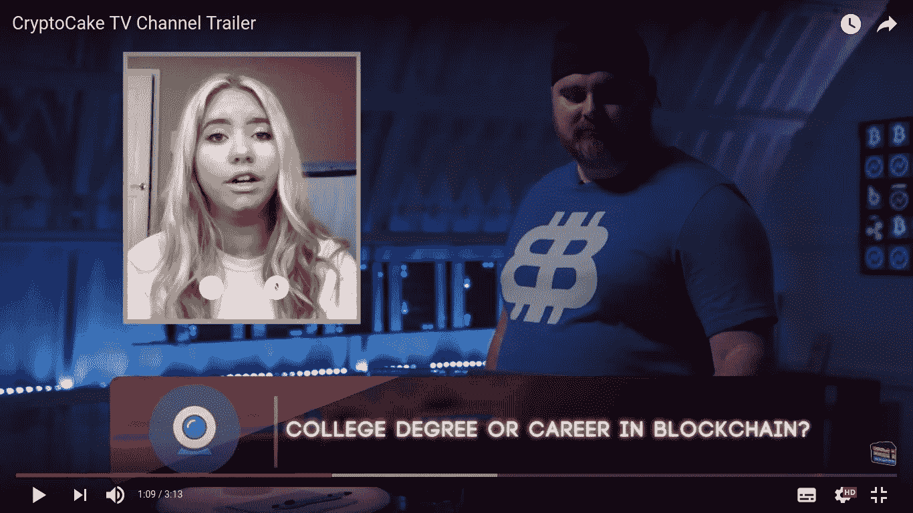
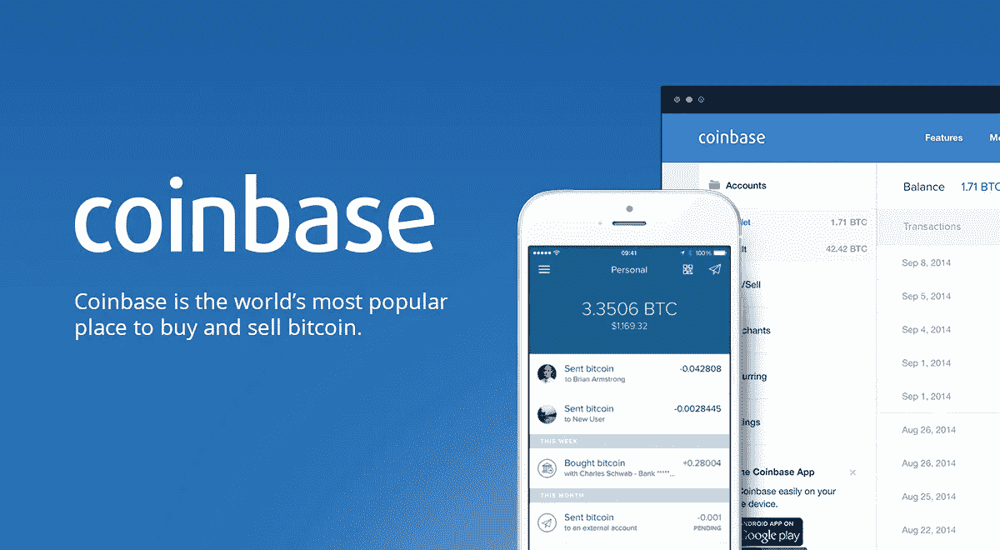

# “最古怪”的加密版本告诉我们关于区块链故事的什么

> 原文：<https://medium.com/swlh/what-the-wackiest-crypto-releases-teach-us-about-the-blockchain-narrative-b8ca531378ab>

Crypto but not invisible

当我去度假时，我尽量不去工作。我说“努力尝试”,是因为像大多数经营自己小生意的人一样，我发现很难完全停下来。对我来说，这意味着每天检查一次电子邮件，只有在紧急情况下才回复。

但是我可以看一些与工作无关的东西。上周我下班的时候看到了 10 月份最古怪的加密新闻稿******，我觉得这应该很有趣，于是打开了它。我会在“工作模式”下删除它。******

******就娱乐价值而言，它绝对令人失望。但是，通过从不同的角度观察 crypto 并窥视其黑暗之处所获得的轶事证据被证明是关于该行业及其当前叙事的启发性经验。******

# ******古怪——仔细检查******

******本文使用的幻灯片格式意味着它旨在浏览而不是阅读，更不用说点击链接了，但是——嘿——我做到了。有一些有趣的发现:******

## ******CryptoCakeTV******

************

******College or Crypto?******

********一个 24 小时直播的流媒体** [**YouTube 频道**](https://www.wealthmanagement.com/marketing/wackiest-crypto-press-releases-october/gallery?slide=1) **有 14 个节目专门介绍加密货币。********

> ****第一印象:为什么不呢？****

****“24 小时直播”似乎有点不必要，加密媒体场景看起来很拥挤。然而，一个致力于加密的新媒体企业并不是一个愚蠢的想法，因为人们对这个话题非常感兴趣。****

****该发布指向一个频道预告片，我将在这里留下。****

****对我来说，不同的节目形式看起来像是 90 年代古怪的游戏节目和脱口秀的混合体，但是，嘿…它叫做 CryptoCakeTV。也许目标市场是那些在深夜看 crypto 的人，他们并不总是头脑清晰。****

> ****第二印象:哇！****

****在 YouTube 上，CryptoCakeTV 有近 200 万订户，而该频道甚至还没有推出。让我觉得这些家伙是对的，他们显然已经设法为发布创造了一个大的嗡嗡声，从观众的角度来看，他们已经有了一个良好的开端。****

> ****第三印象:你差一点就抓到我了，但现在我要逃跑了！****

****坚持住！这个渠道到底是什么？作为一个 YouTube 极客，他正在研究 YouTube 的统计和 API，我喜欢看细节和数字。原来，这个用户名为“SoFloComedy”的频道实际上是一个传统的恶作剧频道，在受到太多版权打击后关闭了。****

****他们在推出之前没有获得巨大的吸引力，他们没有获得 200 万订户，他们是从一个目的完全不同的渠道转移过来的。****

****他们与狡猾的人为伍。****

## ****购买带加密的蓝宝****

********

****[都在标题里](https://www.crowdfundinsider.com/2018/10/140720-crypto-lambos-metahash-partners-with-lamborghini/)，真的。****

> ****第一印象:惊喜****

****根据许多加密网站发布的消息，这是兰博基尼拉丁美洲和#MetaHash 之间的合作。我不认识拉丁美洲兰博基尼公司的任何人，但我认识一个在 IBM 拉丁美洲工作的人，所以这个名字本身并没有让我觉得是假的，尽管整个事情听起来有点奇怪。****

> ****第二印象:很危险****

****一看网站，很明显这个[兰博基尼拉丁美洲](https://www.lamborghini.lat/)并不隶属于真正的意大利[兰博基尼](https://www.lamborghini.com/en-en)汽车制造商。这篇新闻稿有意误导。****

****没有必要再做任何调查来逃避这个了。****

## ****比特币基地 80 亿美元估值****

********

> ****第一印象:不清楚为什么这被认为是“古怪”****

****也许一个更有见识的读者会看到其中有趣的部分，但是我不明白为什么这篇文章中会包括这个。****

> ****第二印象:它并不真的古怪。****

****全球第五大交易所泛欧交易所的市值刚刚超过 40 亿美元。所以，是的，第四大加密交易所的价值是它的两倍这一事实引发了对其估值的质疑。****

****然而，如果你考虑其同行的估值(区块链 109 亿美元，以太坊 200 亿美元，XRP 180 亿美元)，就没有什么令人震惊的了。****

****也许整个板块的估值是疯狂的，或者也许整个独角兽现象是疯狂的，但那是另一回事。****

## ****Kodakcoin / Kodakone****

****这一个稍微老一点，但是已经引起我的注意。****

****From KODAKOne on Instagram****

****利用区块链管理[数字图像版权，并向摄影师](https://kodakone.com/)支付图像使用费。****

> ****第一印象:好主意！使用相同的技术来防止图像版权管理的双重花费是有意义的****

****听起来很有趣，但是，看起来这个项目已经胎死腹中了。****

****如果能看到柯达这个被颠覆的公司成为颠覆者，那将是一件非常令人惊奇的事情……但这不会发生。****

# ****来自一个不那么古怪的行业的教训****

****更多的新闻发布、实验和有趣命名的硬币可以被添加到列表中(这里[是其中的 23 个](https://www.pcmag.com/feature/358046/23-weird-gimmicky-straight-up-silly-cryptocurrencies/))。还有笑话，像 [Dogecoin](https://cointelegraph.com/news/from-memecoin-to-billion-dollar-player-dogecoin-breaks-1-bln) 原来远不止这些，手指对系统，像[没用的以太坊令牌](https://uetoken.com/)，原来也不过如此。****

****晦涩并不意味着古怪，许多项目至少在理论上是有意义的。他们成功的可能性可能很低，然而，这与整个数字创业场景没有什么不同，后者被描述得更加积极。****

## ****加密媒体有很多工作要做。****

****事实上，像上面这些与加密相关的可疑新闻稿被挑选出来并被放大，这令人担忧。挑战在于，这个领域需要的不仅仅是第一印象，以获得真实的画面。****

****确实需要更深入的分析和审查。不知何故，我不认为 CryptoCakeTV 会这样做。****

## ****你不能指望主流媒体会善待 crypto。****

****加密迷们高呼，媒体对比特币的报道是一场灾难。另一方面，金融媒体似乎对机器人顾问非常有利。但这就是媒体的工作方式，叙事提供了一种趋势，直到有什么东西让它们改变方向。在备受期待的比特币爆发后，一连串质量可疑的新闻稿丝毫没有阻止负面叙事的升温。****

## ****对降噪滤波器的需求****

****区块链发生了如此多的事情，以至于很难有什么有意义的事情引人注目。如果有一种神奇的方法去芜存菁，突出好的东西，或者至少是严肃的东西，一种新的叙事可能会出现。如果媒体做不到这一点，另一种方法是实施某种行业标准。在那之前，很难改变。****

****古怪可能不是 crypto 的现实，但它是故事的一个重要部分，这不仅仅是一个媒体问题，它是推动价格的因素，但更重要的是人心和思想。****

****仅有技术进步是远远不够的。早期的自由主义意识形态并不可信，就像互联网一样。对比特币的投机抓住了大众的想象力，但当泡沫破裂时，这种投机逐渐消失了。它现在需要一个更大的故事，我们都可以联系到前进，并转化为真正的需求。****

****目前，密码市场上有如此多的噪音，看起来不太可能出现新的故事。但是过滤掉噪音，可能会出现更明亮信息。****

****至于《全息时代的密码》的娱乐价值，你最好读读《达芬奇密码》。****

**********************************************************************

****感谢你的阅读，一个或大或小的掌声对我来说意义重大，如果你跟着我，我会给你带来更多相关的话题。****

*****我以前是金融专业人士，现在从事媒体工作，但我做了大量研究，探索如何让复杂的金融世界更具视觉吸引力。*****

*****如果你对金融品牌的内容营销感兴趣，可以看看这篇* [*免费洞察报告*](https://view.attach.io/rk0StiNkX) *。在里面，你会发现金融科技初创公司和华尔街巨头的杰出例子。*****

********

## ****这篇文章发表在 [The Startup](https://medium.com/swlh) 上，这是 Medium 最大的创业刊物，拥有+387，966 名读者。****

## ****在此订阅接收[我们的头条新闻](http://growthsupply.com/the-startup-newsletter/)。****

********