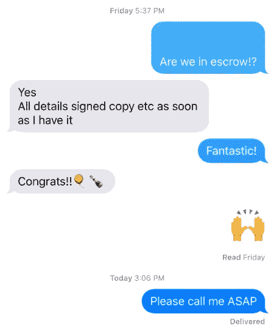

# 关于破产销售，他们没告诉你的是

> 原文：<https://medium.com/swlh/what-they-dont-tell-you-about-bankruptcy-sales-f432bfcc4962>

## 在旧金山不可能的房地产市场寻找便宜货

The growing San Francisco skyline.

我坚信生活中没有真正的捷径。交易和黑客存在，运气当然存在，但工作、时间和风险是固有的组成部分。购买房地产尤其如此，尤其是在旧金山购买房地产。如果你愿意全力以赴，尽职尽责，并且坚信你想要的，总有办法到达那里。问题从“我能得到这个吗？”到“这将如何发展？”

在 2017 年夏天的旧金山，房地产搜索开始了，作为一个年轻的首次购房者，当时没有住在旧金山，被敲竹杠应该是我购买雄心最有可能的结果。人们告诉我，我是贪多嚼不烂，我应该更有耐心。后者是真的，但我越是被告知，从我的有利位置找一笔好交易并不容易，我就越相信一定有办法。

我花了大约两个月的时间去看房子，并在网上做了彻底的调查，才找到一个我知道自己想要什么的地方。大约又过了一个月，我才确信，位于林孔山/东切的一栋特别的公寓大楼哈里森公寓(the Harrison)是我最想投资和居住的地方，又过了大约一周，我才意识到开发商卖的东西都有点定价过高。如果公寓在市场上卖了几个星期，那就不是我想要的。

冬天的某个时候，有一天，出现了一线希望。其中一套 1100 平方英尺的低层公寓在市场上出售，价格在我的承受范围内。我一和我的房地产经纪人通电话，我们就发现合同里有，一夜之间就被抢走了。我决心要得到下一个。我的问题是，我可以跑很长的距离，但反应却慢得可笑。我一点也不知道购房策略会遵循同样的模式。

这是一个关于在旧金山通过破产出售买房子的故事。我完全是个新手。我不仅没有破产销售的经验，也没有购房的经验。在这几个月的过程中，我经历了兴奋、希望、压力、怀疑和解脱。但最突出的是我学到了多少(可能是艰难的一步)。

**我想讲一点我的经历，让未来的购房者考虑一下买一栋房子*而不是*现成的房子的潜在好处，同时也提供一些可能不会被 Zillow 或你的房地产经纪人注意到的来之不易的建议。**

A new neighborhood. Photo courtesy of the East Cut Community Benefit District.

一个偶然的春天早晨，当我在网上搜寻房源时，我仔细看了看，然后不小心把咖啡掉在了地上。哈里森的一套公寓(我梦想中的建筑)被列为潜在的止赎对象。估计止赎成本，低于价值 30%。我立即打电话给我的房地产经纪人，给他发了截图，并祈祷这不是一个错误。他说他会给我更多的信息。他当天晚些时候打电话说，看起来财产是用现金支付的，所以可能是垃圾邮件。显然，在汇总房地产列表的网站上，一些房地产经纪人会提交实际上并不在市场上的房产，以此为他们的经纪公司带来客流量。

**关于止赎权或破产出售的信息不容易找到，而且相关信息往往不准确。你可以在 Zillow 上找到一个列表，上面说这是一个潜在的止赎权，但如果你仔细看看，拍卖日期是几个月前设定的，没有对列表进行更新。也许业主最终还清了债务，也许有人在一年前买了它，公共记录还没有更新，也许所有权有争议，甚至没有人可以正确地购买财产。这些都比没有更可行，你的房地产经纪人将不得不做一些深入挖掘，以获得事实真相。**

三天后，我的房地产经纪人打电话告诉我一个好消息。止赎清单是真的，不是垃圾邮件。虽然房源是真实的，但我的房地产经纪人知道，他不确定卖方正在上演一些戏剧，他需要进一步调查。第二天，他打电话告诉我，这是一个遗嘱认证的出售:业主已经去世，他的遗产正在试图出售财产。尽管遗嘱认证的销售由于附加的繁文缛节而变得棘手，但似乎只要我愿意经历一些困难，购买就可能发生。我告诉我的房地产经纪人，我想参与遗嘱出售，他说他会去房地产经纪人那里了解下一步行动。

一周后，我的房地产经纪人打电话给我，让我知道，事实上，财产不通过遗嘱检验。卖方已经死而复生，活得好好的。嗯，可能不太好。由于未支付抵押贷款，卖方取消了抵押品赎回权。我可能忽略了这样一个事实，即花了一周时间才发现卖家在这个世界上的存在状态，但我没有被阻止向前推进。我尽可能多地阅读了有关止赎权出售的资料，很高兴这个过程似乎没有遗嘱认证出售那么复杂。我需要等待进一步的进展细节。

几天后，在与代表该房产的房地产经纪人谈过之后，我的房地产经纪人带着另一个情节变化回来了。这套公寓不是止赎，而是一次 ***第 11 章破产出售。***

破产出售是不同的，因为财产被破产法院查封，属于法院指定的受托人的财产，而不是原所有人，因为法院有义务出售债务人的所有资产。通常情况下，债务人和潜在买家将进入一个家庭购买协议。将制定一个程序，以便如果其他人想提交财产的投标，他们可以。如果其他投标人提交投标，将举行拍卖。然后，破产法院将举行听证会，考虑是否应该批准向中标者出售。

这不完全是我的情况。

The lobby of the prospective purchase.

我被告知，在我对财产采取任何行动之前，我们必须等待——旧金山破产法院将举行听证会，会透露更多信息。开庭日期来了又去，受托人指定的经纪人给我的房地产经纪人发了一份报价单。我们以为我们获得了许可。破产出售要约的问题在于，它们是非偶然的，如果它被接受，你就被锁定在要约中。不允许“开玩笑的，不严重”。我意识到，尽管房地产经纪人告诉我一切都很好，标准，低风险，我需要一个专门从事破产销售的房地产律师来指导我完成这个过程。

律师看了看报价单，提出了几十个危险信号。**标志 1:经纪人还没有被法院指定**(即他还没有出售房产的权利。标志 2:该物业的业权有问题。标志 3:目前的所有者正在打一场长达一年的欺诈官司，并被迫出售旧金山房地产投资组合来偿还债务。他根本不想卖掉它，并打算尽一切可能拖延进程。

交易的状态让我完全震惊，我开始怀疑和不信任一切。我的动机和其他任何人都不一致。我所能做的就是等着听法院怎么裁决。我向我的房地产经纪人转达了我的律师的揭露，他和我一样震惊，问销售经纪人这到底是怎么回事。但显然，在破产销售的世界里，这是一切如常。

大约一个月后，法院确认了经纪人出售房产的权利，但产权问题仍未解决。我不会深入债务人案件的细节，但基本上，卖方在不得不申请破产之前，已经将公寓的所有权转让给了一个 LLC 实体，以试图保护资产不被纳入破产财产。

头衔的棘手之处在于它们遵循一个连锁系统。所有权从一个所有者传给下一个所有者，如果这个链条出现断裂，未来的“所有者”可能会发现他们实际上并不拥有财产，他们认为正确的所有权传给了他们。这就是所有权保险存在的原因。例如，如果 A 拥有一套住房，但随后将产权转让给了一家有限责任公司，然后被迫在破产时出售所有资产，法院可能会尝试出售 A 的财产。法院会将 A 人的原始所有权转让给买方 B 人。但问题是，从技术上讲，B 人不是合法所有人，即使他们支付了房屋的费用，因为他们从 A 人那里继承了无效的所有权。有限责任公司仍然拥有该资产。你可能会想，这是一个多么有缺陷的系统——的确如此。世界上大多数房地产市场只是发行新的产权，而不依赖于之前的产权状态。但不是在旧金山。

这正是我发现自己的情况。没有律师的调查，我就是一个无知的人 b。

法院需要澄清围绕所有权的问题，并裁定债务人的有限责任公司转让是否无效。两周后，另一家法院裁定，转让事实上是无效的，破产法院的受托人拥有有效的所有权。我需要聘请破产律师来确认法院的裁决，因为我当时住在东海岸，身体状况不允许我出庭。在这一点上，我认为海岸是干净的。我在法庭上经历了多次拖延，确认了出售房产的经纪人确实被授权出售房产，并确认了所有权的有效性。因此，我提出了对财产的报价。

两天后，我收到了经纪人发来的一条短信，其中包含了卖出经纪人发来的一条短信的截屏，称报价已被接受。

我高兴得跳了起来，以为我们就要结束了，但我心里明白，在经历了这么多问题之后，接受太容易了。三天后，我们发现这篇文章是错误的。受托人的经纪人显然是在出售几十处房产的过程中，不小心将短信发送给了错误的人(因此出现了“尽快给我打电话”的短信)。在文字证明我们被告知我们的报价被接受后，这样的错误怎么会发生在一个高状态的专业行业？发生这种情况是因为现实是混乱的，人类就是人类。

雪上加霜的是，我还发现有人提交了竞标。显然，在报价提交后，有 14 天的宽限期，以便考虑其他竞争报价。有人告诉我，我是唯一的出价方，但在竞标截止日期三天后，他们又告诉我，有人出价比我高。被玩弄、被欺骗、被失望的感觉刺痛。但是我已经走得太远了，不能就这么放弃。我想看到这一切结束。我打算参加现场拍卖(如果提交了多个报价，将举行现场拍卖以确定获胜的报价)。如果我赢了拍卖，这件事就会完成。这是必须的。我筋疲力尽。

当时我正在亚洲旅行，电话拍卖安排在凌晨 3 点。我起床后肾上腺素注入睡眠，拨通了拍卖线。我是第一号竞标者。竞拍者是二号竞拍者。我们的两个经纪人都在监听电话。我和我的经纪人通了电话，以防我们需要考虑策略。我已经做好了长期战斗的准备，因为每轮出价只能提高 5000 美元。

**第一轮**

*   我以二号投标人比我高的价格开价。

**第二轮**

*   二号竞拍者加注 5000 美元，
*   我匹配了。

**第 3 轮**

*   2 号出价者加注 5000 美元
*   我匹配了。

**第四轮**

*   2 号投标人拒绝投标任何期货
*   我赢了。

我赢了。什么？！我非常欣慰的是，投标人 2 有一条他们不会越过的强硬路线。离开我身体的肾上腺素让我颤抖。显然，我的经纪人在他的办公室里，在一个安静的开放式办公室里跳起来大喊大叫，引起了很多人的注视。完成了。

但是没有做到。债务人请求反对出售。我不得不去法院看看法官是否会做出有利于我的裁决，让这笔交易通过。在发生了所有这些事情之后，这将归结为一个法官的决定。在发生了这一切之后，法院甚至可能不会出售房产。在我看来，几乎一年的工作可能会白费。直到这时我才被告知我所承担的风险。

我的房地产经纪人和我去了破产法庭。这是一个有趣的地方。在通过了比美国运输安全管理局更严格的安全检查后，我和我的房地产经纪人找到了一个房间，没有任何细菌，和你在犯罪剧里看到的一样。在讨论我们的议程项目之前，大约有四个破产案件需要法官审理。这些案件在法庭上给人一种相当阴郁的感觉。大约一个小时后，这笔交易被提交给了法官。

债务人的律师陈述了他们的请愿书，这使我进入了荒谬的剧场。受托人的律师反驳，法官商议。决定前的沉默是尖锐而痛苦的。我的房地产经纪人说他从未在旧金山听到过如此的寂静。法官判我胜诉。剩下的将是一笔“正常的”房地产交易。我走出法庭时比走进法庭时更轻盈。但事实上，直到我坐在法庭上，我才知道这个过程会变成一场法庭大战，这仍然让我感到不安。

Bankruptcy Court © Steve Gaffney 2018

接下来的交易也不简单，但它们包含了所有关闭任何财产的例行斗争。由于情况复杂，我们可以结束的日子一直被推迟。即使在我签署了所有文件，在我的名下有了所有权之后，我发现我仍然不得不等待搬进来，因为法官必须记录销售。

八月，我搬进来了，我从来没有像现在这样有家的感觉。也许这是认知失调，但我从这个过程中学到的东西让我对买房可能会出什么问题有了更多的看法，未来，鉴于我口袋里的这个故事，我将能够更自信、更有经验地处理房地产。

如果我必须给一个潜在的购房者 TL；从我的经验来看，建议应该是这样的:寻找止赎权和破产销售，但只在你已经看到并确定的建筑中(你是按现状购买，没有意外，可能是全现金)。律师来了。阅读所有的细则。不要把任何人的话当成真理。做好多波折的准备。如果你对颠簸有耐心，你可能会得到价值。如果法官参与了你的交易，要有耐心。一个紧迫的时间表将会非常令人沮丧。但是当时机到来时，这种经历将会是非常有益的。

East Cut and Rincon Hill skyscrapers. The Harrison standing to the right of the Salesforce Tower.

## 这篇文章发表在[《创业](https://medium.com/swlh)》上，这是 Medium 最大的创业刊物，有+391，714 人关注。

## 订阅接收[我们的头条新闻](http://growthsupply.com/the-startup-newsletter/)。

