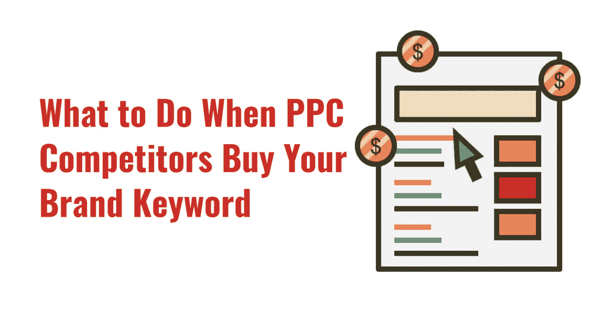

# 当竞争对手购买你的品牌关键词时该怎么办

> 原文：<https://medium.com/swlh/what-to-do-when-competitors-buy-your-brand-keyword-abb2f17c5f51>

如果你在付费搜索游戏中，你可能已经花了相当多的钱试图通过使用品牌关键词和你的品牌名称来产生更多的质量线索。

所以，你需要做的最后一件事就是让另一家企业购买你的品牌关键词，并利用它来建立品牌声誉或推动这些品牌的天才营销计划…