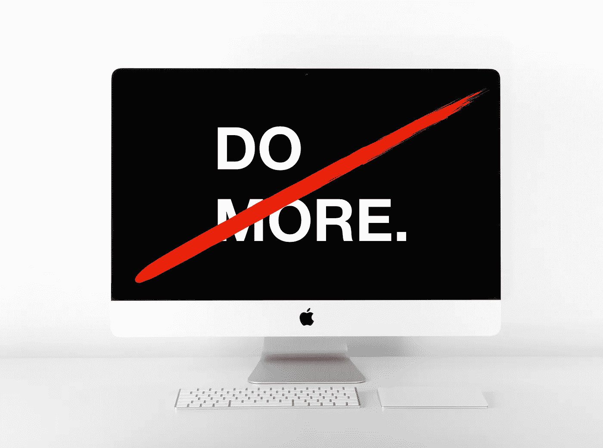

# 当你的应用程序让你失望时该怎么办

> 原文：<https://medium.com/swlh/what-to-do-when-your-apps-fail-you-7029d9aad190>

Photo adapted from [Thomas Quaritsch](https://unsplash.com/photos/m2zuB8DqwyM?utm_source=unsplash&utm_medium=referral&utm_content=creditCopyText) on [Unsplash](https://unsplash.com/search/photos/mac-wallpaper?utm_source=unsplash&utm_medium=referral&utm_content=creditCopyText)

作为一名作家，报道生产力的最大好处是人们会开始向你指出新的更好的工具。不太好的事情是，这些工具往往既不是新的也不是更好的。但是每隔一段时间，一些真正不同的东西就会出现。

我上一次“偶尔”发生在两周前。这个工具叫做 [Workona](https://workona.com/) 。你可以把它想象成一个操作系统…