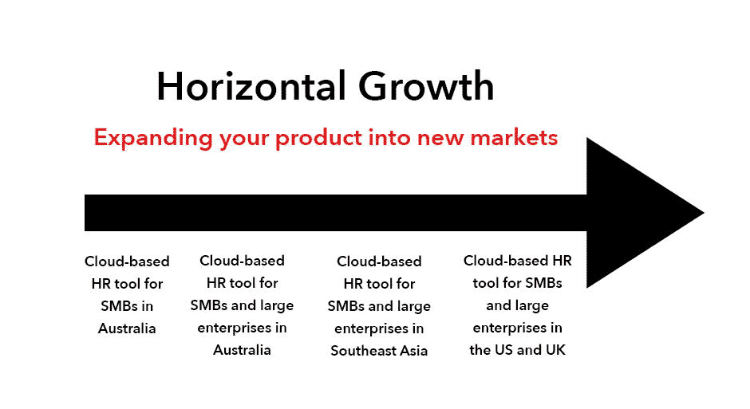

# 当你的初创公司遭遇增长停滞时该怎么办

> 原文：<https://medium.com/swlh/what-to-do-when-your-startup-hits-a-growth-plateau-de3d0f0b7d34>

Originally published on [http://www.appsterhq.com](http://www.appsterhq.com/?utm_source=CP&utm_medium=Medium)

从本质上讲，21 世纪的科技初创公司从根本上关心的是*增长。*

从 Y Combinator 的[保罗·格拉厄姆](http://www.paulgraham.com/growth.html)到连续创业者[史蒂夫·布兰克](https://steveblank.com/2010/01/25/whats-a-startup-first-principles/)到“精益创业”倡议者[埃里克·里斯](http://www.startuplessonslearned.com/2008/09/three-drivers-of-growth-for-your.html)，共识很明确:创业公司必须成长，不仅是为了生存，也是为了繁荣。

增加客户数量，发展规模经济，获得更大的市场份额，增加收入和利润，并拓展新市场:最终，如果一家初创公司不成长，它就无法生存。

然而，当你的创业停滞不前，收入持平时，你会怎么做？

在这篇文章中，我将讨论 3 个行之有效的策略，你可以用它们来度过停滞期，我也将分享一些在 Appster 帮助创业公司成长的见解。

# **成长的重要性**

在最近的一篇文章中，我强调了成长对创业活力的重要性，指出了以下三个关键事实:

> *“1。创业公司努力建立全球业务***每年创造数百万甚至数十亿美元的收入。* ***每周 5%-10%的增长率*** *是现在的创业公司尝试并实现的那种海量、高速的增长。**
> 
> **2。为了快速大幅增长，初创企业必须展现出* ***规模经济*** *也就是说，你的客户越多，你的产品成本就越便宜。**
> 
> **3。21 世纪的创业公司必须追求并有效地服务于* ***巨大的(和/或快速扩张的)市场*** *这些市场有大量消费者对紧急问题解决方案的需求。**

*所有这些都表明，今天的初创公司绝对是在尽可能合理地快速扩大规模。*

*然而，当你的初创公司达到增长平台期，然后努力扩大规模和运营时，会发生什么呢？*

*在这一点上，开始应用以下 3 个关键策略中的一个或多个来(重新)点燃增长和扩展你的业务变得至关重要。*

# *1.垂直扩展*

**

*纵向增长——有时被称为“向不同的纵向市场扩张”——包括努力通过增加销售来获得**更大的市场份额**。*

*正如来自 easternpeak.com 的[valeria Timokhina](https://easternpeak.com/blog/how-to-scale-your-mobile-startup-vertical-vs-horizontal-growth-strategies/)解释的那样:*

> *“纵向增长意味着在现有业务范围内扩展您的服务/产品。通过深入当前市场，你有机会增加对你的产品的需求和采用。”*

*垂直扩张对于一家寻求扩大业务的初创公司来说非常有吸引力，因为它包括通过瞄准一个市场来扩大业务规模的努力，这个市场的动态、客户需求和愿望以及存在的问题已经众所周知。*

*通过纵向扩张，至少有两种主要方式可以扩大现有的市场份额:*

1.  *向现有产品添加更多特性、功能和服务:向当前产品添加新特性的主要目的是吸引新客户，他们的复杂需求目前还没有被您的产品满足。通过提供新服务来满足这些需求，从而带来新客户**您将能够开发额外的收入来源。通过增加补充功能进行垂直扩张的一个很好的例子是拼车服务[优步](https://www.uber.com/)(有史以来发展最快的公司之一)。优步最初提供豪华轿车服务，但后来通过提供额外的便利设施，如优步 X、优步 XL 和优步 Black，扩大了服务范围。截至 2017 年夏天，优步的估值约为 690 亿美元。***
2.  ***开发和销售新产品**:除了为现有产品提供新功能，你还可以通过开发和销售你认为有需求的新产品来增加你的市场份额。[美国云计算公司 Salesforce](https://www.salesforce.com/) 是通过开发新产品获得更大市场份额的创业公司的一个很好的例子。Salesforce 最初是一款面向企业销售团队的基于云的 CRM 软件。后来，该公司开发(并收购)了其他云托管技术和产品，以便通过诸如 [com](https://www.desk.com/product) (在线客户服务工具)和[Pardot](https://www.salesforce.com/eu/products/pardot/overview/)(B2B(企业对企业)销售和营销自动化工具)等服务瞄准企业市场。*

# *2.水平扩展*

**

*横向增长旨在通过进入新的市场来扩大业务运营**——新的地理位置和/或业务部门。***

*试图在新的市场中竞争既带来了巨大的潜在收益，也带来了各种独特的风险和不确定性。*

*在中，除了履行创业公司在[准备在](http://www.appsterhq.com/blog/markets-fancy-ideas-create-successful-start-ups)[新市场](http://www.appsterhq.com/blog/early-stage-entrepreneurs-launch-profitable-startup)推出时应该履行的尽职调查之外，实现横向扩张的最有效方式是利用你现有的优势和知识，而不是瞄准一个你没有人脉、也不了解的完全陌生的市场。*

*这里有三种追求横向增长的方法:*

1.  *在新市场复制你的商业模式:鉴于你目前的商业模式在一个市场运作良好，你很有可能在其他地方成功复制。这种横向扩张的两个例子是亚马逊和优步。亚马逊使用有效的电子商务策略来主导零售市场，然后扩展到电视和电影市场，并以 [Amazon Prime](https://www.primevideo.com/) 的形式应用这一策略。优步利用尖端移动技术大规模扰乱了出租车行业，然后以新的运输和交付服务的形式将这种方法应用到其他市场(例如， [UberEats](https://www.ubereats.com/) 和 [UberRUSH](https://www.ubereats.com/) )。*
2.  ***利用你现有的资产**:通过利用现有的资产，发现更多的方法来将你的企业所能提供的不同类型的价值货币化是一种横向发展的方式。例如，亚马逊认识到，它可以通过向第三方提供仓库服务，将自己为零售创造的超高效仓库网络货币化。[亚马逊的履行](https://services.amazon.com/fulfillment-by-amazon/benefits.htm)就这样诞生了:第三方公司现在可以把他们的产品存放在亚马逊的仓库里，亚马逊负责零售交易中的其他一切(提货、包装、运输、客户服务等等)。*
3.  ***将更多业务内部化(即从供应商那里抢走业务)**:这是一种非常常见的确保横向增长的方法。一旦你的创业公司在规模和运营上足够大，开始在内部开展业务的某些方面是有意义的。您可以构建必要的基础设施，让您的公司自己负责这些服务，而不是让第三方供应商或交付服务以一定的成本为您执行这些操作。以苹果为例。多年来，苹果并没有像零售公司一样运营(而是专注于技术产品的创造)。然而，今天，苹果商店是整个美国最赚钱的零售店，这使得苹果公司能够以牺牲第三方零售商的利益为代价获得额外收入。*

*横向增长就是逐步向邻近市场扩张:*

**

# *3.发展战略伙伴关系*

**

*第三个关键策略是发展战略合作伙伴关系，以克服增长停滞并(重新)点燃你的业务扩张。*

*“战略合作伙伴”可以定义为:*

*   *“为实现既定的共同目标而达成物质和/或智力资源共享长期协议的一方”([source](http://www.businessdictionary.com/definition/strategic-partner.html))；或者，更简单地说*
*   *“你与之达成协议的另一家企业，旨在帮助你们双方取得更多成功”([来源](https://www.forbes.com/sites/davelavinsky/2013/04/02/does-your-business-have-strategic-partners-why-not/#f59aa362731f))*

*建立战略合作伙伴关系可以帮助您通过利用这种联盟带来的以下竞争优势来发展您的业务:*

*   *[获得新客户](http://www.infonote.com/7-benefits-strategic-partnerships/)，以及进入新市场或市场领域的机会:每个企业都可以瞄准对方的“热情”客户群，从而增加客户群*
*   *[增加曝光率和品牌认知度](https://www.americanexpress.com/us/small-business/openforum/articles/how-strategic-partnerships-benefit-small-businesses/):例如，与非竞争企业开展联合营销活动，以交叉推广彼此的产品或服务*
*   *[资源共享](https://www.forbes.com/sites/davelavinsky/2013/04/02/does-your-business-have-strategic-partners-why-not/2/#1877e8e33203)如技术或金融服务:例如，非竞争的数字应用初创公司为了双方的共同利益共享技术(如创新)*
*   *[扩大地理范围](http://www.infonote.com/7-benefits-strategic-partnerships/):除非战略合作伙伴在相同的地理空间内运营，否则这种精心策划的联盟很可能会带来以前未开发的市场或全球区域*

*以下是战略伙伴关系运作的几种不同方式:*

***A .合资企业***

*根据 inc.com 的说法，“合资企业”是由两家或两家以上的公司从事的有时间限制和以项目为重点的商业企业，其目的是分担特定商业活动的费用和利润(希望如此)。*

*目的可以是创造一个全新的产品供应和/或合作进入(或扩展到)一个新的市场。*

*两家科技公司成立合资企业的一个例子是 2014 年脸书 Oculus Rift 和三星(Samsung)开发三星设备的交易。*

*脸书同意负责软件方面的事情，而三星则负责硬件。*

*这使得三星进入了一个新的市场(即虚拟现实)，而 Oculus 则获得了一个新的分销渠道的独家使用权。*

***B .分销伙伴关系***

*如果你发现自己正试图实现增长，但你已经用尽了你的市场覆盖范围，那么分销伙伴关系尤其有用。*

*一个合适的分销合作伙伴可以帮助你开发新的客户群。*

*许多年前，谷歌通过与各种网络浏览器公司签署协议，为他们提供浏览器内搜索，赢得了在线搜索市场的巨大份额。*

*随着时间的推移，这帮助谷歌提升到现在占据的主导垄断地位。*

***C .许可机会***

*当你的公司拥有 a)可以垂直整合到其他创业公司销售的产品中的技术，或者 b)一个声誉好、有吸引力的品牌，如果另一家公司使用你的品牌，它可能会从中受益时，以许可协议形式的战略合作伙伴关系会非常有效。*

*两个简单的例子？*

*   *星巴克早在 2008 年就与联合利华签署了一份许可协议，让联合利华生产、销售和分销星巴克品牌的冰淇淋。*
*   *[谷歌早在 2014 年就与制药公司诺华(Novartis)签署了一份许可协议](http://www.reuters.com/article/us-novartis-google-ceo-idUSKBN0FK0U320140715):两家公司同意诺华使用谷歌的“智能镜片”技术，尝试开发新类别的眼部护理产品(包括“智能”隐形眼镜，允许糖尿病患者通过测量眼液来跟踪他们的血糖水平)。*

## *感谢阅读！*

# *如果你喜欢这篇文章，请随意点击❤下面的心形按钮，帮助其他人找到它！*

**

> *最初发表于[http://www.appsterhq.com](http://www.appsterhq.com/?utm_source=CP&utm_medium=Medium)*

******