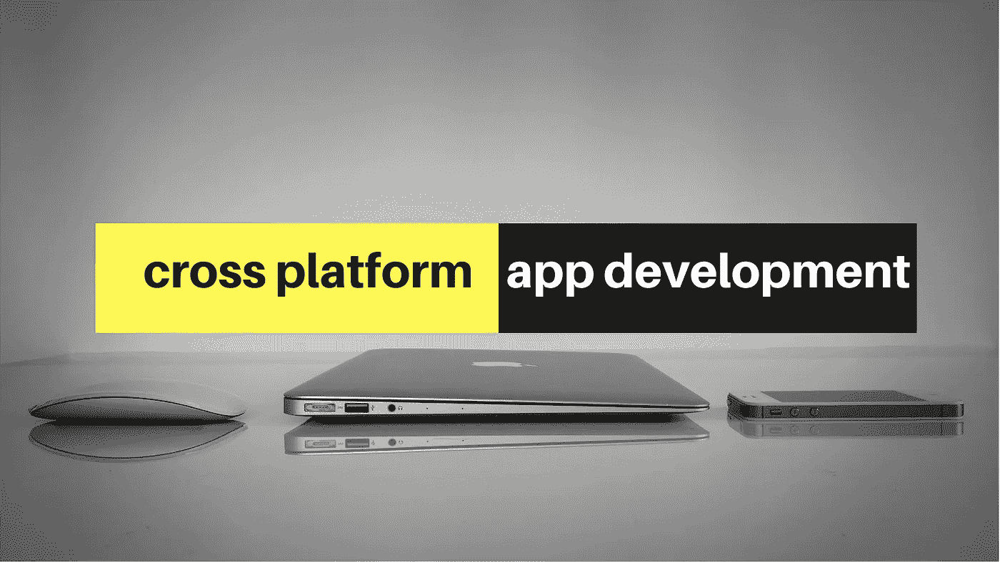

# 设计跨平台应用程序时要记住什么？

> 原文：<https://medium.com/swlh/what-to-keep-in-mind-while-designing-a-cross-platform-application-fe887dc79869>

在为多个平台设计时，最大的挑战是平衡功能和品牌的一致性与各个平台的惯例。iOS、Android、Web 等都包含自己独特的指导方针、用户和设备。如果没有正确的平衡，你的应用程序可能会很难使用或者感觉不合适。此外，经常会出现并发工作的需求，尽管在理想情况下，顺序地在多个平台上工作被认为是最好的。当我们在不同的平台之间转换时，下面是一些帮助我们克服一些挑战的要点。

# 1.你应该对用户做出反应，而不是对设备做出反应。

响应式设计使我们有可能创造适应我们选择的屏幕的数字体验。无论是移动优先还是适应较小屏幕的桌面体验，结果看起来都非常相似。然而，这个“相同”实际上有一个重要的部分，而另一个部分不是。但是我们很难预测某些用户的反应和偏好，所以为了取悦他们，我们提供了可定制性。但是这里的关键不是让你的用户工作。判断用户的偏好，并为他们做出决定。为了让这自然发生，你需要学会响应用户而不是设备。

# 2.一致性似乎是响应式设计背后的驱动力，但不要让这限制了你。

响应式设计涉及大量的熟悉度和品牌推广工作。整个要点是让你的用户认识到如何使用和导航你的服务，同时从视觉的角度认识他们，在所有方面实现无缝的品牌识别和整合。一些知名智能手机制造商甚至以品牌特色的名义争夺手势。最初，响应式设计谈到了软件程序在几个平台上运行的互操作能力。但这并不意味着相同的思维必须驱动跨平台设计和响应式设计。为了减少不一致，响应式设计推动了随处访问，随处相似。当我们将此应用于[跨平台服务](https://www.zibtek.com/Hybrid-App-Dvelopment-Company)时，它限制了我们为平台体验增加额外价值。一致性没有认识到，对于不同的情况，用户会更自然地接受变化。在各种平台上发布的某些服务已经充分利用了这一点。移动设备、电视屏幕、笔记本电脑、电影院等。仍然给我们提供了差异。当然，交付功能和最终用户需求不一定是所有数字体验的区分因素，但对一些人来说，它必须是。

# 3.为 Android 设计的时候，忘了 iOS 吧。

出于设计一致性的考虑，我们可能会采用 iOS 的设计，然后在 Android 平台上重新创建完全相同的设计，反之亦然。在这个过程中模仿其他平台是为另一个操作系统设计应用程序的常见陷阱。我们在从 iOS 应用程序移植而来的 Android 应用程序中经常遇到这种情况。要特别注意导航。考虑一下如何调整应用程序中的导航，以便在每个平台上都感觉“正确”。

# 4.保持品牌一致性

最快的方法是严格遵循特定品牌的设计。但请记住，这只是在 UI 设计方面最快的方法，当涉及到实现视图或元素时，它将花费时间和金钱，因为您的开发人员需要创建在所有平台上看起来相同的自定义视图。使用 SDK 提供的库，可能很容易在一个平台上创建一个特定的视图，而需要在另一个平台上创建一个自定义视图，这样两个视图看起来就可以一样。保持跨平台的一致设计可以让用户与你的应用程序进行交互，而不需要花费太多精力。这里的问题是，一致的设计经常被误解。我们必须将设计一致性视为一种体验。为了给用户提供高质量的体验，有必要在用户界面、信息和品牌的媒体、沟通、甚至线下办公室和其他营销材料中保持一致。这种一致的表示使您的用户能够识别元素并预测下一步行动，从而加快用户尚未探索的新产品和服务的学习曲线。这种可预测性允许品牌更快地吸引用户并与用户交易。

# 5.优化

当您处理多个平台时，您必须计划和优先考虑内容以及它将显示的格式。优先化是品牌面临的最大挑战之一。下一步是获取所有这些信息，并使用尽可能简单的代码将其改编为单个模板，确保它可以在功能较少的设备上显示。对于拥有无数产品和服务的大品牌来说，这将是一项艰巨的任务。

# 6.同时但独立地工作

当两个设计师同时在他们各自的平台上开发同一个功能时，他们很快就会开始互相攻击，并迅速发现工作流程中的缺陷。一致性在这里尤其受到打击。确保所有平台的颜色、版式和行动号召保持一致是一个挑战。不同的平台需要不同的约定，因为它们有不同的技术约束。两位设计师都会停止他们的工作，集思广益，通常会重新评估设计，抛弃任何不可行的东西。在持续的头脑风暴会议和设计重新评估结束时，大家都明白，在另一个设计师也前进之前，任何一个设计师都不能前进。可以想象，不是很敏捷。相反，要分散精力，独立开发不同的功能，而不是在各自的平台上同时开发相同的功能。最后，设计师可以交换他们的功能，并将设计转化到他们的平台上。这使得每个设计师都可以自由地创造性地解决任何技术难题。频繁的白板会议将有助于让每个人在整个过程中保持一致。独立性的增强将导致明确的所有权、更快的速度和探索的空间。但是这个过程并不意味着在真空中工作，协作仍然是自由流动的。通过给设计师分配具体的职责，他们在能够流畅地工作的同时感到创造性的满足。

***原载于*** [***产品洞察***](https://www.cognitiveclouds.com/insights/what-to-keep-in-mind-while-designing-a-cross-platform-application/) ***:顶级*** [***节点 js 开发公司***](https://www.cognitiveclouds.com/custom-software-development-services/node-js-development-company)

## 这篇文章发表在 [The Startup](https://medium.com/swlh) 上，这是媒体最大的创业刊物，拥有 292，582+人关注。

## 在这里订阅接收[我们的头条新闻](http://growthsupply.com/the-startup-newsletter/)。

