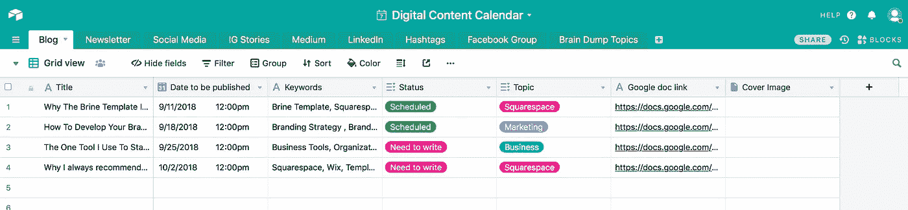
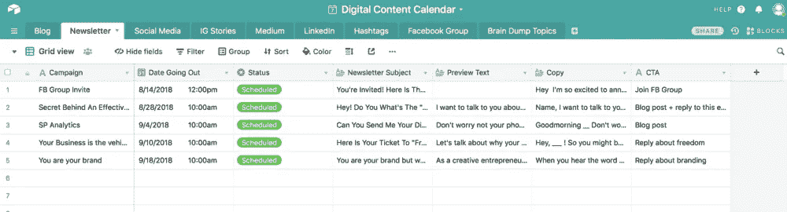
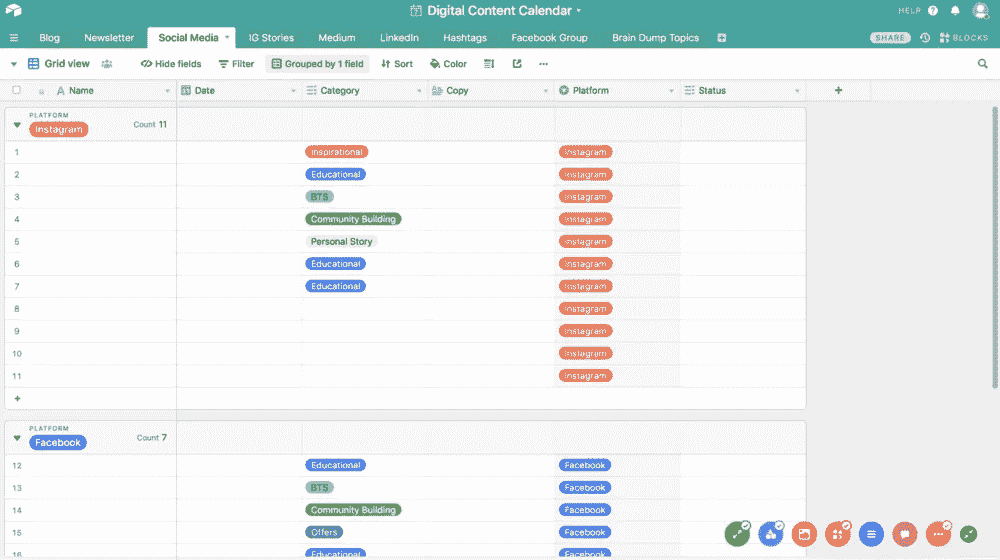
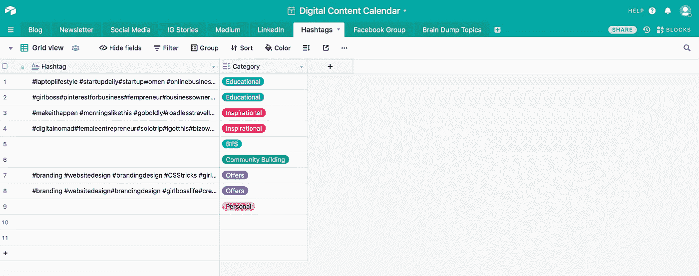
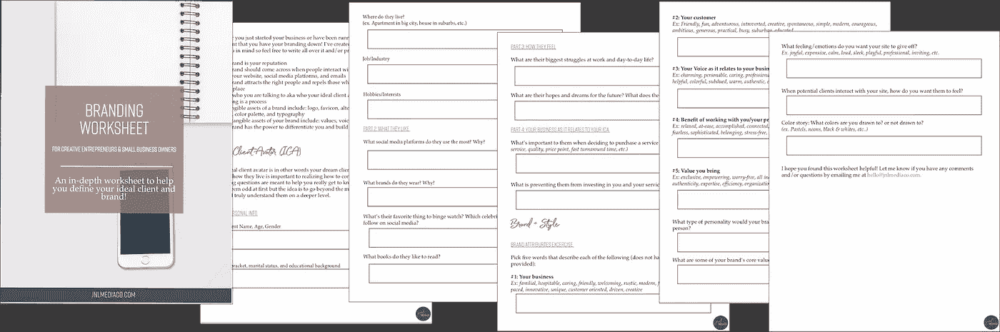

# 你应该创建什么类型的内容+如何保持有序

> 原文：<https://medium.com/swlh/what-type-of-content-should-you-be-creating-how-to-stay-organized-3a7007034944>

“black ballpoint pen beside pink paper with hello written” by [IN BOSSMODE](https://unsplash.com/@everygirlboss?utm_source=medium&utm_medium=referral) on [Unsplash](https://unsplash.com?utm_source=medium&utm_medium=referral)

如今，内容创作是如此重要，如果你不首先把你的业务当作一家媒体公司，那么你就做错了。

是的，每天都有一百万条内容被发布，但是你自己却没有发布内容，因为有太多的博客，这就像没有追求你的激情和开始你的生意，因为已经有太多的人在做生意了。

## 一旦你承诺以一致的方式发布内容，真正的工作就开始了！

首先让我们谈谈内容+一致性。

# 内容:

有不同类型的内容，但最终目标应该始终相同=提供价值。

如今，内容创作是如此重要，如果你不首先把你的业务当作一家媒体公司，那么你就做错了。一旦你承诺以一致的方式发布内容，真正的工作就开始了！

作为企业主，你可以发布以下几种内容:

1.  博客
2.  Instagram 帖子
3.  Instagram 生活
4.  脸书邮报
5.  FB 生活
6.  脸书视频
7.  脸书集团职位
8.  YouTube 视频
9.  LinkedIn 帖子
10.  LinkedIn 视频
11.  网络研讨会
12.  时事通讯

这个列表并不是要让你不知所措，而是给你一些建议，告诉你在哪里可以展示自己，如何与听众交流。

**你不必发布所有这些类型的内容，但要选择一些适合你的受众类型的内容，并发挥你的优势。**

如果你不喜欢视频，那就不要从视频开始，但我会说视频是最好的方式之一，可以让你的名字和你的观众建立信任和可信度。

# 一致性:

你很可能一直听到这句话，但我会再重复一遍，因为这是一个事实，你必须听很多次才能记住。

一致性几乎和内容本身一样重要。在一个月的某个星期或每隔一个月发布几次内容对你或你的观众没有任何好处。

你应该首先发布内容的原因是:

1.  打造你的品牌
2.  建立信任+可信度
3.  建立权威

所以你必须像一个电视节目一样，你的观众应该知道他们何时何地可以收看你的“节目”。

# 保持条理:

那你如何确保你按时完成呢？通过这个我刚刚发现的工具来保持组织性，我已经成为了我生意中的一个游戏改变者。

[**Airtable！**](https://airtable.com)

我喜欢 Airtable 的所有内容管理。

我用的是免费版本，到目前为止效果非常好。

根据维基百科，Airtable 是:

> Airtable 是一个电子表格和数据库的混合体，具有数据库的特性，但应用于电子表格。Airtable 表格中的字段类似于电子表格中的单元格，但具有诸如“复选框”、“电话号码”和“下拉列表”等类型，并且可以引用图像等文件附件。
> 
> 用户可以创建数据库、设置列类型、添加记录、将表格相互链接、协作、对记录进行排序以及将视图发布到外部网站。

## 用简单的英语来说，这是什么意思？

无论是博客还是时事通讯，这基本上都是组织内容的最佳方式。当您登录 Airtable 帐户时，您会看到如下内容:

我推荐使用“数字内容日历”来组织你的内容。

我认为向您展示如何在您的业务中使用它的最佳方式是向您展示我是如何在我的业务中使用它的，以便您了解它如何为您工作。

## 博客:

## **简讯:**

**社交媒体:**

## 标签:

我希望这能帮助你组织你的内容，这样你就能以一致和有效的方式为你的客户服务！

# 行动呼吁

创建品牌内容需要你有一个明确的理想客户+品牌，所以我创建了一个深入的“品牌工作表”来帮助你做到这一点！您可以在此下载免费的[品牌工作表。](https://mailchi.mp/0c0cbe63f52e/brandingworksheet)

*原载于*[*www.jnlmediaco.com*](https://www.jnlmediaco.com/blog/the-one-tool-i-use-to-stay-organized-with-content)*。*

## 这篇文章发表在 [The Startup](https://medium.com/swlh) 上，这是 Medium 最大的创业刊物，拥有+ 372，747 名读者。

## 在这里订阅接收[我们的头条新闻](http://growthsupply.com/the-startup-newsletter/)。

