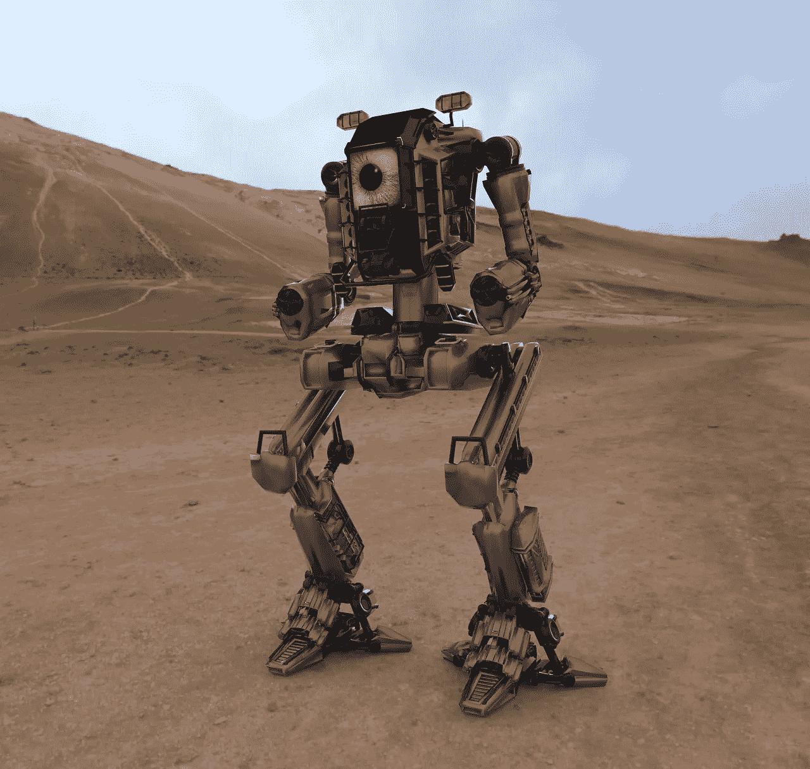

# 我们能从一个重新编程的程序中学到什么

> 原文：<https://medium.com/swlh/what-we-can-learn-from-a-program-that-reprograms-itself-b26e00a38f01>

[Rani_Ramli/pixabay](https://pixabay.com/en/robot-robotic-future-technology-3d-2658699/)

想象一个自给自足的机器人。这个机器人最初是由它的生产者建造和编程的。每天早上，它出门，工作，赚钱。每天晚上，它来到自己的存储单元，把自己插到充电站上。

这个机器人的硬件相当坚固。偶尔会去维修。它的硬件在这里和那里被调整，一些部分被改变。

由于机器人工作并赚钱，它支付自己的账单，如存储单元、电力和维护。它既不属于某个人，也不依赖于某个人。

可以想象，这个机器人的所有动作都是由它的程序决定的。这个机器人的日子、星期和月份是由其行动决定的。这个机器人的生命是它的日、周、月的集合。综上所述，这个机器人的现实性是由它的程序决定的。

> ***这个机器人的现实性是由其程序决定的。***

你可能会认为机器人对它的现实无能为力，因为它的程序是由它的制作者决定的。然而，这并不是 100%准确的，因为程序包括可以自我修改的模块。

每当自修改模块被触发时，它会将它得到的结果与它想要得到的结果进行比较。然后，它做出会产生更好结果的改变。通过这种方式，机器人改进了它自己的编程，从而改进了它自己的现实。

**这不是关于机器人**

你现在应该已经猜到了，我说的是人类。我们的现实是由我们的程序决定的。我们的节目是由我们的教养、我们的家庭、我们的环境等等产生的。这意味着我们的现实是由我们的教养、家庭和环境产生的，对吗？不一定！

幸运的是，我们都有可以改变自己程序的模块。我们大多数人都不用它。我们大多数人都没有意识到我们有这个模块。改善我们现实的秘密是使用那个模块来改善我们的编程。

**改变我们编程的挑战**

改变我们程序的问题是很难。为了改变我们的编程，我们首先需要承认我们错了。人们不想承认他们一开始就错了。很痛苦。人们喜欢正确。

> 更好的现实的第一步是承认你一开始就错了。

现在，在你的编程中有很多[信念](https://ideavisionaction.com/personal-development/whats-holding-you-back-from-realizing-your-most-ambitious-goals/)正在创造你不想要的结果。首先，你需要找到他们，承认他们在你的现实中的作用，并让他们走。

第二，你需要找到能够创造你想要的结果的[信念](https://ideavisionaction.com/personal-development/miserable-or-peaceful-all-by-your-assumptions/)。然后，你需要把这些信念安装到你的程序中。

我知道这听起来比实际容易得多，但我只是想让你认识到这个道理。这不是什么新时代的呜呜呜。一旦你接受了这个事实，你就可以接受它。不容易，但有可能。

这是一个我可以深入探讨的话题，但我今天就把它留在这里。以后我会多写这方面的内容。现在，让这个想法深入人心。

> ***你是一个可以自我重新编程的程序。你打算用它做什么？***

*阅读下一篇:* [*悲惨还是安宁，全凭你的假设*](https://ideavisionaction.com/personal-development/miserable-or-peaceful-all-by-your-assumptions/) *或者报名参加* [*周报*](https://ideavisionaction.com/email-newsletter/) *。*

## 这篇文章发表在 [The Startup](https://medium.com/swlh) 上，这是 Medium 最大的创业刊物，拥有 308，471+读者。

## 在这里订阅接收[我们的头条新闻](http://growthsupply.com/the-startup-newsletter/)。

