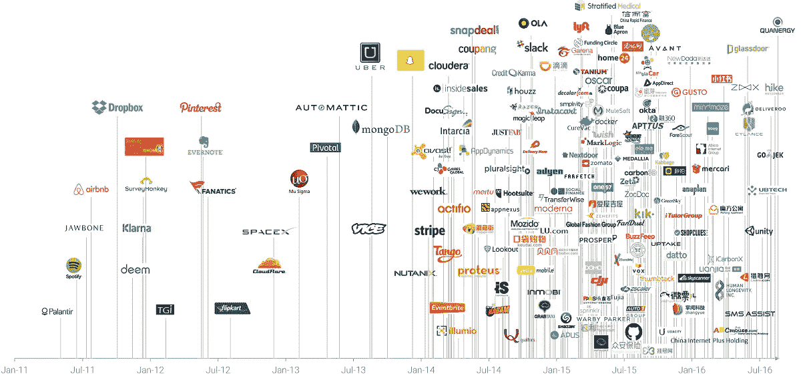
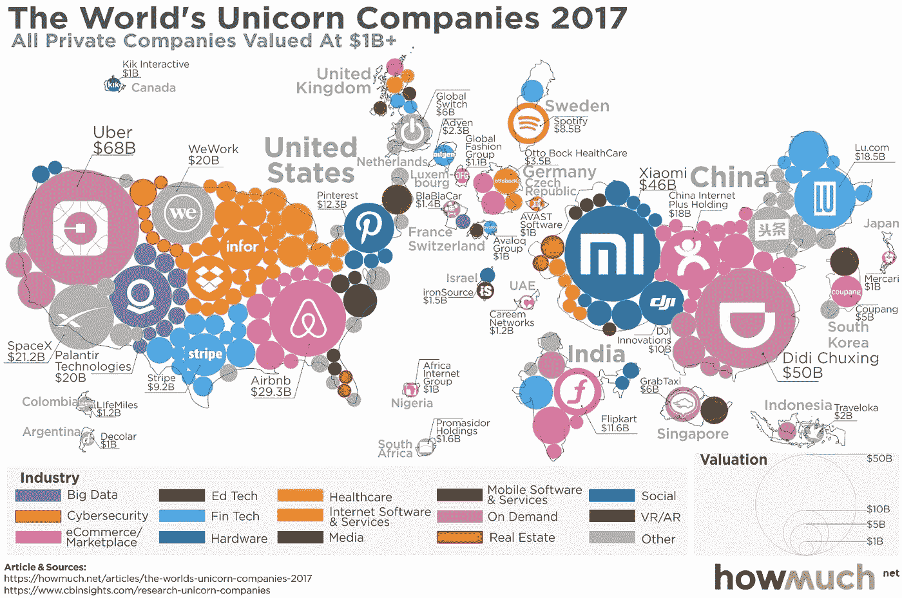
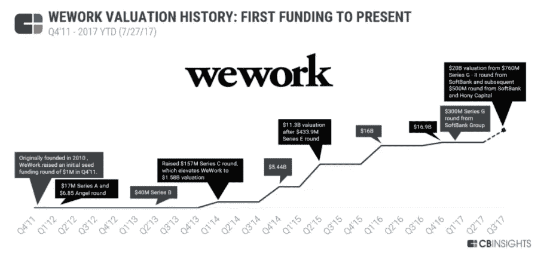
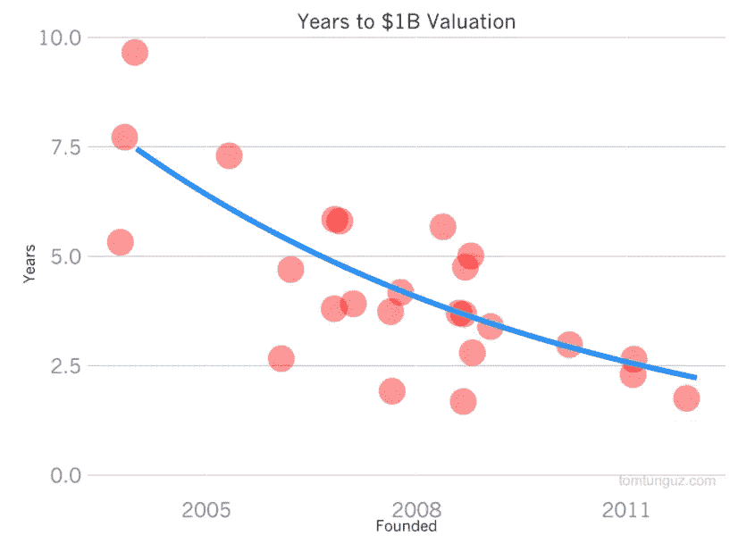
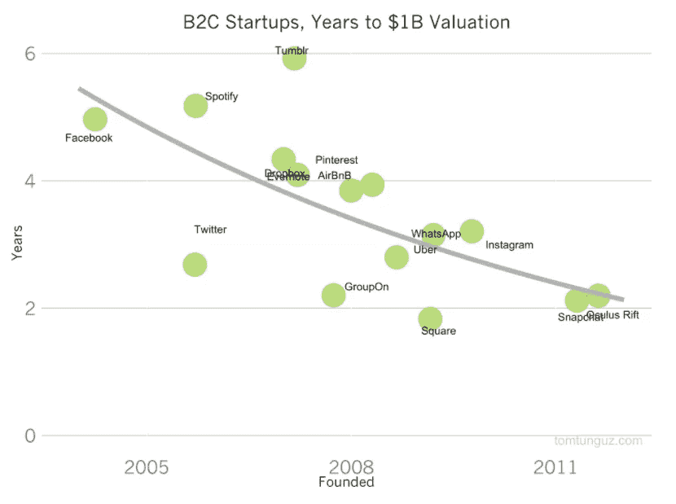

# 我们能从独角兽的成功和失败中学到什么

> 原文：<https://medium.com/swlh/what-we-can-learn-from-the-successes-and-failures-of-unicorns-8850fbabd5b2>

“独角兽”一词通常用来定义价值 10 亿美元或以上的私有公司。虽然是以一种神话生物命名的，但它们越来越经常地出现，并为各种规模的企业提供了经验。

自从风险投资家艾琳·李(Aileen Lee)在 2013 年首次使用这个标签来描述估值达到 10 亿美元的初创企业以来，“独角兽”已经成为吸引消费者和投资者想象力的新的颠覆性企业的象征。

这个名字来源于这样一个事实:从统计学上来说，找到这样的公司被认为和找到一只独角兽的可能性差不多。从历史上看，初创企业达到如此高的估值的确是极少数人的专利。虽然没有找到独角兽那么罕见，但也非常罕见。

如今情况远非如此，根据最新统计，T2 有 217 家公司符合独角兽标准，包括 Spotify、优步和 Pinterest 等公司。随着越来越多的初创企业经历了估值的惊人增长，下图显示了这一高端领域日益拥挤的本质:

([CB Insights](https://www.cbinsights.com/research/increasingly-crowded-unicorn-club/))

很明显，这些公司保持私有状态的时间要比几十年前的同类公司长得多。如今，一家大型科技公司上市需要 [11 年](https://www.mckinsey.com/industries/high-tech/our-insights/grow-fast-or-die-slow-why-unicorns-are-staying-private)，相比之下，1999 年平均需要 4 年。

风险投资的出现彻底改变了这种动态，因为快速增长的初创企业可以获得资本来推动其增长计划，而无需向公开市场发行股票。

当首次公开募股(IPO)最终到来时，这是一个有新闻价值的奇观，引起了广泛的关注。伴随着脸书和 Snap 的首次公开募股而来的媒体狂热肯定证明了这一点。

然而，独角兽现在是一种全球现象。

虽然大多数独角兽都是在硅谷开始它们的生活，但在亚洲、欧洲、非洲和南美洲也有许多成功的故事。

此外，它们跨越了从虚拟现实到大数据和医疗保健的一系列令人印象深刻的行业。

我们可以看到，就地理分布、产品供应和运营行业而言，独角兽公司的名单中有很大的差异。

然而，除了这些差异，还有一些共同的线索将这些公司联系在一起。他们都以新颖的方式解决问题，利用技术创造能够创造指数级增长的平台。出于可以理解的原因，这种组合让投资者兴奋不已，但当每个人都在寻找最新的独角兽时，他们很可能会找到它。因此，既有机会，也有陷阱。

毫无疑问，任何企业都可以从这些获得巨大成功的初创企业身上学到很多东西。下面，我们来看看从独角兽的成功和失败中吸取的核心教训。

# 独角兽解决问题，然后将解决方案货币化

消费者的旅程越来越分散，有大量的选择，但很少有盲目忠诚于某个品牌的动机。公司有责任脱颖而出，吸引回头客。

最终获得独角兽荣誉的公司都是从一个简单的前提开始的。他们观察人们每天面临的挑战，并设计创新的解决方案，为消费者提供真正的价值。

随着技术改变我们的行为和需求表达，实现这一目标的新机会不断涌现。

价值 200 亿美元的 WeWork 为初创企业提供价格合理的办公空间。然而，它成功的关键在于理解年轻员工对公共社交空间的渴望，以便与其他新兴企业建立联系。有[报道称](https://www.wsj.com/articles/wework-a-20-billion-startup-fueled-by-silicon-valley-pixie-dust-1508424483)we work 的首席执行官鼓励他的员工在投资者来访时居住在这些公共区域(“激活空间”，标语是这样的)，以让人们明白公司是一个社区，而不仅仅是交易。

对于投资者来说，这是一个令人信服的故事，他们认为这是对传统沉闷的办公空间租赁世界的现代诠释。尽管他们声称在广告上花费很少，但通过利用时代精神，WeWork 仍然成为了美国最有价值的独角兽之一。

我们看到同样的故事在许多独角兽企业中上演。他们利用技术在消费者和产品或服务之间创造无缝互动，在这个过程中灌输一种社区意识。

再多的营销或商业常识也无法吸引投资者或越来越精明的消费者。这些因素有助于解决问题，但不能取代它。

简单地以成为“独角兽”企业为目标就是本末倒置。研究现有的技术，找出你可以为人们解决现实世界问题的方法，然后剩下的事情就会水到渠成。

# 平台业务实现指数级增长

独角兽公司获得巨额估值的依据是它们的预期未来收益，而不是它们的历史表现。那是显而易见的；毕竟，初创企业的历史表现并不怎么样。

投资者对他们的增长能力有着前所未有的信心，原因是他们是利用平台商业模式建立起来的。平台为各方之间的交流提供了舞台，可以与传统的管道业务模式形成对比。

当管道业务因成本与收入同步增长而趋于停滞时，平台则实现了指数级增长。21 世纪有很多成功平台的例子，包括目前的独角兽，如 Airbnb 和优步。尽管这些公司在成长过程中会产生越来越多的可变成本，但与汽车制造商等传统企业相比，这些成本是微不足道的。

这有助于解释为什么一家初创公司达到 10 亿美元估值所需的时间正在大幅缩短。

风险投资家 Tom Tungutz 用对数回归模型展示了公司自成立以来达到 10 亿美元大关所需的时间。

这种加速是非常显著的，它指出了许多潜在的驱动力。这也提出了这样一个问题:这一新景观到底有多可持续，事实上，到底有多真实。毕竟，这 217 家公司的累计价值为 7520 亿美元。

当我们将 B2C 独角兽与其 B2B 同行隔离开来时，这一趋势更加引人注目:

这些科技公司天生相信平台商业模式能够创造长期的巨大增长。这种趋势是最近才出现的，因此我们还没有可靠的数据来评估这些预测的准确性。然而，我们知道早期采用者，如苹果，其应用程序商店是 2002 年诞生的原型平台业务，已经取得了持续的成功。

# 应该谨慎对待估价

[UBC 索德商学院和斯坦福大学进行的研究发现，49%的“独角兽”实际上并不值得拥有这个头衔。他们的分析试图量化这些公司的公允价值，而不是投资者定义的价值。事实上，他们发现 11%的“独角兽”被高估了 100%以上。](http://www.sauder.ubc.ca/News/2017/Almost_half_of_billion_dollar_start-ups_not_worth_it_UBC_study)

值得直接引用这项研究来强调这种高估发生的确切原因:

> 当前的估值做出了一个误导性的假设:一家公司的股票价格与最近发行的股票价格相同。这种过于简单化的做法极大地抬高了估值，因为最近发行的股票几乎总是包含以前发行的股票所没有的额外津贴。具体而言，我们发现，53%的独角兽企业向其最近的投资者提供了 IPO 回报保证(14%)、阻止未能回报大部分投资的 IPO 的能力(20%)、优先于所有其他投资者的资格(31%)或其他重要条款。

独角兽俱乐部的增长速度也在放缓。2016 年接纳了 19 名新成员，与 2014 年人数相同。作为理性的存在，我们可以理解这一点。然而，我们往往不那么理性，投资者希望看到无止境的增长。

我们现在应该已经习惯了繁荣和萧条的循环，但炒作可能非常具有诱惑力。在科技领域已经有一些真正巨大的成功故事，许多人从中获利，所以我们正在寻找下一个独角兽是可以预料的。然而，这种希望会让我们对冷酷无情的事实视而不见。

绍德商学院(Sauder School of Business)也向独角兽公司的员工发出了重要警告:

> *我们的发现对风投支持的公司的普通员工也有意义，他们通常以股票期权的形式获得大部分薪酬。我们的分析发现，这些员工得到的比他们认为的公平价值要少得多。*

因此，我们可以从这项研究中了解到，公司应该继续专注于改善他们的产品，并准备抵御新的竞争对手。估值可以很快上升，但它们非常脆弱，主要由情绪驱动。

# 快速增长带来了新的问题

他们越大，摔得越重。

可以预见的是，迅速变得如此富有的公司会在前进的道路上遇到一些挑战。

然而，我们可能没有预料到的是，它们会引起如此多的争议。

优步经历了我们可以在外交上称之为困难的一年。卫报[写了一份过去几年优步公关灾难的冗长清单](https://www.theguardian.com/technology/2017/jun/18/uber-travis-kalanick-scandal-pr-disaster-timeline)，但这些事件并不是这个拼车巨头的孤立事件。

WeWork 被卷入了一场与其清洁工的令人不快的诉讼，这些清洁工声称他们的工资过低，并且受到雇主的虐待。Airbnb 在酒店领域也树立了一些非常强大的敌人。

我们可以说，脸书一直是其自身成功的受害者，对其在 2016 年美国大选中所扮演角色的调查正在进行中。脸书作为一个公正平台的立场正在受到审查，因为这据称允许外国代理人在社交网络上推广他们的议程。在允许企业蓬勃发展的自由市场和保护公众、鼓励竞争的干预主义政策之间，需要达成微妙的平衡。

# 我们能学到什么？

本质上，尽管我们面对的是专注于技术的公司，但我们不应该忘记，人仍然决定着企业的命运。

这些是由熟悉的来源引起的新问题。随着公司的成长，它们应该记住，仍然有一个核心需求，那就是为了员工和客户的最大利益而行动。即使是最复杂的自动化技术，其创造和成功采用都依赖于人。似乎许多独角兽正在艰难地吸取这些教训。尽管独角兽取得了成功，但我们仍然可以从它们的越轨行为中学到同样多的东西。

*最初发表于*[*【www.clickz.com】*](https://www.clickz.com/what-can-we-learn-from-the-successes-and-failures-of-unicorns/113961/)*。*

## 这个故事发表在《创业公司》杂志上，有 263，100 多人聚集在一起阅读 Medium 关于创业的主要故事。

## 在这里订阅接收[我们的头条新闻](http://growthsupply.com/the-startup-newsletter/)。

