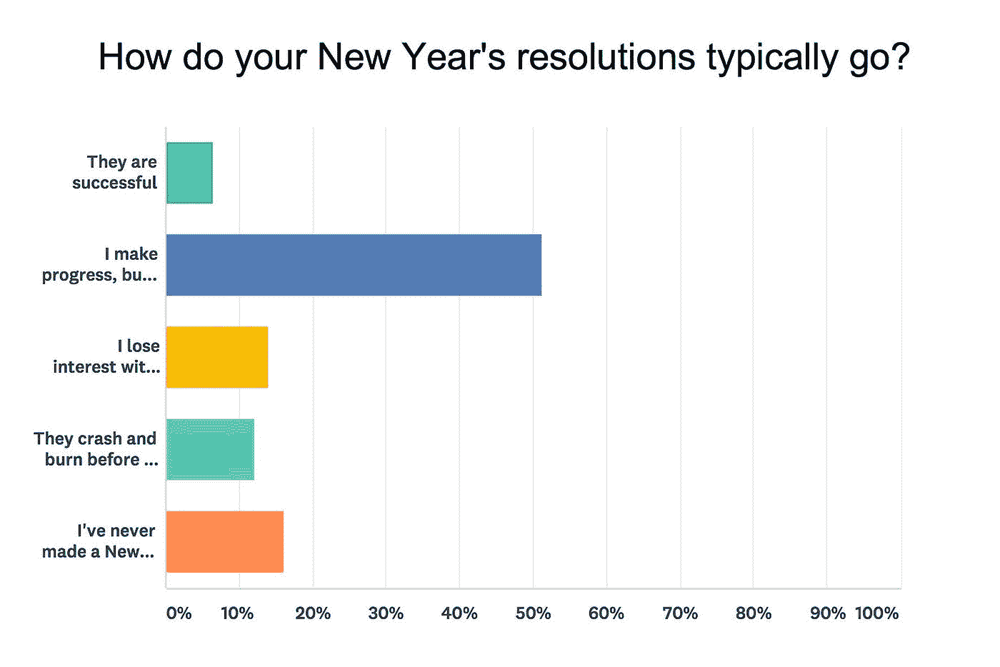

# 我们能从几千年来新年计划的失败中学到什么

> 原文：<https://medium.com/swlh/what-we-can-learn-from-thousands-of-years-of-failing-at-new-years-resolutions-47ddd2b43f28>

## 如何实际看到 2018 年的正增长

Photo by [Ian Schneider](https://unsplash.com/photos/PAykYb-8Er8?utm_source=unsplash&utm_medium=referral&utm_content=creditCopyText) on [Unsplash](https://unsplash.com/?utm_source=unsplash&utm_medium=referral&utm_content=creditCopyText)

尽管新年决心已经成为我们文化的一部分很长时间了(甚至古巴比伦人在 4000 年前就向他们的神许下了每年一次的承诺)，我们仍然非常讨厌它们。

根据最近的调查，**虽然多达 45%的美国人说他们通常会制定新年计划，但只有 8%的人能成功实现他们的目标。**

事实上，我们非常清楚自己无法坚持决心，我们已经为自己的失败付出了整整两天:1 月 17 日放弃决心日，2 月 4 日[戒酒日](https://foursquare.com/infographics/swarm-fall-off-the-wagon-2016)。

我们知道个人改变很重要。将空白的一页变成新的一年似乎是承诺改变的最佳时机。让我们来看看为什么坚持我们的决心如此困难的几个原因，以及我们可以做些什么来增加我们成功的机会。

# 问题 1:新年决心关注结果，而不是过程

当你制定新年计划时，你实际上只是在为未来的自己设定一个结果。你是说，到明年这个时候，我想减掉 20 磅或者不再吸烟。

这种方法有两个问题:

1.  我们有一种可怕的能力与未来的自己联系在一起:在新年来临之际，我们很容易感到有动力朝着自己的目标努力。但是两周之后呢？还是两个月后？设定一个大目标并没有考虑到所有会阻碍我们前进的事情，以及我们如何处理它们。这就像最坏的老板站在你面前说“我不管你怎么做，只管去做。”
2.  **我们将所有的注意力放在最终目标上，而不是如何实现目标:**渐进式改进是实现真正变革的关键。但是新年决心很少是关于日常的，更多的是关于结果。如果没有一个计划或系统来培养让你达到目标的习惯，你很容易偏离目标。

# 问题 2:新年决心很少与我们的价值观相联系

无论你追求什么目标，你都需要一些方法来保持动力。当我们觉得无法继续下去时，价值观和目标是我们前进的动力。不幸的是，新年决心很少与我们的价值观相联系，而是与一些外部的或基于表现的目标相联系。

我们想换工作*赚更多的钱*。

我们想减肥*变得更有魅力*。

虽然这些结果看起来像是强大的激励因素，但实际上不是。研究人员发现，最强大的动力来自内在动力——你已经拥有的价值观和目标。

# 问题 3:新年决心太大了

假期结束时，我们都在阴霾中醒来，并承诺要更好地对待自己。但是设定巨大的目标，即使你认为你有一年的时间来完成它们，也是在为失败做准备。

当我调查了几百个[重新计划](https://www.rescuetime.com/)的用户时，**只有 6.5%的人说他们的计划成功了**，大多数人说他们很快就失去了动力或者从未达到目标。

研究人员称这种现象为 [**假希望综合症**](http://daily.jstor.org/freeing-your-new-years-resolutions-from-false-hope-syndrome/)——我们对可以实现的目标过于自信，然后当我们没有足够快地看到结果时就放弃了。

# 除了制定新年计划，还能做什么

现在，这不是一张*不承诺改变的*免罪卡。中国有句古老的谚语说:

> “种树的最佳时间是 20 年前。第二好的时机就是现在。”

新年仍然是开始朝着你想要做出的改变努力的最佳时机。比你何时开始更重要的是你如何着手改变你的行为。

让我们来看看实现你明年目标的一些最有效的方法:

# 从承诺一个小得可笑且容易做到的改变开始

很容易看出我们是如何陷入虚假希望综合症的。应用程序承诺我们只需 10 分钟就能专注。锻炼计划声称我们将在 3 周内减掉 10 磅。我们的大脑是懒惰的，如果我们认为我们会在很短的时间内获得很大的成果，那么，我们就会去争取。

但是这些都不管用。相反，你需要一天一次慢慢地朝着你的目标努力。作者 James Clear 称之为边际收益的[集合:](https://jamesclear.com/marginal-gains)

> “一开始，做出好 1%或差 1%的选择基本上没有区别。(换句话说，今天不会对你有太大影响。)
> 
> “但随着时间的推移，这些微小的改善或下降会复合，你会突然发现每天做出稍微好一点的决定的人和不这样做的人之间有很大的差距。
> 
> “这就是为什么小的选择在当时不会产生太大的影响，但从长远来看，它会越积越多。”

所以，与其下定决心“多锻炼”或“写本小说”，不如从其中的 1%开始。例如，说你每天早上将走楼梯而不是电梯，或者当你第一次醒来时你将写 200 个单词。

然后，让这些新习惯变得简单得可笑。在你的鞋子上贴一张便条，上面写着“走楼梯”，或者关闭你笔记本电脑上的所有东西，除了一个空白的单词 doc，这样它就是你早上看到的第一件东西。

# 建立在你已经有的好习惯和行为上

虽然总是有可能重新连接你的大脑，但这显然需要时间。

你现在的样子是你一生中养成的所有习惯和行为的顶点。你的思想和身体已经习惯了你现在的样子，不经过努力就不会改变它们[。这就是为什么最好从你已经做的事情开始。](http://blog.rescuetime.com/7-cognitive-biases-decision-making/)

例如，如果你已经一周出去快步走三次，那么每天增加 10 分钟。这样，你已经养成的“散步”习惯就变成了新的“多走 10 分钟习惯”的暗示

这对你目前做的任何事情都有效。

如果你的目标是读更多的书，那么不要在睡前读 10 分钟，而是说你会读 20 或 30 分钟。如果你的目标是吃得更健康，比如说你每周在家做饭 5 次，而不是 3 次。

目标是我们每天所做事情的结果。多做好事，你会离你想去的地方更近。

# 与其改变你的行为，不如改变你的故事

我们都有一个故事，关于我们是什么样的人，什么对我们来说是重要的。我们说“我是那种尝试新事物的人”或者“我不抽烟。”虽然这些故事看起来是板上钉钉的，但事实并非如此。

心理学教授 Timothy Wilson 在他的书《T4》中描述了大量关于我们如何利用这些故事来长期改变行为的研究。在改变我们的行为时，我们可以使用的一个技巧叫做“故事编辑”

它是这样工作的:

1.  从尽可能诚实地写出你现有的“故事”开始。这可以是简单的谈论你是谁或者一系列的陈述，比如“我是那种做 X 的人”。
2.  要特别注意这个故事中任何与你想要建立的新行为相悖的东西。例如，如果你是那种喜欢吃宵夜的人，这就违背了你想要更健康的目标。
3.  现在重写这个故事。使用相同的格式，除了这次说出你想要的故事。讲述一个人的故事，他做出了你想看到的行为改变。

这看起来似乎太简单了，但研究人员表明，这种简单的干预可以产生持久的结果。作者 James Clear 称这些[为基于身份的习惯](https://jamesclear.com/identity-based-habits)，解释说我们需要定义我们想要的身份，然后才能建立让我们达到目的的习惯。

或者，正如库尔特·冯内古特所说:

> “我们就是我们假装的样子，所以我们必须小心我们假装的样子。”

这是一年中承诺做出真正改变的最佳时机。

但是如果你想有最好的机会看到改变的发生，不要把它变成一个决心。相反，把注意力放在你已经拥有的东西上，放在你每天为成为你想成为的人而迈出的一小步上。

*照片由* [*伊恩施耐德*](https://unsplash.com/photos/PAykYb-8Er8?utm_source=unsplash&utm_medium=referral&utm_content=creditCopyText) *和* [*安妮斯普拉特*](https://unsplash.com/photos/Ef1H5YTTmZ8?utm_source=unsplash&utm_medium=referral&utm_content=creditCopyText) *拍摄。*

# 嘿，我是乔里！

我帮助公司和有趣的人通过巧妙而专注的写作讲述他们的故事。想一起工作吗？在 hello@jorymackay.com 给我发邮件

*原载于 2017 年 12 月 28 日 blog.rescuetime.com**的* [*。*](http://blog.rescuetime.com/new-years-resolutions/)

## 这个故事发表在 [The Startup](https://medium.com/swlh) 上，这是 Medium 最大的企业家出版物，拥有 277，994+人。

## 在这里订阅接收[我们的头条新闻](http://growthsupply.com/the-startup-newsletter/)。

