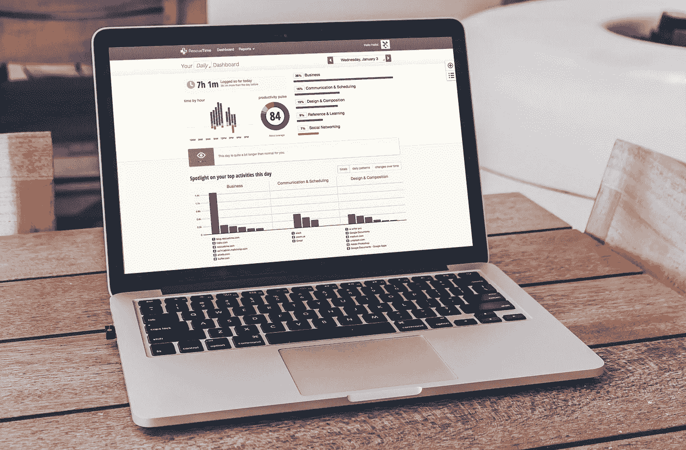

# 我们通过分析 2017 年 2.25 亿小时的工作时间了解到了什么

> 原文：<https://medium.com/swlh/what-we-learned-about-productivity-from-analyzing-225-million-hours-of-working-time-in-2017-7c2a1062d41d>

*This post was originally published on the* [*RescueTime blog*](http://blog.rescuetime.com/225-million-hours-productivity/)*. Check us out for more like it.*

我们在什么时候效率最高？

回想过去的一年，你可能不知道。日子混在一起。几个月过去了。又一年过去了，却不知道我们到底是怎么度过时间的。

我们在 [RescueTime](https://www.rescuetime.com/) 的使命一直是帮助您做更有意义的工作。这要从了解你如何度过一天开始，什么时候你最有效率，什么阻碍了你。

2017 年，我们记录了来自全球数十万休闲用户的超过 2.25 亿小时的数字时间**。**

通过研究过去 12 个月人们如何在电脑和手机上度过时间的匿名数据，我们准确地确定了我们在哪些日子和时间做最有成效的工作，我们被电子邮件或社交媒体分心的频率，以及我们每周实际上有多少时间做有意义的工作。

**关键要点:**

# 2017 年最有(也最没有)成效的一天是哪一天？

简单地说，我们的数据显示**人们在 11 月 14 日最有效率。事实上，那一周是一年中效率最高的一周。**

这很有道理。下周是美国的感恩节，紧接着就是疯狂的假日购物潮，11 月中旬是人们挤出几个额外工作时间，赶在狼吞虎咽地吃火鸡大餐之前的好时机。

另一方面，我们今年的开局并不好。1 月 6 日——一年中的第一个星期五——是 2017 年效率最低的一天。

## 现在，当我们谈论“最”或“最”有效率的日子时，我们指的是什么？

RescueTime 是一个追踪你如何在电脑和手机上花费时间的工具，让你将活动分类，从非常分散注意力到非常有效率。例如，如果你是一名作家，花在微软 Word 或谷歌文档上的时间被归类为非常高效，而社交媒体则非常分散注意力。

从这些数据中，我们计算出你的[生产力脉搏](http://blog.rescuetime.com/breaking-down-the-rescuetime-productivity-score/)——你在你认为有生产力的活动上花了多少时间的满分。

11 月 14 日，所有 RescueTime 用户的平均生产率为 60，还算不错。

# 我们一天中有多少时间花在数字设备上？

我们很多人在计划我们的一天时犯的最大错误之一是假设我们有 8 个多小时来做有成效的工作。这与事实相去甚远。

我们发现，平均来说，**我们每天只花 5 个小时在数字设备上**。

今年的平均生产率为 53%，这意味着**我们一周只有 12.5 个小时做有效率的工作。**

# 平均“高效的一天”是什么样子的？

了解我们的整体生产力是一项有趣的工作，但我们的数据让我们更深入。

看看工作日(周一至周五上午 8 点到下午 6 点)，我们是如何度过时间的？我们什么时候做得最好？不同的任务通常在不同的时间完成吗？

以下是我们的发现:

# 我们最有效率的工作发生在周三下午 3 点

我们的数据显示，我们在每天 10 点到中午之间以及下午 2 点到 5 点之间工作效率最高(用浅蓝色块表示)。然而，分解到小时，**我们在周三下午 3 点工作效率最高。**

Light blue represents our most productive work

# 电子邮件支配着我们的早晨，但从未真正让我们独处

我们的一天从电子邮件开始，周一上午 9 点显然是一周中花在电子邮件上时间最多的一天。

Light blue represents our busiest time for emails

# 软件开发人员直到每天下午两点才达到工作效率的顶峰

具体的数字工作者如何度过一天呢？

看看花在软件开发工具上的时间，我们的数据描绘了一幅工作日的画面，直到上午晚些时候才开始，每天下午 2-6 点达到高峰。

Light blue represents when we’re using software development tools

# 虽然作家更有可能是早起的鸟儿

对于那些花时间写作的人来说，这是一个不同的故事。

写作应用在一天中的使用更加均衡，最有效率的写作时间发生在周二上午 10 点**。**

Light blue represents when we’re using writing tools

# 2017 年最大的数字干扰是什么？

对我们在 2017 年的工作效率感到满意是很棒的。但我们生活在一个注意力分散的世界，我们最大的挑战之一就是保持专注和专注。

以下是我们的研究发现的去年最浪费时间的事情:

# 我们平均每天使用 56 个不同的应用程序和网站

取决于你做了什么，这个数字可能看起来没有那么糟糕。然而，当我们看到*我们如何使用这些不同的应用程序和网站时，事情变得有点棘手。*

当谈到在不同的应用程序和网站之间切换时(即[多任务处理](http://blog.rescuetime.com/multitasking/) ), **我们每天从一个任务跳到另一个任务近 300 次**，每天在一个站点内的文档和页面之间切换 1300 次。

# 对于 Slack 用户来说，我们一天中有 8.8%的时间是在应用上度过的

关于电子邮件和交流对我们的生活有多大影响，已经有很多讨论了。但是这些数字看起来像什么？

我们发现，对于使用 Slack 作为工作沟通工具的人来说，他们几乎有 10%的工作日都在应用程序上度过(准确地说是 8.8%)。

# 我们每天查看电子邮件或即时消息 40 次

更能说明问题的是，我们多久检查一次我们的通讯工具，无论是电子邮件还是即时通讯工具，比如 Slack 或 HipChat。

平均来说，**我们每天查看我们的通讯应用程序 40 次，**或**在我们每天 5 小时的数字工作时间里，每 7.5 分钟**查看一次。

# 几乎每个工作日有 7%的时间花在社交媒体上

我敢肯定，我们大多数人在工作时都尽量不花时间在社交媒体上。但是我们的数据显示**每个工作日几乎有 7%的时间花在社交媒体上**。

然而，问题不仅仅在于花费的时间。平均而言，**我们每个工作日登录社交媒体网站 14 次**，或者说，在我们 5 小时的数字化工作日中，几乎每小时登录 3 次。

那么，所有这些告诉我们如何度过我们的日子呢？

首先，我们需要记住，平均值不应该被视为普遍真理。每个人的工作方式不同。但是对生产力和阻碍生产力的事物有一个高层次的认识是改善你工作方式的有力工具。

从所有这些数据中，我们能得出的最大建议是，意识到你每天用于有意义工作的有限时间，并明智地使用它。

我们的日子充满了令人分心的事情，如何保护我们所拥有的时间取决于我们自己。

# 嘿，我是乔里！

我帮助公司和有趣的人通过巧妙而专注的写作讲述他们的故事。想一起工作吗？在 hello@jorymackay.com 给我发邮件

*本帖原载于 2018 年 1 月 4 日* [*改版博客*](http://blog.rescuetime.com/225-million-hours-productivity/) *。*

## 这个故事发表在 [The Startup](https://medium.com/swlh) 上，这是 Medium 最大的企业家出版物，拥有 281，454+人。

## 在这里订阅接收[我们的头条新闻](http://growthsupply.com/the-startup-newsletter/)。

