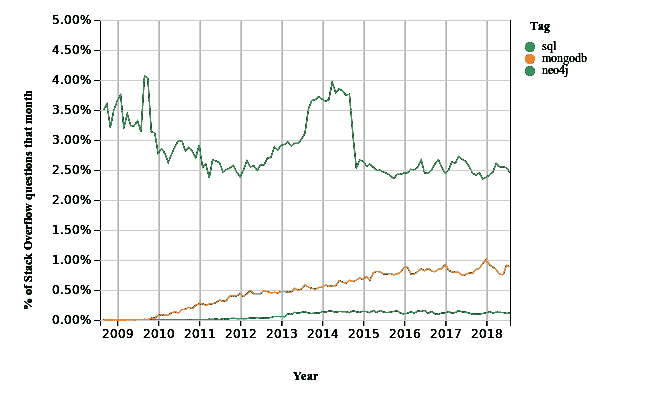
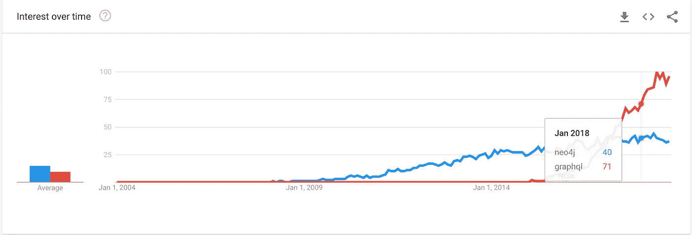
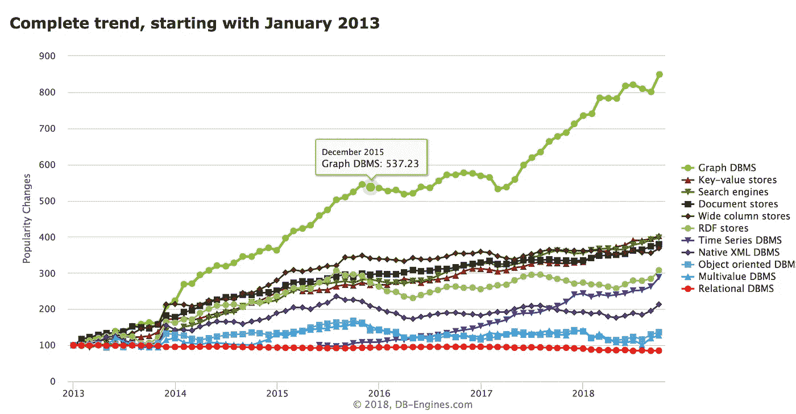
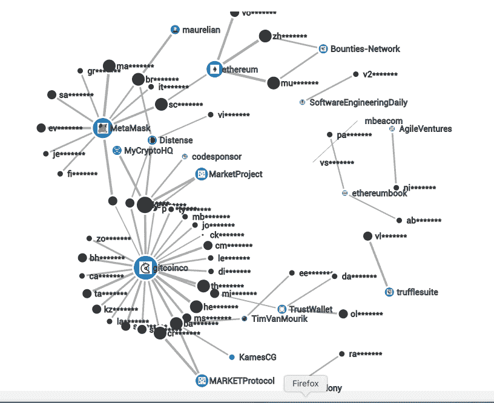
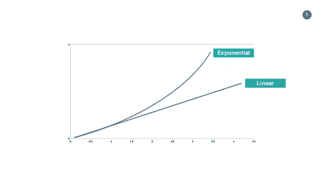
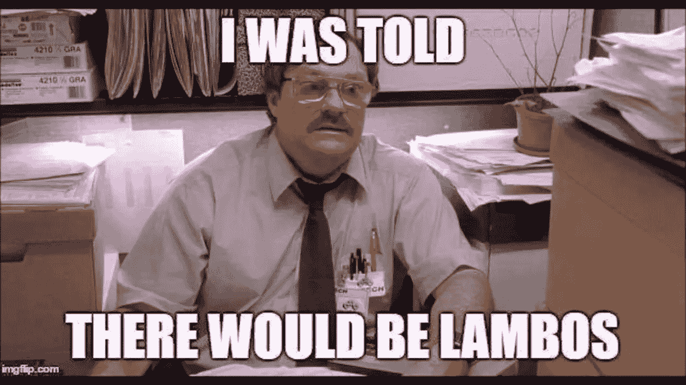

# web3 技术可以从图形数据库中学到什么

> 原文：<https://medium.com/swlh/what-web3-tech-can-learn-from-graph-databases-7eecf7ebd5c2>

一位以太坊开发者分享了一些关于生态系统状态的想法。

我很喜欢彼得·泰尔的说法。为了让一家公司产生前所未有的变化和积极的影响，它的核心理念必须是一个别人看不到的秘密。很少有人同意这个事实。企业揭露的不真实假设越基本，影响和支出就越大。

图形数据库是这种秘密的完美例子。世界不是作为一组独立的实体运行的。

# 数据存储范例

传统上，数据存储在关系数据库中。即使是各种各样的 nosql，从根本上来说，也依赖于相同的概念。它由表和表之间的关系组成。每个表代表一个单独的实体，如客户、雇员、学生等，以及属性。

A naive example of a database

你有没有想过为什么很多创业公司用“X 的优步”来推销他们的想法？答案是:一次能记住多少是有严格限制的(大约 3-5 个项目)。何时、如何以及为什么会出现极限？没人真正知道。但是我们可以对事物进行推理，考虑一组非常有限的项目。因此，优步的住房= Airbnb，而不是任何其他术语。将优步扩展成文字需要 3-5 个以上的概念项目。因此，捷径。

关系数据库使得孤立地看待事物变得容易。这里有一个员工。这里有一辆汽车。没错。

# 图形优势

> "在这里拉一根线，你会发现它连着世界的其他部分。"纳迪姆·阿斯拉姆，虚度的守夜

然而，图形数据库迫使用户(开发者)从整体的角度来看待事物。有助于协调整体的一组独立的事物。

这是比隔离对象范例更好的数据解释。它也更接近于现实世界中的工作方式，但是它经常超出用户的理解能力。个人注释:这可能与**创造力**有关，创造力是五大性格特征之一，非常非常罕见。

# 图形数据库采用率

如果你不相信这个理论，让我们来看看 neo4j、mongodb 和 sql 的堆栈溢出趋势(这是一种语言/类别，而不是一种技术，但你可以得到它的要点)。

谷歌在图形数据库技术 Pregel 和 PageRank 算法(最初)的基础上建立了自己的帝国。然而，很少有人建立或消费网络分析，也很少有人知道如何阅读它们。我知道，即使在谷歌内部，Pregel 的采用率也非常低，尽管有高层管理人员的推动。我看到开发人员第一次构建图形数据库“模式”，他们试图以类似于构建关系数据库的方式来做这件事。

许多其他大公司已经成功地建立了系统，并利用图表揭示了许多真知灼见。但是，现在看来，没有足够的眼睛来看这个，也没有足够的手来建造东西。

让我们来看看一些趋势。

就采用率/兴趣而言，Neo4j 已经持平。Graphql 正在经历一些有趣的增长。让我们看看它去哪里。注意:graphql 有一个更“表格化”的方法，即使它最终将数据集合在一个图中。

当然，据 db-engines.com 称，人们对这一类别的整体兴趣正在上升。如果我们看一下一阶导数，我们可以看到 db 被采用的比率在大幅上升。尽管如此，在数据库领域，Neo4j 仍然在流行度列表中排名第 21 位。

是什么导致了图形数据库的采用停滞不前？我认为最核心的原因是这并不容易解释。这违背了传统的做事方式。更重要的是，它没有提供直接的、明显的好处。是的，作为一名开发人员，在掌握技术后的几周内，你将更快地构建东西。是的，你会发现很棒的见解，现在很难解释。中间中心性？需要非常有创造力的人来接受这个概念，并把它应用到业务中。从某种意义上来说，这个概念不容易与基础技术分开。技术人员还必须围绕它构建一个业务用例。或者，反过来说，当建立一个企业时，你必须意识到图形空间。技术内部没有人能在技术之外正确地解释它。从事这项技术的顾问不断要求生产底层技术的公司提供清晰的用例。这仍然是一个问题。

尽管看到图形数据库陷入臭名昭著的死亡漩涡是一件令人遗憾的事情，但这仍有待观察。

# web3

web3 还揭示了一个不真实的假设。你需要一个银行在人们之间转移价值。你需要大量的文书工作来开始销售你的服务。简而言之，你需要一个中央实体的许可才能开始做事。web3 的出现让这个假设变得过时。这将产生深远的影响，我敢打赌最大的大众市场影响是“工作”的转变。

# **区块链威胁**

普及是非常非常困难的，因为解释这项技术会产生许多概念。我们害怕我们不了解的东西。加入对轻松获得财务收益的嫉妒，由于糟糕的交易而损失的资金，以及传播误解和仇恨倍增的文章。去年关于区块链最受欢迎的文章是那些以非常有创意的方式说它愚蠢和投机的文章。

与图形数据库类似，真正理解正在构建的内容需要查看过多的因素。有技术本身，它有助于复杂的加密和分布式算法。行动者之间的互动构建了经济，由此产生了博弈论机制。这个市场有很多参与者，角色之间的轮廓模糊不清。生产者也可以是消费者。一个工人可以参与许多项目。

Mesh of humans, interacting freely and contributing to multiple projects. Looks familiar?

在其完形中，很容易混淆线性采用率和指数采用率。区块链还没有进入主流，远远没有。但是这个怎么玩呢？如何避免图形数据库技术的命运？

Linear vs Exponential: Up until point 15 on the x axis, the two functions coincide

我认为看看 Linux 发生了什么是有用的。早在 1991 年，很少有人同意(甚至关心)开源操作系统必须存在。今天，世界上有更多的 Linux 安装，然后有专有的 OS 安装。Linux 将自己定位为一个支持自由的平台，并且能与他人友好相处。支流，闭源系统长期吃亏。

但是最终用户很少知道或者关心他们正在使用 Linux。无论如何，开放、协作的系统赢了。甚至在 Linux 出现之前，当互联网诞生的时候，公司就设想了一个封闭的系统来实现公司数据仓库之间的通信。当然，正如我们所知，他们错了。

什么会使区块链收养高原？图形数据库也是如此。我们需要几个人，将技术从业务用例中分离出来。除了蓝宝迷因，我们需要足够强大的冠军和用例来激发消费者市场的兴趣。我非常乐观，但是让我们保持警惕。

从长远来看，我认为我们必须抽象出复杂性(终端用户甚至不应该知道他在区块链上交易——他知道他的手机运行 Linux 吗？)在各个层面。从消费者到非核心开发人员，我们应该提供干净的故事并公开其好处，一直到在源代码级别公开更简单的做事方式。在某个时候，硬核、好奇和使命驱动的开发人员将供不应求。我们有工作要做。建立一个生态系统，并将其培育成大规模应用，绝非易事。一场世界性的社会变革，更不用说了。

一路平安！

## 这篇文章发表在 [The Startup](https://medium.com/swlh) 上，这是 Medium 最大的创业刊物，有+ 379，528 人关注。

## 订阅接收[我们的头条](http://growthsupply.com/the-startup-newsletter/)。

