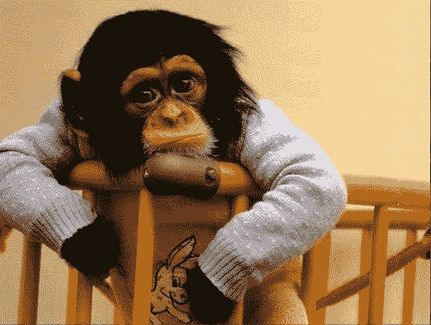

# Munchee ICO 出了什么问题

> 原文：<https://medium.com/swlh/what-went-wrong-at-munchee-ico-sec-subpoena-a468cba42e10>

你知道美国证券交易委员会可以通过电子邮件发出传票吗？我没有。

我认为他们必须通过更官方的媒介沟通——通过像国税局这样的邮件，或者像在电视上向人们送达法律文件时那样亲自沟通。我错了。他们发电子邮件。

2017 年 11 月，当我收到美国证券交易委员会的传票，要求我提供有关我所建议的一个项目的更多信息时，我了解到了这一点。

你可能听说过麦奇。彭博、T2、福布斯、T4、TechCrunch、Coindesk 和 T7 对它们进行了报道，但不是出于我希望的原因。他们之所以被报道，是因为他们是 SEC 采取行动并公开谈论的首批象征性出售。

故事很长——在这里分享了一部分——但简而言之:美国证券交易委员会不喜欢麦奇做的一些假设，在代币销售的第一天，他们下令将所有资金退还给代币买家。

每个人都知道*故事的那*部分。Munchee 团队几个月的工作付之东流，因为他们做出了重大假设和错误(SEC [在此](https://www.sec.gov/litigation/admin/2017/33-10445.pdf)详述)。

我写这篇文章有两个原因:

1.  最近，我和 24 名证券或区块链律师交谈过，他们喜欢说“好吧，你不会想做麦奇做过的事情，而且 X 几乎总是麦奇没有做过的事情，而且在任何时候都没有受到指控。人们给 Munchee 分配了很多不同的活动，但这并不是这里发生的事情。
2.  在我看来，麦奇开始象征性的出售之旅时，最明确的意图是以正确的方式执行任务，但在某个时候，他们失去了这种信念。这很容易做到。希望在这里分享他们的核心错误，有助于以后代币销售避免。

## 首先，重要的一点是:

这里分享的这个故事和观点是我个人的经验和观点。我不代表 Munchee 或其任何利益相关者(过去或现在)发言。我是该项目的顾问，我们的协议在项目停止后不久就终止了。那时，他们的律师接管了一切，而我基本上没有参与。从那时起，我就很少和 Munchee 团队交流了。这些建议都不被认为是对**的任何一种，尤其是合法的。**

*在我看来，管理团队是一群聪明、勤奋、专业的人。错误肯定是有的，但每个人(据我所知)都是出于好意。*

## *产品和计划*

*带着对餐厅评论平台的抱怨和对消费者视觉用户体验趋势的观察，Munchee 推出了一款简单的餐厅评论移动应用，以美食摄影为中心。*

*这次经历强调了麦奇所说的真正重要的东西——食物本身。UX 不鼓励他们所谓的低质量评论，这些评论涉及非食品因素和虚假评论(因为如果你必须出示照片，伪造评论就更难了)。*

*他们最初的商业模式很清楚:餐馆会提供小商品(如薯条或软饮料)来换取 Munchee 平台上的评论。*

*当管理层了解到 ICO 市场时，他们看到了通过令牌集成改进产品的机会。他们推断，如果一家合作餐馆用代币激励用户，可能会鼓励更多的活动。最终用户可以查看餐馆 A 和餐馆 B，通过这样做来赢得 Munchee 代币，并在餐馆 A、B、C、*或甚至* D 兑换这些代币*

*听着，我知道这不是下一个伟大的突破性技术产品。这是一个简单的迭代，一个可爱的想法，是对现有经验的扭曲。*

*这个团队在读了我在《黑客正午》上写的文章后，开始着手进行象征性的出售。我写了我们的 benjaCoin 销售，公用事业和安全代币的区别，我与 SEC 的对话，以及其他一些话题。(快速旁白:这些帖子只有 7-9 个月大，但它们还没有成熟。他们可能来自 100 年前。变化太大了。)*

*我不需要了解代币的细节，但根据我们当时掌握的信息，麦奇似乎可以进行代币销售。该团队将存货(代币)出售给一群人，这些人会将存货用于其声明的目的，他们相信他们不会违反豪威测试，他们不会以任何方式(通过交易所上市或其他方式)将其视为证券，并且他们本着诚信行事。*

*那时候，这已经足够了。*

*我们交往的头两个月，一切都很顺利。Munchee 围绕该产品建立了一个社区，赢得了一些媒体的关注，并且似乎已经做好了执行一次成功的小规模销售的准备。虽然当我和创始人交谈时，我在电话的另一端听到了压力，但我们总是把电话留在一个稳固的地方。*

*然后风向变了。*

*一些预定的电话被错过了。我会提供一个我们看似同意的建议，但他们会立即忽略。在两个场合，我表达了我的沮丧，但我得到保证一切都会好的——有人告诉我，随着新人加入团队，会有一些成长的烦恼，一切都会很快恢复正常。*

***事实是我被淘汰了。直到事后我才意识到。***

*管理层担心他们可能没有建立足够的有机社区来支持销售，因此引入了额外的象征性顾问。虽然这通常是一个受欢迎的想法(因为想法的多样性是一件好事)，但这些新顾问破坏了我们在这一点上采用的良好治理、“以正确的方式做”的方法。不管出于什么原因，新的顾问得到了管理层的认可，而我却成了局外人。*

## *在我看来，麦奇改变了他们的策略，做了三件导致他们失败的事情:*

1.  ***麦奇发誓要烧掉所有没卖出去的代币。**这在 2017 年底之前的代币销售中很常见，似乎已经成为过去，因为**宣布你将烧掉代币意味着代币价值将会增加。这违反了 Howey 设定的利润预期。***
2.  *麦奇开展了一项大规模的奖金计划。正如我在“[安息吧，ICO Bounty Programs](https://hackernoon.com/rest-in-peace-ico-bounty-programs-fc1e1e04e867) ”、**中分享的，如果“利润来自发起人或第三方的努力”，Howey 测试将交易标记为投资合同(最有可能是证券)，**当一个项目作为 bounty program 的一部分被推广时，这几乎*总是*发生，免费令牌意味着存在隐含的利润预期。”*
3.  ***Munchee 转向付费推广。**我不想说我告诉过你，但这是我从 2017 年 8 月以来一直在[谈论](https://twitter.com/andrewjchapin/status/894026908626698240)的事情。我告诉过你。
    付费推广在这个生态系统中没有一席之地——ICO 广告是骗人的，会将买家/投资者的资本置于风险之中。虽然看到脸书、Twitter 和谷歌拒绝代币广告业务令人鼓舞，但这并不是唯一发生这种情况的地方:Munchee(显然)付钱给许多 YouTube 有影响力的人和博客来宣传这个项目。不确定我在说什么？让我借用一下美国证券交易委员会的停止令:“Munchee 在脸书上发布了一个公开帖子，链接到第三方 YouTube 视频，并写道“以 ICO 价格在 MUN token 上获得 199%的收益！现在就报名预售！链接的视频中有一个人说“今天我们要谈谈麦奇”。麦奇是个疯狂的 ICO。如果你不知道什么是 ICO，它被称为初始硬币发行。差不多吧，如果你足够早地投入其中，你很可能会得到回报。此人继续使用他的“ICO 投资表”将 MUN token 与他所谓的“有史以来的 15 大 ICO”进行比较，并“推测”1000 美元的投资可以创造 94000 美元的回报
    **这不是我报名参加的善政代币销售。***

*试图在美国做生意而忽视这些要点的代币经营者这样做是错误的，简单明了。在联邦政府提供代币资产类别的新定义之前，这些行动将导致 SEC 认为代币可能是一种证券(或至少对此进行调查)。*

*代币购买者应该对任何基于美国的代币销售感到厌倦，他们认为他们可以在没有注册为证券的情况下执行这些促销活动。尽职调查并提出问题。让代币购买者尽职调查过程变得困难的一点是，许多加密媒体不披露文章、视频、播客或其他内容何时付费，这违反了联邦贸易委员会的规定。我很快会写更多关于这个的东西，但是如果一个象征性的销售项目突然一下子有太多压倒性的正面媒体，在一头扎进去之前先问问题。不要让 FOMO 抓住不放。*

*今天，Munchee 是一个警示故事——我经常引用这个故事，当然也从中吸取了教训，我希望其他人在买家和代币运营商考虑他们的下一个项目时也能从中吸取教训。*

**我的名字是***。我是商品广告网络* [*Benja*](http://benja.co) *的首席执行官，一名代币顾问，也是初创公司 foundry*[*Chapin Labs*](http://chapinlabs.com)*的负责人，该公司帮助推出了* [*着色加密*](http://coloringcrypto.com) *播客(上一集为 Munchee* [*此处为*](https://itunes.apple.com/us/podcast/33-what-happened-at-munchee-mistakes-the-flagged-the-sec/id1291606679?i=1000408503593&mt=2) *)和***

****