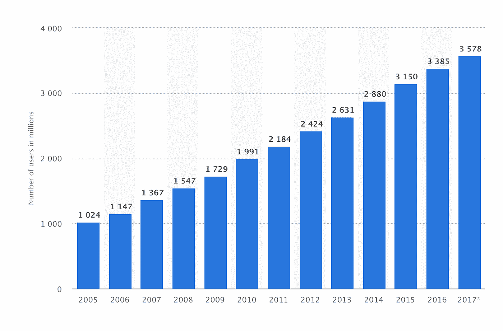
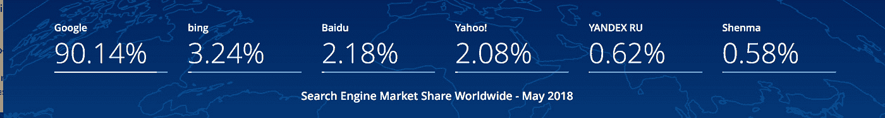
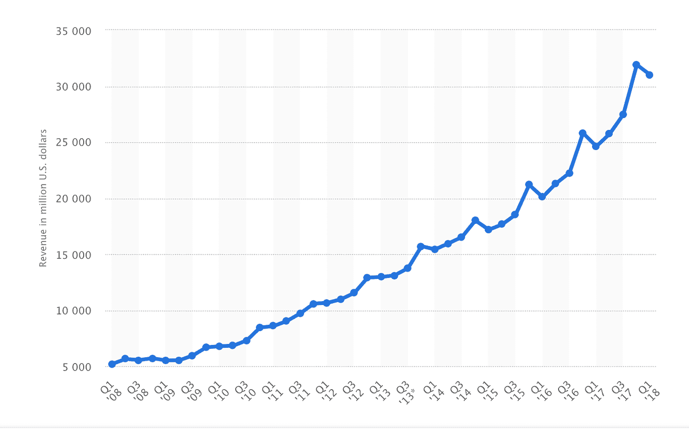
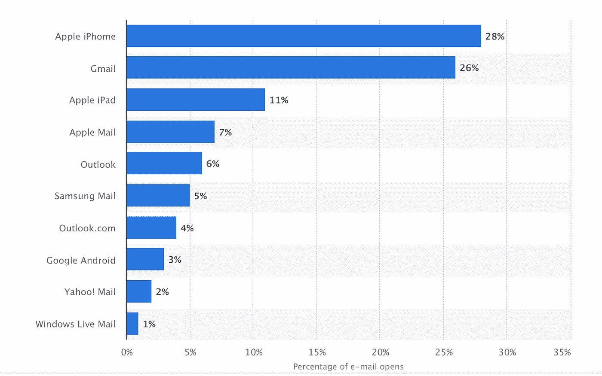
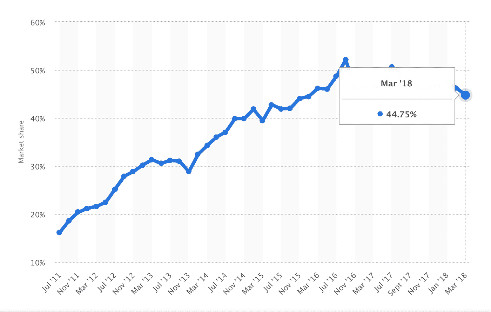
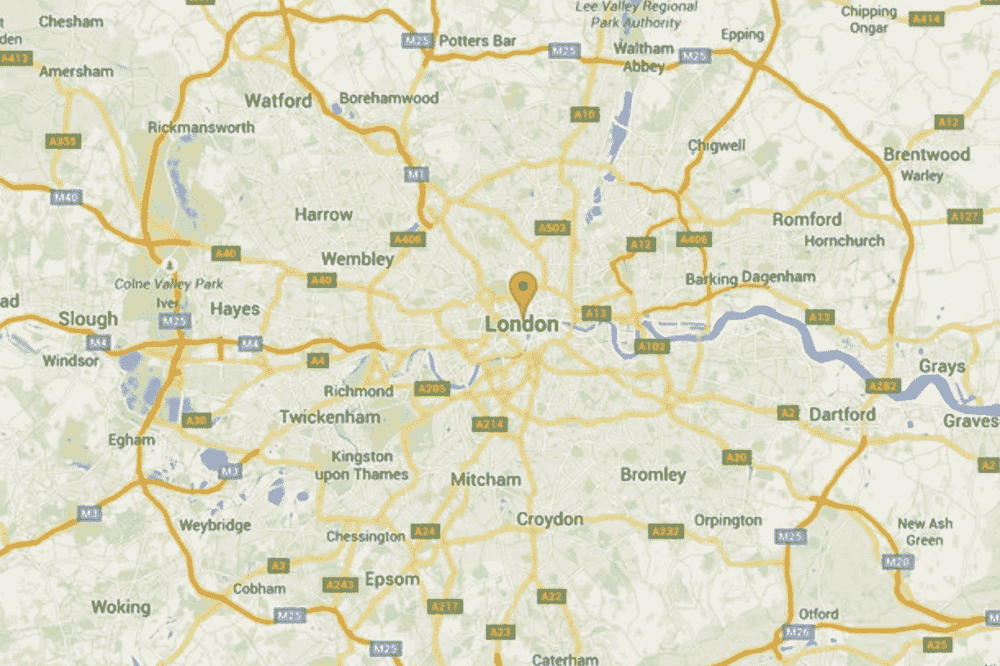
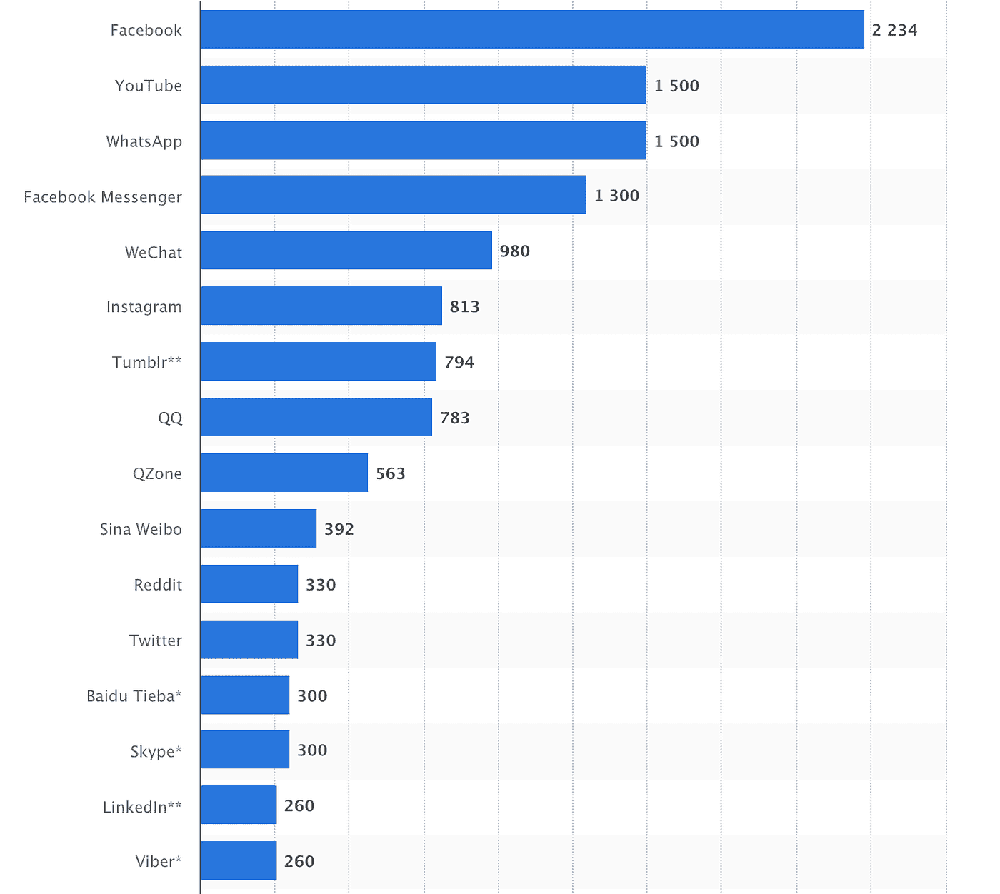
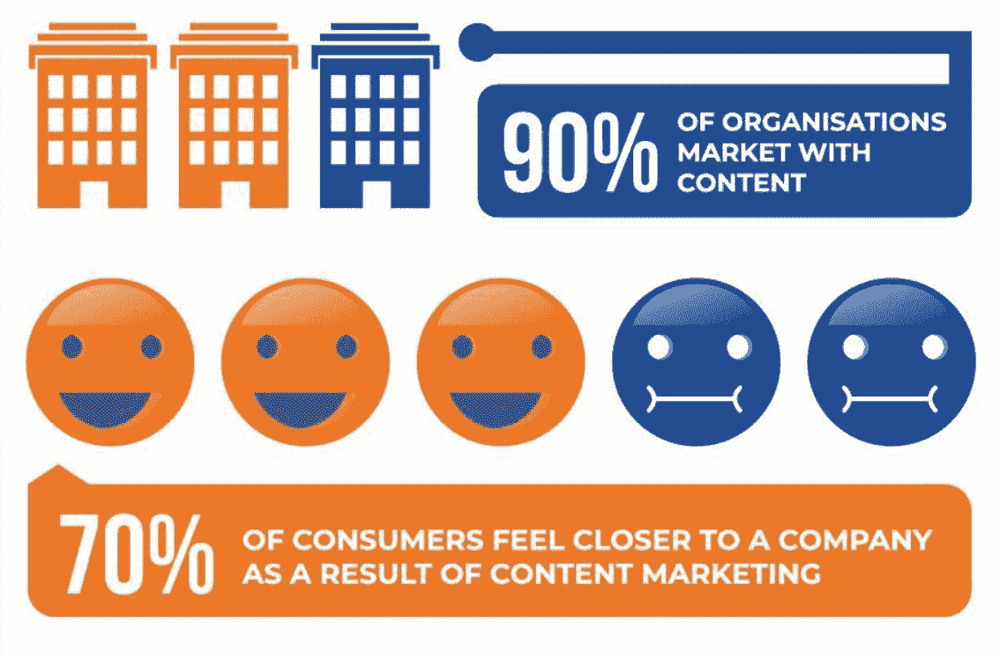

# 如果谷歌崩溃 24 小时会怎么样？

> 原文：<https://medium.com/swlh/what-would-happen-if-google-crashed-for-24-hours-3bcc09a1769b>

Photo by [Annie Spratt](https://unsplash.com/@anniespratt?utm_source=medium&utm_medium=referral) on [Unsplash](https://unsplash.com?utm_source=medium&utm_medium=referral)

# 别担心，没有迹象表明这个世界上访问量最大的网站即将崩溃或下线…

…但是，如果是这样，会发生什么？我们对一个网站和它的服务有多依赖？

在我们深入到**这个世界末日的东西**之前，让我们检查一下上次[谷歌 T7 崩溃时发生了什么。](http://google.com/)

2013 年 8 月，谷歌的服务关闭了 2-3 分钟。在此期间，全球互联网流量下降了 40%。

40%!那是 5 年前的事了！

从那以后，谷歌加强了他们的地位，增加了一大堆附加服务，我们变得更加依赖互联网。

**2005-2017 年互联网用户增长**([*Statista*](http://statista.com/))

# 那么，如果谷歌崩溃会发生什么？

# 搜索引擎

首先要考虑的是谷歌最受欢迎的产品，搜索引擎。

*“谷歌 it”*已经成为一个独立的术语，就像“胡佛”一样，这是有充分理由的，他们拥有全球搜索市场 90.14%的巨大份额。

如果谷歌的搜索引擎显示“404 错误”，我们大多数人会做的第一件事就是检查我们的互联网连接。许多人甚至会完全放弃，从网上消失。

我们这些没有第二选择搜索引擎的人(我猜很多)，会本能地想在谷歌上搜索*【其他搜索引擎】*，却发现谷歌(又)宕机了。

世界上的其他人可能会发现自己在[***Bing***](http://bing.com/)(在他们努力提高搜索工具的使用率之后)然后他们的**服务器也会崩溃**，因为谷歌每天都要处理大量的流量。

全球范围内搜索最多的“如何”问题是*“如何打领带”*，这会让世界各地的男人们几乎窒息，而不幸的伴郎会在他们的脖子上打两个结。

# 企业和营销人员

谷歌的短期死亡会让企业遭受难以估量的损失。

他们的大部分流量会消失，但他们可能不会意识到，因为谷歌分析也会失败。

没有他们心爱的数字，营销分析师会陷入深深的沮丧之中。许多人会求助于**无休止地在他们的桌面计算器上敲击随机键**或者对着他们的“图表太棒了”咖啡杯哭泣。

销售额将会暴跌到有史以来的最低点。世界上最大的科技公司的股票会在如此低的流量下崩溃。但是中国公司的股票会飙升，因为 [*【百度】*](http://baidu.com/) 仍然在运行，而且他们的公司不像西方世界那样依赖一个网站。

Alphabet(谷歌的母公司)会为失去广告收入而后悔。在 2018 年的 Q1，他们公布了 310 亿美元的**收入**，这意味着一天没有交易将花费他们**316，326，530 美元。**

**谷歌季度收入(**[*Statista*](https://www.statista.com/statistics/267606/quarterly-revenue-of-google/)**)**

广告商也会遭殃。他们会冲到 Bing 上，去发现如何在他们的平台上运行广告，结果流量的激增让它(再次)崩溃。

# 沟通

据[***Statista***](http://statista.com/)*统计，全球有 26%的人使用 Gmail 作为他们的电子邮件服务提供商。*

**

*的电子邮件将会消失，造成灾难性的邮件沉默。人们会匆忙回到他们的旧的 Hotmail 或 Yahoo 帐户，这些帐户主要用于注册看起来像垃圾邮件的交易，并且不得不费力地阅读 356，922 封未打开的电子邮件…*

*…当他们清除了邮件后，他们就不能给除了老同学之外的任何人发邮件了，因为他们所有的真实联系人都在他们的 Gmail 账户里。*

*我们中的一些人甚至可能不得不拿起电话，但使用 Android 的 44.75%的英国人甚至可能无法进入他们的联系人，因为他们也是谷歌运营的公司。*

**

*许多人会拨打前任的电话号码，因为这是他们唯一能记住的号码。*

# *娱乐*

*如果谷歌倒下了， [*YouTube*](http://youtube.com/) 可能也会倒下。*

*这意味着当我们无聊地等待谷歌重新上线时，我们甚至无法观看热门的搞笑视频*“猫追自己的尾巴*”。*

*YouTube 上的“名人”会系统地把自己送进精神病院，因为一整天都没有人关注他们。*

*各地浪费时间的人实际上不得不继续他们的工作，或者找一个不同的兔子洞倒下。*

# *方向*

**

*没有谷歌地图？我们都必须在加油站停下来，决定走哪条漂亮的彩色线。*

**“当然，我必须沿着绿线走？”*人们会告诉自己，*‘这就是谷歌地图的工作方式，它总能把我带到正确的目的地’。**

*汽车会撞车是因为司机把 A3 大小的地图塞进了挡风玻璃上的手机支架里。我们其余的人都会沿着绿线到达完全相同的地点，在乔伊登的木材服务站制造大屠杀。*

*我们中的一些人可能会聪明地使用苹果地图。这些人最终会来到德国的黑森林，并建立一个邪教，相信这种废弃的技术已经直接把他们带到了应许之地。*

# *社会化媒体*

***社交媒体活跃用户**(2018 年 4 月 [*Statista*](https://www.statista.com/statistics/272014/global-social-networks-ranked-by-number-of-users/) )*

**

****Google+*** 会崩溃…*

*…没有人会注意到。*

*我们中的许多人会冲向我们想要的社交网络，以下列方式做出反应:*

*[***脸书***](http://facebook.com/einsteinmarketer)***–****

*   *“我的天哪！”*
*   *‘世界末日到了！！!'*
*   **出售的苹果 mac 电脑，*运行良好，但无法加载谷歌-* ***6.99。*****

****——****

*   ****' # Google down # kill menow # bingis crap '****
*   ***‘这都是因为英国退出欧盟# out of europeoutofgoogle’***
*   ***‘duck duck go 反正更好！#关于时间'***

**[***insta gram***](http://instagram.com/einsteinmarketer)—**

*   **这是我和谷歌的自拍，不敢相信他走了。RIP'**
*   ***‘黑白，死搜索引擎的高分辨率镜头，鱼眼镜头。’***
*   ***‘不要使用中文搜索引擎，你可能会找到我想以低得多的价格出售的产品’***

**[***领英***](http://linkedin.com/)——**

*   **“如果没有谷歌，你认为企业将如何应对？”**
*   **“如果没有谷歌，你认为企业将如何应对？”**
*   **“如果没有谷歌，你认为企业将如何应对？”**

**[***Tumblr***](http://tumblr.com/)—**

# **内容营销人员**

****

**离开谷歌的时间让最懒惰的内容营销者耗尽了创意，毕竟，如果他们不能搜索一个主题，他们应该如何剽窃别人的创意呢？**

**所有其他内容创建者开始创建关于没有谷歌的生活的帖子。**我们无法移动标题为**的博客**

*   **-谷歌崩溃是好事的 10 个理由**
*   **-谷歌倒闭期间，5 种让你成功的方法**
*   **-我从谷歌崩溃中幸存下来，这是我的故事**
*   **-38 家公司在谷歌关闭期间蓬勃发展**
*   **-数字营销超级忍者分享他们最好的谷歌速成技巧**

# **结论**

**这篇博客的目的不是取笑任何人，而是展示一家科技公司对我们生活的影响有多大。**

**他们的产品很棒，而且(大部分)是免费的，这让我们很多人完全依赖他们的服务。**

**让我们祈祷这永远不会发生，因为谁知道会发生什么事情(希望不是那些把地图粘在挡风玻璃上开车的人)。**

**如果谷歌崩溃，你认为会发生什么？我错过了什么重大的事情吗？让我知道你的想法，让我们一起为世界做好准备！**

**想要更多的乐趣吗？看看我们的 [***8 个病毒性视频广告***](https://www.einsteinmarketer.com/viral-video-ads/) ！**

***原载于 2018 年 7 月 9 日 www.einsteinmarketer.com***。****

****

## **这个故事发表在 [The Startup](https://medium.com/swlh) 上，这是 Medium 最大的企业家出版物，拥有 343，876+人。**

## **订阅接收[我们的头条](http://growthsupply.com/the-startup-newsletter/)。**

****