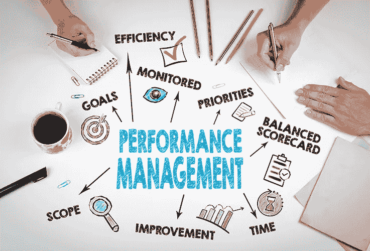

# 要在各个层面取得成功，你必须知道的目标和关键结果(okr)

> 原文：<https://medium.com/swlh/what-you-must-know-about-objectives-and-key-results-to-be-successful-at-all-levels-157c9dc46056>

## 目标和关键成果作为设定优先事项的导航系统

## 伟大领袖的智慧。第三部分。

OKR As A Tool To Set Priorities — Align Work

最近，约翰·杜尔登出版了一本新书，名为《衡量什么是重要的:谷歌、博诺和盖茨基金会如何撼动……