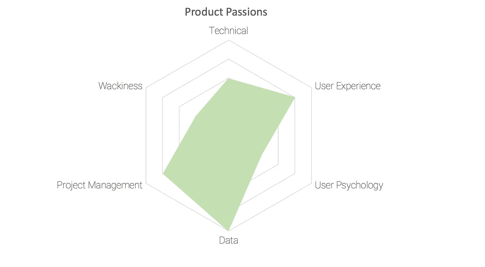

# 你应该从产品人员身上寻找什么

> 原文：<https://medium.com/swlh/what-you-should-be-looking-for-in-a-product-person-ee40e39a7301>

几个月前，我离开了 Life On Air，也就是我共同创立并负责该产品的公司，此后，我发现自己成了寻找下一步行动的产品人员和寻找合适产品人员加入团队的公司的中心。角色相当广泛:无论是寻找项目经理的公司，寻找第一个产品雇员的创始人，还是寻找产品/联合创始人的企业家。

在这段时间里，我发现自己在重复一些我学到的东西，因为它似乎对一些人有用，所以我决定在这里分享它。

底线是我问的第一个问题:

*“你的产品缺少什么？”*

答案不在于你所寻找的产品人员的技能和优势，而在于:

*“他或她的激情是什么？”*

在一个公司将产品视为其产品中心的世界里，雇佣合适的产品人员变得至关重要。由于产品人员就像鸭子一样(我们会谈到这一点)，很难定义是什么让产品人员成为适合你公司的人。

产品人员往往来自各种各样的背景。并且不需要任何统一的前提条件就能成为产品人。

我们大多数人都希望他们擅长所有的事情；我们希望他们有许多特定的技能，像三项全能运动员…或者鸭子。他们需要游得好，跑得好，骑得好(如果是鸭子，还需要飞得好)。以最好的铁人三项运动员为例:总会有更好的游泳运动员、更好的跑步运动员和更好的自行车运动员，但最好的铁人三项运动员应该是这三者交汇处的佼佼者。每个铁人三项运动员对每项运动都有不同程度的热情(这并不总是与他在每项运动中的技能水平一致)。

回到产品人员——假设我们雇佣了最好的人才，了解他们的热情所在是很重要的。然后我们可以建立一个雷达图——或者蜘蛛网——来分析我们需要什么。

我喜欢把它分成六类激情:**技术**、**用户体验**、**用户心理**、**数据**、**项目管理**和**搞怪**。我试着看着这个人，理解他们的热情，不管他们的背景(这可能会给出错误的假设。)

# 1.技术的

这些是产品人员寻求深入了解矩阵如何工作，它可以在哪里弯曲，它在不久的将来会是什么样子，以及如何在它的限制内构建。他们将能够在入侵系统时对某些功能进行最快的验证。他们试图精确地想象建造一个东西需要多长时间。他们想要理解和管理技术债务及其与产品后续步骤的关系。他们试图找到可以偷工减料的地方，并试图更深入地了解某些功能对技术部分的影响。

# 2.用户体验(UX/用户界面)

他们喜欢了解 UX 的潮流和设计模式。他们喜欢设计迭代，也许是设计而不是创建模型。当没有数据或用户不能真正解释时，他们试图对设计能给用户带来什么有更好的感觉。他们的舒适区在设计师中间。当他们被设计而不仅仅是线框的时候，他们感觉谈论特性和想法更好。如果是线框，他们更喜欢交互式的东西，这样你可以更好地感受用户体验。

# 3.用户心理学

这些人真的对用户的感受感兴趣。他们喜欢听(我们大多数人不喜欢)。他们喜欢并从用户测试和观察用户与产品的互动中获得很多。他们乐于寻求支持并成为其中一员，他们喜欢参与社区管理或营销。他们喜欢了解用户属性和人口统计数据，并了解产品外部的外部生态系统如何影响他们与产品的交互和使用。产品的信息和声音对他们来说很重要。他们寻求将产品的信息和社区的声音与产品相匹配。

# 4.数据

这些人总是试图理解和量化产品特性或进展的影响。他们真正关心的是理解数字如何显示与产品的互动。不是由数据驱动的决策是无用的。他们喜欢用仪表盘开始一天的工作。当他们对实际使用情况没有足够的了解或者没有数字来回答他们的问题时，他们会感到不舒服。当别人没有提出正确的问题时，他们会感到恼火，当别人得出错误的结论时，他们会更加恼火。

# 5.项目管理

他们关心的是做事的过程，是不是足够精益，是不是缺了点什么，还是不够。他们把功能和想法看作是一小步一小步的总和，当你和他们说话时，他们试图在头脑中分解如何从 A 点到达 B 点。他们关心优先级及其方法。如果决策是由数据驱动的，他们想知道如何使决策更加高效和透明。以及如何扩展工作流程。他们寻求对产品管理方法的更好理解；他们喜欢理解 Scrum、看板和敏捷等等的优缺点。

# 6.古怪

这是一个棘手的问题，因为它很难理解，甚至更难衡量。我所说的“古怪”是指有些人的想法与众不同。他们有一些想法，当他们谈论这些想法时，会引起人们的惊讶。这并不一定意味着这些是最好的想法——它们只是不同而已。但不同的想法很容易产生，这些人可以理解这个怪异、古怪的想法是如何产生的，以及其背后的逻辑是什么。他们可以想象这种怪异的想法是如何从 A 点建立到 b 点的，他们很容易对产品感到厌倦，他们对模式和窃取想法感到不安——不是因为这在道德上是错误的，只是因为这很无聊。

现在，当你思考这六种不同的激情时，你们中的一些人可能会认为还缺少一些领域。其他人可能会发现其中一些人吹毛求疵，而其他人则一无是处。

我认为，我们需要思考我们的产品中缺少什么，然后绘制这六种激情。我说的“产品中缺失”不仅仅是指产品本身；而是整个产品团队，无论是创始人寻找产品创始人加入，还是聘请产品 VP，为一个产品团队增加一个 PM，或者为一个多学科的小分队增加一个 PM。

现在，画出这六个属性的雷达图，找出缺失的部分，然后开始为你心目中的每个人画出这六个属性。

假设你雇佣了最优秀的人(我们都这样做)，如果**他们的热情与**你认为缺失的相匹配，并且你的文化赋予人们做出改变的能力，**他们会影响**其他人，把你的产品带到你想要的地方。

我仍在努力想出一个简单、有条理的方法，用一些问卷或练习对这 6 个属性进行排序。这样做的一个方法可能是要求那个人根据他或她最喜欢的东西在六个属性之间划分 20 个“点”。你也可以从他们阅读的内容、他们追随的人以及对他们产生影响的事情中对他们有更好的了解。如果你有任何建议，我很想听听。

更新:🙏克里斯蒂安·蒙托亚为方法[https://montoya.github.io/product-person/](https://montoya.github.io/product-person/)创造了一个工具