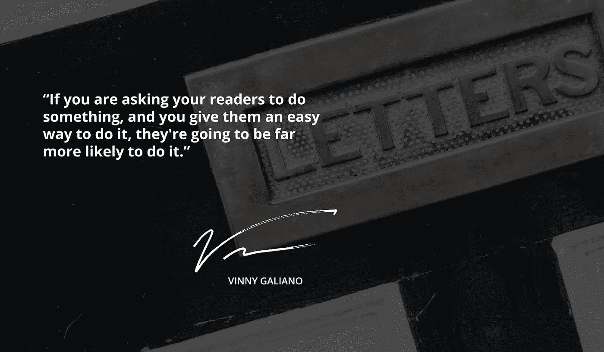

# 你的电子邮件对你的描述

> 原文：<https://medium.com/swlh/what-your-emails-say-about-you-38459809c4bd>

电子邮件是一种主要的交流方式，从办公室间的快速信息传递到公司使用电子邮件同时联系数百万人。因此，虽然你可能不会再三考虑发送电子邮件，但请记住，你的信息可能会被转发、打印或给人留下错误的印象。虽然你同事之间的私人邮件可能有点太多文字或表情符号，但真正对人们产生最大影响的是发给大众的邮件。

无论你的分发名单是一千人，还是十万人，他们出现在你的邮件列表上是有原因的，你不想给他们任何退订的理由。所以，在你点击发送之前，看看你的邮件，决定你是否愿意自己阅读。

**长长的文字块**

这意味着你可能没有考虑人们会如何看待你的信息。随着越来越多的人在移动设备上阅读电子邮件，他们很有可能会快速阅读。他们不想读一篇长文章。不要用大段文字把你的电子邮件弄得乱七八糟，给你的读者一个摘要或导语，让他们选择浏览你的网站来阅读他们感兴趣的文章。他们可能会因为略读和选择不读十分钟的文本而错过很多内容。

**使用明亮、冲突的颜色**

如果你在电子邮件中使用大量鲜艳的冲突色，仅仅是因为存在这种选择，读者会认为你试图传达一些令人兴奋的东西，但使用令人讨厌的颜色会过度。人们希望看到赏心悦目的邮件，如果不是这样，他们会认为你不知道如何推销你的产品。

**闪烁的文字或者读起来令人生厌的文字**

这表明你还停留在 2000 年的早期，那时网站和 html 技术还是新鲜的，人们在他们的网站和电子邮件上做疯狂的事情，仅仅因为它是新的和酷的。嗯，近 20 年后，这样的技术不再新颖和酷，你的读者会认为你没有跟上时代的步伐。对于一封邮件或一家公司来说，这通常不是一个好的选择。

**每天到达几次的消息**

一天收到好几次的邮件，可以被整理成一封邮件，这表明你可能没有组织能力或者注意力不集中。这也表明你不在乎你的读者的时间，只关心尽可能多的获取信息。虽然有些邮件列表为特定内容提供许多不同的特定订阅，但这是不同的，因为它允许您的用户控制他们看到的内容。如果你没有办法处理你的邮件，人们会注意到，通常会退订。拥有一封简洁的每日邮件表明你是有条理的，不想淹没你的读者的收件箱。

**隐藏的行动号召**

行动号召很重要，除了简单地传达信息之外，这也是发送电子邮件最常见的原因。如果你想让人们做某件事，让他们容易做，否则他们会认为这件事对他们来说并不重要。人们希望事情变得简单明了，如果不是这样，他们可能就不会为此费心了。

**简洁的布局便于导航**

虽然不是每个人都能够识别一个干净的布局和简单的导航，但是当它不存在的时候，他们能够识别它。通过给你的读者一个简单的体验，他们会对你所提供的东西有一个积极的内涵，并且欣赏它的易用性。它看起来也很赏心悦目，给人的印象是你知道自己在做什么，并认识到清晰的沟通对通过电子邮件发送重要信息至关重要。

**用图像说话**

利用图片来抓住你的听众的注意力是在电子邮件中沟通的一种聪明而简单的方式。虽然曾经有一段时间 html 格式的电子邮件需要更长的加载时间，许多人选择不使用它们，但随着高速互联网和移动数据的不断改善，它们变得越来越普遍。在邮件中使用引人注目的图片可以让你通过图片说话，用更少的文字来传达信息。

**简单的行动号召**

如果你要求你的读者做某件事，并且你给他们一个简单的方法去做，他们会更有可能去做。他们会知道你不仅想要信息，而且你在想一个简单有效的方法让他们这么做。不要让他们在其他地方留下评论或购买物品，让他们直接从你的电子邮件中完成，节省他们一个步骤和时间。你的用户会更认真地对待你，更有义务去做你要求他们做的事情。

**通用主题行**

主题行没有给你的读者任何关于邮件内容的提示，会让他们觉得他们真的不需要费心去打开它。时事通讯第 67 期和第 66 期读起来是一样的，但是如果你给他们一个提示或者一个打开邮件的理由，他们会更有可能这样做。如果你花时间写一封信息丰富的邮件，花额外的几分钟时间让主题行更有效。

说到发送电子邮件，最重要的是给你的读者一个好的体验。保持事情简单明了，而不是用鲜艳的颜色、过多的信息和糟糕的导航来淹没它们，这是良好沟通的关键。如果你记住这些事情，你的邮件会给人留下好印象。

## 查看 vinnygaliano.com 的原始帖子！

## 关于作者

我是来自纽约的企业家、商业顾问、投资者和开发商。我创造品牌&帮助别人建立他们的品牌。你可以在[推特](http://twitter.com/vinnygaliano)或者 [Instagram](http://instagram.com/vinnygaliano) 上和我联系。

注册我的周一早间简讯！

## 如果你喜欢这篇文章，请推荐给其他人看！

## 这篇文章发表在 [The Startup](https://medium.com/swlh) 上，这是 Medium 最大的创业刊物，有 327，829+人关注。

## 在这里订阅接收[我们的头条新闻](http://growthsupply.com/the-startup-newsletter/)。

