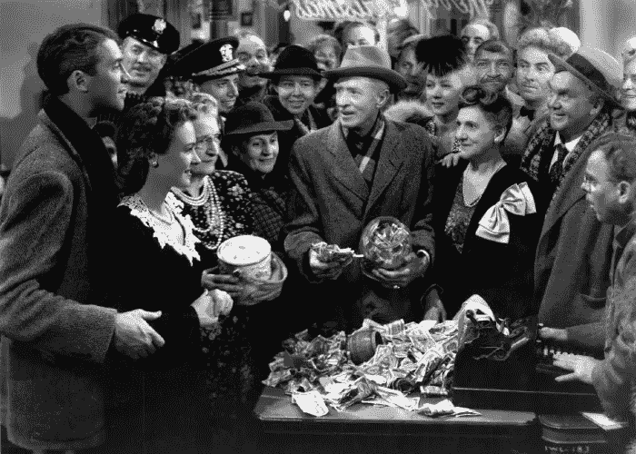

# 优秀的老式储蓄贷款机构到底怎么了？(以及我们如何将它带回来)

> 原文：<https://medium.com/swlh/whatever-happened-to-the-good-old-fashioned-savings-loan-and-how-we-could-bring-it-back-7cfa5548625f>

By DazzlingWaitressGal — Own work, CC BY-SA 4.0, [https://commons.wikimedia.org/w/index.php?curid=65228688](https://commons.wikimedia.org/w/index.php?curid=65228688)

没有什么比看“这是一个美好的生活”更能说明这个假期了。当然，在电影中，主角乔治·贝利在生活中被一个他无法逃脱的家族企业的支柱所束缚:贝利兄弟储蓄贷款公司。

在许多方面，这部电影实际上是围绕储蓄贷款展开的。这是乔治对生活不满的主要原因，因为从父亲手中接管生意使他无法实现环游世界的梦想。然后在后来的股市崩盘期间，他必须花光所有的积蓄(这些钱本来是用来进行一生一次的蜜月旅行的),只为了开门营业。

**但与此同时，储蓄贷款最终成为他的救赎，因为它向他展示了他的生活对他的朋友、家人和社区产生了多大的影响。没有储蓄贷款，他的许多朋友和邻居将永远被困在从当地贫民窟的主人波特先生那里租来的昂贵的棚屋里。**

作为一名前银行家，我总是被有多少故事实际上围绕着银行业及其对社区的影响所吸引。在我们生活的这个时代，我们对大银行有如此多理所当然的愤怒和沮丧，我总是在想:**储蓄贷款怎么了？这些贷款实际上是在帮助人们获得成功，而不是被银行敲竹杠？**

> 就像今天一样，乔治·贝利一家都输了，而波特先生赢了一次又一次。

By Liberty Films/RKO, Frank Capra — [http://ricksrealreel.blogspot.com/2016/12/its-wonderful-life-still-has-wonder-70.html](http://ricksrealreel.blogspot.com/2016/12/its-wonderful-life-still-has-wonder-70.html), Public Domain, [https://commons.wikimedia.org/w/index.php?curid=69964416](https://commons.wikimedia.org/w/index.php?curid=69964416)

但也许，在这个世界上，全球化已经吸干了许多像虚构的贝德福德瀑布这样的小镇的活力，回归老式的储蓄和贷款可能正是我们所需要的。

**也许，随着金融技术的变化，我们正处在这样一个地方，储蓄贷款可以被重新想象成再次成为当地社区的支柱，并产生积极的影响。**

但首先，我们需要理解我们是如何从乔治·贝利的辉煌时代走到今天的储蓄贷款残余的。

# 储蓄贷款的兴起

储蓄贷款银行诞生于英国和美国的工业革命，在那里，中等收入的人会定期向一个基金付款。然后，这些资金将被集中起来，以住房抵押贷款的形式借给该组织的成员。

随着 19 世纪末和 20 世纪初城市和工业的扩张，越来越多的工人需要靠近他们日益工业化的工作的住房，这一概念得到了极大的发展。

与银行相比，储蓄贷款公司有几个关键优势，这是它们越来越受欢迎的重要原因:

1 .事实上，我发明了分期偿还抵押贷款。如果你去银行，你只需支付贷款利息，直到贷款到期，然后你必须一次付清全部金额。储蓄银行实际上是第一个你可以贷款的地方，在那里你可以逐渐偿还本金。

2.T2 的贷款比银行有更长的时间跨度。银行贷款期限通常为 5 年或更短——主要面向富人，你可以想象，对于工人阶级的工厂工人来说，在这么短的时间内存下他们房子的总价值是一个相当高的要求。另一方面，储蓄银行可以提供 10 年或更长时间的分期偿还贷款。作为一种权衡，储蓄和贷款需要提前 30 天通知才能取款，而银行提供支票/活期账户，你可以随时取出资金。

3.**储贷社是小型的、社区拥有的组织，肩负着使命。**当时的大型银行由大型实业家(比如摩根大通)所有，它们相当肆无忌惮:提供有吸引力的前期价格，但带有隐藏条款，日后收取高额费用或罚款。(听着耳熟？另一方面，储蓄贷款是由他们的成员所拥有的，他们出资，并认为自己对社会结构至关重要，社区中的每个人都可以买自己的房子。

回想一下这里的“这是一个美好的生活”——这实际上是当时生活的一幅非常精确的图画！储蓄贷款最初实际上是乔治·百利在美国各地小城镇的一场运动，他们相信他们的社区应该有一个值得信赖的替代者来代替波特斯先生(或摩根大通)。

但是现在我们比以往任何时候都拥有更多的波特先生的银行，乔治·贝利和他的储蓄贷款银行在哪里呢？

# 衰落

你可能会想，一定有什么大事件扼杀了储蓄和贷款，就像电影中 1929 年的崩盘，差点让贝利兄弟储蓄和贷款沉没。

但实际上，在 20 世纪 20 年代的崩溃和随后的大萧条期间，传统的储蓄贷款比银行的表现好得多。(由于提款的时间限制，储蓄贷款比银行贷款更不可能出现挤兑)

他们的衰落实际上是一个更复杂的故事，关于消费者偏好的变化、竞争、去监管化和欺诈，大概是这样的:

1.  第二次世界大战后的几年里，美国经济的繁荣导致了大量储蓄和贷款的增长。这种增长导致储蓄银行以两种不同于其原始模式的方式扩张: ***它们不再只是为抵押贷款放贷，而是为各种各样的消费产品放贷。*** (想想 20 世纪 50 年代人人都信誓旦旦的洗衣机和大车) ***体积变大了。许多最大的储蓄贷款变得大到足以与全国性银行相匹敌。其中最大的公司不再由社区成员所有，而是在公开市场上发行股票。***
2.  **规模的增长导致了竞争和整合。**大约在 20 世纪 50 年代末，****大型储蓄银行&利用它们的规模优势收购规模较小的竞争对手，或者提供极具竞争力的价格，将它们挤出市场。从那时起，S & Ls 的数量持续逐年下降，即使该行业的总资产继续扩张。 ***换句话说，S & Ls 的数量在下降，而最大的 S & Ls 在变大。*******
3.  ****在解除监管的一点帮助下，最大的银行变得和银行没什么区别了。上世纪七八十年代，高利率环境让传统的储蓄和贷款机构难以运营。他们的账簿上有旧的抵押贷款，固定利率很低，但消费者可以从其他地方的储蓄中获得更高的利率。基本上，他们在销售利率为 10%或更高的抵押贷款的传统业务中无法盈利。监管者的回应是取消对他们可以提供的产品和价格的限制，并减少他们受到的监管。****
4.  ****最后，就像他们后来成为的银行一样，他们承担了大量不良风险，并进行了一些欺诈。由于对他们可以提供的贷款产品不再有限制，最大的储蓄贷款实际上只是名义上的储蓄贷款——他们现在已经成为成熟的银行，提供支票/活期账户以及各种各样的无担保贷款工具。但他们没有任何担保无担保贷款的专业知识，在许多情况下承担了不良风险并失败了。这再加上一些破坏了人们对储贷社信任的大型欺诈案件(由于监管不力)，导致了 20 世纪 80 年代末的金融危机，使得幸存的储贷社数量进一步减少。****

****最终，那些在 20 世纪 80 年代储蓄贷款危机中幸存下来的人不再是真正的储蓄贷款——他们变成了我们今天所知道的银行。****

# ****让时钟倒转****

****但是，如果我们能从 1900 年代早期带回真正老式的储蓄和贷款会怎么样呢？****

****我喜欢这些原始机构的原则和它们简单的商业模式。**我认为，在现代技术的推动下，这种商业模式有很多潜在的变化，可以为传统银行留下的社区带来新的机会。******

****一个例子可能是这样的:****

*   ****一个社区/城镇/城市可以有他们自己的在线市场****
*   ****通过这个市场，他们可以接受储蓄定期存款，并向当地居民发放长期担保贷款****
*   ****如果社区没有足够的资金来满足贷款需求，他们可以向社区外想要投资项目的人发行定期储蓄存款或存单****
*   ****通过这种方式，资金将会流入那些过去只能看到现金流向相反方向流动的社区。(例如，大型银行吸收存款，并利用这些存款在其他城市/国家为利润更高的贷款提供资金，或推动其他高风险业务)****

****这只是一个想法，但我相信还有很多其他的想法，是最初的储蓄和贷款概念的变体。****

****其中任何一个都可能成为一个伟大的金融科技利基市场，有望让一些乔治·贝利(George Bailey)重返金融业，并改变对波特的看法。****

****那不是很好吗？****

*****注意:如果你正在寻找美国储蓄和贷款行业历史的更多细节，这里有一篇很棒的文章:*****

 ****[## 储蓄和贷款行业(美国)

### 储蓄和贷款行业是美国住宅抵押贷款机构融资的主要来源…

eh.net](https://eh.net/encyclopedia/savings-and-loan-industry-u-s/)**** ********

## ****这篇文章发表在 [The Startup](https://medium.com/swlh) 上，这是 Medium 最大的创业刊物，拥有+400，714 名读者。****

## ****订阅接收[我们的头条新闻](http://growthsupply.com/the-startup-newsletter/)。****

********