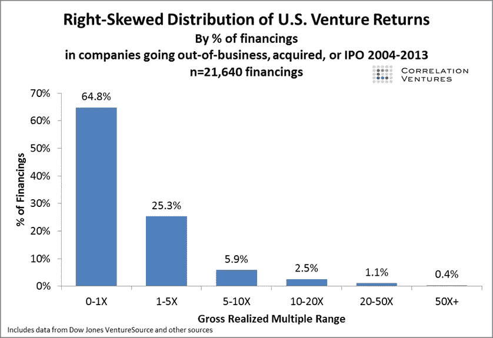

# “创业很难”是怎么回事？

> 原文：<https://medium.com/swlh/whatever-happened-to-venture-is-hard-5cebff6d53d3>

我在挠头。随着“软件正在吞噬世界”这一压倒性的观念的出现，似乎每个人都在创建一个风险基金…或者做一个 ICO。不知何故，你会相信，一个提升所有船只的巨大宏观涨潮会突然让所有人都打败风险投资的传统数学。这现实吗？

**新兴经理人的案例**

我们必须从事实开始，而不是神话，我们可以消除少数公司产生所有回报的观念。我不会重复所有的数字，但正如[剑桥协会的一项研究](https://www.google.co.uk/url?sa=t&rct=j&q=&esrc=s&source=web&cd=1&cad=rja&uact=8&ved=0ahUKEwjQnuPrxprXAhUJahoKHafODvUQFggmMAA&url=http%3A%2F%2Fwww.cambridgeassociates.com%2Fwp-content%2Fuploads%2F2015%2F11%2FVenture-Capital-Disrupts-Venture-Capital.pdf&usg=AOvVaw0Pet7EDmj-TJrby7mAxr0B)所展示的:

> 人们普遍认为，90%的风险行业业绩都是由排名前 10 位的公司创造的(我们的分析显示，这在 2000 年之前有一定的相关性)，这是一个吸引人但没有证据支持的说法，可能会导致投资者错过与能够提供大量价值创造机会的经理在一起的有吸引力的机会。

为了了解回报的分布，CA 分析了 18 年来(1995 年至 2012 年)风险投资的前 100 名。为什么？因为这些 **100 笔交易产生了 72% (2012 年)到 277% (2000 年)的总回报**。当我们说风险投资是关于离群值的时候，事实就是如此。

按价值创造衡量，对这 100 家最大风险投资的分析表明，在每年最大的 100 家风险资本投资中，平均有 61 家公司创造了价值；参与这一级别的价值创造的公司的构成也发生了变化，在过去的 10 年里，新的和新兴的公司一直占据着前 100 名公司价值创造的 40%-70%。

这有助于解释淘金热，特别是像 Felicis [这样的新经理宣传](https://www.felicis.com/numbers/) 9X 现金回报。

你想分一杯羹也情有可原。

**但在风险投资中赚钱很难……**

专业管理的风险投资公司(比如 Accel)花费数年时间培训和/或观察有抱负的风险专业人士，以确定他们是否有“触觉”。正如我的一位前合伙人所言，“我们想看看他们是否能把所有的积木放在一起，成为伟大的投资者”。

从理论上讲，表面上看，风险回报是如何产生的并没有什么内在的复杂性，但在实践中，似乎只有少数人能始终如一地正确，而其他人则在职业生涯中苦苦挣扎，从未摆脱平庸。运气、坚持、天赋结合在一起，让一些人大放异彩。

杰森·莱姆金(Jason Lemkin)用餐巾纸数学计算了有多少风险投资家是成功的，这听起来非常真实。

他的结论是: **12%的风投是成功的。最大值**

另一种看待这个问题的方式是看每家公司的倍数分布。我能找到的关于这方面的最佳数据来自 Correlation Ventures 通过[Foundry 的 Seth Levine](https://www.sethlevine.com/archives/2014/08/venture-outcomes-are-even-more-skewed-than-you-think.html) :

换句话说，一个 10X 真的很难生成！

**保持领先地位更加困难**

[Mike Annunziata](https://medium.com/u/33a4fc8402d0?source=post_page-----5cebff6d53d3--------------------------------) 在评论中漏掉了一个值得强调的重要注释，表明**历史上排名靠前的基金往往会保持在前列**。当然，像迈克尔·森达纳(Michael Cendana)这样围绕新兴经理人建立了整个企业的人，不会同意这个结论，但你开始感受到成为一名伟大的有限合伙人有多难

> *这其实不是感情用事。这种观点认为，顶级公司的风险回报(定义为基金层面的 3 倍净 MOIC)是持续的，在投资组合层面实现风险回报的最大事前概率是投资这些基金。众所周知，其他公司能够也将会获得风险回报，但在投资盲注池之前，几乎不可能知道哪些公司会获得风险回报。下面链接的研究证实，在风险投资中，21 世纪前和 21 世纪后的基金都存在持续性。*

阅读报告。

**解构欧洲迈达斯排行榜**

为了进一步说明这一点，我看了一下新发布的欧洲迈达斯排行榜。一些显而易见的结论(暂且不提以色列):

*   少数几笔交易推动了大部分业务 : Supercell (Comolli then，Rimer，zenn strom)；金(查尔芬、霍尔姆斯)、Skype(曾斯特伦)、JustEat(霍尔姆斯)、Avito(帕森然后德里克)、SkyScanner(帕特森)、Criteo(格罗斯曼、博特里、维达尔)、Zoopla(德斯坦&克莱恩)
*   **新兴的成功故事同样集中** : Spotify (Hommels，Parsson then DeRycker)，Farfetch (Court)，Hut Group (Briggs)，Transferwise (Klein，Sohoni，Hammer)，FundingCircle (Rimer then Nelis)，Deliveroo(米尼奥& Rimer，Destin)，BlaBlaCar (Botteri，Vidal)implementable(Klein)
*   **基金集中度惊人** : Index (4 个合伙人，我敢肯定马丁·米尼奥在敲门)、Accel (4)、LocalGlobe (2)、Atomico、Northzone、SEP……尽管新兴基金经理也有代表，并将继续进步:Phenomen、Mosaic、Felix(均来自 Advent)、BGF(来自 Balderton)。

**结论**

在风险投资领域，我不知道为什么，成功很难实现，复制成功更难。我花了十年时间才有任何形式的业绩记录，我已经投资了十七年，但我还不能告诉你怎样才能成为一个成功的投资者。我知道的是这真的很难。我坚信会出现强大的新公司(IA Ventures、Founder Collective、Floodgate、Felicis，仅举几个例子),但我觉得，目前创办/资助新经理的热潮看起来很像是一种周期结束现象。不过话说回来，也许涨潮会把所有的船都抬高。

## 这个故事发表在 [The Startup](https://medium.com/swlh) 上，Medium 的出版物拥有超过 256，410 人的关注。

# 订阅[在这里获取头条](http://growthsupply.com/the-startup-newsletter/)。

