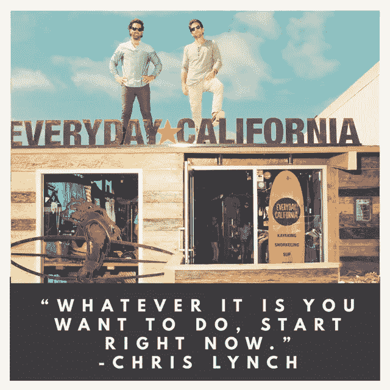

# 不管你想做什么，现在就开始

> 原文：<https://medium.com/swlh/whatever-it-is-that-you-want-to-do-start-right-now-1da29d0ba762>

你以前听过这个故事的第一部分。妈的，它甚至可能发生在你身上。

克里斯·林奇(Chris Lynch)2008 年毕业，获得经济学学位，并准备好在华尔街过满是对冲基金的生活。几年后，圣地亚哥本地人林奇发现自己在海滩上，没有工作，不知道该做什么。

这个故事的第二部分是独特的。

林奇接到老朋友[迈克尔·萨梅尔](https://www.linkedin.com/in/michael-samer-3703321/)的电话。林奇和萨梅尔一起为拉霍亚的一家皮划艇公司做导游。萨梅尔告诉林奇公司正在出售，他想和林奇一起购买。

没有创业经验的林奇答应了。

故事的第三部分纯粹是牛逼。

2010 年成立的 kayak tour 公司已经成为加州首屈一指的生活方式公司，[每日加州](https://www.everydaycalifornia.com/)。

> “我们希望让有趣的事情发生，创造酷的产品，并利用商业来改善环境。”

通过商品、1%的环保承诺甚至他们自己的 IPA——他们正在完成他们的使命。

在千禧动力播客的这一集[中，克里斯和我谈论了他的创业历程，他在商界最艰难的时刻，以及他是如何建立起如此强大的品牌的。](https://soundcloud.com/ryan-warner-799706255/61-make-fun-happen-create-cool-products-improve-the-environment-w-chris-lynch)

他们的故事的第四部分，未来，是未知的，但林奇并不急于加快增长，如果它破坏了他们已经建立的文化。

他对坐在 2010 年我们位置上的人有什么建议？

开始吧。每周不花几个小时在激情项目上太容易了。

> “不管你想做什么，现在就开始。从今天开始。”

# 想让你的游戏更上一层楼吗？

# [在此注册订阅我的时事通讯](http://eepurl.com/c-46aj)

# 关于作者

[Tom Alaimo](https://www.linkedin.com/in/tom-alaimo-573a1878/) *是一位充满激情的 B2B 销售专业人士。他目前是* [*千禧一代动力播客*](https://soundcloud.com/ryan-warner-799706255) *的主持人，在这里他帮助千禧一代快速跟踪他们的个人发展。Tom 也是 TechTarget 的客户经理，住在旧金山。*

[网站](http://tomalaimo.com/) | [播客](https://soundcloud.com/ryan-warner-799706255) | [邮箱](mailto:thomasalaimo7@gmail.com) | [推特](https://twitter.com/TomAlaimo_TTGT)|[LinkedIn](https://www.linkedin.com/in/tom-alaimo-573a1878/)|*|*|[脸书](https://www.facebook.com/thomas.alaimo.12) | [Instagram](http://instagram.com/talaimo7) | [媒体](/@TomAlaimo_TTGT) |

## 这个故事发表在 [The Startup](https://medium.com/swlh) 上，这是 Medium 最大的企业家出版物，拥有 343，876+人。

## 在这里订阅接收[我们的头条新闻](http://growthsupply.com/the-startup-newsletter/)。

