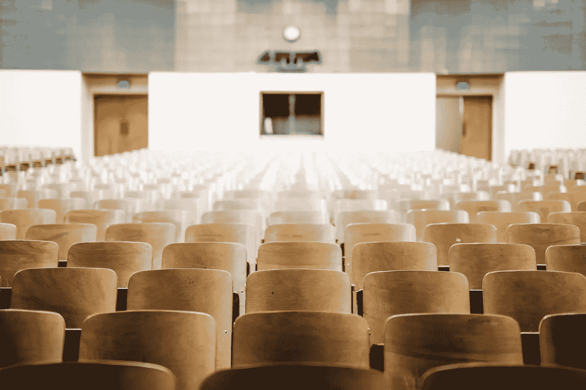

# 我们的孩子怎么了？

> 原文：<https://medium.com/s/story/whats-happening-to-our-kids-7eb5c16ba3a6>

## **科技的最新颠覆:中学关系**

Kids are communicating more than ever, but are they actually forming connections?

我们的孩子出了问题，为了理解这一点，我们需要谈谈对他们来说至关重要的决定性时刻发生了什么:中学时期的关系。你们都知道我在说什么——传纸条，“如果你喜欢我就检查是”，在午餐桌上八卦谁…