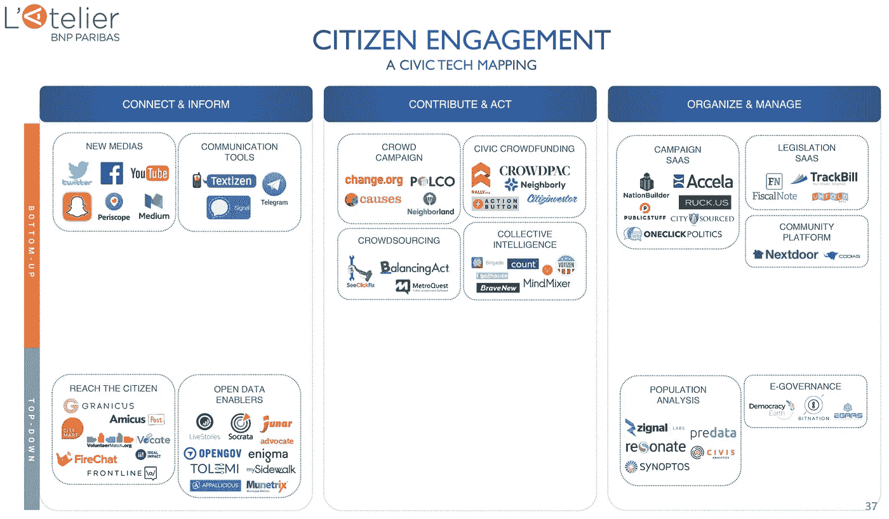
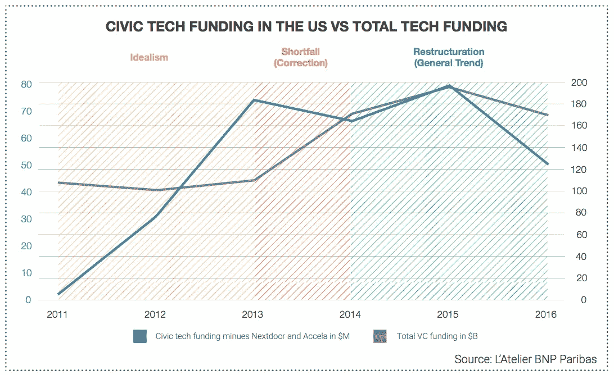
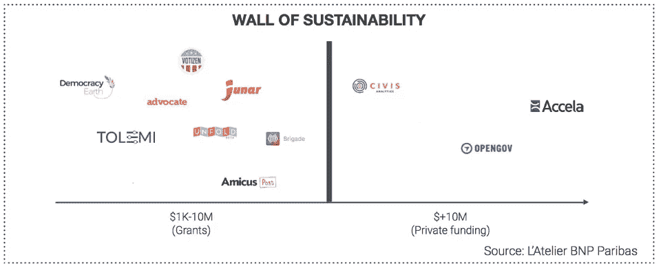

# 思域科技的下一步是什么？

> 原文：<https://medium.com/swlh/whats-next-for-civic-tech-e9c6daeddf80>

## 为了更好的未来，对生态系统的 3 条建议

在互联网时代，公民技术生态系统对民主的未来发挥着重要作用。我们目前正在设想从以机构为中心的传统世界向更加以公民为中心的新社会模式的转变，在这种新社会模式中，公民技术包含在从公民和组织到政府的所有参与者的工具箱中:

*   **开放数据服务**(由像 [Code for America](http://codeforamerica.org) 这样的组织和像 [OpenGov](https://opengov.com/) 这样的初创公司推动)正在增强政府和公民之间的透明度和信任关系
*   在全球层面([Change.org](http://change.org))和地方层面([隔壁](https://nextdoor.com))运作的自下而上的平台正在扩大公民和基层的声音，使他们能够集体行动。
*   **SaaS 公司**为组织提供所有的工具来更好地管理他们的活动和志愿者( [NationBuilder](http://nationbuilder.com) )，甚至是宣传( [FiscalNote](https://fiscalnote.com) )

Mapping of civic tech startups tackling civic engagement

回顾过去五年，公民科技生态系统的特点是早期过度兴奋的泡沫，这导致主要投资者和推动者重新关注成功机会更高的较小投资组合。最后，在走向市场战略、运营速度、筹资和合作伙伴互动方面，建立一家公民企业不同于其他行业。

(No aggregated data on 2017 yet but the numbers should be the same)

随着生态系统的重组和稳定，企业家和推动者现在都在开发更可持续的民用技术计划。各种可能的模型开始普遍化，这个模型是关于在**独立性**、**影响**和**可持续性**之间找到平衡。

我们目前正处于公民技术第三阶段的边缘。这个生态系统已经完成了它的早期阶段，现在必须走向成熟。但一个大问题依然存在:就项目、投资和基础设施而言，这是一个**支离破碎的生态系统**阻碍了复制和规模化的机会。

## 分散的项目

公民科技的一个显著特点是有多少地方性的小项目。在所有的大城市都有微型公司或组织试图在当地居民中试验科技。当然，不应该限制在本地部署解决方案。它显示了生态系统的活力，像城市这样的小行政机构比联邦或国家机构更灵活，更了解自己的人口。但是，当这种习惯导致生态系统的不良适应时，就会出现问题。许多这样的小举措都是在脱离网格的情况下发起的，没有与现有的参与者进行交流。结果是大量不可持续的项目互不关联。企业家只是过多地考虑所有权，每个人都想自己创业。

最终，协作和互助都会受到影响。这个生态系统充斥着各种项目，而且一点都不团结。很少有行动者( [Accela](http://www.accela.com/) 、 [NationBuilder](http://nationbuilder.com) )足够大，能够成为统一和扩大运动的平台，但他们没有创造出所需的凝聚力，他们整合的可能性也不够广泛。

## 分散的资金

由于公民技术领域仍然很早，很少有公司能够在这些年里成功成长。私人融资市场被少数公司锁定，吸引了大部分资本(即使募集的金额与总影响投资相比并不显著)。

相比之下，随着许多倡议的出现，赠款和公共资金的数量激增，使得环境有利于启动和种子培育。企业现在喜欢资助公民科技项目，因为它在营销方面有双重价值:社交和创新。资本大部分时间被注入到具有最具吸引力的社会影响目标的最佳项目中，而很少关注 it 的业务和可持续发展方面。此外，与大多数企业创新推动者一样，重点是帮助新计划启动并迈出第一步。没有任何结构或资源可以作为后续。这些项目一旦能够站立起来，就被简单地放弃了，尽管事实上真正的困难始于成长阶段。

这就是公民技术悖论，即发起倡议很容易，但在雄心和商业模式可持续性方面，扩大规模和将项目提升到下一个水平却非常困难。运营预算普遍不足，很难留住致力于项目的最佳人员，即使是兼职人员和志愿者也是如此。人们很容易认为这种种子阶段的活力并不是最好的情况，但仍然值得一试。但是，生态系统正在窒息，因为太多的项目被授权，而没有面对正确的方向。提供更多没有实际前景的资助只会使情况恶化。

## 分散的基础设施

由于本地化的重要性和生态系统的碎片化，公民科技初创公司别无选择，只能复制而不是扩大规模，利用城市的数字基础设施。他们把自己的模式和技术从一个地方输出到另一个地方，这个过程是极其痛苦的。城市在文化和运行速度上真的很难对付。如果他们现在更好地理解了数字化转型的重要性，他们的数据和流程仍然没有标准化。集成解决方案几乎需要手工操作。最重要的是，每个城市每次都没有增加多少价值。
人们可以说普通创业公司进行 B2B 也会发生同样的事情，但不同的是，为小企业带来的价值很小，而且很容易复制，而为缓慢而困难的大公司带来巨大的价值。在公共部门，你不得不与两种劣势并存的参与者合作:价值较小，销售过程缓慢。

尽管如此，形势在不断变化。许多城市推出了[新结构](https://www.cityofchicago.org/city/en/depts/doit.html)并雇佣[新人](https://www.linkedin.com/pulse/smart-cities-rise-chief-data-officer-cdo-keith-day/)来转变他们的文化。但是需要做大量的工作来标准化数据和流程。

## 对生态系统发展的 3 条建议

关于这个碎片化问题，我想对生态系统的 3 个主要促成因素提出 3 条建议:

1.  **对于企业和基金会:建立提供更大赠款的财团** 基金会和企业应该统一他们的资助提议，将大量的小额赠款和援助转化为少数更大的资助机会。许多初创公司有潜力产生可持续的影响，但没有机会通过普通的风险投资融资来说服。该联盟在沟通和为企业创造价值方面也是有益的，因为它在社会影响和创新的基础上增加了企业合作的概念。
2.  **对公共行政部门而言:将创业公司的做法标准化，以促进复制** 政府应获得与创业公司和外部供应商接触的适当信息，以实现更顺畅的合作。可以与各城市共享启动工具包以及合同和协议模板，以简化流程。需要实现数字化转型，以使 IT 基础设施与新技术和语言保持一致，并以通用和可用的格式聚合数据。
3.  **对于创业公司和组织:统一生态系统以增强可扩展性** 生态系统缺乏能够公开与任何公民科技公司合作并分享其数据和网络以获得更好的可扩展性的指定领导者。对于自下而上的行业来说尤其如此，这一行业仍然没有拥有大量用户的开放平台。

*本文是公民技术和公民参与的未来系列文章的第二篇。
它完成了我的研究* [*“公民科技能拯救民主吗？《技术如何更新公民参与》*](https://atelier.bnpparibas/en/smart-city/article/study-civic-tech-save-democracy) *为法国巴黎银行工作室撰写，去年 12 月出版。*

## 这个故事发表在 [The Startup](https://medium.com/swlh) 上，这是 Medium 最大的企业家出版物，拥有 286，184+人。

## 在这里订阅接收[我们的头条新闻](http://growthsupply.com/the-startup-newsletter/)。

