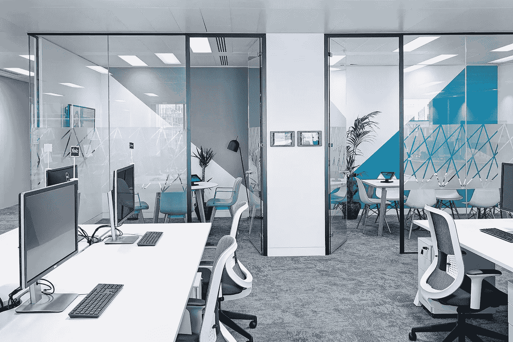
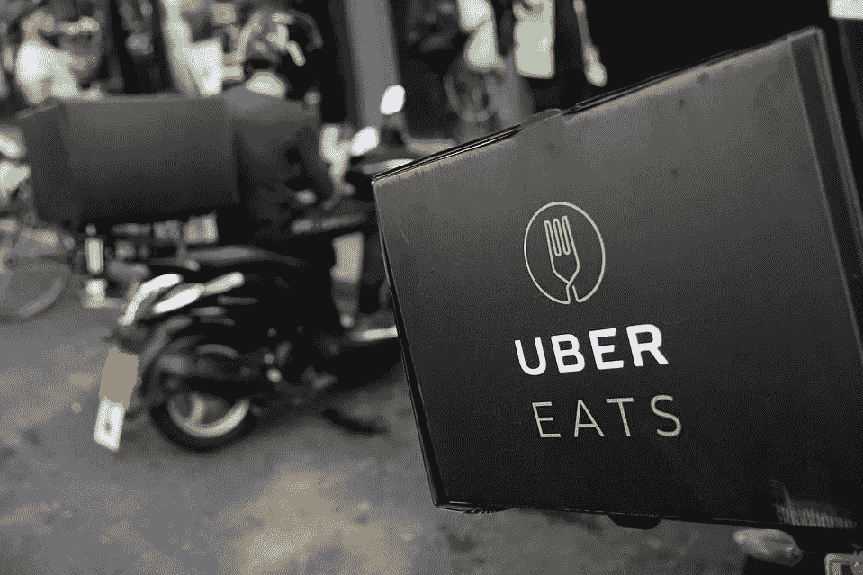
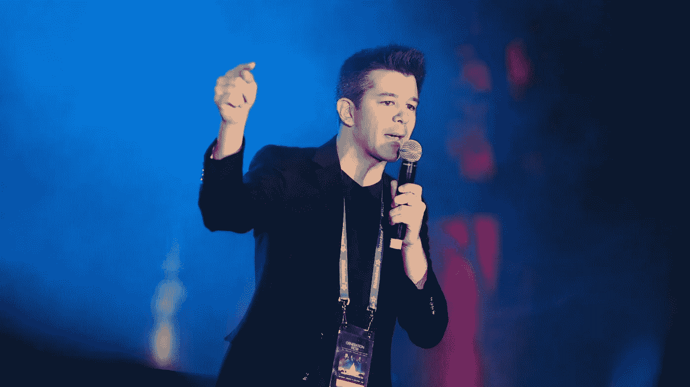

# 优步是如何运作的

> 原文：<https://medium.com/swlh/whats-so-special-about-uber-a5b96592d365>

## 对优步文化价值观的内外称赞。

我去年离开了优步，我对在那里看到的一切仍然心存敬畏。Travis 和他的联合创始人已经在结构和文化上建立了一个独特的组织——我希望它在未来会面临更多的挑战。

在过去的 12 个月里，你肯定听说过几起与优步有关的丑闻。我在优步的经历与我们今天在报纸上读到的不同。我真诚地希望达拉和他建立的团队能够解决优步的文化问题。然而，我也希望优步的一些魔力不会在改革中消失。

我想和你们分享三个小故事，告诉你们我作为伦敦 UberEATS 团队的一员所看到的、经历的和学到的。

# 30 分钟，否则我们请客！

*将伦敦从竞争最激烈的市场变成最成功推出 UberEATS 的信息的故事。*

Uber’s offices in London.

## 冠军的心态:准备是不够的

我坐在总经理的前面，餐厅运营经理的旁边。结合起来，我们代表了平台的三个方面:顾客、餐馆，对我来说，还有快递员。会议室有一面墙，我们可以用它作为白板来思考。我们有一份伦敦 120 家最佳餐厅的清单，是巴黎在推出时的三倍。我们应用了让优步成功的每一个增长技巧，从给予-获取推荐到应用内广告。我们已经检查了战术手册上的每一个选项。但是，高管团队告诉我们，我们在伦敦推出 UberEATS 的计划“肯定不够大胆。”

发射前五天，我们又回到了起点。我必须承认，我们在伦敦有一些老牌企业——毕竟，这里是 Deliveroo 的全球总部，而 Just Eat(LON:JE)、TakeEatEasy、亚马逊餐厅(Amazon Restaurants)、无缝(GrubHub)都是强劲的参与者。虽然顾客普遍认可优步在卓越运营方面的优势，但问题仍然存在:它如何影响顾客点餐时的行为？

我们需要一个强有力的信息来定义我们的立场。这一信息将使我们明显区别于其他平台。说到点餐，我们意识到，我们往往是饿了，点得太晚了。所以作为消费者，我们自然非常重视送货时间。此外，我们已经有了 120 家伦敦最好的餐厅，并对所有餐厅进行了测试，以确保无论“食客”点什么，他们都会满意。我们所需要的就是把这个信息传达给“食客”，所以总经理想出了这个主意，打出了这样的口号:“30 分钟，否则我们请客！”

发布 UberEATS 并传递信息，强调它的快速和可靠使我们成为竞争格局中的高价值产品。我们都同意，保证送货时间而不支付餐费是证明我们观点的最强有力的方法。我们还一致认为，从心理上来说，“30 分钟”是一个比任何其他数字都强得多的价值主张。我们的目标是为即将在线订购食品的饥饿消费者简化决策过程:如果你想要质量和速度，你应该尝试 UberEATS。

> “发布日就是你要传达的信息，好好利用它。你不可能和竞争对手一样优秀。你需要给顾客带来新的东西。一些特别的东西。”(英国负责人)

## 让建筑商来建造:金融不插手

然而，当我计算这些数字时，似乎我们会在一周内烧完我们的季度营销预算。根据类似城市的数据，超过 65%的饭菜在 30 分钟后送达，主要是因为按需准备食物需要时间。在任何其他组织中，财务团队会迫使团队将消息更改为 45 分钟，根据数据，这将更有意义。

在任何其他组织中，另一个“部门”都会表达出严重的担忧，担心我们将他们数十亿美元的业务(以及卓越运营的声誉)置于危险之中。在任何其他组织中，管理团队都更倾向于采用之前经过测试的“最佳实践”。这正是我的 MBA 学习告诉我要做的。但是，在一种敢于冒险的文化和“让建筑者来建造”的价值观下，做被期待的事情在优步是行不通的。“冠军的心态”已经渗透到公司的所有阶层；没有一个在优步呆得足够久的经理会满足于一般的结果。我们的总经理只是拿走了我们的一大笔现金，然后划燃了火柴。

> “我们每周都会烧掉季度营销预算。”

## 成为所有者:决策(和责任)留在本地

在优步，决策过程是相反的:当地团队最终决定他们如何在一个新城市启动和运营。起初，为了建立一家能够适应各种环境的公司，从纽约到内罗毕，从上海到圣保罗，颠倒正常的自上而下的方法(或总部-地区-子公司层级)似乎是必要的。

将决策权转移到城市也有助于实验，因为不同的团队会以不同的方式处理相同的问题。从这些实验中学到的知识将被添加到行动手册中。

最重要的是，反向决策使当地团队能够快速行动，因为办公室政治和影响力的考虑仅限于每周的谈话，而总经理必须向他们汇报。

> “速度要求本地决策和授权，而优步为城市运营团队提供了成功所需的所有资源:现金、积极的人才和灵活的技术。”

London suddenly had thousands of couriers zipping around the City in June 2016.

## 大胆下大赌注

在几周内烧掉我们的营销预算是我们做过的最糟糕的决定之一。我们立刻取代了第二名(“轻松吃”)，仅仅几周之后，第二名就倒闭了。在让伦敦人下载 UberEATS 应用程序并试用我们的过程中，口口相传非常有效。增长曲线的形状不像曲棍球棒，它们只是看起来像一堵不可逾越的垂直墙。

从商业角度来看，我们通过更快地烧钱来降低平均客户获取成本，因为我们在两周内获得的用户比我们在 6 个月内缓慢烧钱获得的用户多。我们在未来几年里对 UberEATS 进行了完美的定位:UberEATS 能更快地为你提供最好的食物——而且，他们已经准备好把钱押在这上面了。

现在我们能够竞争了。

> "令人惊讶的是，我们通过更快的烧钱降低了平均 CAC . "

## 授权当地团队=速度*(创造力+责任感)

让一个饥饿的经理组成的小团队全权负责一个重大项目，并给他们尝试新事物的余地，解决了创造力和责任感之间的经典矛盾——这是本·霍洛维茨在他的书*中介绍的。我们有创造力，因为我们有权失败(一次)；我们有责任，因为整个公司给了我们“创造奇迹”所需的一切。*

所以，在金融开始敲我们的门之前，我们还有几个星期的时间。

与此同时，我不得不应对一个忙乱的开始:数百名愤怒的厨师端着冷食在餐厅柜台上等着，数千名快递员在城市里跑来跑去，不停地提出要求，还有数万名顾客在 30 分钟内没有收到他们的食物。支持代表被每天数以千计的投诉所淹没，而餐厅运营团队越来越焦虑。在这个阶段，每个人都很有耐心，但每个人都盯着我:*他会成功吗？*

> “餐馆准备的饭菜和由于缺少快递员而无法送达的数量每天都在增加。”

# *每周五有 500 份餐食未送达……*

解开我们制造的混乱。一个关于团队合作的故事。

从快递运营的角度来看，该平台的病毒式成功是一场噩梦。需求是我们最乐观预测的四倍。每天我都问自己，“我到哪里去找运送所有这些订单所需的数千名快递员？”

## 永远忙碌

现在是星期五下午。从周一开始，我可能每晚睡 4-6 个小时。我感到既兴奋又疲惫，我不得不忍受三个小时的煎熬:

*   在上午 10 点 45 分录制并发送一条自动语音信息给所有离线的快递员，让他们知道我们将迎来“激动人心的一天”，并希望他们能上线
*   缩短餐厅和顾客之间的距离，以及快递员和餐厅之间的距离(从而提高整个系统的调度效率)
*   给所有离线的快递员发送自动短信，让他们知道如果他们上线了会有促销活动…
*   …并在系统中建立促销
*   除此之外，给快递员一个全面的促销，让他们在午餐时间提供一定数量的食物
*   雇用办公室里任何愿意在午餐时间骑自行车送餐的人(顺便说一下，这是获得反馈的最佳方式)
*   为从同一家餐厅出发并前往同一方向的餐食进行分批处理(基本上是将 uberPOOL 的算法应用于配送)
*   调整配送参数，仅在食物准备好之后才发送快递请求(而不是通常让快递员在食物准备好取货之前大约 30 秒到达)
*   要求餐厅运营团队关闭当天已经有超过 50 份订单的所有餐厅

拥挤。

然而，我们仍然有 500 份由餐厅准备的饭菜，在柜台上等了 20 多分钟，仍然没有送到…

既然我已经用尽了我能想到的所有办法，我不得不再次问自己:还有什么可以解决这个问题？我困惑地坐在屏幕前。我与总经理的会面安排在下午 4 点——现在是下午 3 点 15 分。我该何去何从？

我雇佣并培训了一个由 20 名合作伙伴支持代表组成的团队，但是他们每天只能接纳 100 名新的快递员。我需要雇用 450 名新代表来解决合作伙伴中心的瓶颈，即使我这样做了，我也会在其他地方面临许多其他挑战(设备的交付时间、快递员入职和培训等)。)

我的电话响了。有人从巴黎打来电话。 *All？*

> "地方决策和授权的另一面是全球数据访问:每个人都在看."

## 精英管理、循规蹈矩和原则性对抗

“你好！这是 JM，巴黎行动！你们有一个非凡的开始！干得好！我刚刚在看你的数据，我猜你在快递供应方面捉襟见肘。我是说，你在流血！你的收购漏斗有很多瓶颈。你有没有考虑过同时进行所有的背景调查？你的供应商必须做他们在一系列，它不能花 5 个星期来处理背景调查。另外，看起来你的库存快用完了，你的供应商有多长的交货时间？如果你愿意，我明天可以在欧洲之星寄几个背包。我们很幸运，在边境海关不会有任何问题…我的意思是，现在，哈哈！”

这就是…我的解决方案:在我之前，全球数百个其他团队经历了同样的运营和后勤问题。他们像天使一样看着我们在做什么。我甚至不需要问。

内部系统的设计是为了帮助每个城市互相学习，互相帮助。Travis 引入了“踮脚走路”和“有原则的对抗”的概念，以促使人们畅所欲言，讨论与优步在各地的行动有关的问题。这些价值观与“成为所有者，而不是租赁者”非常契合。

Travis presented Uber’s cultural values at a company wide event in Las Vegas.

作为运营经理，访问其他城市的历史数据对我们的成功至关重要。我可以计算出下午 12:30 时小型摩托车穿过巴黎的速度，以及它们是否比自行车跑得快。我可以查看曼谷的运输团队编写的脚本，以标记伦敦的快递员，他们使用虚假的 GPS 位置来获得更多的调度订单。我可以复制多伦多有效的信息传递活动来重新激活休眠的快递员。我们会共享一个聊天室来讨论我们的问题，并通过电话互相帮助。

通话应该简短、高效，当人们知道自己在谈论什么时，他们会采取强硬的立场；他们会告诉你，如果他们处在你的位置，他们会做什么，会冒什么风险。

我觉得要学的东西太多了，而一天的时间又这么少。

> “优步的 IT 架构旨在促进团队之间的沟通。优步的价值观被定义为促进团队内部的沟通。两者的结合创造了奇迹。”

## 华尔街交易柜台遭遇魔兽世界

优步的内部系统就像电子游戏一样。全球数百个团队在各自的市场内友好地相互竞争。当我加入车队时，我们的目标是比巴黎做得更好。然后，当我们意识到市场比我们预期的要大时，我们的目光转向了纽约。随着我们以惊人的速度增长，我们超过了纽约市，它刚刚被洛杉矶超过。所以我们必须打败洛杉矶！我们比计划更早地向伦敦郊区扩张，只是为了登上排行榜的榜首。

因此，优步的组织通过其信息系统架构和以价值观为中心的团队合作文化，营造了一个精彩的竞技游戏环境，在这个环境中，城市团队努力赢得市场份额，以登上全球排行榜的榜首，同时也让运营部门感受到是全球冒险的一部分。

每天，我们都会查看实时数字和图表，比较团队之间的增长和质量度量；每天都会有新的东西:墨尔本引入了交叉调度，一夜之间增加了数千名送货司机；新加坡引入了分批处理，并恢复了盈利能力；巴黎推出了一项打击欺诈的计划，完成率提高到 99%；伦敦扩展到另外 3 个地区，收入超过了纽约。太令人激动了。

> “在 Ops 中，我们不认为自己是员工——绝对是负责任的所有者和管理者——当然也不认为自己是游戏玩家——成为获胜团队的一员确实感觉很特别。”

## 游戏玩家帮:什么比团队合作更强？

优步的运营团队代表了优步文化的核心和子集:运营团队倾向于创建自己的文化，并被其他团队效仿和复制。特别是那些推出新城市的 Ops，他们彼此非常尊重，并自称 OG(最初黑帮的简称),因为在暴民控制黑色出租车业务的城市(如纽约市)推出优步是多么困难。

公司内部的这种亚文化驱动着一种独特的群体归属感，这种归属感是公司其他部门，从 SF 的产品经理到马尼拉的支持代表都无法完全理解的。在“优步技术有限公司”内部，运营团队是唯一一个在技术领域(处理产品缺陷、流程自动化和数据分析)和现实世界(雇用司机、与餐馆谈判和处理司机问题)工作的团队。Travis 可能参与了让行动组成为组织的脊梁。这是优步不同于其他硅谷创业公司的地方。

我从未想过，拥有这样一个同事网络可以帮助我处理和解决商业中最困难的问题。即使在麦肯锡或世界银行——以分享最佳实践而闻名的全球性组织——工作时，我也从未见过这种程度的合作。在优步工作的几周内，我就有了一个同事网络，我每周都会和他们交流想法，让我们的业务和流程变得更加强大。我从来不会在超过四个工作小时的时间里等人来回复我。那是一个满是游戏玩家的聊天室。

> “骗子说了算——而不是首席执行官、经理或工程师。”

# 传送者，对规模大师

*优步如何在短短三年内实现全球扩张。关于技术的故事。*

几个星期以来，越来越多的快递员聚集在最成功的餐馆门口。他们准确地计算出，调度算法优先考虑离餐厅最近的快递员——就像优步的调度请求首先到达最近的司机。这产生了严重的负面影响，因为当有 20 名或更多的快递员在门边等候时，路过的顾客不愿意进入餐厅，有时甚至在里面。

更糟糕的是，一些使用 Android 手机的快递员开始使用 GPS 欺骗应用程序，以便虚拟地将自己置身于餐馆中，当他们在数英里之外时，以便获得下一个配送订单。快递员会看着刚拿着订单走出餐馆的人十分钟后回来拿另一份订单。智能安卓用户无需等待！

收入差距惊人。当我们刚刚推出时，每小时的旅行次数(以及每小时的收入)的分布遵循一个正常的规律。高斯线现在慢慢向下移动到左边，因为大多数快递员每小时的行程都在减少，而在最右边出现了一个新的偏斜:一个新的快递员群体出现了，他们的收入是普通快递员的 3 倍。

我已经为这些问题纠结了很多天了。我向我办公室里最好的朋友 JK 描述了这种情况，他当时正在一个不同的产品和城市工作。他把头微微偏向右边，抬起左边的眉毛，盯着我看了一秒钟，抽动着嘴唇，然后问我:“你为什么不在附近的广场上设立一个机场先进先出区？”

## Technologies，Inc——面向一千个城市

优步已经创建了一种算法，在机场为司机组织先进先出队列，等待区是一个特定的停车场，用于所有来自机场区域的请求。用于优步核心业务的相同功能也足够灵活，可以用于 UberEATS 快递公司。

在希思罗机场，司机必须进入一个特定的停车场，才能在司机应用程序上获得一个号码。来自机场的所有请求都是从特定区域发出的。同样的城市空间组织也适用于快递公司。他们会在附近的广场上排队，这样餐馆周围就没有人了。这将鼓励顾客进入餐厅，并让快递员对公平而非随机的调度系统感到满意。

这些想法仍在我脑海中酝酿。我微笑着，一句话也没说，跑向我的桌子。JK 紧随其后，我们花了一个小时将机场代码部署到 UberEATS。第二天早上，新加坡和纽约也在这么做。世界似乎更加平静了。我更冷静了。

> “优步的产品团队设计了一个足够灵活的系统来处理现实世界中的所有情况。运营经理可以组装和拆卸它的每一部分。同样的工具将被用来为一千个城市的几十种产品设计流程。”

## 骗子创新

优步会议非常强调采取行动。我们视自己为实干家。我们和司机混在一起。当一大群人对我们不满意时，我们走出办公室与他们交谈。我们卷起袖子，做我们要求其他团队成员先做的工作。

然而，我认识到，作为一名经理，我通过创造过程会比整天自己忙活更有效率。在我们最大程度的奉献上，我们只能把 16-18 个小时的注意力放在解决问题和改进公司创造价值的算法上。将我所做的一切转变成一个可以传授给团队其他成员的过程，这对于给我提供后退一步，看到更大图景，并解决具有更高影响的问题的思维空间至关重要。

我通常会在午夜过后走出办公室。我深夜走在伦敦昏暗的街道上回家，这是思考发生过的非凡故事的完美时刻。有些很棒。有些不好。最史诗。尽管早期的日子越来越痛苦，但我总是微笑着走路。洗完热水澡后，我会溜到床上，把记事本放在床头柜上，关掉灯，闭上眼睛，准备睡觉。我很少睡这么快。

凌晨三四点左右，我会把手伸向床边的灯，打开灯，在记事本上写几个字，看看时间，然后回去睡觉。早上，我会试着弄懂我潦草的字迹，拿起一杯咖啡，跑去办公室。我有一个新想法要实现。

> “优步内部工具的灵活性将创新工作从产品团队转移到了运营团队。产品经理发明工具。骗子会创新。”

## 流程即服务

我们每天都会遇到新的问题，无论是午餐时间还是晚餐时间，这是我们一天中的两个高峰时间。我会花一整天来修理我能修好的东西。我会花一整晚思考如何大规模解决这个问题。早上是谷歌文档的时间。

我会在 9:30 开始写一张白纸，然后有大约一个小时的时间来描述我前一天做了什么。我会起草一份流程，并请我的团队领导阅读。我们会来回检查以确保一切都很清楚，并询问优步所有可能对新流程有意见的人:餐厅运营部、我们的总经理、处理类似问题的运营经理、可能对新流程感兴趣的城市团队、法律团队、战略团队、营销团队、支持团队、社区管理团队，应有尽有。

下午，我会检查所有的评论并发给团队领导，为培训做准备。支持团队在当天轮班结束时接受培训。我会在一夜之间对系统做出必要的改变，我们的流程每天都会改善 1%。

> “我们可以让数百个团队处理同一份文档，并实时协调。随着时间的推移，流程会发生变化，使优步的运营日益强大。创造价值的内部算法不断得到改进。”

## 产品管理适用于运营部门

在大多数公司中，关键的利益相关者是外部的。在优步，运营经理是客户。如果你看看内部开发的产品数量，你会很快意识到主要客户不是骑手(1 或 2 个应用程序)，或合作伙伴司机(3 个应用程序，包括优步地图)，而是内部运营经理(20 多个应用程序)。这不是偶然发生的。

> “优步的整个哲学就是解决大规模的问题，以及成千上万的具体案例。优步向我展示了正确构建技术的威力。”

# 离别的思绪

优步自 2009 年以来的非凡历程给世界带来了一些新的东西。它改变了我们在城市中移动的方式。它改变了创业公司进入新市场的方式。随着优步黑手党离开去开创新的事业，这将改变组织的运作方式。

## 这篇文章发表在[《创业](https://medium.com/swlh)》上，这是 Medium 最大的创业刊物，有 289，682+人关注。

## 订阅接收[我们的头条新闻](http://growthsupply.com/the-startup-newsletter/)。

