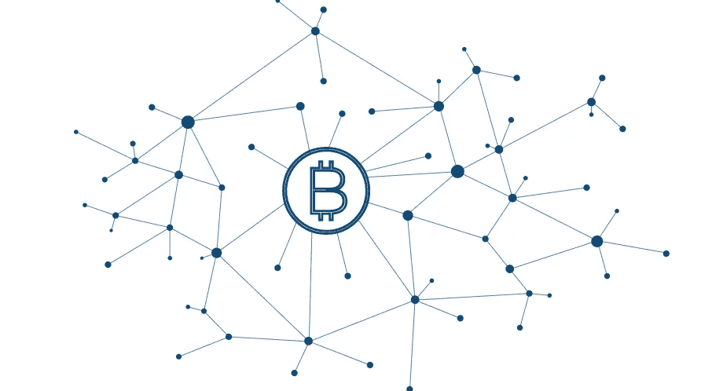

# 和刀有什么区别？为什么他们是区块链的未来？

> 原文：<https://medium.com/swlh/whats-the-difference-between-dapp-idapp-and-dao-and-why-they-are-the-future-of-blockchain-52758f50474e>

区块链世界充满了令人兴奋的新概念和术语。然而，这些概念/术语通常充满了歧义，并且经常不一致，因为我们仍然处于非常早期的阶段。如果我们对相同的术语有不同的理解，就很难相互交流。下面我试图澄清两个最有趣的术语:**和**道**之间的区别，并提出一个新的术语: **iDApp** 来填补它们之间的空白。**

****

**Blockchain Decentralized world (image from internet)**

# **什么是 DApp？**

**在这本令人敬畏的 DApp 白皮书中，戴维·约翰斯顿将 DApp 定义为**

> **对于被视为 Dapp(读作 Dee-app，类似于 Email)的应用程序，它必须满足以下标准:**
> 
> ***应用程序必须完全* [*开源*](https://en.wikipedia.org/wiki/Open_source) *，它必须自主运行，没有实体控制它的大部分令牌。应用程序可以根据建议的改进和市场反馈修改其协议，但所有更改都必须由用户一致同意。***
> 
> **应用程序的数据和操作记录必须加密存储在一个公共的、分散的[区块链](https://en.bitcoin.it/wiki/Block_chain)中，以避免任何中心故障点。**
> 
> **应用程序必须使用加密令牌(比特币或其系统自带的令牌)，这是访问应用程序所必需的，任何来自(矿工/农民)的价值贡献都应在应用程序的令牌中得到奖励。**
> 
> **应用程序必须根据标准加密算法生成令牌，作为节点对应用程序贡献价值的证明(比特币使用工作证明算法)。**

**他进一步根据区块链的使用方式将 DApps 分为三种类型。**

> **I 型分散式应用程序有自己的区块链。比特币是第一类去中心化应用最著名的例子，但莱特币和其他“另类硬币”属于同一类型。**
> 
> **类型 II 分散式应用程序使用类型 I 分散式应用程序的区块链。类型 II 分散式应用程序是协议，并且具有其功能所必需的令牌。Omni 协议是第二类分散式应用程序的一个例子。**
> 
> **类型 III 分散式应用程序使用类型 II 分散式应用程序的协议。类型 III 分散式应用程序是协议，并且具有其功能所必需的令牌。例如，使用 Omni 协议发行可用于获取分布式文件存储的“安全币”的安全网络就是一个 III 类分散式应用的例子。**

**根据这一分类，比特币可以被视为 I 型 DApp，就像传统的操作系统一样。以太坊更复杂。它就像是 I 型和 II 型 DApp 的组合，就像是传统的操作系统和安装的 javascript(solidity)解释器。以太坊上的智能合约是第三类 DApps，就像运行在 NodeJS 中的 JS 程序。**

****DApps 与传统分散式应用****

**根据上面的定义，**是一个分散式应用，但并不是每个分散式应用都是 **DApps** 。我猜由于标签的选择，这是 **DApp** 概念中最混乱的部分。****

****所有传统的 P2P 应用，如 Bittorrent 和 Freenet，都是去中心化的，因为 P2P 网络默认是去中心化的。他们没有使用区块链式的组织方法，所以他们没有一个联合的可验证的全局状态。因此，它们不能被视为一个带有强制业务逻辑的“虚拟”应用程序。****

****然而，在我看来，区块链只是组织 P2P 节点的一种方式，而不应该是唯一的方式。在不久的将来，现有的区块链技术甚至可能不存在。区块链可能会发展成一个更通用的术语来表示可验证的全球状态和透明的计算过程。****

# ****道是什么？****

****道的概念产生于以太坊社区。Vitalik Buterin 写了一篇很棒的博客讨论“达、道、道”。****

****DAO 概念是从一个叫 DAC(去中心化自治公司/公司)的更金融的子类发展而来的，它主要用于将人类的公司组织转化为自治的计算机组织。DAC 的一个例子是“[DAO](https://en.wikipedia.org/wiki/The_DAO_%28organization%29)”，它是使用以太坊智能合约组织的投资组织。****

****道被维塔利克定义为****

> ****它是一个实体，生活在互联网上，自主存在，但也严重依赖于雇佣个人来执行某些自动机本身无法完成的任务****

****基于这一概念，比特币本身可以被视为一种工具。如此看来，**刀**与**有很大重叠。Vitalik 选择了“组织”这个词，而不是“应用程序”,以使它与传统的 P2P 应用程序更有区别。******

# ******DApp vs 道******

******虽然这两个概念是由两个不同的群体创造的，但它们有时可以互换使用。关键区别在于“自主”这个词。道可以被看作是 DApp 的一种，完全自治的 DApp。不一定是刀。******

*********和刀在自动化程度上不同*********

****这里我借用自动驾驶汽车领域的[自动化/自主级别](https://en.wikipedia.org/wiki/Autonomous_car#Levels_of_driving_automation)概念。****

****当前基于区块链的 DApps 最多可以被视为 1.5 或 2 级自动化。它排除了人为的干预，但其业务逻辑是预先固定的，只能通过多数表决来更新；它完全没有自学能力。****

****DAO 应该是完全自主的，拥有 5 级自动化。应用程序应该根据自己的智能做出决策，并根据决策的结果进行自我改进。****

*******人类创造的应用程序还没有达到“自主”水平。*******

****DApp 没有提到自动化水平。它给出的所有例子都是自动化软件，因为还没有自主软件。所有现有的基于区块链的 DApps，包括比特币，只是自动化了预编码的业务逻辑。维塔利科提到道是圣杯，因为还没有人到达那里，甚至一些人可能自称为“道”。****

****所以道主要是美好的愿景，而不是现实(还)。****

# ****iDApp:智慧的 DApp****

****DApp 概念不涉及智能水平，并假设当前的应用是基础水平的自动化。道是关于未来，而不是现在。****

****而随着人工智能研究的进展，自动驾驶正在进入第 3 或第 4 级。于是提出了一个新的概念，叫做 **iDApp** ，智能 DApp 的简称，填补了与道之间的空白。****

*******iDApp 是具有一定智力水平的 DApp。*******

****它可以使用机器学习技术从决策结果中学习，而不是预编码的业务逻辑。例如，它可以根据当前环境调整奖励比例，而不是固定的奖励机制。如果它需要更多的计算资源，它可以奖励更多的矿工。****

*******iDApp 用区块链代替依靠区块链*******

****如前所述，区块链就像提供良好基础设施的操作系统。iDApp 自己决定如何利用底层计算基础设施，而不是部署到区块链。它可以将自己部署到现有的公共链，或者启动自己的新链，并根据需要进行迁移。****

*****公私不分*****

*****iDApp 选择最佳选择来外包其计算基础设施需求。它只关心它所服务的客户的需求，因为这将使它的收入最大化。如果客户需要隐私，它不会利用公共链，因为这样做会导致失去所有的客户和收入。*****

# *****进化:App -> DApp -> iDApp ->道*****

*****我们正处于进化过程中，这可能是人类历史上最大的进化。但我们仍处于早期阶段。*****

*****有了区块链，我们就能拥有比特币。然而，我们只是使用了“去中心化”的力量来使应用程序不可阻挡和抵制审查。它有非常狭窄的用例。类似的情况在自动驾驶领域也是如此。2 型自驾没那么有用，用途相当窄。*****

*****有了 **iDapp** ，我们希望来自“智能”的力量可以让事情变得不同。就像对自动驾驶的信念一样，它可以降低运营成本，让“不可能”的商业模式成为可能。*****

*****我也很兴奋看到真道在不久的将来出现。*****

**********

## *****这篇文章发表在 [The Startup](https://medium.com/swlh) 上，这是 Medium 最大的创业刊物，有 332，253+人关注。*****

## *****订阅接收[我们的头条新闻](http://growthsupply.com/the-startup-newsletter/)。*****

**********