# 电动滑板车的未来如何？18 点路线图。

> 原文：<https://medium.com/swlh/whats-the-future-of-electric-scooters-18-point-roadmap-14e1f3f9e00d>

在人行道上堆满故障的硬件是电动滑板车的典范吗？它会继续成为青少年的玩具，还是会塑造我们的城市？阅读这篇文章，了解一下未来的交通运输。

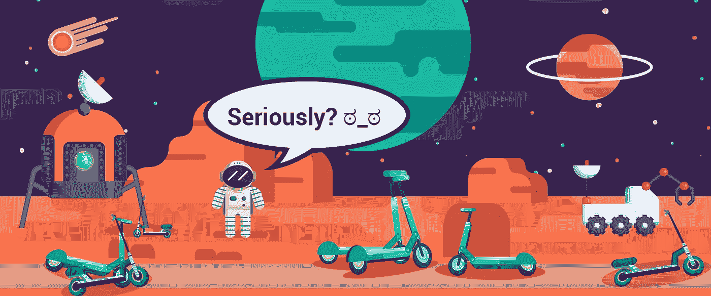

# 放眼全局

位于圣莫尼卡的初创公司 Bird 成立于 2017 年，在[短短 15 个月内](https://www.theatlas.com/charts/S1eKFGy-Q)的估值超过了 1B。产品发布后，投资者对收入增长率感到不知所措，并向滑板车公司提供大量资金。随着新的交通工具出现在加利福尼亚的街道上，人们立即采用了这项服务，暴露了这个利基市场是多么的空虚。

在几个月的时间里，eScooter 行业在城市中发布了数百辆汽车，欢迎每个有驾驶执照的人。风投们看到了[有利可图的单位经济学](https://qz.com/1325064/scooters-might-actually-have-good-unit-economics/)，首席执行官们看到了一种“让世界变得更美好”的方式，用户看到了一种从 A 点到 b 点的新的有效方式。如果一切顺利，那么这就不是一个真正的创业故事，而且由于不负责任的停车行为和滑板车事故，[引发了巨大的社会反弹](http://www.latimes.com/local/lanow/la-me-ln-bird-scooter-vandalism-20180809-story.html)。

让我们看看这一现象的全貌，以了解 eScooter 在人类时间轴中的位置，并看看未来等待我们的城市是什么。

# 透过历史的棱镜

看待交通发展的最佳方式是看看 100 年前其他技术是如何发展的。汽车。

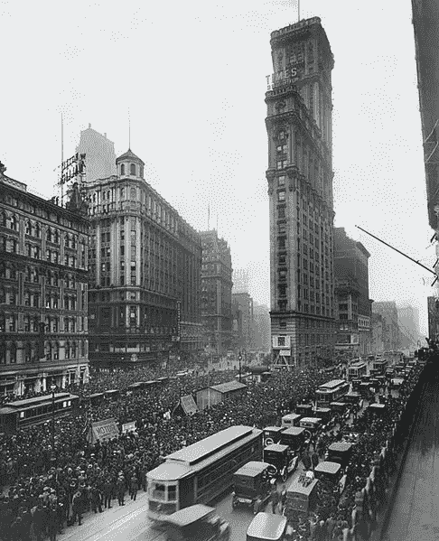

A crowd gathers for updates to 1919 World Series, *The New York Times* photo archive

当汽车刚刚开始在 20 世纪 10-20 年代城市的街道上流行时，它们被认为是危险的入侵者。街道以最高 8 公里/小时的速度移动，因为马匹、公共汽车和人必须在密集的人流中一起移动。儿童游乐场并不存在，所以孩子们在马路中间玩耍是很正常的事，因为现在有很多汽车经过。

成千上万起事故发生了，难怪人们急于减少交通堵塞。一个温和的例子是辛辛那提居民[将车速](http://nautil.us/issue/7/waste/did-cars-save-our-cities-from-horses)限制在 40 公里/小时(T 型车速度的 55%)。一些积极分子甚至要求 25 公里/小时的限制，和大多数示威者现在的限制一样。
让街道变得更慢更安全的尝试永无止境[——底特律的限速为**8 公里/小时**，直到 1909 年专门的法规出台。](https://www.detroitnews.com/story/news/local/michigan-history/2015/04/26/auto-traffic-history-detroit/26312107/)

除了超速行驶的司机造成的危险之外，停车成为混乱的另一个来源。既没有高层建筑有特定的停车场，也没有任何法律或公共停车礼仪。司机们停在大楼前或十字路口，让汽车堵在街上几个小时。

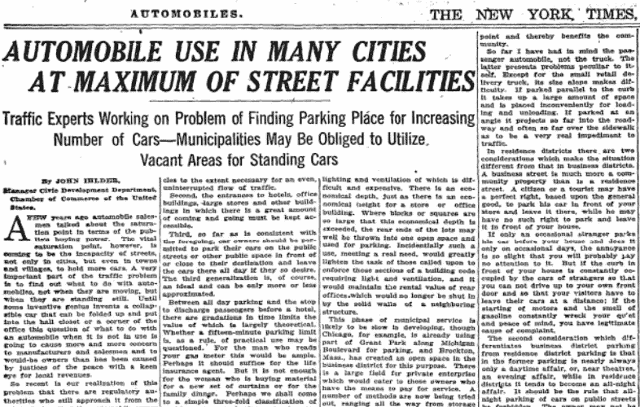

June 24, 1923, The New York Times

汽车被禁止的机会增加了，所以汽车司机、富有的车主和汽车经销商在共同的利益下团结起来。除此之外，他们的宣传活动是教育人们如何安全过马路，并使汽车是街道的新主人这一观念正常化。

超速行驶、事故、停车……这些问题和我们现在经历的很相似。问题是，滑板车到底好多少？

# 与汽车相比，eScooters 的到来有什么好处？

我们有重要的基础设施。我们不需要在巨大的立交桥上投入数十亿美元。我们不必为了停车而牺牲额外的公共空间。我们不必参与一些疯狂的造地活动(至少在这个星球上)。我们必须做的是扩大自行车道。

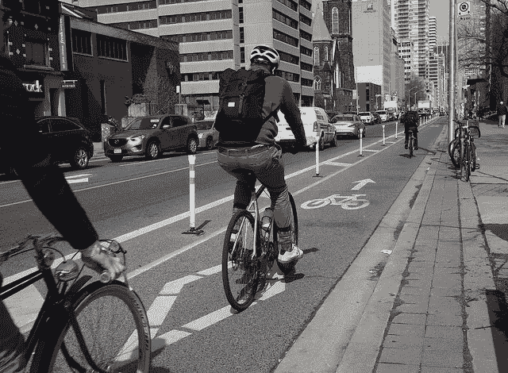

Bloor St W cycle track, Toronto

踏板车在城市道路上行驶在汽车中永远不会感到安全，行人在踏板车中也永远不会感到安全。目前，美国和欧洲的许多街道都是专为汽车修建的，人行道很小，没有受保护的自行车道。

旧金山市大约有 442，000 个公共停车位，只有 1，250 辆电动滑板车。真的吗？

# 滑板车有多环保？(剧透:很绿)

我们都关心生态，我们的政府定期宣布 2030 年左右的可持续发展目标，对吗？如果这些不仅仅是口头上的，也许是时候政府在城市采取更多的行动了？

典型的踏板车骑行是[3，2 km](https://www.vox.com/2018/8/27/17676670/electric-scooter-rental-bird-lime-skip-spin-cities) 以下，所以让我们把 3km 作为我们的距离。在德国波茨坦运行的西门子康比诺有轨电车要求 [1，84kWh/km](https://www.ptua.org.au/myths/tram-emissions/) ，包括再生制动。所以 3 公里骑行需要 5520Wh。在英国，电车的平均载客量是 [53 人](https://assets.publishing.service.gov.uk/government/uploads/system/uploads/attachment_data/file/623366/light-rail-tram-ending-march-2017.pdf)。
->3 公里 x 1840Wh 瓦时/公里/53 名乘客= 104.2 瓦时/乘客/3 公里。

小米 M365——世界上最受欢迎的滑板车之一，电池功率为 280 瓦时，最大续航里程为 30 公里。请记住，用户并不总是体重 60 公斤，驾驶完全平坦的道路，我们可以折扣范围到 25 公里。
->3 公里 x 280Wh 瓦时/25 公里= 33.6 瓦时/乘客/3 公里

**电动踏板车比电车节能三倍。**

它们的效率也是特斯拉 Model S
的 18 倍，3 公里 621.9 瓦时……我们仍然需要先进的公共交通，但当政策制定者要在人行道、电车道、自行车道和道路之间重新划分有限的道路空间时，他们应该知道要做出什么样的决定。

# 与政府的合作

新的滑板车公司对舆论更加敏捷和敏感。他们从特拉维斯·卡兰尼克吸取了教训，现在正认真听取公众意见，与城市管理部门合作良好。

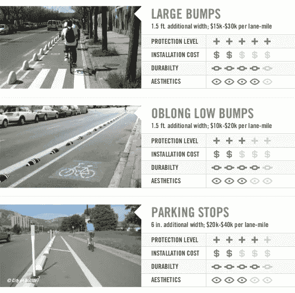

3 out of 14 examples of protected bike lanes, Infographics by People For Bikes

在他的公开信[“拯救我们的人行道”](https://www.bird.co/sos-pledge-mar272018)中，Bird 的首席执行官承诺每天每辆车向市政府捐助 1 美元，而市政府必须将这笔钱投资于自行车道和安全骑行的推广。这封信是写给相互竞争的滑板车公司的首席执行官的，所以我们很有可能会看到他们对城市生态系统做出更多的贡献。一个月销售 10，000 辆小型摩托车可能会产生足够的资金，为市政当局建设 20 英里保护良好的自行车道。

Lyft 正试图通过向往返于公共交通枢纽的人们提供大幅折扣来减少道路上的汽车数量。此外，该公司三分之一的车辆位于低收入和公共交通不发达的地区。

Lime 要求用户根据结束骑行时必须提交的照片来评价每辆滑板车停放的情况。它还通过针对低收入人群的 LimeAccess 项目提供旅行补贴。

电动滑板车不仅仅是交通运输的新篇章。它们是政府和科技公司之间关系的新篇章。因此，我们应该期待空前水平的合作。

意识到中国垃圾自行车的问题后，滑板车公司承诺每天都要清理和维护滑板车。他们的另一个承诺是，除非每天使用超过三次，否则不会增加车辆数量。

# 这应该是一个双赢的游戏

乍一看，这些活动似乎太无私了，但是如果你从正确的角度来看，你会发现每一个活动都是让你赚更多钱的一个步骤。
这很好:城市赢了——消费者赢了——公司赢了。

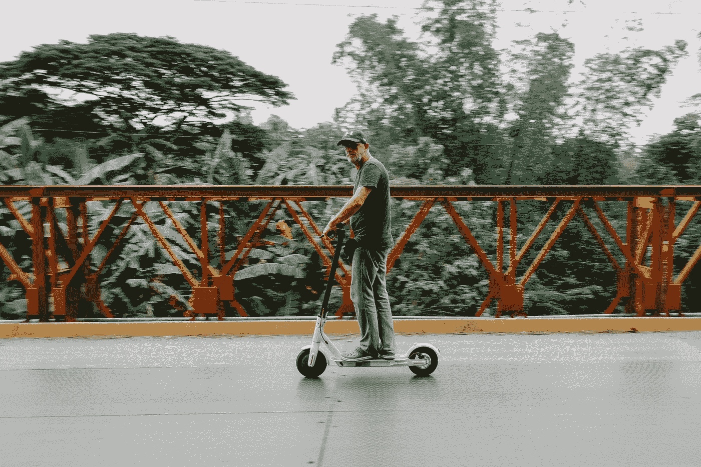

尽管用户喜欢使用 eScooter 服务，而且有明显的迹象表明他们正在改善城市生活，但仍有许多问题需要克服。一个更荒谬的例子可能发生在德国，在德国，正在制定中的轻型电动汽车法案规定，只有最高时速 20 公里的电动滑板车才可以合法使用。新法规可能会对滑板车共享公司构成重大威胁，因为像小米 M365 这样的个人车型可以“解锁”达到 30 公里/小时的速度。警察不会测量速度，但消费者将倾向于转向更快的个人滑板车。

从长远来看，eScooter 公司的最终目标是让城市中 50%的通勤都与他们的车辆有关。哥本哈根市为 2025 年的自行车制定了类似的目标，但考虑到这项技术在全球传播的空前速度，我们应该期待它早日实现。在接下来的几年里，我们将会看到电动滑板车作为交通工具被大量采用，在真正流行之前，滑板车必须不断发展。

# 电动滑板车路线图(底部图片)

对于发展难以预测的初创公司来说，交通运输是一个令人兴奋的新领域，但让我们花两分钟打开幻想。请记住，名单上的许多点取决于每个竞争创业公司的公共政策经理和他/她的谈判技巧。

eScooter Black。购买力较高的用户总是寻求更舒适、更好的性能或更好的外观。因此，公司可能会推出设计更优雅、电池容量更大、上坡速度更高、最高速度不变的新车。稍微好一点的选择，类似智能手机存储升级。

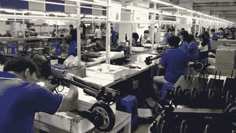

Production line for Koowheel E1 electric kick scooter, [Bonnie Chan](https://www.youtube.com/watch?v=8z1n1gzjUZM)

硬件改进:我们现在看到的大多数踏板车都是 MVP。快速适应新商业模式需求的消费品。企业需要更耐用和更高效的车辆，因此，将于明年春天发布的最新定制车型将解决许多现有问题:
1)更大的电池增加了里程，减少了白天为滑板车充电的需要
2)专用微控制器而不是原型套件中的[元件](https://makezine.com/2018/04/25/vandals-crack-open-dockless-scooter-discover-particle-electron-board-inside/)
3)用于不平坦城市的车型发动机功率过大
4)转向灯，因为滑板车驾驶者在用手示意转弯时有摔倒的风险
5)没有可折叠的设计，增加了耐用性
6)可调节高度

寒冬过后，滑板车公司加倍努力，通过有针对性的广告和网站吸引低收入车主，展示根据选定的路线使用电动滑板车可以节省多少钱(和清洁的空气)。

每个公司都必须在应用程序中标明用户节省了多少二氧化碳。

踏板车最后已知位置的照片可以显著加快用户的搜索过程。

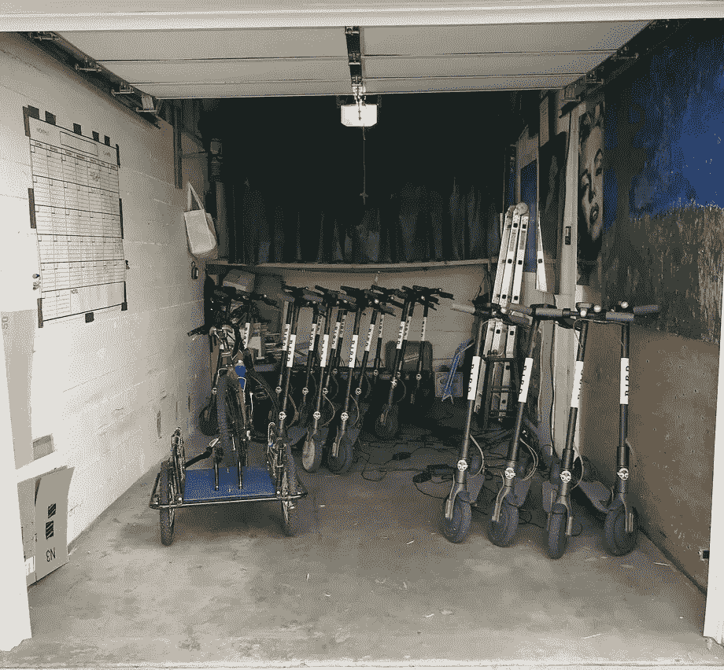

A typical garage of a charger, by Patrick Sisson, Curbed Los Angeles

充电器的小问题:它们会消失。正如 Haje Jan Kamps 在他的[美丽的单位经济模型](https://techcrunch.com/2018/04/10/how-to-understand-the-financial-levers-in-your-business/)中所概述的，充电器(或榨汁机)是最重要的成本，也是增加利润的障碍。即使我们不涉足金融领域，这个概念也不适用。踏板车非常环保，但是如果需要在燃烧汽油的货车或 SUV 上充电，它们可能就没那么环保了。更少的人会有副业收入来源，但更多的人会有全职工作。见下文。

新解决方案—可更换电池。这意味着让滑板车 100%充满电的惊人的高速度和低成本。该模型可以通过两种方式实现。第一种——[Gogoro 电动助力车](https://hackernoon.com/taiwan-startup-gogoro-aka-the-scooter-of-tesla-fbc226bccfa3)风格，配有可拆卸电池和 ATM 大小的充电站。第二种——[tele pod](https://www.telepod.sg/)滑板车风格，专职的全职员工在城市里开车，给滑板车安装新电池。Gogoro 模型使滑板车的行驶范围几乎是无限的，而 Telepod 的电池被盗风险很低。

就像人们不喜欢离开家时智能手机的电池电量只有 65%，他们也不喜欢使用电池电量只有一半的滑板车。你已经可以买到电池容易拆卸的[滑板车](https://www.alibaba.com/product-detail/Foldable-Electric-Telepod-Scooter-Singapore-Telepod_60592972291.html)，但是即使在亚洲，功能的全部潜力还没有被利用。

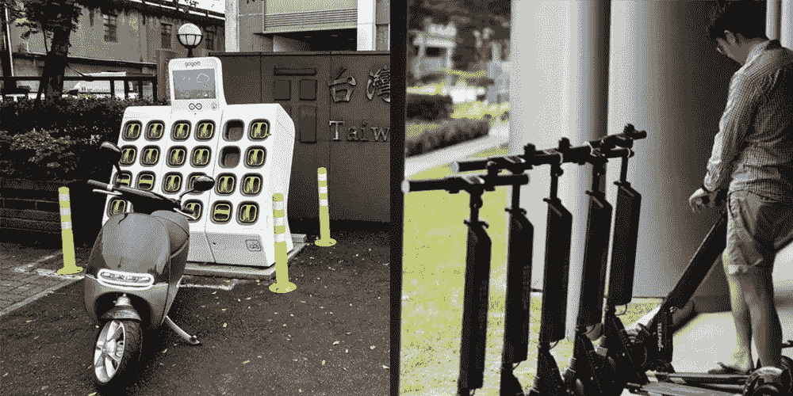

Gogoro electric moped charging station (left), Telepod electric kick scooters with swappable batteries (right)

既然我们有很酷的电池组，为什么不使用这个巨大的电源来给手机充电呢？

在这里的某个地方，赛格威城市之旅将变成埃斯库特城市之旅。

路人和行人之间的礼仪会慢慢发展。目前，没有一套规则，没有宣言，没有常识，但我们可以期待很快。
解决方案的一部分:Lime 要求其骑行者拍照，以确认滑板车在骑行结束时停在了合适的位置。利用提交的停车照片或内部事故报告中的数据，Lime 和其他公司可能会针对特定用户提供预防信息。但最终，最重大的变化应该发生在我们的头脑中。

如果 eScooters 被宣传为汽车/公共交通的替代品，那么我们很容易想象有人每周使用该服务 12 次，这将导致每年 2500 美元。一个人花 400 美元买一辆个人车辆不合理吗？是的，在这个价位上。踏板车公司真的能让他们的服务好六倍吗？不，但他们可以试试。他们可以探索新的定价方案。

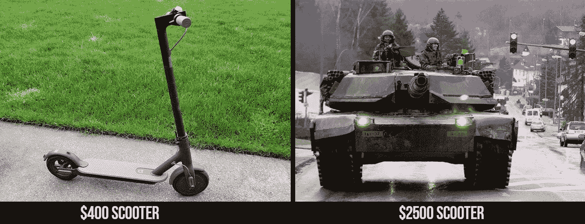

Can startups provide consumers with a reason not to buy personal vehicles?

没有城市管理部门的“启发”,新的定价计划就会出现。定价是每家公司与众不同的地方，无论是提供 3 个月的无限制订阅、150 次骑行还是 300 公里。

跟随[汽车行业趋势](http://www.thedrive.com/tech/21956/volkswagen-will-launch-an-electric-car-sharing-service-in-germany-next-year)，小米和华为——拥有强大品牌的制造公司，将推出类似的代步车共享服务。这一举措将需要已经“经典”的踏板车创业公司做出回应。

冬天。如果在恶劣的天气里没有汽车，那么对于 eScooters 来说，很难大幅减少汽车拥有量。滑板车公司会出资清理自行车道吗？用户可以在-2 摄氏度下驾驶这种车辆吗？在冬天运行这项服务显然符合滑板车公司的利益，但如何管理呢？我们正在谈论未来十年全球交通运输的转变。在冬季，当过去骑摩托车上下班的人没有舒适的方式去上班时，城市管理部门应该在道路上增加公共汽车吗？在对一种新的交通方式的设想中，这个问题是要解决的。

不，拼车司机不会有[太阳能电池板](http://evworld.com/news.cfm?newsid=29915)。

根据来自 a16z 的陈楚翔的[预测，踏板车应用程序可能会成为城市交通的一部分，就像谷歌搜索对于互联网的作用一样——一个可以向企业收取流量费的起点。基本上控制流量的公司可以在有用的基于位置的广告或其他服务中找到额外的收入来源。根据哪家公司在支持公共交通方面会更成功，他们将开始在应用程序中售票。](https://twitter.com/andrewchen/status/1006646515895619587)

踏板车带来的愉悦慢慢消失。

骑自行车的人仍然讨厌滑板车，但并不比汽车司机更讨厌

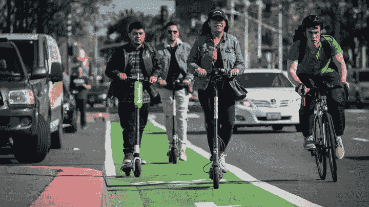

David Paul Morris, Bloomberg, Getty

蜂群。越来越多的人将驾驶有限的自行车道。为了降低与其他踏板车碰撞的风险，可以实施软件算法。这将需要**部分控制**彼此靠近的滑板车，安排它们的位置和速度以获得最大的安全性和舒适性。它不能被称为自动驾驶的东西，但在它的帮助下，它将能够进行微转弯或减速几公里/小时，与附近的车辆同步，通过 RFID 或蓝牙协调位置。

新法规规定，有汽车驾驶执照的人可以在路上骑滑板车。升级后的可更换电池允许滑板车在 GPS 限制的特定区域加速到 50 公里/小时。群体算法将使滑板车一起驾驶，以增加能见度和安全性。

引入了特定的小型摩托车驾驶执照，降低了人们在道路上驾驶的障碍。每个人还是要知道所有的交通规则。

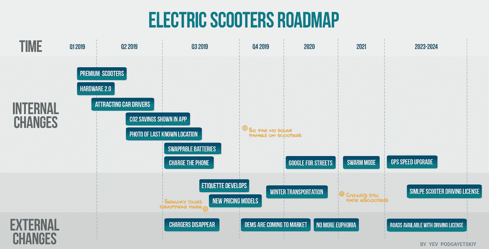

电动滑板车，无论是个人的还是共享的，都是交通工具的重大转变。最初看起来像玩具的东西将塑造城市、我们的行为和技术的未来。科幻小说作者所设想的新程度的个人移动性正在成为现实。

由于在同一个工厂生产的几乎相同的车辆([照片](https://map.baidu.com/#panoid=09002400011703061413369256W&panotype=street&heading=98.4&pitch=2.38&l=21&tn=B_NORMAL_MAP&sc=0&newmap=1&shareurl=1&pid=09002400011703061413369256W))和相同的定价政策，摩托车公司现在处于完全竞争状态。因此，这场战争将在更顺畅的用户体验和与城市的合作中进行。我们现在观察到的只是市场的诞生。2019 年，我们将看到每家初创公司都在寻找自己的利基市场和客户。

Bird、Lime、Spin、Spot、优步、Lyft、Taxify 等等——在踏板车开始运送数十亿人，与自行车、公共汽车和轻轨共享绿色、健康、非汽车中心城市的街道之前，它们都必须克服变革城市交通的道路上的大量障碍。

最后，你应该能够在 scooter 应用程序中编辑照片。

P.P.S .想了解更多关于代步车共享的见解？查看我关于[滑板车运营管理](https://hackernoon.com/whats-the-biggest-threat-to-scooter-sharing-in-2019-cf0bfefeb9b8)未来的新文章。

## 这篇文章发表在 [The Startup](https://medium.com/swlh) 上，这是 Medium 最大的创业刊物，有+369，832 人关注。

## 订阅接收[我们的头条新闻](http://growthsupply.com/the-startup-newsletter/)。

