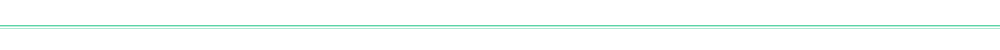

# 回报是什么？探索真正重要的奖励…

> 原文：<https://medium.com/swlh/whats-the-payoff-exploring-rewards-that-really-matter-9bd546cce16c>

no need for sticks. we’re just talking carrots here.

> 作者注:我原本打算写一篇文章，概述领导者在工作环境中最适合使用的奖励和认可类型，但遗憾的是，我被一个更大的追求打断了。一组更大、更漂亮的问题开始出现了……那么让我们从这里开始，好吗？

奖励真的重要吗？

**他们真的在阻碍我们成为最好的自己吗？**

回答第一个问题，是的，它们当然重要。

第二个问题呢？在某种程度上，是的，他们做的。让我们来解释一下奖励是如何为某些追求服务的，但在其他领域——我敢说——甚至是我们生活中更重要的领域——却是令人分心的数据。

## **奖励是燃料(为了好的火)**

让我们面对现实吧，尽管我们喜欢认为自己是高度进化的，但人类充满了基本的驱动力和非理性。见鬼，如果我们完全理性，就不会有战争，不会有贫穷，我们都会非常健康，拥有美好的关系。我们会在无止境的理性思考过程的基础上，过着绝对辉煌的生活，没有人会在白天看肥皂剧。

但我们不会过那种生活。或者至少，我们没有全部拥有。是的,《勇敢与美丽》明天还会上演。

OMG. Like, er, best. show. everrrrr… (said no one)

所以我们做出的决定并不总是符合我们的最佳利益，尤其是从长远来看。为什么？

在本质上，我们很大程度上是一种享乐主义动物。我们寻求快乐，并试图将痛苦最小化。这就是奖励像毒品一样的地方。事实上，它们是我们所知的最强药物之一多巴胺的前体。当某人或某事作为努力的回应出现时，我们感觉良好。这很好，直到它不是。

## 奖励系统的生理学

因为当我们的工作受到奖励或认可时，我们感到的“兴奋”基本上是由药物引起的，所以我们的系统对任何药物的引入都会迅速产生两种反应。他们是；

1.  渴望——我们想要更多，而且
2.  习惯化——我们已经习惯了

因此，我们发现自己处于不满的神经肽汤之中。我们想要更多，但更多是不行的。所以我们想要更多，更多。

所以我们看到了问题。在我们自身的生理中，它开始变得越来越少关于工作，而是关于化学回报。奖励和认可可能是一个陷阱，从长远来看，最终双方(给予者和接受者)都不会满意。

那么这是否意味着我们根本不应该奖励或认可呢？

当然不是。你当然应该使用它们，但是应用程序很重要，上下文更重要。

# **有效应用奖励**

因此，让我们看看应用或奖励和认可，并把它纳入三个主要规则；

**规则 1——使其匹配(奖励应与努力保持一致)**

你有没有全心全意地投入到一个项目中，只为了得到象征性的奖励或小小的感谢？感觉很没动力，不是吗？就像你撕下一小块作品，每个人都为此大唱大跳一样。奖励和强化在合适的场合下效果最好。

**规则 2——让它变得可变(当可预测时，奖励变得不那么有效)**

收到过圣诞奖金吗？也许你在工作纪念日会自动加薪？当它发生的时候真好。但是说实话，这些奖励或认可影响了你的表现吗？可预测的强化物在一个极快的时间框架内变成了权利。所以尽量不要把奖励和强化与可预测的指标(假期、日历日期等)联系起来，而是根据被认为是自发的*来思考。*

**规则 3——让它有价值(通过关心，而不是系统化)**

我们都听说过关于金钱奖励及其应用的不同功效的建议。用现金作为奖励的最大问题是它很容易被比较。尤其是在其他人当中。吉姆得到了 300 美元，而不是杰玛的 250 美元，这意味着他做得更好，但任务可能会有很大不同。由于金钱的结构和意义，似乎唯一的解决办法是通过将所有的金钱奖励纳入一个系统/政策来消除主观性，这反过来又进一步否定了它们的影响。

这里有一个新颖的方法。多尝试基于关怀的奖励和认可。找出关于个人的事情，并使奖励与这些事情挂钩。这会产生一种积极的价值扭曲，这对双方都是双赢的。

好了，在给定的任务或项目中，将奖励和认可作为提高绩效和所有权的工具，有一些基本的东西。但我们的谈话才进行了一半。也许打开水壶给自己冲一杯咖啡，或者从你那愉快的居高临下的咖啡师那里点一杯半杯杏仁拿铁，然后开始考虑我们应该如何、何时或为什么使用奖励和认可。因为应用固然重要，**语境才是王道。**

# 你在玩什么游戏？

因此，我们已经确定奖励是基于生物化学的(滴答),因此有越来越多的需求来保持相关性和满足感(双击)。他们可能是强大的，但最终(由于他们的化学性质)最终会不满意(交叉)。

但真正的秘密是。从长远来看，奖励的有效使用是在游戏之间切换。

詹姆斯·卡斯是一个传奇。他的哲学名著[有限和无限的游戏——一种将生活视为游戏和可能性的观点](https://en.wikipedia.org/wiki/Finite_and_Infinite_Games)是那种罕见的书籍，在那里你会受到这个概念的如此多的挑战，你需要钻研几次，才能真正欣赏其中的智慧。

Carse 向我们介绍了这样一个概念，即我们可以参与两个游戏，*有限*和*无限*游戏。

有限博弈是生活中最常见的博弈之一。项目的成功交付是一个有限的游戏。体育或棋盘游戏是有限的游戏，因为它们通常有开始和结束，我们可以很容易地衡量成功(赢和输)。这些规则是严格执行的，不会改变。有限博弈的边界被设计来约束框架内的参与者。

**无限游戏**展示了不同的构造。无限游戏的规则*必须*改变并且没有结局；事实上，无限游戏的主要目的是让游戏继续下去。无限游戏超越时间，也超越游戏群体。

## 努力工作，尽情玩耍

如果我们用 Carse 的理论来反对奖励的使用，一些主题就出现了。如果你在玩一个有限的游戏，强化物可以是性能的喷气燃料。这是有限博弈本身中的有限博弈。保持游戏的规则和边界(它的持续时间，成功的衡量标准和强度)可见，你将毫无疑问地看到该类型游戏的玩家在智能应用的奖励系统下做得很好。

所以奖励和有限游戏是天作之合。算是吧。

好的一面是，总有另一个有限游戏可以玩，但这是一把双刃剑。有限博弈有一个结局，但当你完成了上一个博弈，总会有另一个博弈在等着你。

当奖励和对有限游戏的追求不能带来饱腹感时，问题就出现了。

你可以无意中创造出一个巨大的仓鼠轮子，最终成为倦怠的定义；没有目标的进步。

给你一个警告:如果你决定玩有限游戏，以及伴随它们的奖励系统，你获得持续动力的途径有两种选择。

1.  继续寻找更大、更刺激的有限游戏来玩
2.  (我一会儿就揭示这一点)

如果你选择了第一个选项(尤其是对你领导的人而言)，那就做好野蛮撤退的准备吧。它会发生的。

你在这里，与多年的深刻，美妙的合作编目，但它仍然会变酸。为什么？

因为你给他们下了药，现在他们正在经历药物戒断。而且很残忍。他们的系统已经习惯了多巴胺这种强大的神经刺激物，现在迫切需要它，但你再也无法提供足够大的刺激来满足它。所以他们的系统不得不忍受被移除的严酷。

典型的情况是，如果我们有一个物质滥用者停止服用硬毒品，我们会看到明显的戒断迹象，如发烧、颤抖和严重的情绪波动。多巴胺戒断症状较少，但有其自身的变化。沮丧、愤怒、失望甚至昏睡都是已经习惯了有限游戏的享乐主义生活方式的人的退缩症状。

所以给你个警告。如果你决定放弃使用奖励的游戏，将会有一个崩溃。你可以追逐更大的游戏，并提供更大的回报，但它(他们)在某些时候不可避免地会摔倒。

但是回到我们保持高动力的选择上来。

1.  如前所述，你可以继续寻找更大、更刺激的有限游戏来玩，或者
2.  **切换到无限游戏**

I know Dwayne. Huge, right?

你看，业绩可以由外在因素驱动(奖励等)，也可以由追求无限游戏的内在因素驱动。谦逊、自我意识、觉悟、感恩……这些都是可以玩的无限游戏。他们从来没有结束状态，他们会比任何人都长寿，我敢说玩这些游戏的结果远远超过任何奖励，即使是设计最出色的有限游戏。

## 让我们包装它。

这比预期的要大，不是吗？奖励本质上是一件需要小心处理的事情。所以拿 2000 字来浓缩成一个简单的建议，我们试试下面的。

如果你在玩一个有限的游戏，使用奖励和认可。但要意识到，你需要继续玩更大、更刺激的游戏，这些游戏会带来更大、更刺激的奖励。

或者转行玩无限游戏。没有真正的奖励要求，因为这些游戏本质上更受驱动。

最后一点，当我们玩无限游戏时，真正的领导力就开始了。但那完全是另一回事了。

## 这篇文章发表在[《创业](https://medium.com/swlh)》上，这是 Medium 最大的创业刊物，有 312，596+人关注。

## 订阅接收[我们的头条新闻](http://growthsupply.com/the-startup-newsletter/)。

