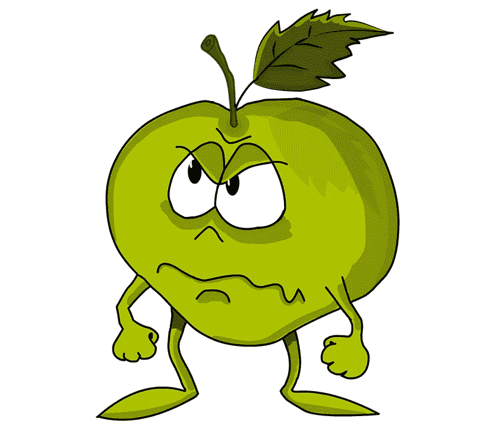
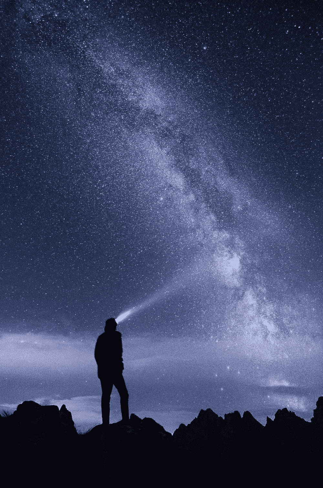
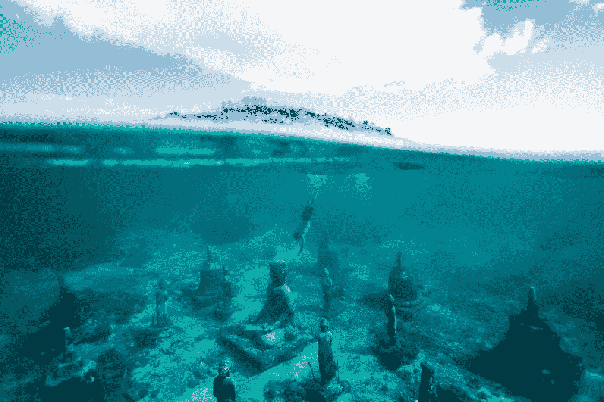
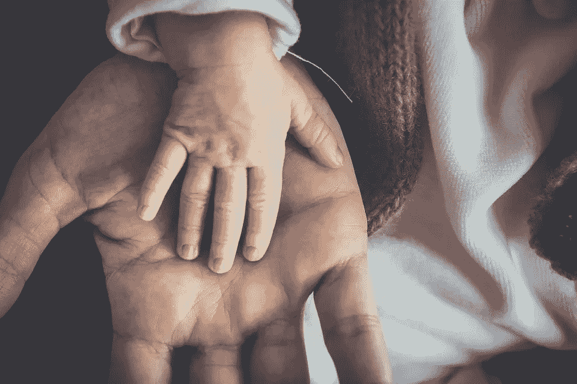

# 人生的目的是什么？

> 原文：<https://medium.com/swlh/whats-the-purpose-of-life-ff9d7e07e4b9>

这个令人毛骨悚然的大胆问题。

当每个人都发现自己在问这个问题时，就到了一个岔路口。它可能源于年龄，源于事情没有按计划进行，源于用尽计划，源于失落，源于有很多事要做，源于无事可做，然而存在的唯一共同点是这个问题在某个阶段的诞生。

它的出生地并不重要，因为当这个问题露出尖牙时，它们还是会刺痛我们。所以当我的时间到了，我做了我唯一知道要做的事——求助于书籍。

我阅读了所有我能找到的东西，包括神经科学、心理学、量子力学、形而上学和哲学。

因为我们读书是为了知道我们并不孤单。

**不，只是开玩笑，因为你吃的东西会变成什么样，你读的东西会变成什么样。**

马可·奥勒留和塞内加的《沉思录》抚慰了心灵，尼采重新揭开了伤口，卡尔罗·罗威利和斯蒂芬·霍金拓宽了我的视野(还有我的眼睛！)到现实的本质，卡尔·萨根拓展了我的思维，尼克·博斯特罗姆吓了我一跳！

Scavenging for answers . Photo: Unsplash

它花了一年左右的时间才达到某种意义上的终结，如果它可以被称为终结的话。但是我比以前更接近答案了。这是我的武器库中为任何与同样的怪物战斗的人准备的！

# 宇宙不给你意义，你给宇宙意义。

在物理学中，有一个[观察者悖论](https://en.wikipedia.org/wiki/Observer%27s_paradox)的概念，它指的是一种被观察的现象被观察者/调查者的存在无意中影响的情况。现在，让我们加入一些量子力学来使事情变得更有趣。[双分裂实验](https://en.wikipedia.org/wiki/Double-slit_experiment)进一步证明了波粒二象性，并引发了许多解释，包括[多世界解释](https://en.wikipedia.org/wiki/Many-worlds_interpretation)，它断言所有可能的替代历史和未来都是可能的，许多宇宙也是如此——一个宇宙中我是 JK 罗琳，另一个宇宙中你长大后是哈利波特。

回到这个宇宙，当你伸长脖子仰望晴朗的夜空，看到无数的星星在你头顶上，回忆那种美丽和奇妙的感觉。

现在把你自己从等式中去掉。

所有这些令人惊叹的星系和恒星、黑洞和超新星，如果不是我们一开始对它们感到惊奇，将会继续在太空中漫无目的地旋转。

We are the ones who throw the beam of beauty at the stars. Photo : [Kôprovský štít, Vysoké Tatry, Slovakia](https://unsplash.com/search/photos/k%C3%B4provsk%C3%BD-%C5%A1t%C3%ADt%2C-vysok%C3%A9-tatry%2C-slovakia)

> “不是宇宙赋予你意义，是你赋予宇宙意义。”

# 没有探索就没有发现。探索始于内心。

我们寻找“目标”,就像一个 5 岁的孩子在丛林中寻找独角兽一样。

如果我们把同一只独角兽画在纸上，并用各种花哨的东西给它上色，那么实现它的可能性会更大。

> 目的相同。我们需要创造它。在我们的生活中。用我们行为的颜色。

这一切的起点就在我们内心的某个地方。不是外面。而且，还不明显。

如果有上帝，我相信他/她就在我们心中。许多开悟的灵魂旅行数千英里来揭示最重要的旅程是向内的旅程。

Have you taken the journey beneath the surface of the self? Photo : [Lembongan island, Indonesia](https://unsplash.com/search/photos/lembongan-island%2C-indonesia)

无论我们是选择减轻他人的痛苦，增加我们的学习，还是做一个更好的自己。这取决于我们内心的那个人。在宇宙的某个地方，没有一个指定的人赋予我们“目的”。以任何其他方式思考都是夸大其词。换个角度来看，如果宇宙的年龄被挤进我们的日历，人类在 12 月 31 日午夜左右到达了某个地方。认为人类有任何重要性，在时空上都是天真的。

然而，我们每个人都是如此珍贵，以至于在数十亿个星系之外，没有一个人像你一样。所以你的目的是你自己的故事，你自己在自己的宇宙中的创造。

当然，遗传和进化起着一定的作用，但我们自己的思维和理性也是如此。

> “你会有一个伟大的帝国吗？统治自己。”
> 
> —塔西陀·西鲁斯

# 接受和改变并不相互排斥。

事实上，接受是彻底改变的第一步。

Amor Fati，这个拉丁语短语的意思是“对命运的爱”,已经被几位大师反复引用。我喜欢弗雷德里克·尼采的这首

“我认为人类的伟大之处在于:一个人不想与众不同，不想前进，不想后退，不想永生。不只是承担必要的东西，更不要隐藏它……而是热爱它。”

> 一旦我们真诚地接受现实，只有这样，我们才能停止沉湎于过去，重新想象未来。

然后付诸行动。

# 照看部落

Love. It is the perfect antidote to all existential doubts

无论是我们的国家、州、直辖市、公司，还是在最细微的层面——我们的家庭；智人是一个“部落”物种。

然而，使我们区别于其他动物的是我们集体行动的能力，比如说大猩猩，它有更强壮的手臂，更灵活的身体，更好的爪子和牙齿。

> 语言、信任(金钱)、民主、资本主义、宗教是我们竖起来编织集体织物的支柱，不管是好是坏，它们将我们联系在一起。

地球上最聪明的人也不能完全靠自己做出一只你握在手中的简单的鼠标。他将如何开采塑料，在哪里锻造工具？

“无论何时何地，人类的成就都是集体的。你所使用的每一件物品和服务都是不同的头脑共同努力的产物，他们发明或管理的东西远远超出了任何一个人的能力。这就是中央计划不起作用的原因。大多数日子，伦敦有一千万人吃午餐；鉴于他们中的许多人在最后一刻才做出决定，他们究竟是如何在何时何地得到他们想要的东西的，令人费解。如果有一位伦敦午餐专员来组织，他会一败涂地。由价格信号整合的个人决策起作用了，而且确实非常有效。”——马特·里德利，《理性乐观主义者》的作者

超越所有的抽象和哲学，作为一名雇员，一名作家，一名父母，我们有能力去影响和成为我们自己以外的未来的建筑师。我们有这个责任，公正地做到这一点可能是一种美好的生活。

> “知道哪怕一个生命因为你的存在而呼吸得更轻松。这是成功的。”

——拉尔夫·瓦尔多·爱默生

我希望这能给你足够的启发，让你花时间接受自己的现状，然后向内旅行一点。我希望这段旅程有足够的回报，让你做出一些改变，并推动你为自己和你想要塑造的宇宙中的其他人设计一个更美好的未来。

## 这篇文章发表在《创业公司》杂志上，这是 Medium 最大的创业刊物，有 319，283 人关注。

## 订阅接收[我们的头条](http://growthsupply.com/the-startup-newsletter/)。

