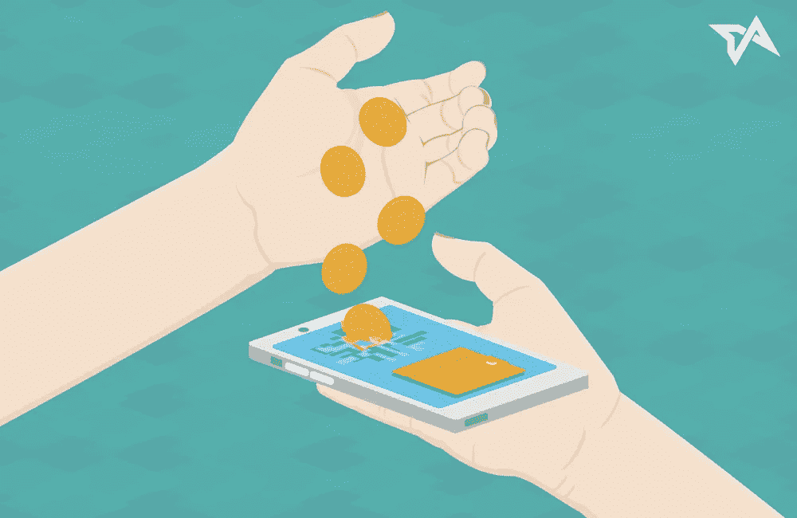
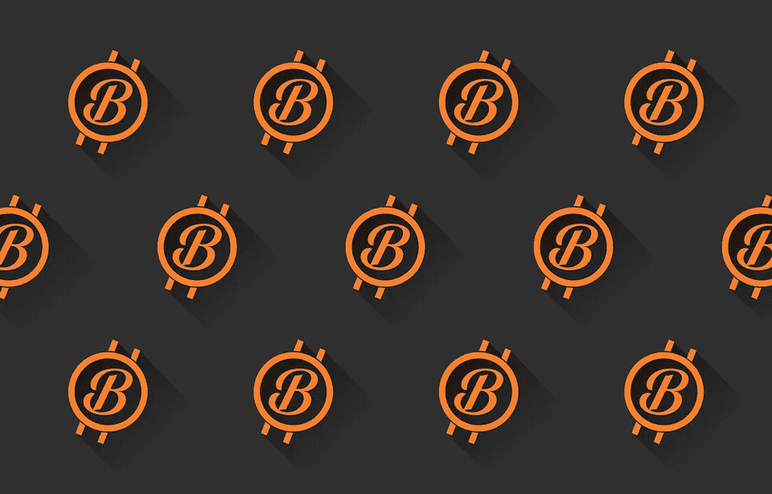

# 加密货币的“真实价值”是什么？

> 原文：<https://medium.com/swlh/whats-the-true-value-of-cryptocurrency-86023c935dcf>

What are cryptocurrencies? (via Flickr)

随着媒体和公众对加密货币的大肆宣传，许多人仍然质疑这些数字资产及其背后的技术的真实价值。双方都有主张——传道者认为他们是来扰乱我们所知的金融和技术的，而反对者认为他们不值得大肆宣传。

我并不自称是这方面的专家，事实上我只是刚刚开始理解它们是如何系统地和社会地工作的。然而，我知道通过写关于它们的文章，我保证会通过研究和参与加密社区学到更多。

诚然，加密货币极其不稳定，但这对其背后的技术意味着什么？随着这场炒作的继续，我们将会问这个问题。现在有数以千计的替代数字货币在交易，但它们都归功于一个主宰它们的密码(目前来说):比特币。这是大多数人听说过加密货币的原因，即使他们不了解它的价值或使其工作的底层技术。

如果你要一头扎进加密的世界，需要一段时间才能完全理解这项技术发展和变化的规模。然而，一旦你对它的工作原理和重要性有了基本的理解，你就会意识到它的潜力。

本质上，加密货币(比特币是第一种)是通过分布式点对点网络发送的数字货币。没有管理机构，没有利益相关者，也没有机构中间人。用例包括债券、贷款等金融工具的转移，但也包括我们尚未看到的大量其他交易或合同用例。你可以随时随地向任何人发送密码。

发送或接收交易的双方通过加密算法(因此是加密货币)保持匿名。此外，你可以通过在线钱包和交易所买卖这些数字代币。

Will people ever use cryptocurrencies? (via Tech in Asia)

到目前为止，我们面临着这项技术的两难境地，这可能会阻碍它产生影响的能力。这一困境是经典的“鸡和蛋”问题:如果加密货币将用于现实世界的日常场景(比如买车甚至喝杯咖啡)，谁会接受它们？问题是，如果没有商家接受它们，人们就不会在日常生活中使用它们，反之亦然。商家不会接受密码，除非他们知道他们的许多客户正在使用它来购买商品和服务。

我们看到的另一个困境是，大量的投机活动推动比特币的价格，以及其他跟随比特币的价格，以不稳定的速度上下波动。专家声称，加密世界正在经历现代金融史上最大的经济泡沫，比互联网泡沫还要大。一些福音传道者同意，其他人不太同意。事实是，有成千上万的人在价格上投机，允许价格上涨，然后他们把价格倾销到市场上，导致价格暴跌。有时这种情况会在几秒钟内发生。它不仅引起了人们对其泡沫性质的担忧，还让投资者以及商品和服务使用者质疑其对社会的真正价值。

A decentralized network (via Pixabay)

加密货币的价值不在于代币本身；它们没有内在价值。它藏在它们下面。

抛开投机不谈，比特币及其创新但隐藏的技术，创造了区块链的**，被定位为颠覆各种行业。区块链是允许这些密码被发送和接收的系统。用 Lamen 的话说，它是这样工作的:区块链上的每一次交易或数据传输都被系统中的所有节点记录下来。节点是运行分布式账本(本质上是一个软件包)的计算机，包括从笔记本电脑到大型服务器群的所有东西。节点通过建立共识来验证交易。他们解决加密算法，以便认为交易是真实的，并相互参考，以继续下一个交易。**

保存所有这些交易的分布式分类账既是不可逆的，也是匿名的。这些节点通过解决极其困难的量化问题和接收比特币或其他取决于区块链的令牌来验证账本。

这被称为“工作证明”，这就是比特币的运作方式。然而，还有许多其他方法来验证分类账，包括“空间证明”、“股份证明”等。随着越来越多的交易在分类账中流动，越来越多的矿工被激励措施吸引，导致算法变得更难解决。(这项技术还有很多我还不了解的地方。)

真正有趣的是区块链如何改变我们做生意的方式。在一个由机构和中间人组成的世界里，区块链代表着打破现状。一个不涉及任何银行的自助的、不公开的分布式计算机网络——这是一股不可忽视的力量。

你可能会问，为什么区块链如此有用？

首先，它允许近 20 亿没有银行账户的人获得金融服务，使他们能够快速地发送和接收资金，而无需支付高额的国际转账费用。由于种种原因，世界上许多没有银行账户的人没有办法去银行或获得信贷。数百万人必须跋涉数英里才能到达当地银行，因此我们认为通过电话和电脑发送数字货币是有意义的。

No bank needed. (via Pixabay)

其次，区块链不像上市公司那样由利益相关者控制。它使用**开源技术**，由无偿贡献者编写和设计，以保持系统运行(尽管也有例外)。由于没有权力要求所有权，就没有政治议程可循，创新率可以保持很高。

这导致了比特币之外的新的替代密码，这些密码是从其代码中“分叉”出来的(或新编写的)。替代加密货币希望纠正比特币的一些缺陷，同时满足特定行业的需求(IOTA 区块链用于物联网，Ripple 用于企业)，并建立更多的安全功能。没有中央权威，创新的机会就没有尽头。

最后，区块链(泛指技术)消除了集中式系统的低效率，同时降低了用户的成本。当有人刷信用卡购买杂货时，有时需要多达七方来确认交易。在处理交易的几天时间里，资金从消费者流向商家，流向中介机构，如信用处理机构和金融机构，如 Visa，以及消费者的银行。

所有这些手抓住交易的百分比！通过这一过程，我们可以了解对更便宜、更快速的分散式点对点网络的需求。

Will cryptocurrencies take over? (via Pixabay)

最终，时间会证明加密货币及其基础技术能否颠覆强大、有时甚至不稳定的金融机构。2008 年金融危机的巨大打击向世界表明，人们多么容易对我们的银行和部分准备金银行体系的安全性失去信任。也许一个新的系统，一个权力分散、更高效、更便宜、更容易被那些不幸的人获得的系统，是前进的道路。

目前，真正的价值将来自这项技术的使用，而不是投机。厌倦困扰该行业的“泵和转储”和快速致富计划。也许在不久的将来，这项备受争议的技术将有助于为子孙后代创造一个更安全、更美好的世界。

这是对加密货币和区块链的简要介绍。如果你想了解更多，我推荐阅读 [**加密货币时代**](https://www.amazon.com/dp/B00L73JQ18/ref=dp-kindle-redirect?_encoding=UTF8&btkr=1) **和原版** [**比特币白皮书**](https://bitcoin.org/bitcoin.pdf) **。**

*感谢阅读。敬请关注更多内容。*

## 这个故事发表在 [The Startup](https://medium.com/swlh) 上，这是 Medium 最大的企业家出版物，拥有 277，678+人。

## 在这里订阅接收[我们的头条新闻](http://growthsupply.com/the-startup-newsletter/)。

