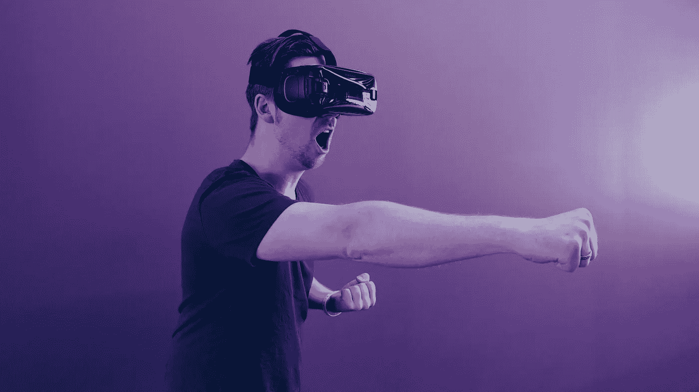
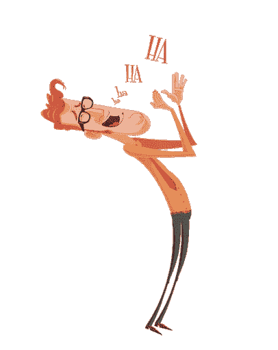
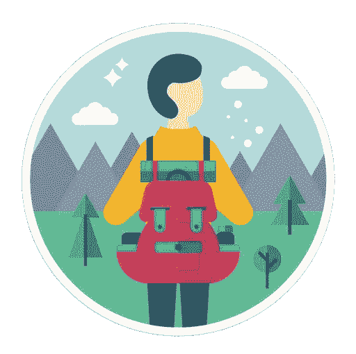
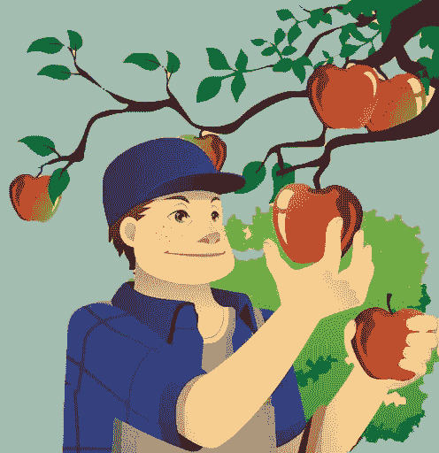
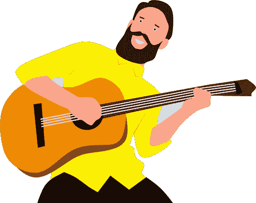

# 你的游戏个性是什么？—8 种游戏个性类型

> 原文：<https://medium.com/swlh/whats-your-play-personality-the-8-play-personality-types-69d798ef0863>

> 你还记得小时候当你知道如何娱乐时的那种感觉吗？

作为一个成年人，你想再次感受它，但你似乎不能再有那种“乐趣”的感觉了。

你甚至会做一些应该很有趣的事情，但是你似乎再也不能像个孩子一样享受生活了。

**于是你做白日梦，回忆那些美好的过去，回到现实。**

我知道你可能会认为生活中的乐趣已经成为过去，但我向你保证，即使你有太多的责任和事情要担心，也有可能获得乐趣。

虽然[学习放松本身就是一门艺术，但享受生活则是另一门艺术。我们似乎无法在生活中获得乐趣的最大原因之一是，我们甚至不知道什么能给我们带来真正的快乐。](https://designepiclife.com/how-to-be-at-peace/)

> 所以我们总是在别人喜欢的活动之间徘徊，然后我们想知道为什么我们不能像他们那样喜欢这些活动。

但从今天起，您就不必再进行猜测了。您会知道该做什么来娱乐——无论何时。

# 游戏的重要性

> "最成功的成年人保持着玩耍的能力。"——杰克·肖恩科夫博士

在我阐述你如何根据自己的个性寻找乐趣之前，让我们确立一下你为什么应该关心玩耍。

**你可能会认为玩耍是为了孩子。您可能认为成年后玩耍是可选的。但事实是——你需要玩耍。就像是你灵魂的食物。**

今天，比以往任何时候都有更多的人被剥夺了游戏权利。慢性游戏剥夺的[后果包括:](http://www.scholarpedia.org/article/Consequences_of_Play_Deprivation)

*   大脑发育不足
*   患抑郁症的风险增加
*   成瘾行为的风险增加
*   重要脑区的功能障碍
*   脉冲控制不良
*   不良的愤怒管理
*   自律性差
*   脆弱而肤浅的关系

另一方面，《T8 本质主义》一书的作者 Greg McKeown 说，**游戏增加我们的大脑活动，减少压力，开阔我们的思维，让我们看到其他选择。**

您如何将游戏带回到您的生活中？

我很高兴你问了。

# 发现您的游戏个性

《游戏》一书的作者斯图尔特·布朗博士根据动物和人类的自然行为确定了 8 种“游戏个性”。

**虽然我们都是这些游戏人物的混合体，但我们通常都有一个或多个主导人物。此外，您的游戏个性可能会随着您的年龄而改变，所以当您似乎无法在生活中获得乐趣时，请随时接受尝试。**

了解你当前或主导的游戏个性可以帮助你确定哪些活动会给你的生活带来真正的快乐，让你感觉充满活力。

**这 8 个游戏角色分别是:**

# 1.小丑

他们喜欢逗别人笑，玩恶作剧，做滑稽的模仿。他们是一个群体中的“班级小丑”或“滑稽角色”。

**创意玩一把*百搭:***

*   用你的笑话让人们发笑
*   笑你的笑话和双关语
*   看喜剧

# 2.动觉

他们喜欢通过移动身体来玩耍。它可以是跳舞、跑步、瑜伽、运动、游泳、散步或徒步旅行。

**一种*动觉的玩法* :**

*   进行体育运动或户外散步
*   加入一群做你喜欢的活动的人
*   观看和学习你喜欢的活动

# 3.探险家

他们喜欢拓展视野，发现新事物。探索可以是身体上的(参观新的地方)，精神上的(在感兴趣的领域扩展自己的知识)或情感上的(通过音乐、艺术或运动挖掘情感)。

**一个*探险家的玩法* :**

*   去冒险(做新的事情)
*   学习一些让你着迷的东西
*   研究你感兴趣的事情

# 4.竞争对手

他们喜欢为了胜利或打破记录而玩——无论是单人游戏还是社交游戏。他们也可能喜欢观看竞技体育。

**竞争对手*的玩法* :**

*   玩游戏
*   设定目标(让生活成为一场游戏)
*   观看体育比赛

# 5.导演

他们喜欢计划、组织和执行活动。他们在社交世界中带头举办活动，并为群体提供一种体验。

**给一个*导演的剧本* :**

*   组织聚会或活动
*   组织或计划你的东西
*   在你的小组中扮演领导者的角色

# 6.收藏家

他们喜欢收集并拥有最有趣的令他们着迷的事物或经历。他们喜欢寻找新的收藏品。他们也可能喜欢组织和展示他们的收藏。

**一个*收藏家的玩法* :**

*   收集你珍惜的物品、资源或经历
*   寻找新的作品加入你的收藏
*   公开你的收藏(或展示给你的朋友)

# 7.艺术家/创作者

他们喜欢涉及创造力或艺术的活动。可以是绘画、建筑、编织、园艺、唱歌，甚至修理和清洁物品。

**艺术家/创作者的游戏创意*:***

*   *做你喜欢的艺术或活动*
*   *使用或把你的作品给其他人欣赏*
*   *观察你欣赏的艺术*

# *8.讲故事的人*

**

*他们喜欢通过想象去冒险。他们可能喜欢表演、写作和讲故事。或者他们可能喜欢通过阅读小说或看电影和戏剧来体验这些创造。*

***给一个*讲故事的人*的游戏创意:***

*   *讲或写故事*
*   *阅读、听或看故事*
*   *通过表演成为故事的一部分*

# *深度游戏的力量*

*你可能听说过[深度作品](https://designepiclife.com/deepwork)。但“深度玩法”也是体验惊艳人生所必须的。*

*你越清楚乐趣对你意味着什么，你就越会花时间在深度游戏上，避免你不喜欢的事情。*

*确定你深度娱乐活动的最简单方法是注意是什么让你忘记了时间的概念。记住你小时候喜欢的活动也可以帮助你识别它们。*

*深度的工作和深度的娱乐是相辅相成的。有时，它们合并成一项活动，而其他时候，它们相互补充，通过给你最佳的压力和恢复来管理你的能量。*

*因此，为了充分发挥深度工作和深度娱乐的力量，你可以在两者之间保持平衡。或者你可以选择一个可以让你同时做这两件事的工作领域。*

***当您不得不在深度工作和深度游戏之间周旋**，并且没有时间进行深度游戏时，您可以召集“微游戏”会话。*

*   **爱开玩笑的人*可能会开玩笑或观看有趣的内容*
*   *动觉者可能会走一小段路*
*   *探险家可能会“谷歌”一些东西来满足他们的好奇心*
*   *参赛者可能会玩一小段游戏*
*   *主任可以组织文件或任务*
*   *收集者可以保存相关链接或资源的列表*
*   *艺术家/创作者可能会在纸上涂鸦，哼一首歌，等等(取决于艺术)。*
*   *讲故事的人可能会幻想一个故事*

***另一个选择是当你的工作符合你的游戏个性风格时，同时进行深度工作和深度游戏**。*

*正如詹姆斯·米切纳所说…*

> *“生活艺术的大师很少区分他的工作和他的游戏，他的劳动和他的休闲，他的思想和他的身体，他的信息和他的娱乐，他的爱和他的宗教。他几乎分不清哪个是哪个。无论做什么，他都追求卓越，让别人决定他是工作还是娱乐。对他来说，他总是两样都做。”*

# *结论*

*人生苦短。玩耍是完整生活的重要组成部分。*

*大多数人不知道怎么玩，因为他们不知道他们真正喜欢什么。*

*但是你不用再猜了。像大多数人一样，你可能是不同游戏角色的混合体。你可以在以下角色中找到自己独特的主导角色——*小丑、动觉者、探险家、竞争者、导演、收藏家、艺术家/创造者、*和*讲故事者。**

*现在你知道你的独特组合和确切的活动，可以让你感觉最有活力。所以，不要等待生活变得完美——开始玩吧。*

*除非你腾出时间，否则玩耍的最佳时间永远不会到来。因此，点击开始按钮，让自己沉浸在深度游戏中——每天都是如此。*

# *找到更多快乐的方法…*

## *[点击报名参加为期 10 天的免费电子邮件课程，发现真正幸福的 18 个要素](http://bit.ly/happiness-ingredients)。*

**最初发表于 D*[*esignEpicLife.com*](https://designepiclife.com/how-to-have-fun)*

**

## *这篇文章发表在 [The Startup](https://medium.com/swlh) 上，这是 Medium 最大的创业刊物，拥有+398，714 名读者。*

## *在此订阅接收[我们的头条新闻](http://growthsupply.com/the-startup-newsletter/)。*

**