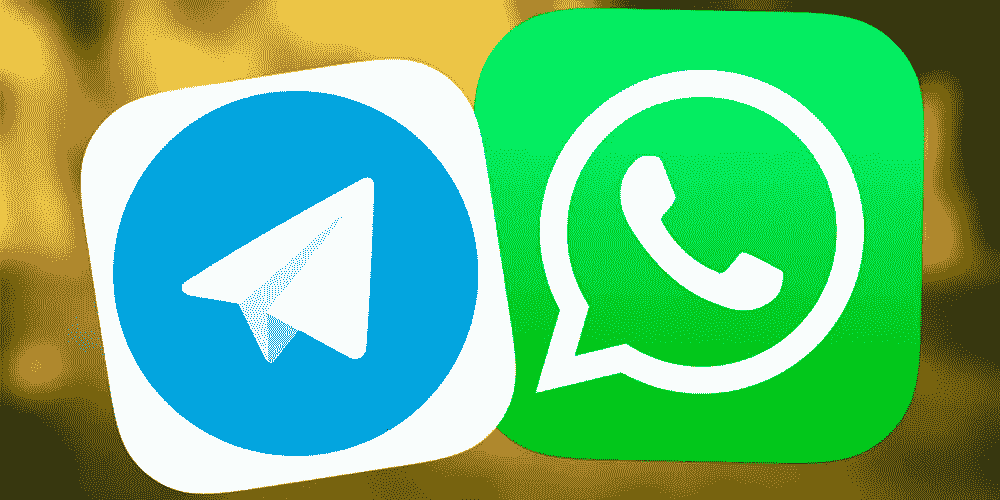
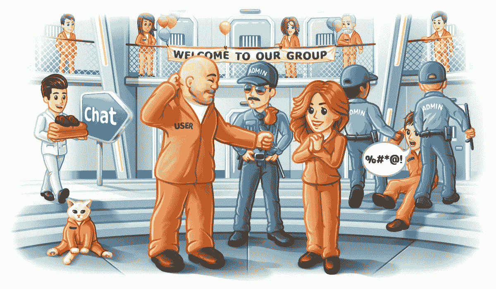
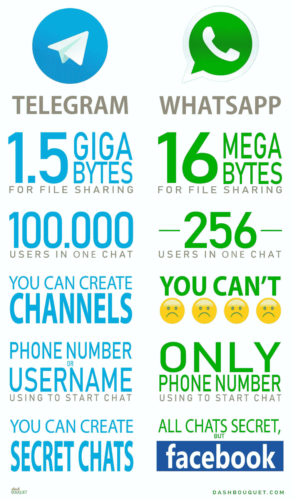

# WhatsApp vs Telegram——信使大战

> 原文：<https://medium.com/swlh/whatsapp-vs-telegram-messengers-fight-b297babc04c2>

这个世界上有两种人。支持 iPhone 的人和喜欢 Android 的人；那些热爱脸书的人和那些总是在推特上的人。最后，我们有使用 WhatsApp 的人和 Telegram 的铁杆粉丝。如今，这两个应用程序(WhatsApp 和 Telegram)的不同特点成为了讨论的话题。

是什么造就了 WhatsApp？电报有什么不同吗？他们有相似之处吗？有没有更好的 app？优越感是由什么决定的？让我们深入了解一下。

# 关于 WhatsApp

2009 年，雅虎的两名前员工在脸书求职，遭到拒绝。这两个人，布莱恩·阿克顿和简·库姆，然后坐在一起开发一个通讯应用程序。他们雇佣了一名俄罗斯开发者，一起开发了 WhatsApp。如果你想知道，这个应用程序是以一句流行的短语命名的，“你好吗？”

在他们的想法提出五年后，脸书以 190 亿美元收购了这家公司。多讽刺啊，对吧？如今在 2018 年，月用户超过 15 亿，这一投资似乎得到了回报，该应用程序受到了全世界用户的喜爱。让 WhatsApp 如此轰动的特性将在接下来的段落中进行分析。

但首先，让我们看看 WhatsApp 的新兴竞争对手 Telegram。

# 关于电报

创始人被亲切地称为俄罗斯的马克·扎克伯格，然而，这个神童却活在自己的世界里。帕维尔·杜罗夫在哥哥尼古拉的帮助下，于 2013 年创建了 Telegram。据《福布斯》杂志报道，自拍电报以来，他已经积累了超过 17 亿美元。

Pavel Durov

帕维尔的一个显著特点是他对安全的重视。他曾被要求向俄罗斯当局提供某些亲欧洲活动人士的个人数据。他的决定是断然拒绝，这导致他逃离这个国家，定居在迪拜。

现在，我们可以继续探索这两个应用程序之间的差异。

# 安全性

帕维尔·杜罗夫在最近接受采访时声称，他参与创建 Telegram 的主要动机是“建立一种俄罗斯安全机构无法进入的通信手段”毫无疑问，安全对团队来说非常重要。

Telegram 拥有秘密聊天等功能，为对话提供端到端加密。这种秘密聊天在公司的服务器上是无法追踪的，而且信息会根据你设置的计时器自毁。他们甚至领先一步，承认他们并不像他们认为的那样万无一失，因此，他们定期为发现他们框架中关键错误的开发人员提供激励。

还有一点需要注意的是，Telegram 没有股东或广告客户需要报告。老板夸口说他们没有向任何第三方透露一点信息。2015 年巴黎袭击后，伊斯兰国组织拥有与 Telegram 相关的账户，这些账户被迅速关闭。

而 WhatsApp 则将秘密聊天的概念融入到每一次对话中(它不仅仅是一个功能)。他们使用 Open Whisper Systems 的开源加密标准来实现这一壮举。虽然当你想起涉及马克·扎克伯格和脸书的剑桥分析公司丑闻时，你可能会开始怀疑你在 WhatsApp 上的个人数据的安全性。

# 文件共享

Telegram 再一次展示了它在这方面的优越性。与 WhatsApp 相比，文件共享功能要好得多，这要归功于 Telegram 采用的云系统。Telegram 上分享的照片既没有压缩也没有像素化。此外，你可以在 Telegram 上分享的最大视频大小是 1.5GB。在 WhatsApp 上是 16 MB。你甚至会注意到电报频道播放全高清质量的电影。

Telegram 还允许你在不同的平台上下载相同的文件，次数不限。但在 WhatsApp 上，删除一张照片会将其从系统内存中删除。

# 群聊、频道和超级群组

WhatsApp 又一次未能赢得多数选票。WhatsApp 的群组用户上限为 256 人。Telegram 拥有可容纳多达 100，000 名用户的超级群组。除此之外，我们还有广播他们内容的频道(新闻更新、视频、电视剧、图片等)。)给会员，内容可下载。去吧，电报！

# 隐私

除了安全问题，隐私是电报用户关心的另一个主要问题。首先，WhatsApp 需要你的电话号码来发起聊天。这对一些人来说可能是个坏消息，因为这会让他们接到不必要的电话。但是，Telegram 可以使用您的电话号码或用户名。

此外，在 Telegram 上更换新电话号码的过程要简单得多。如果您没有阻止您的联系人，他们会自动获取您的号码。

# 草稿

比方说，你正在用手机打字，而你不得不暂时离开手机去处理其他事情，你应该会遇到你正在输入的内容的一个保存版本，对吗？WhatsApp 并不总是这样。

然而，你可以用 Telegram 做同样的尝试。开始打字，关闭应用程序，几个月内忘记它，当你打开它时，草稿仍然存在。不仅如此，假设你在手机上打字，然后手机被偷了。打开你的电脑，进入电报客户端，瞧！你的草稿在你的电脑上。

# 结论

似乎这种比较是对 Telegram 优于 WhatsApp 的一种阐述，这与事实相差不远。即时通讯的热心用户可以证明，Telegram 的到来给 WhatsApp 带来了巨大的改进。事实上，Telegram vs WhatsApp 是竞争如何推动创新的一个明显例子。然而，WhatsApp 拥有更大的用户群。虽然，我们可以将这归因于 WhatsApp 已经存在了更长时间，并且与 Telegram 相比，他们可以获得更多的资金。WhatsApp 和 Telegram，你更倾向于哪个？

[作者罗曼·昆采维奇](https://www.linkedin.com/in/roman-kuntsevich-55819515a/)

## 这个故事发表在 [The Startup](https://medium.com/swlh) 上，这是 Medium 最大的企业家出版物，拥有 338，320 多名读者。

## 在此订阅接收[我们的头条新闻](http://growthsupply.com/the-startup-newsletter/)。

