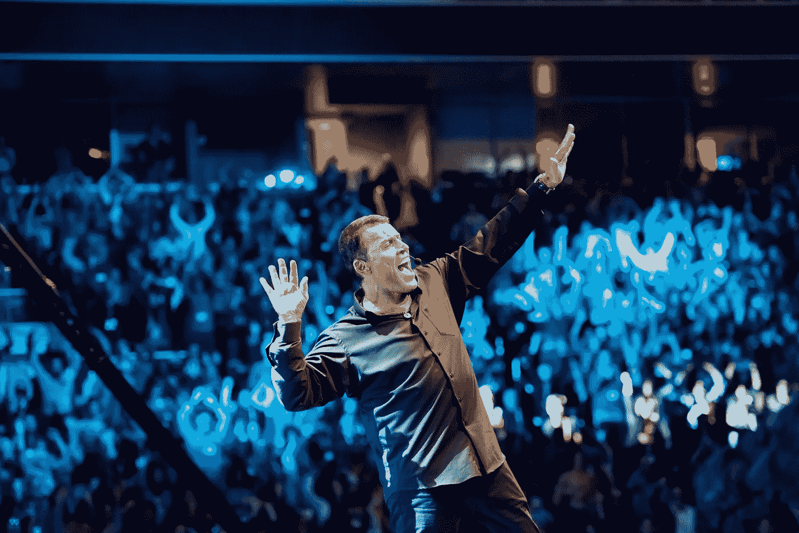
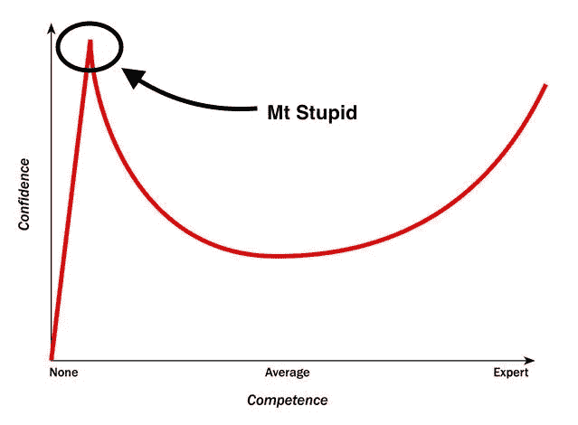
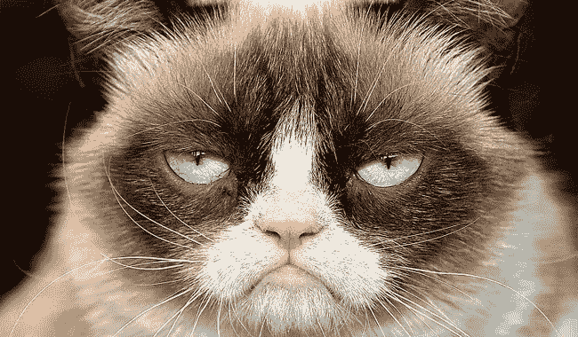
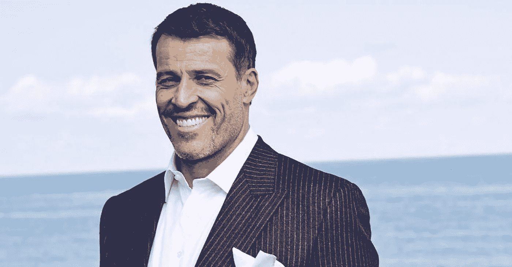
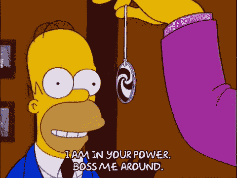

# 当一个持怀疑态度的行为科学家去参加托尼·罗宾斯的活动时会发生什么。

> 原文：<https://medium.com/swlh/when-a-skeptical-behavioural-scientist-goes-to-a-tony-robbins-event-e122062798f4>

听着，我会非常诚实的。托尼·罗宾斯是最差劲的蛇油推销员。他的活动，他的伪科学和所有的一切都是一个巨大的商业骗局，旨在从愚蠢的人身上榨取钱财。

砰。这就是了。

至少在我参加他的活动之前，我是这么想的。

你知道，当我年轻的时候，受过良好的大学教育，明显缺乏谦逊，我很快就形成了自己的观点——通常没有什么依据。基本上，我可以从我很少甚至没有第一手经验的东西中判断出 sh*t。

从那以后，我开始知道这就是[邓宁-克鲁格效应](https://en.wikipedia.org/wiki/Dunning%E2%80%93Kruger_effect)

通常，当我们对某样东西接触有限时，我们会有一种信念，认为我们经常能知道该知道的一切。这种无知的顶峰被愉快地(准确地)命名为 Mt 愚蠢。当托尼·罗宾斯出事的时候，我已经把我的旗帜插在了那座山顶上。还拍了一堆恶心的自拍。

# 好奇害死猫

Grumpy Cat with Dunning-Kruger Effect in full-swing

当我不在愚蠢的范围内登山时，我倾向于花大量的时间探索好奇心的洞穴(这是我瞎编的)。谢天谢地，尽管我过度自大(有时会比狂欢节更响亮、更骄傲)，但我好奇的天性最终总是会胜出。说到托尼·罗宾斯这个话题，几年前开始的一系列事件(3 部分)开始激起我的兴趣。

## 【第一部分】我很好奇。就一点点。

蒂姆·费里斯是[播客](https://tim.blog/podcast/)的主持人，他的直率和理性令人耳目一新，他对罗宾斯赞不绝口。好的。肯定只是个例外，对吗？但随后，他节目中一系列没完没了的嘉宾也对他赞不绝口。我尊敬并认为令人印象深刻的人。所有这些都给这个 6 英尺 27 英寸高的励志巨作一个巨大的包裹。嗯…这是怎么回事？

好的。现在更好奇了。

## [第二部分]我的第一手托尼·罗宾斯的经历

我第一次真正接触 TR 并不是他的一个活动，而是他的书[金钱掌控](https://www.amazon.com/MONEY-Master-Game-Financial-Freedom/dp/1476757860)。一本超过 700 页的厚书，我是在心情不好的时候买的，但也是因为我对金融投资感兴趣。

所以我读了它。我印象深刻。这个人可以直接接触到世界上排名前 50 的投资头脑。[雷伊·达里奥](https://en.wikipedia.org/wiki/Ray_Dalio)、[约翰·邓普顿爵士](https://en.wikipedia.org/wiki/John_Templeton)、[沃伦巴菲特](https://en.wikipedia.org/wiki/Warren_Buffett)等等。他们在书中涉及的想法和策略简单易懂，有意义。

好的。现在更好奇了。

## [第三部分]斜面。看啊。走开。

根据记忆，当纪录片最终登陆时，不仅仅是一片喧闹。我像成千上万的其他人一样跳上网飞，看着《我不是你的导师》播出。

这部纪录片原本是为罗宾斯设计的，但实际上是为罗宾斯为期六天的马拉松项目*与命运*的约会制作的两个小时的电视广告。尽管对罗宾斯神庙的过分迎合，它仍然是引人注目的观赏。他所进行的干预是不可能被忽视的。他们在对峙。但是很吸引人。

但后来影片中的一个小片段真的让我有了更深刻的感悟。他们在干预后采访了罗宾斯，他讲述自己如何对待工作的原始情感是真实、原始和未经过滤的。

好吧。我准备好了。让我们看看你有什么本事，大家伙。

带上你最好的托尼。

Welcome Darren…first, I will hypnotise you with the whiteness of my teeth…

# 我们要进去了，宝贝…

于是我们发现自己，我的妻子阿里和我，排了很长的队，从太空都能看到。不是一个好的开始。我真的不喜欢人群和队伍。如果你害怕这些，那么托尼·罗宾斯的活动肯定不适合你。除非你正在经历某种极端形式的脱敏，否则会非常非常痛苦。

但最终我们还是注册了。找到了进去的路，并为这次经历做好了准备。但是首先，我认为这是最重要的，我们在进入房间之前就做好了准备。我很高兴我们做到了。因为如果我们事先没有考虑到这一点，我会讨厌去想那会是怎样的体验。

## 我们的准备原则

在进入房间之前，我们的承诺是以下三件事。

1.  **全力以赴**——如果需要的话，我们会像其他人一样把自己弄得一团糟。我们会尽最大努力去体验，而不是退缩。
2.  **先体验，后评判**—我们认为，仅仅坐着评论四天的体验并不是对我们(或托尼)时间的最佳利用。以后会有足够的时间进行评论。
3.  最重要的是，**保持好奇**—在为期多天的沉浸式活动中，毫无疑问会有我们不喜欢的事情。但是我们不会对他们做出情绪化的反应，我们会保持好奇心作为我们的朋友。

现在你知道了，我们进入了野兽的巢穴，做好了充分的准备，抬起眼睛，为整个经历做好了准备。

**老实说，这是一种怎样的体验。**

take me to your leader….

# 结果…

所以直截了当地说，作为一种整体的感官体验，TR 程序是对你感官的一次全面攻击。这实际上是一场 50 小时的摇滚音乐会。包括所有的舞蹈，跳跃，叫喊。但我猜你可能已经知道了。所以让我们直接跳到我的观察、判断和摘录。

# 我喜欢什么

100%诚实地说，有很多值得喜欢的地方。整个“秀”很紧凑，制作成本惊人，你可以看到它已经制作了很多年。但总结成两个关键领域:

## 时光飞逝

他是管理房间的大师。当人群的能量减弱时，他们有一种感觉，并使用音乐、动作、幽默或休克策略来让你在学习过程中保持主动而不是被动。随着时间的推移，你开始渴望运动和能量。虽然白天很长，但随着时间的推移，你实际上会变得更有活力。

## 很有娱乐性

这完全是一场摇滚音乐会。所以，如果你喜欢安静的酒吧作为你的娱乐方式，那就避开它。但是如果你喜欢一群人承诺善意的能量，那么这是相当神奇的。

# 我学到了什么

见鬼，我记了一页又一页的笔记。我也不擅长记笔记。与纯粹的数据和研究不同，TR 的大部分学习是基于故事的，并被总结成关键的学习块。他的方法当然是抓住一个关键点，坚持不懈地钻研下去。

我认为我最大的三个收获是:

## 从你的大脑进入你的身体

我很乐意给这些年来对我说这种陈词滥调的每个人一块钱，但是直到我的 TR 经历我才真正理解它。当然，在冲浪、运动或纯粹的高强度训练中，你会真正走出你的认知和思维，进入一种纯粹的身体状态。

但是在 TR，如果你愿意，你会真正找到那种状态。当你这样做的时候，那绝对是美妙的 T4。当然，我的顿悟时刻和随后的承诺之一是更经常地找到离开我的大脑和进入我身体的路径。多一点沉思，少一点协商。

## 表面之下总有些东西

这显然与第一点有关，但作为人类，我们被这个美丽的大脑所保佑。这是个诅咒。我们经常觉得我们可以思考一个问题，制定一个策略，绘制一个计划，这一切都很美好。不会吗？

如果这就是全部代价，那么我们都会过上幸福的生活，不是吗？我们都会经济自由，非常健康，有令人惊叹的职业生涯…生活的每一个领域都将是神奇的。但事实并非如此，不是吗？

因为我们都有盲点。我们有根深蒂固的行为模式和自我限制的信念，这阻碍了我们。我们在生活中得不到我们想要的东西，很少是因为机会，而主要是因为我们还没有接受实现它所需的心理游戏。TR 事件对成功的心理影响很大，这本身就是一个很好的提醒，来微调这个最重要的成功驱动因素。

## **准备好你的状态(尤其是在做关键决定之前)**

有大量的研究支持罗宾斯按照自己的方式生活的基本方法；

**改变你的状态来改变你的行为。**

但是我们常常倾向于在最初制造问题的相同环境和物理状态下尝试和解决问题。对我来说，这是一记铁砧般的耳光。在过去的 18 个月里，我因为糟糕的身体状况做出了太多次糟糕的决定，为此我感到内疚。

似乎很简单。的确如此。

那么在 TR 活动中，有哪些事情是我不太喜欢的呢？嗯，有几件事…

# 我不喜欢的是

当然，整个项目并不完美。这当然是我所经历过的最好的学习经历，但像任何事情一样，在我看来，有些事情并不吸引人，需要改进。从最难吃的东西开始排序；

## 性别偏见

托尼是一股强大的男性力量。这符合他的绝对确定性。但是几乎每一个成功的例子都是男性。他的故事是关于男性朋友和同事的。使用的视觉效果 90%是男性。我假设托尼对强大的男性角色模型有偏见(可能是因为在成长的岁月里缺乏自己的角色模型)，这在他的语言、参考资料和故事中一再出现。

我也认为他正在努力纠正这一点。有时候，他确实会在发言后纠正自己，但这不是一种自然的偏好。这种性别失衡非常明显。

> 注意:我认为托尼·罗宾斯绝对是女性的冠军。我认为在他漫长的职业生涯中，他曾与一些了不起的女性共事并帮助过她们，所以没有理由怀疑他有任何厌女症。我只是认为这是一个盲点，他和他的团队可以很容易地补救。

## 抛售

他们不会失手。有大量的销售。我对此很敏感，所以这并没有破坏我的体验。但对于那些讨厌被卖的人，你会讨厌的。

## 重大声明

大托尼有时会变得夸张。一些非常笼统的陈述有时实际上自相矛盾，但这没什么大不了的。大多数主题演讲人(包括我在内)都犯有这种不太令人发指的罪行。

## 糟糕的座位

我们说的是漫长的一天。上午 9 点开始，2 点结束。马拉松式的会议。第一天挤在一排排的座位上，感觉很拥挤，很不舒服。在接下来的几天里，我们坐在靠走廊的座位上，这给了我们更好地移动的机会，并带来了巨大的变化。所以，如果你要去参加 TR 活动，多花几个小时排队。值了。

# 最后的想法

我走过了从纯粹愤世嫉俗到皈依的旅程。所以，如果你开始阅读这篇文章，寻找额外的证据来支持你的确认偏见，即托尼·罗宾斯是一个笑话，那么我现在的猜测是，你认为我也是一个傻瓜。没关系，你会加入一个体面的队列。我会睡得很安稳。

对于那些纯粹的托尼·罗宾斯的追随者，他们会攻击任何敢于质疑托尼的任何方法的文本，或者给出任何形式的批评，那么我要说的是，双方都存在确认偏见。你也会发现你自己的队列。

所以我会这么说。

我强烈建议你去参加托尼·罗宾斯的活动。

这家伙是一个我们再也见不到的现象。他在舞台上的精湛技艺是你一生中难得一见的。如果你有机会去看毕加索的画或巴赫的演奏，如果你没有抓住这个机会，你会后悔的。现在有些人在想‘你怎么敢拿他和他们相比！’但我不是拿罗宾斯和他们比较，我是用那些艺术家做比喻。他们是天才。罗宾斯也是如此。在舞台上连续工作长达 14 个小时。再说一次，再也不会有第二个人像他一样了。

所以去吧。但只有一个条件。不能抱好奇心就不要去。这会让你头疼的。

干杯

戴伦

*脚注:声明一下，我的第一次经历是参加“释放内在的力量”,给我留下了深刻的印象，也足够好奇，于是我参加了“商业掌握”。为期 5 天的商业精通项目是我参加过的最好的专业学习经历。*

## 这篇文章发表在[《创业](https://medium.com/swlh)》上，这是 Medium 最大的创业刊物，有 290，182+人关注。

## 在这里订阅接收[我们的头条新闻](http://growthsupply.com/the-startup-newsletter/)。

