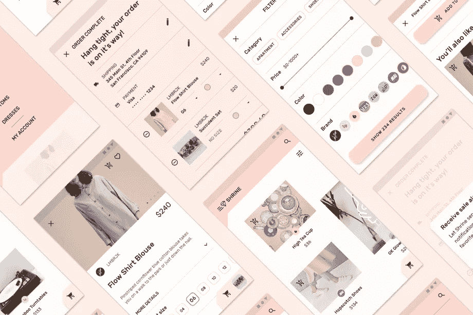
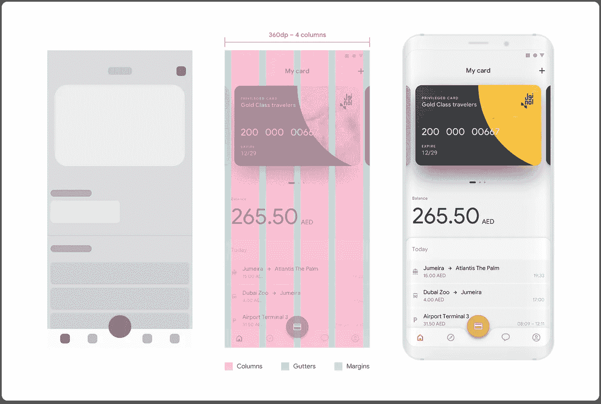

# 安卓什么时候开始比较好？

> 原文：<https://medium.com/swlh/when-android-is-better-way-to-start-a31767559d69>

选择第一个移动平台来开发应用程序可能会很复杂。对于创业公司和资源有限的小公司尤其公平。这里的问题与其说是开发成本，不如说是营销、进一步改进和支持应用程序的成本。

表面上的混合应用程序解决方案似乎是好的。混合应用程序可以在两个平台上即时发布，但这只是硬币的一面。这种方法简化了应用程序的开发，但另一方面，从长远来看，营销、支持和应用程序改进变得更加复杂。

在 BraveGeeks，我们不喜欢这样的方法。面对每个平台的混合或原生应用之间的选择，我们肯定会选择第二个选项。背后的原因，Lunabee 工作室[的伙计们在这里](/lunabee-studio/why-hybrid-apps-are-crap-6f827a42f549)描述的很好。

当谈到在移动平台上发布应用程序时，许多公司会不假思索地首先选择 iOS。美国和欧洲的技术专家喜欢苹果产品。他们中的大多数人使用苹果产品，所以他们更有可能认为其他人也更喜欢苹果产品。然而，让我们检查一下这个假设是否正确。

# 市场占有率

让我们从比较 iOS 和 Android 在世界不同地区的市场份额开始。Statcounter 公布了 iOS 和 Android 在美国、南美、欧洲等市场份额的公开数据。

Source: [http://gs.statcounter.com/](http://gs.statcounter.com/)

根据这一数据，在美国以外的任何地方，Android 都比 iOS 普及得多。此外，即使在美国，Android 也拥有更大的市场份额，尽管差距并不明显。

让我们不要深入探究其背后的原因。在为你的应用程序定义可服务的可获得市场(SAM)规模时，只需考虑这些数据。简而言之:在 Android 主导市场的地区，专注于将 iOS 作为主要平台，很可能会导致赔钱而不是赚钱。

# 支付能力和用户获取成本

通常，另一个重要指标是用户的支付能力。在这里，iOS 将 Android 抛在了身后。根据 LIFTOFF 报告 [2018 移动应用参与指数](https://info.liftoff.io/2018-app-engagement-index/)，iOS 用户购买应用的可能性(6.3%)是 Android 用户的两倍(2.5%)。

请记住，Android 用户更有可能注册该应用程序，比例为 45.5%，比 iOS 高出 20.9%。

在用户获取成本上也是如此。

别忘了，平均而言，iPhone 用户比 Android 用户花费更多。Wolfgang Digital [research](https://moz.com/blog/apple-vs-android-aov) 显示，Android 用户每笔交易花费 11.54 美元。另一方面，iPhone 用户花费高达 32.94 美元。

Source: LIFTOFF, [2018 Mobile App Engagement Index](https://info.liftoff.io/2018-app-engagement-index/)

更容易获得安卓用户的信任。然而，在实际购买时，Android 用户变得更加挑剔，不会花太多钱。如果应用程序不是免费的，或者盈利策略意味着应用程序内购买，这可能会导致问题。然而，Android 将非常适合与广告合作的项目，或者遵循基于佣金或其他盈利策略。

不要将这些数据视为你未来应用的精确指标:它可以帮助你定义营销投资回报(ROMI)的假设，但特定应用的真实指标总是不同的，取决于市场、应用本身、营销渠道等。

# 设计和指南

Google play 上有许多应用程序的开发缺乏必要的精确性:它们没有经过深思熟虑，也没有遵循任何指导原则。然而，在过去几年里，这一问题发生了重大变化。2014 年的标志是谷歌展示了在 2018 年得到显著改进的材料设计。谷歌最近也开始更新自己的官方应用。

Image: [https://material.io/design/material-studies/shrine.htm](https://material.io/design/material-studies/shrine.htm)

第三方开发者也在利用发布的 [**指南**](https://material.io/design/) 逐步完善自己的应用。它结构良好，包含范例和最佳做法。

为了帮助设计师，谷歌最近推出了 [**主题编辑器**](https://material.io/tools/theme-editor/)——一种根据材料设计指南对设计库进行操作的工具。它有助于自动更改所有标准材料组件。这就创建了一个完全遵循指南的定制 UI 工具包。

Source: [https://material.io/tools/theme-editor/](https://material.io/tools/theme-editor/)

在 BraveGeeks，我们最近使用主题编辑器和最新的(当时我们正在开发)指南重新设计了一个用于公共交通的 Android 应用程序。我们对谷歌最近的所作所为感到高兴。

Please see original [UX\UI case study](https://uxplanet.org/ux-ui-case-study-redesigning-a-public-transportation-app-for-a-large-touristic-city-932a2157fa21) if you need some details

# 发展

许多开发人员确信，为 Android 编程简直太可怕了。事实上，仅仅在 5 年前，Android 的开发还是相当复杂的。然而，最近发生了很多变化:为开发人员引入了许多工具，库变得更便于使用，文档变得更加清晰。

2014 年，谷歌推出了基于 IntelliJ IDEA 软件的安卓工作室 。这个 IDE 好看，运行快，而且是免费的。它可以在 Windows、MacOS 和 Linux 上使用，不像 Xcode 只能在 MacOS 上使用。此外，Android Studio 支持 Kotlin(我们喜欢它！).

Android Studio interface

[**Android 支持库**](https://developer.android.com/topic/libraries/support-library/) 满足开发者对界面基本元素和组件的主要需求，并帮助支持向后兼容性(Android 开发者面临的主要挑战之一)。2018 年，这个库被重命名为 AndroidX，并成为 Jetpack 的一部分，Jetpack 是开发人员快速入门的一组组件。

文档也得到了改进:它变得更加详细和结构良好。甚至[代码样本](https://developer.android.com/samples/)和[最佳实践](https://developer.android.com/guide/)都可以在那里找到。

谷歌还在开发并不断改进一个名为 [**Firebase**](https://firebase.google.com/) 的云平台，帮助在 Android 上发布产品。Firebase 获得了许多不同的功能，从推送通知到数据库云托管和机器学习 API。

# 分配

标准的 Android 应用分发方式是 Google Play。2018 年，它在设计和架构方面都有了显著改善。谷歌改善了市场的 UX，开发者获得了一种新的发布应用的格式，称为 Android 应用捆绑包。你可以在这篇[文章](/googleplaydev/what-a-new-publishing-format-means-for-the-future-of-android-2e34981793a)中了解更多。

总的来说，Google Play 在下载应用的数量上迅速扩张。2016 年，下载量增长了 15%，达到 750 亿次，而同年 App Store 的下载量略高于 250 亿次。

Graph: App Annie, [http://go.appannie.com/app-annie-2016-retrospective](http://go.appannie.com/app-annie-2016-retrospective)

安卓应用的分发还有其他市场。例如，亚马逊和三星有自己的商店，也有其他商店。

此外，Android 应用程序有可能直接共享 apk 文件，尽管这对用户来说不太方便。

# 最后

应用程序第一平台的选择取决于可用资源、应用程序类型、盈利模式和期望的分销市场。

美国市场肯定需要发布 iOS 应用程序，因为苹果产品在那里非常受欢迎，他们的用户有最高的支付能力。如果产品主要集中在欧洲、印度或全球市场，首先考虑在 Android 上发布是有意义的。尤其是如果应用程序是免费的，没有直接货币化。

Android 平台被严重低估，因此为其发布应用可能会成为一种竞争优势:获取用户的成本更低，而且由于谷歌最近实施的变革，应用可以快速轻松地开发出来。

你觉得这篇文章怎么样？请在下面的评论区分享您的反馈。我们很乐意讨论您的想法和想法！

## 这篇文章发表在[《创业](https://medium.com/swlh)》上，这是 Medium 最大的创业刊物，有+395，714 人关注。

## 订阅接收[我们的头条新闻](http://growthsupply.com/the-startup-newsletter/)。

