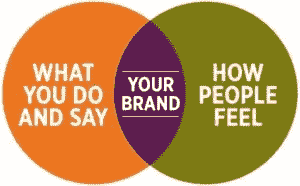
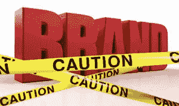

# 当“品牌”是一个肮脏的词

> 原文：<https://medium.com/swlh/when-branding-is-a-dirty-word-ef1aae19c990>

我一直对讲故事很着迷。任何认识我的人都会告诉你，我是一个如饥似渴的读者，我甚至会为自己定期观看《单身汉》系列进行辩护，坚称我对该剧创造的关于爱情和婚姻的叙事很感兴趣(这是真的……我发誓)。我相信品牌就是讲述故事，正确的故事为人们提供意义和联系。商业天才塞思·戈丁(Seth Godin)是我很多灵感的来源，[将品牌定义为](http://sethgodin.typepad.com/seths_blog/2009/12/define-brand.html)“*一系列的期望、记忆、故事和关系，这些加在一起，解释了消费者选择一种产品或服务而不是另一种的决定。”*本质上，品牌有助于消费者理解他们的选择，并理解一个组织/产品/服务提供的价值。

我进入教育界时，对为资源不足的组织使用品牌原则感到兴奋。毕竟，如果所有学校或非营利组织都有引人注目的、以用户为中心的品牌故事，那么它们就能够吸引所需的资金、客户和合作伙伴来完成让世界变得更美好的重要工作。我以为其他人会和我一样兴奋。我错了。在教育领域，就像在许多非盈利领域一样，“品牌”通常被认为是一个肮脏的字眼。

经过多次交谈和两年的课堂教学(尽可能远离私营部门)，我对这一现象形成了自己的假设。公共部门的组织天生受使命驱动。他们的最终目的，不像 T4 的任何营利性组织，不是为了赚钱(尽管他们确实需要钱来完成他们的使命)。营利性组织通常使用的语言和策略可能会让人觉得不对，这与使命驱动的文化背道而驰；他们觉得*基于贪婪*而不是*基于需求*。令人担忧的是，企业利益将凌驾于使命之上，并将优先事项从完成使命转移到中饱私囊。

这里还有一个文化挑战。作为一名任课教师，我从未感到自己与一个比自己更伟大的目标有如此紧密的联系。教书真的真的很难。在一个资源不足的学校教书真的真的很难。在充满挑战的条件下工作有一种统一性，因为你在努力做一些感觉很重要的事情。简单地说，这比我做过的其他事情都重要。不要误会我；我不认为一个人必须为微薄的收入工作，或者只在公共部门工作才能产生有意义的影响。我只是认为，这种类型的工作很容易产生一种“我们对他们”的心态，你如此专注于你所做的工作，以至于你(有意或无意地)对其他一切都不屑一顾。直到我离开教室，我才发现我在那种心态中变得多么沉迷。作为一名训练有素的战略家，我开始理解这种理想的冲突从何而来，以及为什么对私营部门之外的人来说，品牌可能会感觉如此恶心。

这是我的诊断。那么治疗方案是什么？这对我来说是一个相关的问题，因为这是我做的工作:使用品牌战略和设计思维来帮助教育机构和非营利组织完成他们的使命。以学校为例。一个学校就是一个品牌。不管喜欢与否，学校在市场上竞争学生(是的，甚至公立学校)，有多个利益相关者(学生/教职员工/家庭等)。)，并且有鲜明的价值主张。为了实现其目的，学校必须明确其品牌:我们的目的是什么，为什么与我们的目标学生群相关，以及我们如何才能有意义地传播我们的故事？

当我想出如何联合这些世界并为我的客户创造价值时，这里有一些我正在使用的路标:

1.  **听并适应。**作为一名顾问，很容易进入一个拥有闪亮的、完全成熟的流程的组织，并热情地向任何愿意倾听的人吹嘘它。更难的是真正倾听你的客户和他们所面临的挑战，并接受你的过程需要适应，被分离，并调整以适应他们——而不是相反。
2.  **理解他们的语言。我当任课老师的第一周过半时，我的合作老师克里斯托对我说:“阿什莉，我真的不明白你到底在说什么。你能不能放下行话，像人一样跟我说话？”这对我来说是一个非常重要的教训。没有什么比像营销机器一样被人说得不屑一顾更让人不屑一顾了，也没有什么比听到想法被翻译成你日常生活中的语言更让人充满力量了。如果你和教育者谈论品牌，使用他们的语言。找出相关的例子。让它有意义。**
3.  深究糟糕的人际关系。大多数非营利组织都有过与私营部门打交道的糟糕经历，无论是咨询公司在 PD 期间介入并向他们推销某个流程，结果却再也没有人见过它；一个“战略合作伙伴”,不采访员工就向领导层做大量汇报；或者董事会的行为似乎直接违背了组织的价值观。问问你的客户这些糟糕的关系。你越了解商业行为的阻力来自哪里，你就越有同理心，你就越能体贴地与你的客户交流。
4.  **把工作和目的联系起来。**伟大的品牌会带来增长，这一点没有错，这可以用从获得客户到不折不扣的收入来定义。但是，当你与一个资源不足的组织交谈时，这还不够强大。最终目标是利用这种增长来推动这项任务。更多的收入将如何帮助您的客户更广泛地提供服务？它将如何帮助他们创造新的服务？这些是你需要明确的联系，这样商业的东西也有意义。

品牌有时可能是一个肮脏的词，但它在这个世界需要的使命驱动型组织的增长和可持续性中占有重要地位。我们只需要稍微清理一下，刷掉它，然后，嗯，重新贴牌。

## 这篇文章发表在[《创业](https://medium.com/swlh)》上，这是 Medium 最大的创业刊物，有 290，182+人关注。

## 在这里订阅接收[我们的头条新闻](http://growthsupply.com/the-startup-newsletter/)。

