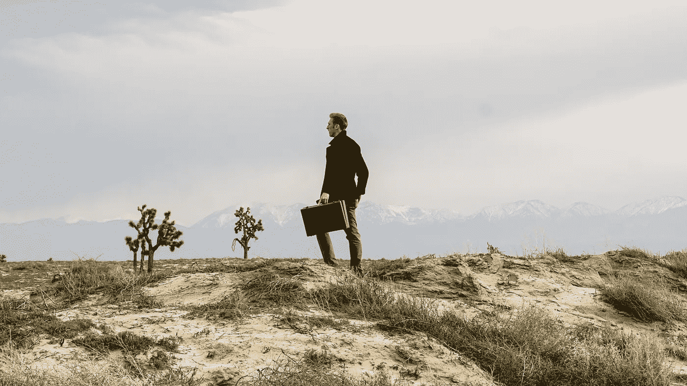

# 我们什么时候才能开始新的生活？

> 原文：<https://medium.com/swlh/when-can-we-just-move-on-bb46a972be85>

## 辨别生活的曲线球。

Photo by [Fredrick Kearney Jr](https://unsplash.com/photos/7F_FcLhrsds?utm_source=unsplash&utm_medium=referral&utm_content=creditCopyText) on [Unsplash](https://unsplash.com/search/photos/move-on?utm_source=unsplash&utm_medium=referral&utm_content=creditCopyText)

我个人认为，从一件事情上继续前进和继续克服逆境需要同样多的力量。得出这个结论并不容易。它往往意味着我们已经达到了我们的门槛，有些人认为这相当于“放弃”。

我向你保证——不是的。因为事情变得困难而放弃和因为你不再拥有继续前进的手段，或者变得不健康，或者只是时间继续前进，这两者之间有着天壤之别。不管是什么情况，在第二种情况下，你不仅仅是因为反对而放弃。所以，问题变成了，什么时候可以继续生活？什么时候我们才能继续前进而不被贴上“放弃者”的标签。

无论我们谈论的是梦想、目标、工作还是关系，这都无关紧要。这可以适用于广泛的主题，因为我们真的需要区分前进和放弃。我相信，能够接受我们已经做出的决定，并对这些决定充满信心，这对我们来说至关重要。

感觉自己放弃了一些原本对你个人发展有益的东西，是一种很糟糕的感觉。想到你没有给自己一个公平的机会去完成某件事，真是糟糕透了。

很有可能，有些事情你已经从过去的阴影中走了出来，也许还带着一点遗憾。没关系。重要的是认识到为什么后悔存在。你能更努力吗？还是你付出了所有？现实吗？或者这是你编造的童话故事？

你看，需要成为焦点的重要特征是，你是否能用你手头的欲望和资源做更多的事情。为了确定这一点，有几个重要的问题需要回答。

## 继续前进会对你的心理健康有益吗？

实际上，这个问题是我们应该经常问自己的。几乎在我们做的任何事情中，如果我们不能照顾好自己，我们就不能照顾别人。

为了让我们的车带我们去我们需要去的地方，它必须有一个足够的发动机，可能是一些好的轮胎，可能是换油，当然，它需要燃料。

如果我们不能再给自己“加油”，那么我们将一事无成。如果你发现自己每天一整天都在工作中筋疲力尽，你在决定是否应该继续前进，那么你来到这个十字路口可能有一个很好的原因。长时间呆在这个地方会对你的自尊、人际关系和整体欲望产生负面影响。

如果你一直在考虑离开某件事，问问自己这个问题。你可能会发现，你对自己的了解比你最初预想的要多。也许有更深层次的东西让你质疑自己是否准备好继续前进。总而言之，在做出这样的举动之前，你需要确保你在精神上拥有你需要的工具。

## 你的亲人支持你继续生活吗？

这个问题极其重要，要问自己。每个人都需要自然的支持。我以前说过——我们不应该独自生活。你最亲近的人在给你建议的时候都会把你的最佳利益放在心上，尤其是在关键时刻。因为这个原因，当你试图辨别是否是时候继续前进时，得到他们的支持是非常重要的。

通过解决这个问题，你从等式中消除了自己的情绪。做出情绪化的决定并不总是一件坏事，情绪当然是有益的，但在做出关键决定时，你需要能够控制一些情绪。在别人的帮助下，你能够完成这件事。在你需要做出重大改变的时候，你最亲密的朋友和家人会一直在你身边。

如果你所爱的人不支持你对这种改变的渴望或继续前进的动力，你可能需要重新评估一下。这并不完全意味着你不应该继续前进，但当你爱的人不同意你的想法时，这就很说明问题了。有时候，与你爱的人进行一次对话可能是你重新调整思维的全部需要。

## 这需要立即发生吗？

这是一个同样重要的问题，值得花时间去考虑。决定这个重大决定是否可以等待的原因很重要，原因很简单，有时我们需要的只是一点时间，以便智慧给情况带来光明。

慢慢来也能让你在做出如此有影响力的改变之前清除掉所有的情绪。如果转会不需要马上发生，那么我会鼓励你慢慢来。诚然，有时某些变化比其他变化更具时效性，但如果是需要考虑和思考的事情，慢慢来可能是你最好的选择。

当我们遇到促使我们行动的情况时，问自己一些关键问题可能是做出正确决定的第一步。我想我们经常做最坏的打算，对吗？我们认为，如果我们做出一个决定而不是另一个决定，这将永远决定我们生活的方向，但事实未必如此，不是吗？通常在未来会有其他的机会出现，而我们会陷入另一个关键的决定——搬家还是不搬家。

我记得听到一句名言，当我感觉需要做出“危机”决定时，我经常会产生共鸣——“没有什么事情像它看起来那样好或那样坏”。继续做出你认为合适的改变。毕竟这是你的生活。只要你有支持，你会慢慢来，你会确保一路上照顾好自己，我想一切都会好的。

## 在这里找到更多我的故事。你也可以关注我的[推特](https://twitter.com/Eturn102)。谢谢你让我开心！

## 如果你喜欢这个故事，请点击👏按钮并分享，帮助其他人找到它！欢迎在下方留言评论。

## 这篇文章发表在《T4》杂志《创业》(The Startup)上，这是 Medium 最大的创业刊物，拥有 333，253+读者。

## 在这里订阅接收[我们的头条新闻](http://growthsupply.com/the-startup-newsletter/)。

