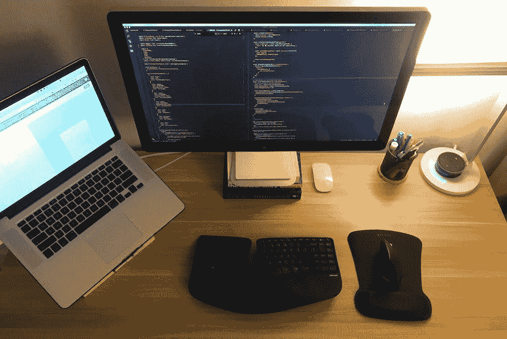
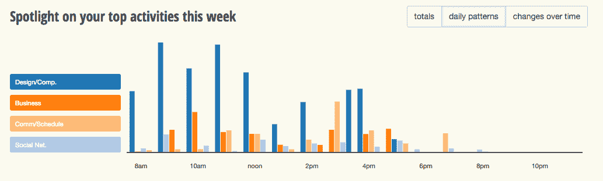

# 你应该(确切地)在什么时候做专注的工作？

> 原文：<https://medium.com/swlh/when-exactly-should-you-be-doing-focused-work-5fa2d3cbba84>

## 这位 AirBnB 开发者是如何发现深度专注的最佳时间的

告诉我这听起来是否熟悉。你花时间做你的“常规工作”，打卡下班，回家，然后开始做别的事情。也许你称之为侧滑。或者是爱好。不管是什么，对你来说都很重要。

但是很有可能你没有在这上面花足够的时间。

对于设计师、开发人员和作家[乔纳森·怀特](https://twitter.com/JonathanZWhite)，这个确切的场景一直是一个持续的斗争。在 AirBnB 做开发人员的日子里，在兼职项目、[论文](/@jonathanzwhite)和设计的“空闲”时间里，Jonathan 发现自己工作的时间越来越长。但是没有看到他期望的结果。

这是一个我们都知道的故事。你想要达到你所有的目标，做有意义的工作，并日夜感觉富有成效。唯一的方法似乎就是投入更多的时间。

但是有更好的方法。

**在这次采访中，Jonathan 解释了他是如何将心态从努力转变为结果，通过减少工作时间变得更有效率，以及发现一天中专注工作的最佳时间的过程。**

# 将你的心态从花费时间转变为明智地花费时间

乔纳森在世界上最大的科技公司之一工作，每天都有相当一部分时间被占用。然而，这并不能阻止他追求工作之外的项目。但是把这么多放在自己的盘子里开始产生影响。

“我去上班，然后回家，一直工作到半夜，”他解释道。“虽然我觉得自己正在取得进步，因为我有更多的绝对时间来工作，但随之而来的是严重的精神和身体伤害。”

乔纳森说，在这个计划实施几个月后，他开始一直感到疲劳。他变得喜怒无常。他不能分清目标的轻重缓急。最糟糕的是，他失去了创造力。简而言之，他开始感受到职业倦怠的影响。

> “我意识到，如果你的注意力不集中了，你还有多少时间都没用。所以我开始寻找更好的方法。”

他的寻找让他找到了一个老朋友。他们俩同时毕业，做着相似的工作，但他的朋友似乎总是满负荷工作。他的诡计？一贯的就寝时间。

“这看起来太基础了，但是一旦我开始制定每天晚上在同一时间睡觉的时间表，并且连续睡 8 个小时，我就开始看到效果了。突然间，感觉面纱被揭开了。”

> “虽然我的绝对时间减少了，但我有更多的时间专注于工作。”

# 为什么你需要关注你的输入，而不是你的输出

所有这些都让乔纳森想起了他听过 AirBnB 创始人布莱恩·切斯基谈论的一些事情。

“基本上，Brian 解释了在亚马逊，他们如何针对个人输入进行优化，而不是试图优化来实现他们的目标。”

这意味着生活的基本要素——水、食物、住所、睡眠。随着我们的工作变得越来越复杂，要求越来越高，这些基本原则通常是最先被抛弃的。比起睡觉或锻炼，我们更重视工作。吃快速，含糖的食物，而不是营养餐和大量的水。但是，据乔纳森说，这是一个危险的交易。

“当你专注于这些单独的输入时，这就是输出的来源——比如认知表现、专注能力和创造力，”他解释道。

> *“你对最有效率的人了解得越多，你就越会意识到他们不只是努力工作，而是从优化他们每天做的小事开始。”*

# 个人数据如何让你优化工作

像这样的输入优化是很难的，因为我们很少有人真正跟踪它们。我们不会像追踪项目或工作时间那样追踪水、食物或睡眠。但是，如果没有对我们的努力的准确反馈，就不可能看到您需要改进的地方。

“这就是我认为量化的自我数据非常重要的地方，”乔纳森解释道。“我用 Fitbit 追踪睡眠，用体重秤追踪食物。我有各种不同的方法来量化我的投入。没有它们，你会有一种“哦，我睡了这么多”的感觉。哦，我大概吃了这么多。哦，我大概喝了这么多，但你没有办法优化，因为你无法达到某种程度的一致性。”

诸如此类的假设使得我们难以实现自己的个人目标。你没有理解影响你产出的所有输入(并为它们进行优化)，你只是说你“足够接近”了，而没有投入工作去真正理解是什么让你拥有美好的一天。

# 发现专注工作的最佳时间

我们做的很多事情都是由习惯、情绪和其他我们无法控制的因素驱动的。因此，能够跟踪我们实际在做的事情，并将其与我们的意图(我们*希望*正在做的事情)相匹配，是每天都变得更好的强大工具。

为了追踪他是如何度过时间的，乔纳森使用了[重新安排的时间](https://www.rescuetime.com/)不仅可以准确地看到他的时间去了哪里，还可以确定*什么时候*他最有可能把工作做得最好。

> *“我喜欢每隔几天查看一次 RescueTime，因为对我来说，最重要的是查看一段时间内的历史数据。通过这种方式，我可以识别出我仅仅通过日常观察无法识别的趋势。”*

一个很快变得明显的趋势是**他在晚上某个时间点之后看到了工作时间的负回报。**

“当我第一次开始跟踪我如何使用 RescueTime 度过时间时，我关注的是数量。我会连续看 10、12、13 个小时，然后说‘这太棒了！’但是随着时间的推移，你会开始意识到那些长时间的连胜并不一定是有成效的。"

“例如，我注意到，虽然我完成了相当多的工作，但为了完成这些目标，我会比平时熬夜。听起来不错。但是在晚上晚些时候，我发现我的注意力正在急剧下降。我会上推特或者浏览黑客新闻之类的东西。”

> *“知道让我选择早点睡觉，而不是违背我的注意力和不明智地使用我的时间。”*

# 如何为深度工作挤出一致的时间

乔纳森从他的休息时间数据中获得的另一个强有力的见解是了解他最有可能在什么时候做有成效的、专注的工作。在一段历史时期内，观察他一天中的生产力脉动，让他优化他的一天，在他最可能集中注意力的时候做他最重要的工作。

“我已经开始关注质量，关注深度工作。“在这个注意力分散的时代，能够长时间专注于一项任务是一种竞争优势，很少有人能做到。”

为了找到专注的时间，乔纳森使用了一些方法:

# 首先，从你的环境中去除干扰

“我开始意识到我花在手机上的时间多得吓人。不仅仅是当我坐在电梯里或者类似的时候。”

“当我在工作中遇到问题时，我会开始滚动浏览。我的手机成了我不舒服时的默认设置。”

对乔纳森来说，解决办法是完全的物理隔离。现在，当他工作时，他会把手机放在另一个房间，只把对他来说重要的东西放在面前。

# 第二，把你的重要工作和你最有效率的时间结合起来

为了更好地在工作中找到心流，乔纳森使用他的休息时间数据来找到他最有效率的时间，并根据这些时间调整他的工作。

实际上，这意味着早上第一件事就是划出两个小时的时间做兼职项目，而不是在一整天的工作之后才做。

# 最后，把大项目分成你能在一天内完成的小部分

即使乔纳森没有分心，并且在最佳时间工作，他有时仍会感到停滞不前。

“在这种情况下，我会做两件事。要么就此停止工作，我去休息一下，要么我专注于一个非常小的任务，比如我设计了一个对页面其余部分有贡献的小组件。完成这个小任务就像打开了页面的其他部分。”

“说到兼职项目，当你有如此有限的时间来做这件事时，每天都要把事情分成小部分来完成，真的会随着时间的推移而变得复杂。就像那句老话，“你高估了你一周能完成的事情，但你真的低估了你一年能完成的事情。”"

# 生产力比你在工作时间所做的事情更有深度

“优化并不来自于你工作时的所有策略。乔纳森解释说:“很多都来自于你不工作时所做的事情。

> “一旦你有了充足的睡眠或开始足够的锻炼，你就可以将这些因素作为变量移除，并开始寻找其他让你慢下来或阻碍你的因素。”

对于我们中的许多人来说，很难忽略我们每天做的紧急工作，并问什么不仅能让我们更有效率，而且更快乐，压力更小。但是，如果不先确定，然后优化基础，我们将会陷入追逐更长时间的困境，找不到最佳的工作时间。

查看乔纳森在媒体上写的或[在推特上关注他](https://twitter.com/JonathanZWhite)了解更多。

# 嘿，我是乔里！

我帮助公司和有趣的人通过巧妙而集中的写作讲述他们的故事。想一起工作吗？给我发邮件到 hello@jorymackay.com

*这篇文章的一个版本最初发表在* [*RescueTime 博客*](https://blog.rescuetime.com/jonathan-white-deep-work/) *。查看更多关于生产力、专注和动力的文章。*

## 这个故事发表在 [The Startup](https://medium.com/swlh) 上，这是 Medium 最大的创业刊物，拥有 299，352+人关注。

## 在这里订阅接收[我们的头条新闻](http://growthsupply.com/the-startup-newsletter/)。

