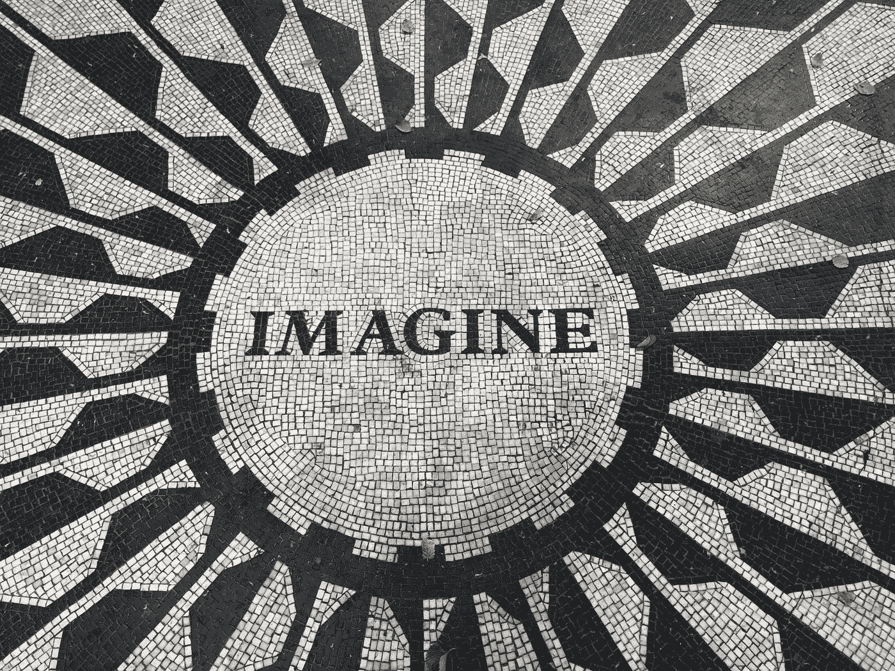

# 当“我不知道”是最佳答案时

> 原文：<https://medium.com/swlh/when-i-dont-know-is-the-best-answer-c9d460c32e8>

## 为什么不知道可能是一件大事的开始

[Source](http://"imagine text" by Jeremy Beck on Unsplash)

我们很聪明。我们是有创造力的，我们喜欢认为我们至少能在一定程度上掌控自己的命运。当然，这种控制实际上是一种错觉，但我们将在另一个时间讨论这个问题。

但是**我们喜欢认为我们知道事情。**尤其是当我们稍微长大一点的时候。多加几年寿命…