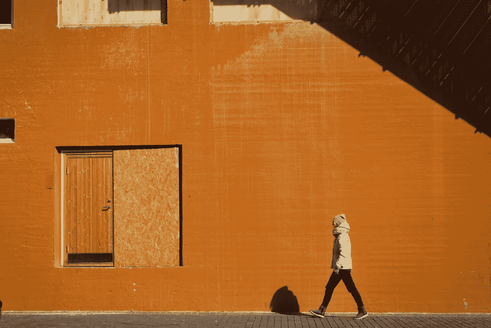

# 当有疑问时，出去

> 原文：<https://medium.com/swlh/when-in-doubt-go-out-dadc8cdaebc6>

Photo by [Tatiana Diakova](https://unsplash.com/photos/k_NkqIaRhro?utm_source=unsplash&utm_medium=referral&utm_content=creditCopyText) on [Unsplash](https://unsplash.com/?utm_source=unsplash&utm_medium=referral&utm_content=creditCopyText)

## 帮助你远离对自己和工作的怀疑的心智模型

在上周的帖子中，我谈到了自我损耗以及如何管理你的能量状态来帮助你做出更好的选择。这篇文章会讲到我的另一个“心智模型”，具体来说就是如何在你的工作中避免疑惑。

2016 年，我独自工作了一段时间，建立了一个关于如何更有效、更轻松地交流复杂话题的规则系统。我没有完全达到我的目标，现在我可以比几个月前更自由地承认这一点。但是我花了很多时间分析什么可行，什么不可行，以及当我再次做自由职业者时如何避免陷入某些陷阱。

我在家庭办公室工作，虽然我有机会出去，但我不敢离开我的电脑，因为我“必须在那里工作”

这实际上导致我在室内呆了很长时间，强迫自己保持专注。

正如你可能猜到的，结果并不太好。

**强迫自己遵守纪律，盯着空白的屏幕或一张纸很少是达到目标的最佳方式。**

我也有很多容易分心的事情。

**网飞就在一个浏览器标签之外，Steam 就在后台运行，脸书，Reddit，一切都唾手可得。**

由于我缺乏明确的目标和达到目标的明确方法(或者至少是正确的方向)，我没有真正取得任何进展。我拖延了。我怀疑这个项目。

对于 2018 年，我知道如果我试图在同样的环境，同样的衣服，同样的干扰下独自工作，即使我想做得更多，我也会陷入负面行为。这就是我设定新的“心智模式”作为工作指南的原因。其中一个简单地叫做“当有疑问时，出去。”

也就是说，如果我发现自己被困住了，变得心烦意乱，呆在室内太久，工作毫无进展，我会强迫自己出去。

这可能是一次简单的散步来理清思绪，也可能是去镇上另一个环境工作，得到不同的输入。

怀疑我自己和我的工作是一种消极的思维模式——在一个已经潜在的分心环境中，它会导致对我所做的事情更多的消极。

现在，当我有疑问时，我会出去——去别的地方，和人们聊聊天，散散步，给朋友打个电话叙叙旧。

犒劳一下自己，喝杯好咖啡或类似的积极体验。疑虑会消失，我会带着全新的思维和全新的眼光回到工作中。

而且不仅仅是“休息一下”。你也可以选择改变你的工作环境，也许去一家咖啡店(一家潮人密度低的咖啡店)，在纸上工作一段时间。

随着我收集更多关于心智模型的材料，我对环境如何塑造我的工作方式有了一些有趣的想法，我想在以后更深入地探讨这个话题。

## 这篇文章发表在[《创业](https://medium.com/swlh)》上，这是 Medium 最大的创业刊物，有 283，454+人关注。

## 订阅接收[我们的头条新闻](http://growthsupply.com/the-startup-newsletter/)。

