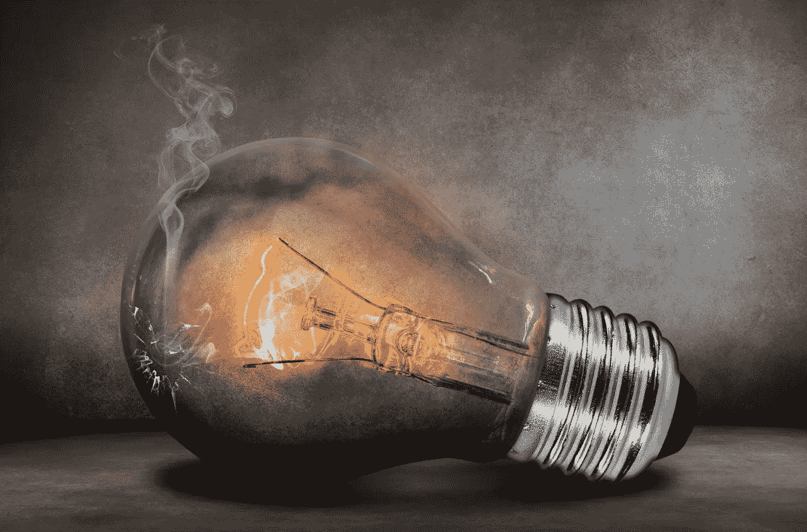

# 什么时候该退出？

> 原文：<https://medium.com/swlh/when-is-it-time-to-quit-26e6e4c43976>

Burned Out… (Credit: Pixabay.com)

最近，我写了很多关于戒烟的话题。我已经分享了为什么我通常不喜欢考虑它作为一个可行的选择。

我已经对处理困难和困苦的最佳方法给予了肯定，并分享了我对将障碍视为学习机会而不是阻碍我们进步的障碍的看法。我坚决主张在不懈追求成功的过程中致力于过程和应用纪律…