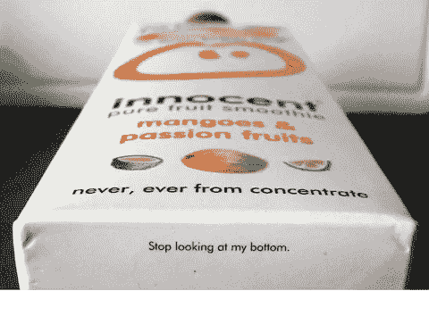
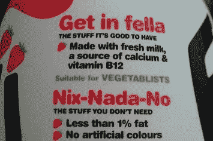
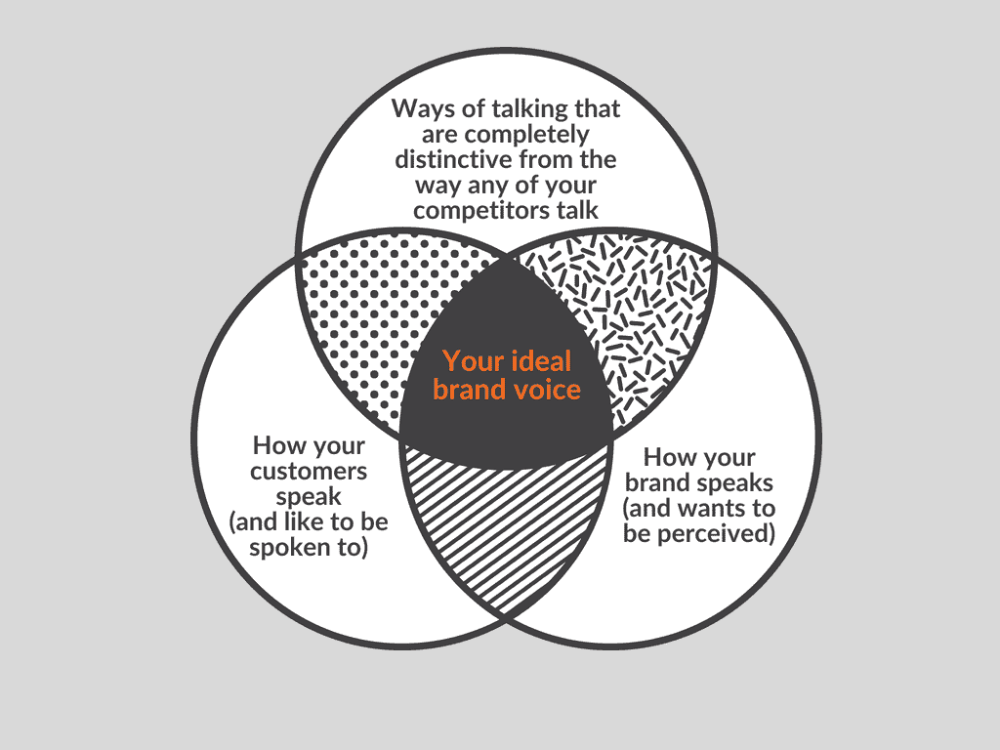
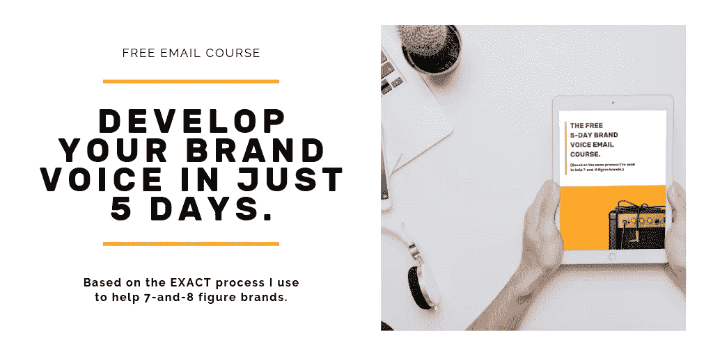

# 当涉及到你的品牌声音时，友好、有趣和有点古怪不再合适了。

> 原文：<https://medium.com/swlh/when-it-comes-to-your-brand-voice-being-friendly-funny-and-bit-quirky-just-doesnt-cut-it-ff4985bb0c96>

当我在思考品牌声音的初始阶段与企业交谈时，我经常听到这样的话:“我们希望听起来友好、平易近人”或“我们只是希望我们的声音有趣或古怪”。

(旁注:在我做文案的日子里，几乎我接触过的每个客户都想要一种‘有趣而友好’的语气。)

不要误解我的意思，这些东西是 ***伟大的*** 作为品牌声音开发过程的起点，但它们远远不足以开发出独特的、吸引客户的声音。

(尤其是当越来越多的品牌开始发展自己独特的品牌声音，而不仅仅是滑稽和友好的时候。)

# **为什么“有趣、友好和古怪”已经不够好了。**

几年前，一个有趣、友好和古怪的声音曾经足以让你从众多制作无聊、做作和僵硬的企业文案的品牌中脱颖而出。

它过去常说‘我们是由真实的人经营的真实的品牌。我们不会把自己看得太重。

**早早地跳上潮流，无辜的人像狗娘养的一样利用这一点。**

他们制作的每样东西都友好、有趣、古怪，而且与众不同，因为它与众不同。结果，销售额飙升，品牌价值扶摇直上，品牌越来越强大。

The copy that launched a thousand shit imitations…

但随后，当然，出现了一大群古怪的无辜山寨品牌的声音。

突然间，从你的电子邮件提供商到你的报纸，所有的东西都想成为你古怪的最佳伴侣。(在英国，这种趋势甚至有了自己的名字——[wacking](https://www.theguardian.com/lifeandstyle/wordofmouth/2014/mar/25/wackaging-trend-food-packaging-innocent-language)。)

这里有一个特别惊人的例子。在某个地方，有人看着甜甜的奶昔说“如果它能说话，听起来就像丹尼·戴尔”…

The absolute state of this.

(值得注意的是，虽然古怪的声音正在慢慢演变为工匠品牌的声音——一切都是“手工制作”和“精心琢磨”——但机制仍然是一样的；一种友好、幽默的语调，用工匠的话语取代了古怪的旁白。此外，货架上仍然有太多古怪的东西，我们无法宣布这种趋势已经死亡。)

因此，随着越来越多的品牌发展出自己的品牌声音，对话式文案越来越成为常态，有趣、友好和古怪不再是区分因素。

事实上，它们正迅速变得过时。

在对公司废话和商业用语的强烈反对中，滑稽和古怪已经成为新的常态。品牌这样说并不是因为它是品牌的、真实的或适合他们的客户，他们这样做是因为这是应该做的事情。

## 换句话说，一个“友好而有趣”的品牌声音不再让你脱颖而出，而是让你融入其中。

(顺便提一句，[的一项研究](https://www.warc.com/newsandopinion/news/brands_lack_a_distinctive_voice/32931)发现，品牌使用的所有语言中有 54%是通用的，品牌在表达与竞争对手相同的内容上投入更多，而不是试图表达独特的东西。这不是很疯狂吗？企业正在花费大量的金钱来融入*。*)

# 但是还有另一个问题。

事实上，几乎每个品牌都想让自己听起来友好、平易近人(你知道有哪家企业想让自己听起来敌对、冷漠吗？)，这两个术语是如此宽泛，以至于在现实世界中应用它们时几乎完全没有用。

“友好、有趣、有点古怪”在理论上听起来可能是品牌声音的一个好方向，但它在实践中是如何运作的呢？

你想要像最好的朋友一样友好还是像牙科接待员一样友好？你想以一种让人感到安全和放松的方式表示友好，还是一种让人想和你一起喝杯啤酒的方式？

说你想变得有趣，有点有趣？嗯，那完全是另一回事，我的朋友。

有趣和古怪是如此令人难以置信的主观和宽泛的术语，以至于它们几乎不可能被一致地应用。(在与客户沟通时，一致性是关键。)

你品牌的幽默感是英式的、美式的、超现实的、日常的、爸爸式的、开玩笑的、讽刺的、黑暗的、尖锐的还是自嘲的？其中两三种的微妙混合？

你说的古怪是什么意思？有多奇怪？大卫·鲍依式的古怪，杰夫·高布伦式的古怪，还是佐伊·丹斯切尔式的古怪？

Ha! So “quirky” and “random”.

在没有明确说明他们希望如何变得有趣和古怪的情况下，品牌往往下意识地(或有意识地)模仿其他品牌做得好的方式(可爱的旁白，连续几天的双关语，以及偶尔爆发的安全的超现实主义)，而没有考虑这是否适合他们的品牌或他们的目标受众。

# **“有趣、友好、有点古怪”适合你的观众吗？**

当然，友好、有趣和古怪的声音对一些品牌来说非常有效。

如果你能找到一种不同于任何其他品牌(尤其是你的竞争对手)的方式来使用这种语气，那么你很可能会注意到你的参与度和品牌认知度有所提高。

## **然而，停下来思考“有趣和友好”是否适合你的品牌和目标市场也很重要。**

在一项关于品牌声音如何与顾客对品牌的感知相关的研究中，朱迪·林德发现，虽然许多品牌受益于使用更个人化、更清晰和更非正式的语言，但有时品牌最好保持更正式一点。

在得到一个政府机构非正式的、友好的品牌声音的反馈后，林德发现顾客认为这个声音是一种居高临下的态度。他们更喜欢直接但不太健谈的声音，容易理解但仍很务实，最重要的是，不太友好。

**关键要点:你的品牌声音至少在一定程度上应该由你的顾客期望如何与你交谈来决定。**

# **解决办法？基于对您的品牌、您的竞争对手、您的客户和您的潜在客户的研究的新品牌声音。**

**您知道吗？顾客购买与情感和个人联系紧密的品牌产品的可能性是普通顾客的四倍。**

但是，在如此多的噪音存在的情况下，建立这种至关重要的联系从未像现在这样困难。

数字时代似乎对旧的 7 法则观念进行了一次大规模的颠覆。

现在，你不仅仅需要被你的客户看到 7 次，你还需要被看到，被注意到*和*比你的竞争对手创造更多的情感联系。

**简单对吧？**

然而，植根于对你的客户的研究的独特的品牌声音可以产生巨大的差异。

如果你能开发出一种声音，在你的品牌听起来如何(以及希望被看到)、你的客户如何说话(以及喜欢被别人说话)以及说话方式与你的任何竞争对手完全不同之间找到最佳平衡点，那么你就能很好地真正开始比赛。

## 看看像苹果、维珍和 Firebox 这样的品牌是如何把他们的品牌声音一路打进来的。

他们的品牌声音面向所有人，但这正是重点。他们都想出了自己的品牌代表什么，他们希望自己的品牌如何被人看到，他们的品牌如何与众不同，然后他们发现了如何用迎合(但不模仿)客户的声音来传达这些信息。

(我做了一个花里胡哨的图给你看我的意思。)

No prizes for guessing why I didn’t try to become a graphic designer instead.

我想我想表达的主要观点是:开发一个与众不同的品牌声音并不难，这只是一项艰苦的工作。

这一切都是为了做研究(和大量的研究)，试验和尝试声音的大小，然后将其细化，直到它达到维恩图中间的最佳点。

## 或者，就像我儿子杰德·巴特莱说的

当然，一旦你做了所有的研究，你可能仍然希望你的品牌声音是友好的，有趣的和古怪的。

但是我想你也会希望它远远不止于此。

你可能会像喝了一两杯的朋友一样友好，或者像你的理发师一样友好，或者你可能会认为你的听众喜欢粗鲁的幽默、讽刺的幽默或者根本不喜欢幽默。

但是你也可能会决定你的声音也应该是一大堆其他的东西；权威、大胆、有争议、直来直去、自我意识强、年轻、充满活力、以客户为中心、厚颜无耻、直言不讳、鼓舞人心、富有冒险精神…

这个清单还在继续…

## 一旦你决定了这些事情，并把你的新品牌声音放在适当的位置，从那一刻起，你的品牌产生的一切，无论是推文、博客帖子还是销售文案，都将立即对你的目标受众产生影响。

你的声音会盖过噪音。(因为你会从所有人中脱颖而出。)

你会显得真实可信。(因为你的声音真实可信，始终如一，植根于你的品牌故事。)

你会找到联系的。(因为你的声音被设计成与你的听众说话的方式相一致，并且喜欢别人对你说话。)

**这远不是一个简单的“友好、有趣和有点古怪”的品牌声音能带给你的。**

## 如果你想开发自己的独特品牌声音——基于我曾经帮助 7 和 8 位数品牌的相同过程——你可以在这里注册我的[免费品牌声音电子邮件课程](http://thebrandvoiceguy.co.uk/free-course):

## 这篇文章发表在 [The Startup](https://medium.com/swlh) 上，这是 Medium 最大的创业刊物，有 351，974+人关注。

## 在这里订阅接收[我们的头条新闻](http://growthsupply.com/the-startup-newsletter/)。

