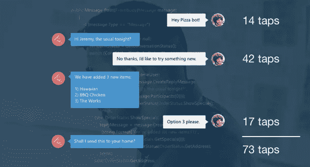
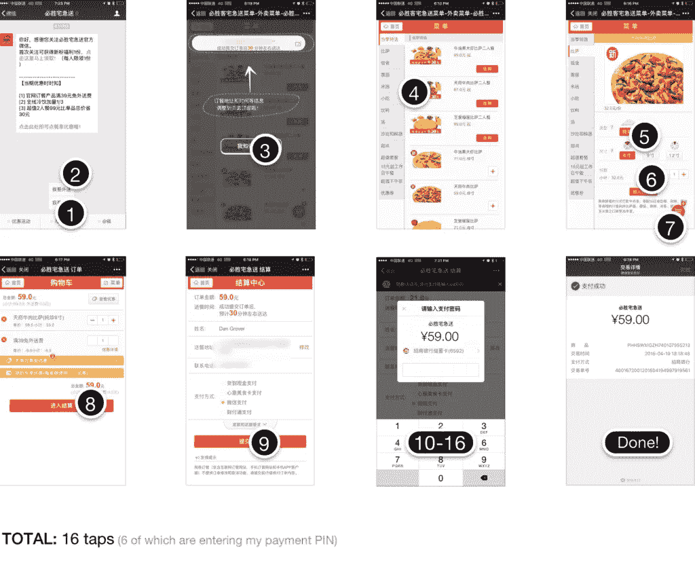
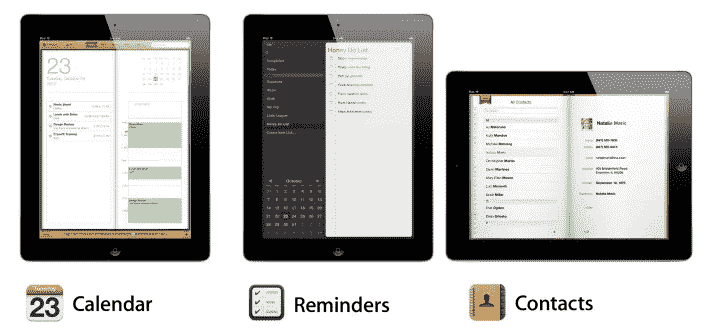
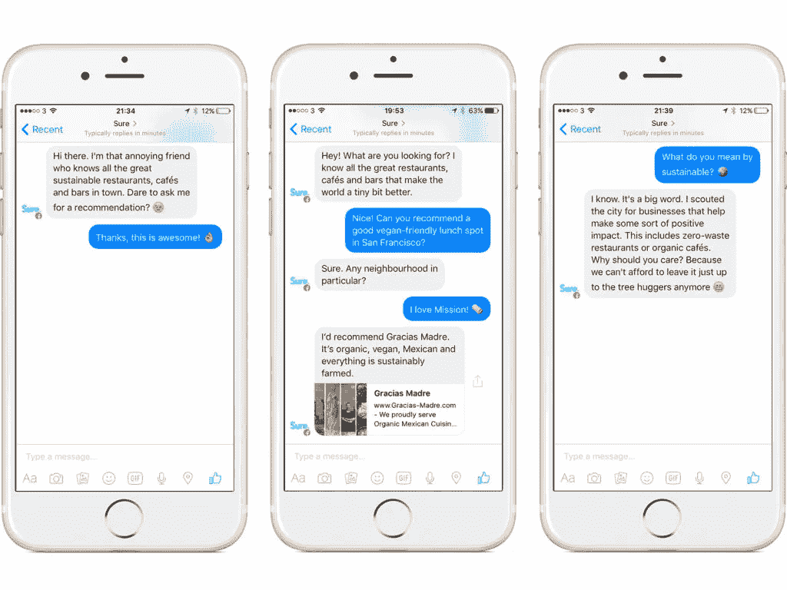
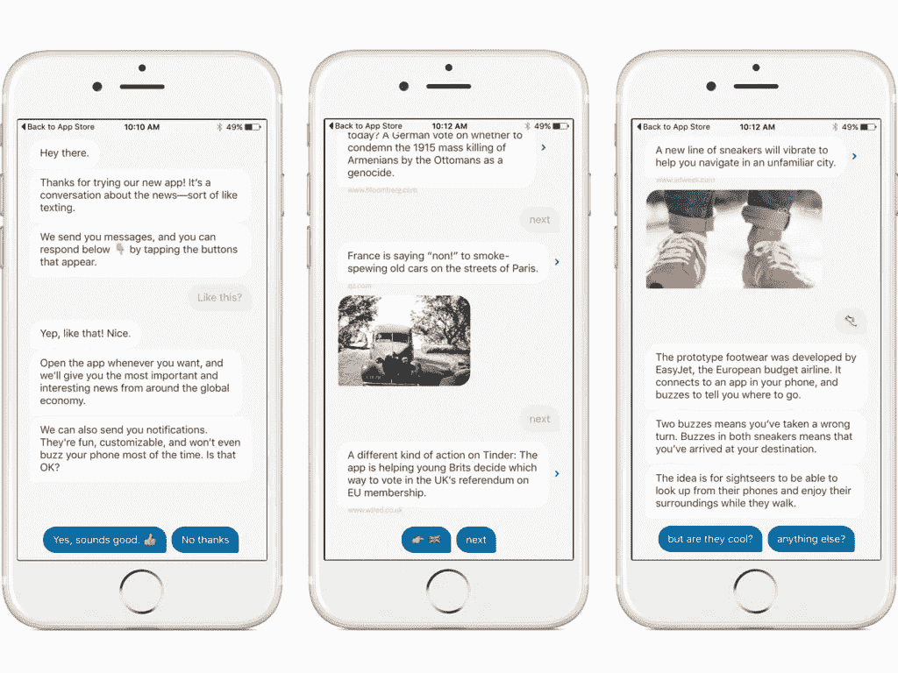

# 当产品说话时，它们必须友好吗？

> 原文：<https://medium.com/swlh/when-products-talk-do-they-have-to-be-friendly-19452bd211ac>

在斯派克·琼斯 2013 年的电影《她》中，心碎的小胡子乔阿金·菲尼克斯深深爱上了他的人工智能私人助理萨曼莎。

虽然对我们大多数人来说，故事情节可能有点荒谬，但聊天机器人的兴起表明，我们愿意像对待人类一样与机器交谈。

像所有技术一样，特别是机器人，萨曼莎的目标是让用户的生活更容易。从点击一个网站到真正提出你的问题并马上得到答案。虽然科幻小说仍然是虚构的，但它确实让我们看到了我们认为世界*应该如何运转。*

越快越好，随着对话设计、自然语言处理和人工智能机器人的兴起，说话正在取代点击成为我们寻找信息的首选方法。

在微软最近的 Build developers 会议上，首席执行官塞特亚·纳德拉宣称:“机器人是新的应用”，这一声明得到了脸书等其他科技巨头的呼应，后者通过发布 Messenger 平台的机器人进入了机器人领域。

甚至 Slack 也将机器人带到你的工作环境中，帮助你做从安排会议到[寻找新的美丽的摄影作品](https://slack.unsplash.com/)的一切事情。

为了进一步证实当前 bot 开发的热潮，我们只需要看看海外，由于微信和 Kik 等平台，bot 起义已经在亚洲取得了进展，每月有超过 6.5 亿用户使用。

但这真的是未来吗？我们会为了更多的聊天而放弃我们的应用和网站吗？

如果我们这样做，它应该如何工作？

# 我们都想找个人倾诉

聊天机器人并不是什么新鲜事。

早在 1966 年，麻省理工学院的计算机科学家 Joseph Weizenbaum 发表了一个名为 [Eliza](http://psych.fullerton.edu/mbirnbaum/psych101/Eliza.htm) 的程序，该程序可以解析输入到计算机中的单词，然后将它们与一系列脚本响应进行匹配，以模仿人类对话。

伊莱扎被设计成一个模拟心理治疗师——显然不是人类。但 Weizenbaum 对他看到的来自 Eliza 用户的反应感到不安。

My actual conversation with Eliza…

当有机会进行自由开放的对话时，用户开始向伊莱扎吐露他们最大的秘密。

Weizenbaum 建造聊天机器人的理由从来不是创造一个你可以与之交往的“朋友”或个性，而是创造一个实用工具。比如一个 app。事实上，在他的书《计算机能力和人类理性》中，他断然拒绝了机器可以取代人类智力的观点。

对于 Weizenbaum 来说，即使回到 60 年代后期，聊天机器人和所有技术的目标，实际上，只是另一种工具——用户思维的延伸。

此外，尽管科幻小说对未来充满了自由意志的人工智能助手的乌托邦式愿景，但如今大多数机器人都只是一个工具。正如杰瑞德·纽曼[在《快公司](https://www.fastcompany.com/3059065/bot-wars-why-big-tech-companies-want-apps-to-talk-back-to-you)上写的:

> “那么，思考机器人的最佳方式就是将其视为一种新型的交互模式。就像移动应用削减了桌面软件的庞杂菜单一样，聊天机器人将用户引入了一个狭窄的互动范围，每个机器人之间的互动都很相似。
> 
> "不管是通过短信还是语音，或者是否有诙谐的玩笑，都是次要的."

像所有好的 UX 设计一样，机器人的想法是让这个*甚至*比他们已经有的更容易。消除摩擦——阻碍人们直观、轻松地实现目标的交互——消除用户在使用产品时可能遇到的任何障碍。

而且理由很充分。

想想当亚马逊推出一键式支付时，它是如何增加其年收入的[估计为每年 24 亿美元](http://blog.rejoiner.com/2012/07/amazon-1click-patent/)。

或者当双语儿童应用程序[提供“全部购买”选项，而不是让用户分别购买他们的每本“书”时，他们的收入是原来的三倍。](http://blog.crew.co/how-we-tripled-our-revenue-by-adding-one-button/)

机器人希望为每一次互动提供这种结果。

企业已经认识到，并不是每个人都想下载并学习如何使用新的应用程序来阅读新闻或点餐。尽管每个应用程序都有自己的入职流程和学习曲线，但有了聊天机器人，你就不必学习如何使用它。如果你能打字或说话，你可以使用它。

# 功利需要人格吗？

这一切提出了一个有趣的问题:如果效用和更少的摩擦是目标，机器人需要友好吗？

在最近一篇关于[为什么机器人不会取代应用](http://dangrover.com/blog/2016/04/20/bots-wont-replace-apps.html)的文章中，微信的产品设计师 Dan Grover 通过观察最基本(也是最重要)的人类任务之一:订购披萨，考察了微软对机器人工作的设想。

在[微软的](https://dev.botframework.com/)版本中，我们的用户和‘pizza bot’聊天，就好像它是朋友一样。机器人知道他的“通常”。知道他住在哪里。并且，假设，将直接向他收费，而不需要他输入任何支付信息。

效用:检查。

性格:可能有点干，但肯定。

然后，Dan 将这与他在微信上从必胜客机器人订购披萨的实际体验进行了比较:

必胜客机器人的行为不像一个友好的助手，更像一个向导，只给你需要的选项来达到你的目标:订购披萨。

在丹看来，摩擦可以通过点击来衡量——你要点击多少次屏幕才能得到想要的结果？

如果是这样的话，那么冰冷、无菌的必胜客机器人以压倒性优势战胜了友好的微软比萨机器人。更少的点击意味着更少的摩擦。但这就一定意味着更好的互动吗？

丹认为，微软和其他机器人制造商的“对话式”设计只是另一种形式的 skeumorphism(装饰性设计)，这在最初的形式中是必要的，但现在不再是了。

Skeumorphism 基本上意味着试图在数字空间中重建模拟或来自自然世界的东西，即使这意味着包括不必要的设计或功能，这些设计或功能可能必须在自然世界中出现，但不要在数字世界中出现。

想想你的一些应用程序，如日历或联系人列表，过去是如何设计成与模拟应用程序一样的外观的。

产品设计师认为，除非我们已经很熟悉，否则我们不可能在手机或电脑上存储我们的联系人。

对于机器人，丹认为个性是一回事——“对话设计”不需要包括经典对话的元素，如细节、问候、戏谑等。如果这些东西只会产生更多摩擦，为什么你会选择使用机器人而不是应用程序？一旦新鲜感消失，实用性才是最重要的。

看看 Siri 就知道了。当然，虚拟助理知道如何讲几个笑话，但最终目标总是实用性。

问一个问题，得到一个答案。完成了。

# 但是，未来不友好吗？

另一方面，萨曼莎式个人助理的用户体验承诺难道不是我们都想要的吗？虽然机器人还没有被设计成“全能”的人工智能生物，但更自然的交互前景是诱人的。

因为大多数机器人生活在一个我们与其他人互动的生态系统中——如 Messenger、Slack 或其他聊天服务——我们不能不将人类的价值投射到它们身上。那么为什么不给他们一个个性呢？

但是，正如 Intercom 产品设计总监埃米特·康诺利强调的那样，[个性并不意味着伪装成人类](https://blog.intercom.io/principles-bot-design/):

> “不要违背用户的意愿。这意味着不使用“正在输入”指标或人为延迟来使它看起来更人性化。相反，机器人消息应该有不同的风格，并以一种传达它们不是人类的方式被清楚地标记。这并不妨碍我们赋予机器人个性。”

人格除了“扮演人类”还有其他目的。

除了让你感觉舒服，并且实际上想让你使用这个机器人， [Sure](http://besure.io) 背后的产品和体验设计师塞巴斯蒂安·克鲁姆豪森(Sebastian Krumhausen)认为，个性实际上有助于建立更好的整体用户体验。

> “机器人的个性不会在效率或易用性方面改善体验，但它会使体验更加愉快。如果你赋予机器人更多的个性，当它失败时，用户会更加宽容。”

Sure 没有完全由脚本运行，而是使用了他们所谓的“人工辅助人工智能”，当有人提出超出机器人当前功能的问题时，团队成员可以无缝地加入对话。

因此，当设计机器人的个性时，他们假设是在设计自己的工作个性——友好、有趣、随和、放松。如果你没有马上得到你想要的答案，那种让你很容易原谅的品质。

“首先，人们回应我们的方式非常粗鲁，尤其是当这不起作用的时候，”克鲁姆豪森解释道。“但当我们把这种古怪的反应加入进来时，人们变得开放起来，变得更加友好。”

营销学者称之为“品牌拟人化”,公司已经使用这种技术很多年了。

正如泰勒·考恩在《纽约客》中对[的解释，几十年前，像 Sure 这样的机器人给了我们古怪的个性，让我们与陶氏化学公司的擦洗泡沫联系起来](http://www.newyorker.com/business/currency/when-products-talk)[告诉消费者](https://www.youtube.com/watch?v=EFeEMx7ElBg)“我们做工作，所以你不必做”；加州葡萄干[唱](https://www.youtube.com/watch?v=pM2OK_JaJ9I)“我是通过小道消息听到的，”；皮尔斯伯里甜甜圈男孩[咯咯地笑着谈论饼干、面包卷和饼干。](https://www.youtube.com/watch?v=HBPrPj-EiSQ)

> “企业创造这样的图标有一个简单的原因:他们知道消费者会对那些似乎与他们在个人层面上产生共鸣的产品做出反应。”

然而，对于机器人，对话是双向的。这意味着，机器人不仅仅是与品牌建立个人联系，它还有服务的责任，正如克鲁姆豪森解释的那样，推动互动向前发展。

> “非常重要的是，就像你在开发一个产品一样，一开始就应该非常专注。所以对话真的很集中。我们发现，机器人在某种程度上推动或推动对话朝着我们希望的特定方向发展是很重要的。”

一个近乎完美的例子是 Quartz news 应用程序。

当然，这款应用混合了人工编写的交互和脚本。这些故事和内容都是由石英记者以他们的机器人和他们的品牌的声音的风格和语气写的。

Quartz 的独特之处在于，它有许多表情符号，还有不少笑话和讽刺，但互动方面采取了一种明确的自主冒险路线，每个故事只提供两种选择。阅读更多或继续前进。

正如贾里德·纽曼在他的《快公司》文章中指出的，不再仅仅是互动的机器方面被脚本化了。我们的反应也是如此。

# 赋予你的机器人个性的风险

Quartz 应用程序虽然是机器人如何融合实用性和个性的最佳例子之一，但也存在一些独特的问题。

就像你在聚会上被迫交谈一样，不能保证你会喜欢和你交谈的人。尽管大多数机器人制造商试图创造一个古怪、有趣、容易相处的角色，但它很快就会过时。

有了 Quartz 应用程序，他们的反应有时会让人觉得是被迫的，就好像把一个重要的新闻故事浓缩成一个版本，而你的密友会在啤酒上告诉你，这并不符合事件的真实情况。

也许这更像是埃米特所说的不要“愚弄”你的用户。

个性没问题，但我们永远都知道我们在和谁说话。他们不认识我们。他们看不懂社交暗示。愚蠢地使用表情符号只是另一种形式的“打字”人性化。

此外，作为 Quartz 每日时事通讯的长期订阅者，我确实发现这个应用程序比滚动浏览另一个文章列表更有吸引力。但是，因为它是一个独立的应用程序，而不是 Messenger 中的一个机器人，我发现自己想知道我是否真的会进入这个应用程序，以保证保留它(存储和打开一个独立的应用程序对我来说可能会有太多的摩擦)。

这就是失败的地方，正如克鲁姆豪森对 Sure 的解释:

> “重要的是，它要高效，人们要尽早获得快速的胜利。像任何其他在线用户体验一样，它需要快速高效。因为如果它不比使用现有体验更好或更快——在我们的情况下，像谷歌地图或 Yelp 这样的东西——人们就不会使用它。”

越来越多，速赢意味着在人们已经在的地方。下载应用程序并想打开它(而不是在我已经经常使用的环境中阅读电子邮件)的行为比它的价值更有摩擦。

# 抛开个性的争论，机器人会取代应用吗？

所有这些都归结为围绕机器人的主要问题:它们会取代我们所知的应用吗？

对大多数人来说，答案是否定的。

机器人，无论是作为一个友好、健谈的“朋友”还是纯粹的实用工具，都只是科技生态系统的一部分。无论是支持、建议还是销售，它们都提供了一个减少产品关键部分摩擦的机会。

最后，他们做什么可能比他们说什么更重要。

*嘿！我是乔里。屡获殊荣的作家、编辑和内容策略师。如果你想一起工作，可以在* [*的博客*](https://goo.gl/RZqyLS) *或* [*上查看更多类似的帖子。*](http://jorymackay.com/)