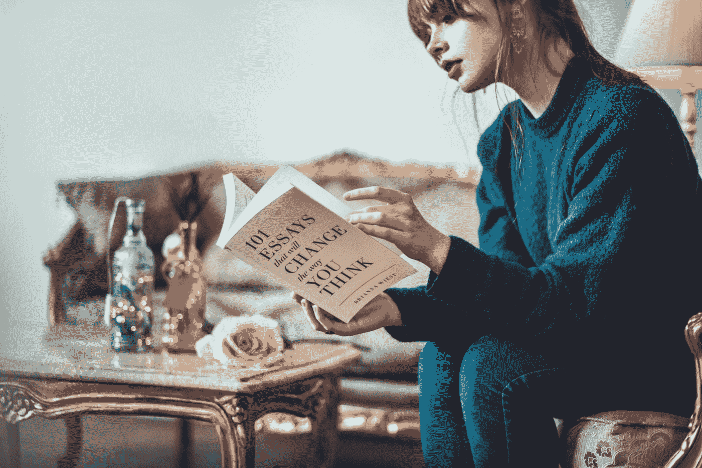

# 当“自强”变成自残

> 原文：<https://medium.com/swlh/when-self-improvement-becomes-self-harm-d67b0b8710fb>

[Thought Catalog](https://unsplash.com/@thoughtcatalog?utm_source=medium&utm_medium=referral) on [Unsplash](https://unsplash.com?utm_source=medium&utm_medium=referral)

## 我们追求进步是为了更快乐，但我们做到了吗？

自我提升风靡一时。

自助书籍实际上是在推销自己。每天都有数不清的“在 XYZ 做得更好的 10 种方法”的文章。生活博客上的播客有数百万的下载量。