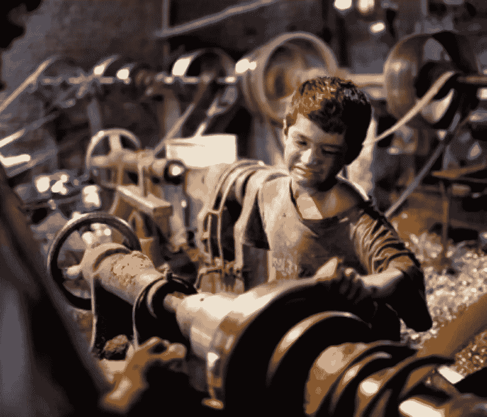

# 当“错误”的决定是唯一正确的决定时——为什么我拒绝外包

> 原文：<https://medium.com/swlh/when-the-wrong-decision-is-the-only-right-decision-cd2444742f5f>

我叫安迪·格雷厄姆，我做了一个糟糕的商业决定。

五年前，我发明了一种乐器，主要是自娱自乐。我真的没想到会以此为职业。

这个设计是如此独特，以至于我可以申请专利，这给了我一个想法:我可能以此为生。就这样开始了..

自从专利被授予以来，我已经能够在享受其受欢迎程度稳步上升的同时支持自己生产这种仪器。和各种专业人士、名人、甚至音乐传奇人物交朋友是超现实的。我的可靠消息来源告诉我，甚至斯蒂维·旺德花了一些时间玩我的产品。哇！(我还在坚持拍照)。

我在电台和电视上演奏过这种乐器。在过去的几年里，我比以往任何时候都能够去更多的地方旅行。上帝保佑商务旅行注销。

听起来真的像一个梦，特别是对于像我这样的音乐家来说，我从高中开始就一直在与虚假的承诺和音乐成功的希望作斗争。

我对自己许下的一个承诺是尽我所能不要忘记我是多么幸运。

但是你看，就像我说的，我做了一个错误的商业决定:

我承诺在美国制造我的产品，无论如何。

这显然是一个禁忌，尤其是在，你猜对了，美国。

我新职业的亮点之一是能够参加国际贸易展，尤其是一年一度的 NAMM 展(全国音乐商人协会)。NAMM 是精彩纷呈的四天..一个不停的聚会，一个没完没了的商人、艺术家和媒体的漩涡。这是音乐产品行业的“归零地”。

我的产品在受欢迎程度、新客户以及专业人士和名人关系方面的传播，很大程度上归功于我参加了 NAMM 会议。

来自制造业各个方面的代表在这里展示了他们的最佳表现。其中很大一部分是在海外生产你的产品的公司。

在今天的制造业文化中，许多人认为这条道路不是一个选项，而是一个必要的步骤，如果你有任何获利的机会的话。

快速浏览一下今天几乎任何消费品的标签，就会发现这是首选的商业模式……而且生意正在蓬勃发展。

每次展会上，这些友善的人都会造访我的展位，让我知道在他们的海岸上等待着巨大的制造机会。“我们可以让你的产品便宜……非常便宜。对于星巴克一杯拿铁咖啡的价格”(是的，有人告诉过我)，这位代表眼睛一亮说道。

我的“商业意识”应该为此欣喜若狂。一杯拿铁的价格？多好的利润空间啊！只要我伸出双手，就会有一股现金向我涌来！

当她继续她完美的推销时，当我考虑我不应该考虑的潜在现实时，我内心有一种不安的感觉:

如果我的产品制造成本如此之低，那么那些工厂工人的劳动报酬几乎为零，更不用说工作条件了。

一个人不一定要成为经济学家才能理解这个基本原理，就像你不一定要成为数学家才能确定地知道二加二总是等于四一样。

我有时会询问这些工人的生活，同时尽量保持专业。

毫无疑问，我得到了一些惊人的，可能是排练过的回应:

"实际上，那里的标准有很大不同，这在那个地区是正常的做法."

"这些人很高兴有任何收入来源."

我个人最喜欢的是:

“实际上，这是你为他们提供的一项很好的服务，他们能够养活家人，生活质量也更高。”

此时，我意识到任何对人权的进一步关注都将被置若罔闻，所以我笑了笑，拿了他们的卡，他们继续他们快乐的生活。毕竟这是一个商业展览，除了展示我的商品之外，我不是来大吵大闹的。

然而，我想出了一个回应，如果我觉得够刻薄的话，下次我在这种情况下可能会用到。大概是这样的:

“你知道，你说得对，谢谢你提醒我，每个国家的标准都不一样。生活在美国，很容易忘记这一点。

这让我想起我是多么期待下一次去泰国出差。我的一个朋友最近去了那里，他告诉我，花大约 20 美元，我就可以得到一个 12 岁的漂亮女孩共度良宵。事实上，我相信我可以很容易地以那个价格谈成 2 英镑！"

对我的回答的恶心和厌恶程度应该很高，至少我希望如此，如果这位代表还有人性的话。

幸运的是，我自己会有一个精心准备的回答:

“实际上，那边的标准有很大不同，这是那个地区的正常做法。那些女孩很高兴有任何收入来源。事实上，我在为他们做一件大好事，帮助他们养活家人，提高生活质量。”

我有一种感觉，代表脸上的表情现在将是无价的，因为他们大脑中的两个现实发生了碰撞。

对于那些足够勇敢的人来说，这是一个非同寻常的双重标准:

愉快地周游世界，对几个十几岁的当地女孩进行性剥削，这种想法甚至会引起我们社会中那些道德有问题的人的厌恶和反感。

但是用 100 个这样的女孩填满孟加拉国的一家服装店，这样一个美国青少年就可以得到“最新的返校时装”，而没有人会对此感到惊讶。

为什么一种剥削形式如此令人厌恶，而另一种却只是商业？

我认为答案就在现代商业文化的某个地方:

这里似乎有一个强调的原则。从定义上来说，无论哪个选项最赚钱(对不起，是“最高回报”)，都是正确的选择。做出这一选择所需的细节并不重要，尤其是在一个遥远的地方。

眼不见心不烦。确实如此。

在这个问题上，我们似乎在不同程度上集体喝下了苦艾酒:尽管我们对人们(通常是儿童)被可怕地剥削以获取经济利益的想法感到不寒而栗，但我们的关注似乎在闪亮的低价新事物的阴影下迅速消退。

媒体偶尔会让我们听到富士康安装自杀网的恐怖故事，或者当血汗工厂的门被锁起来以防止那些吃利润的厕所休息时，人们被活活烧死。但是该死的，你见过最新的 iPhone 上的新功能吗？你只花那么多就买了那套可爱的返校装？

这让我想起了我那个可怕的商业决定，那就是开发自己的产品。我不得不承认，我的良心阻止我利用海外那些神奇的拿铁价格产品。

我不得不接受这个决定。我不认为这将是一个问题。事实上，致力于此是拼图的最后一块。这种认知失调最终被平息了。

如果我想降低材料成本，我可以批量购买。如果我想让一个过程更有效率，我会建造一台机器，一个工具，一个夹具来完成这项工作。

如果我不能把我 20 多年的机械师、工具制造者、装配者和问题解决者的工作放在这些问题上，那么我可能就没有生意可做了。

总有一个聪明的、合乎道德的解决办法。双赢。

我做生意的唯一目的不是赚钱。我是来谋生的。如果我不得不放弃我的道德标准来做到这一点，那么“生活”的部分就会受到影响。但那是我。

能够问心无愧地上床睡觉也不错。

安迪·格雷厄姆

所有者——Slaperoo 打击乐公司首席执行官

andygrahamproductions@gmail.com

先生？

发表于*[**# SWLH**](https://medium.com/swlh)**(***创业、流浪、生活黑客)**

******