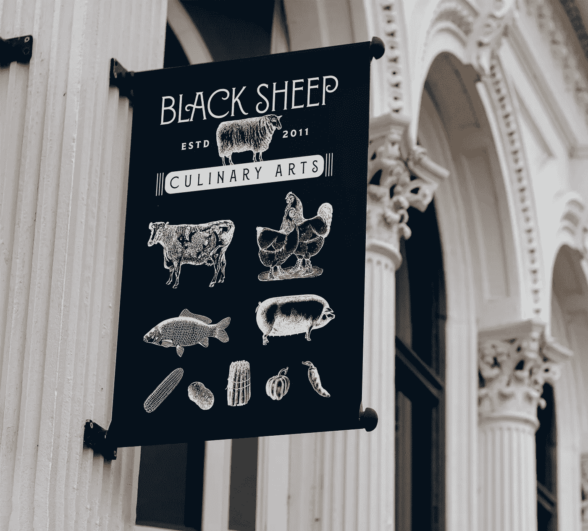

# 何时重塑品牌:了解标志

> 原文：<https://medium.com/swlh/when-to-rebrand-knowing-the-signs-9ed09a334f59>

## 事实:你的公司会在某个时候重塑品牌。问题是:你会知道选择最佳、最有利可图的重塑品牌时机的标志吗？以下是一家公司如何做到这一点的一些重要见解。

## 知道何时重塑品牌是任何品牌在其生命周期中面临的最大挑战之一。

你不想成为这样一个品牌，因为它没有意识到暗示“适应或死亡”的迹象而失去客户

我所说的“适应”，绝不是指“为了适应而改变”

我的意思是(根据字典):“使(某物)适合新的用途或目的；修改。”

## 诀窍在于了解征兆。

需要注意的一些关键迹象:

1.  *你的品牌是否被归入某一类别或某种感知价值(与事实所显示的不同)？*
2.  你的品牌 d *是否与市场对你的品牌做什么或卖什么的误解相一致？*
3.  尽管你尽了一切努力，你是否仍停留在陈旧过时的印象中？
4.  你是否不清楚你想要和需要传达什么，最重要的是，他们对谁重要？
5.  仅仅因为“我们一直都是这么做的”，你还在做同样的事情吗？

为了更好地理解这些，我邀请你去看这篇文章和视频。

# 如果没有这另一项技能，知道征兆就毫无意义

知道何时重塑品牌的部分原因是这种“全身心投入”的品质，尤其是在这个“试探性谨慎”和政治正确的时代。

“全力以赴”和“坚定信念”的角色是这一集《周三一分钟》的焦点。

# 那么，什么时候重塑品牌？

就全力以赴而言，我很幸运能与一个充满活力的夫妻团队合作，采用屡获殊荣的 pitmaster 和厨师 Dave 主厨的原创食谱，并重塑品牌和他们的第一个酱料系列。

桌子上(一语双关)有:

*   品牌名称，
*   品牌的视觉识别，
*   产品线，
*   产品类别(它需要一个新的类别吗？)，以及
*   包装设计本身。

腹部烧烤线的更名是他们品牌的一次彻底的革命——抛弃一切(除了食谱)——采用独创的、释放味道的酱料，并给予它应有的尊重。

最初的标签是*烙印地狱的百慕大三角*。它在标签的正面提到:

*   烧烤(这是美国烹饪的传统)，
*   伍斯特郡酱(这无疑是英国的遗产)，和
*   “鲜味”，一种日本的味觉哲学，被《纽约客》定义为*“继咸、甜、酸、苦之后的‘第五种味道’。这是另一件事，你甚至不知道它需要一个概念或名称，直到有人指出来。这种深沉、深沉、浓郁的肉味使烤牛肉、酱油、成熟番茄、帕尔马干酪、凤尾鱼和蘑菇等与众不同。它击中了你的喉咙，让你渴望更多。”*

虽然这种酱非常适合牛排、烧烤、家禽、海鲜、蔬菜、汤和饮料(用血腥玛丽代替食谱中常用的伍斯特郡酱)，但看看最初的包装和品牌，你不会知道这瓶酒蕴含的魔力。

因此，为了消除品牌的混乱，我们决定它必须成为一个新的类别，并以一个全新的名字完全重新开始。

> 经过一番讨论，很明显，黑羊的概念非常符合他们的风格，他们的哲学，以及他们在这个领域的烹饪差异，因此有了*黑羊烹饪艺术。*

有了新的品牌名称 Black Sheep Culinary Arts，产品线变成了 Bloom 酱和卤汁，有 3 种令人垂涎的口味。这个概念是一种酱料，可以释放你的食物的味道，让它们轻松美味地绽放。

我们将新酱料定位为“即时厨房救赎”，自然释放所有食物的味道，一点一点地美味滴落(非常适合家庭厨师和专业厨师)，如这个简短的介绍视频所示(调高音量):

The introductory video for the new rebrand

然后，我们为每种口味配方赋予了自己的金属色:

*   原版是银色的，
*   无麸质是金，而且
*   熏的是铜。

# 美味的，可笑的，惊人的

原始品牌，然后是新品牌:

品牌的各种核心资产:

标签详细信息:

名片和食谱小册子:

品牌如何作为户外横幅:

最后，最初推出的三瓶酱装在定制的木箱中，向厨师、博客和行业领袖介绍新的酱料系列:

现在，这是一个“全身心投入”你的品牌的例子，让*毫无疑问*你提供的是超出寻常或预期的东西。

## 从这篇文章中获得了价值？
然后鼓掌，分享，关注我，订阅我的 [YouTube 频道](https://www.youtube.com/user/headmusik)每周都有新视频。需要一个品牌重塑或一个难忘的主题演讲人？在这里找到我。

*最初发表于*[*【www.risingabovethenoise.com】*](https://www.risingabovethenoise.com/when-to-rebrand-knowing-the-signs/)*。*

## 这篇文章发表在 [The Startup](https://medium.com/swlh) 上，这是 Medium 最大的创业刊物，有 340，876 人关注。

## 在这里订阅接收[我们的头条新闻](http://growthsupply.com/the-startup-newsletter/)。

