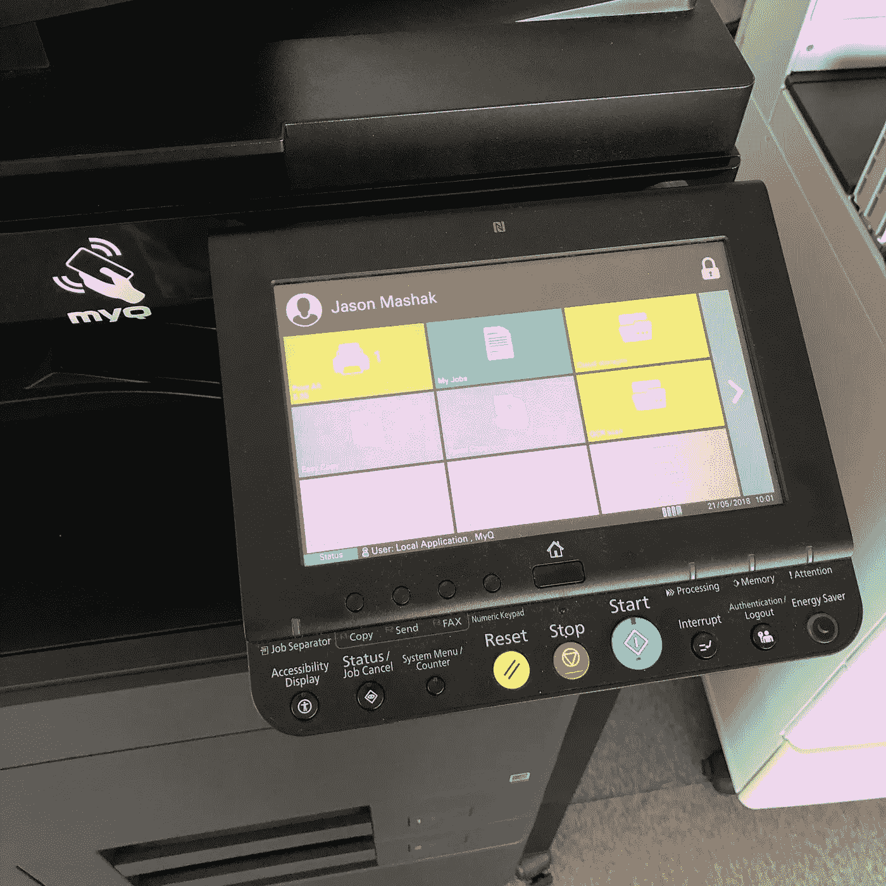
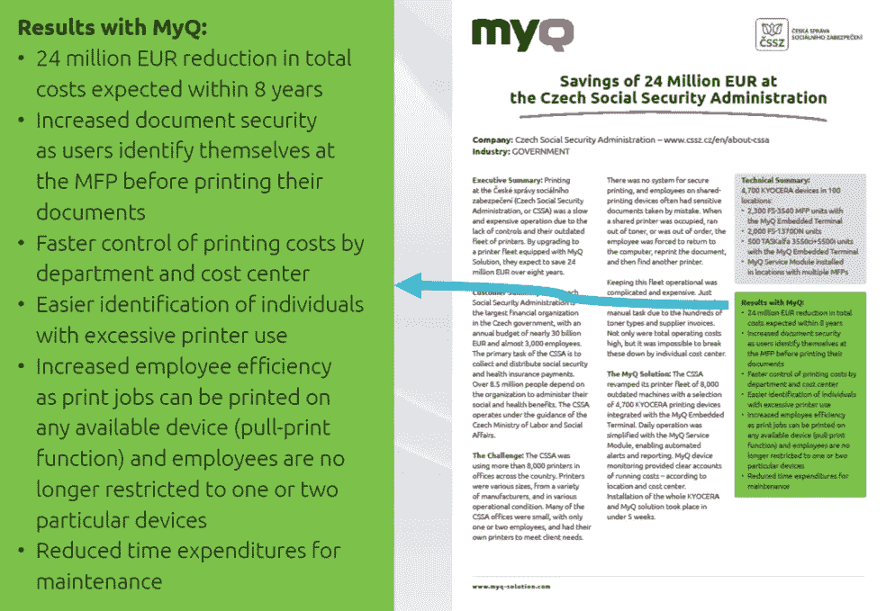
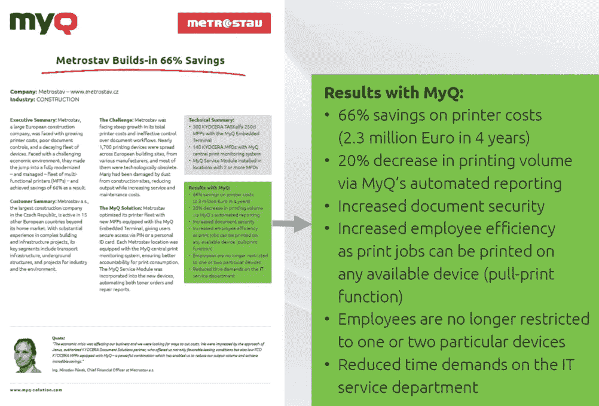
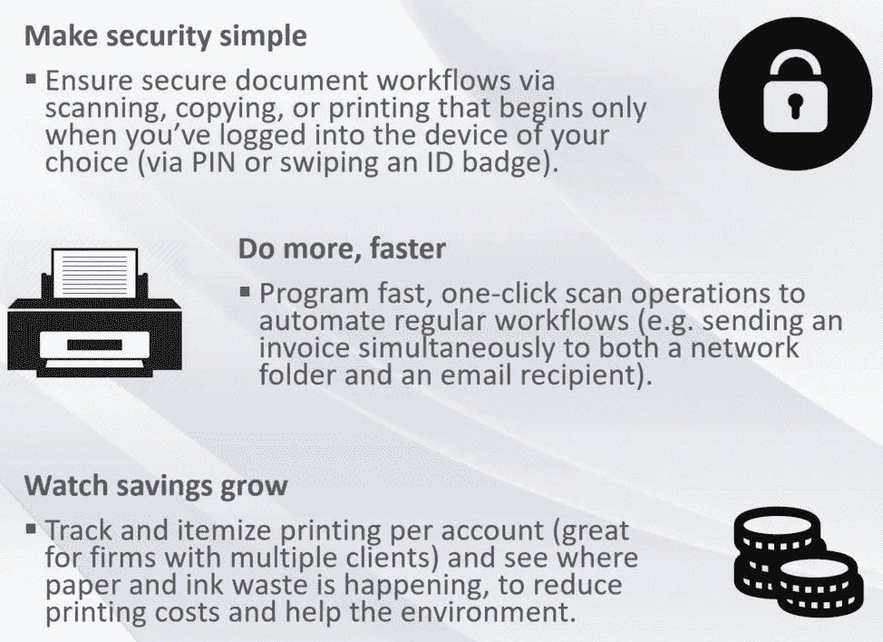
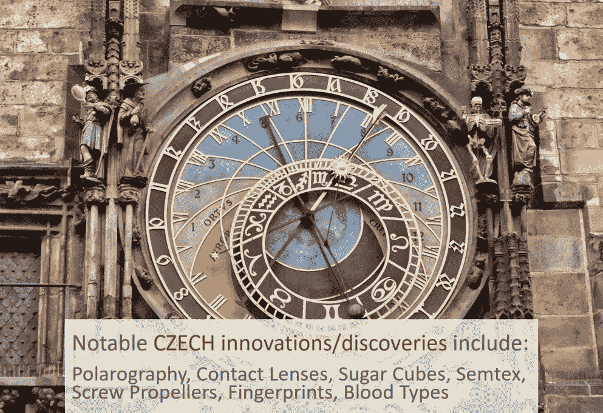

# 当你意识到:“这就是创新！”

> 原文：<https://medium.com/swlh/when-you-realize-thats-innovative-2fcd2c271ebd>

上周，我在两天时间里向我们的打印服务器发送了 9 个不同的打印任务。由于我忙于会议等事务，我没有时间马上去取文件——由于“拉式打印”的一个主要好处是文件的安全性，而不是放在打印机上(暴露在外),我一直等到我([当然效率最高](/business-hacks/lifehacks-smartphone-habits-using-outlook-as-a-to-do-list-and-getting-coffee-957dfe7d12e4))有时间的时候才一次把它们打印出来。

当我最终刷卡进入我发送的打印作业列表时，我看到队列中总共有 9 个文档。起初，我很惊讶自己竟然想在两天内打印这么多文档。

对未决文档的快速检查表明，在实际打印之前，我实际上可以删除这 9 个作业中的 3 个，因为不再需要这些文档了。

我拿着我需要的 6 份文件走开了，然后我突然想到…

# **减少 33%的浪费和相关成本。**

这仅仅是我两天的积蓄。对于定期打印大量大型文档的部门，如人力资源、财务或法律团队，这在墨水/碳粉、纸张(树木、森林)、维护成本以及最终的**更高利润**方面有什么潜力？

Case Study for Czech Social Security Administration, GOVERNMENT sector

Case Study for Metrostav, CONSTRUCTION sector

我们看到很多关于 MyQ 为我们的客户节省了多少的统计数据，但我从来没有真正有意识地联系到它在我们自己的办公室里每天为我们做完全相同的事情。

*

我们的首席执行官马丁·杰纳斯(Martin Janus)谈到了他和他的朋友最初创建 MyQ 的原因:**“我们希望建立一些东西来帮助公司节省时间和自动化流程，让更少的人做更多的事……减少对新人的培训需求，并使其成为一致的体验。”**

Three ways that MyQ returns money to the PROFIT column

MyQ 当然会这么做。我和马丁聊了几次，灵感来自于懒惰经常推动创新的概念。有人引用比尔·盖茨的话说:“我选择一个懒惰的人去做一件艰难的工作。因为一个懒惰的人会找到一个简单的方法来做这件事，”我记得亨利·福特和其他一些人也提出过类似的观点，一个不想整天工作的人通常是以最有效和创新的方式完成事情的最佳人选。

“我们有一个明确的愿景——生产一个简单且具成本效益的解决方案,”骏利在 2015 年接受 KeypointIntelligence.com 的安德鲁·昂斯沃思采访时说。

剩下的就是历史了。

Ahead of its time: Astrologicky Orloj (Astronomical Clock) in Prague

上周，作为时间和资源的自动节省者，我与 [MyQ Solution](https://www.myq-solution.com/) 进行了积极的互动后，我意识到 MyQ 是捷克人可以引以为豪的一长串创新/发现中的又一个:极谱法、隐形眼镜、方糖、弧光灯、塞姆汀塑胶炸药、螺旋推进器、指纹、血型、避雷针……当然还有最初的比尔森啤酒——在同类产品中被广泛认为是最好的。

如果您想了解我们的软件如何通过减少不必要的浪费来帮助您的组织获得更大的利润，请[联系离您最近的 MyQ 分公司](https://www.myq-solution.com/contacts)。

真诚地

杰森·马沙克，CMO

捷克共和国布拉格

**关于 MyQ**

[MyQ](https://www.myq-solution.com/) 打造屡获殊荣的通用 MyQ 解决方案，通过打印机和其他多功能设备实现安全打印管理和工作流程优化。MyQ 总部位于捷克共和国布拉格，在奥地利、法国、德国、俄罗斯、阿联酋、英国和美国设有分支机构，与印刷行业最知名的全球供应商合作。 *CIO Business World* 将 MyQ 评为捷克科技公司“100 强”。欲了解更多信息，请访问:[www.myq-solution.com](http://www.myq-solution.com)

## 这个故事发表在 [The Startup](https://medium.com/swlh) 上，这是 Medium 最大的创业刊物，拥有 326，962+人关注。

## 在此订阅接收[我们的头条新闻](http://growthsupply.com/the-startup-newsletter/)。

