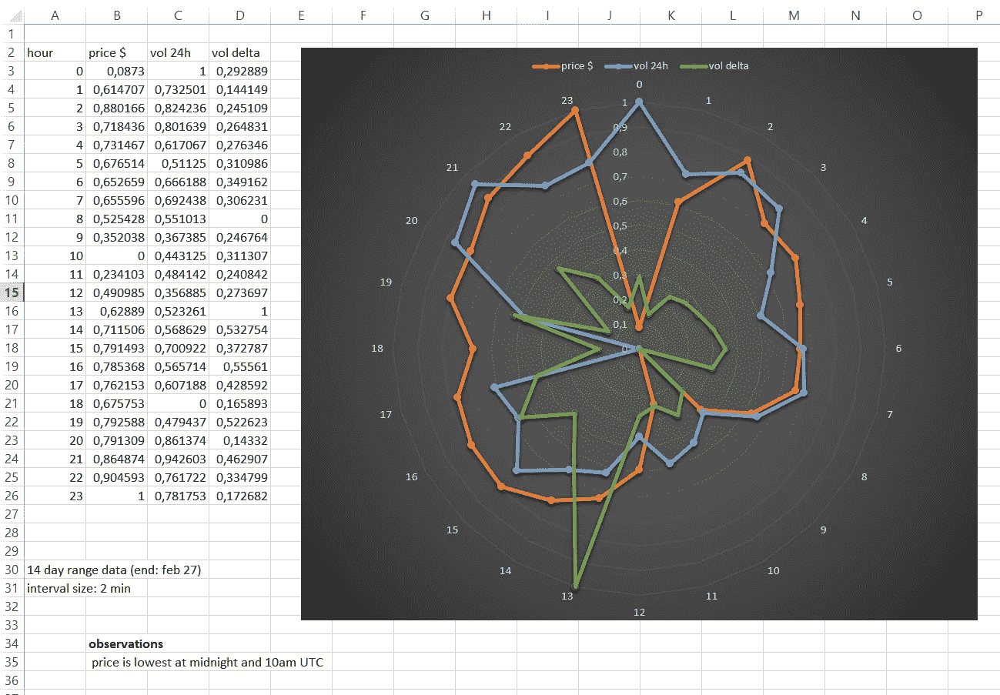
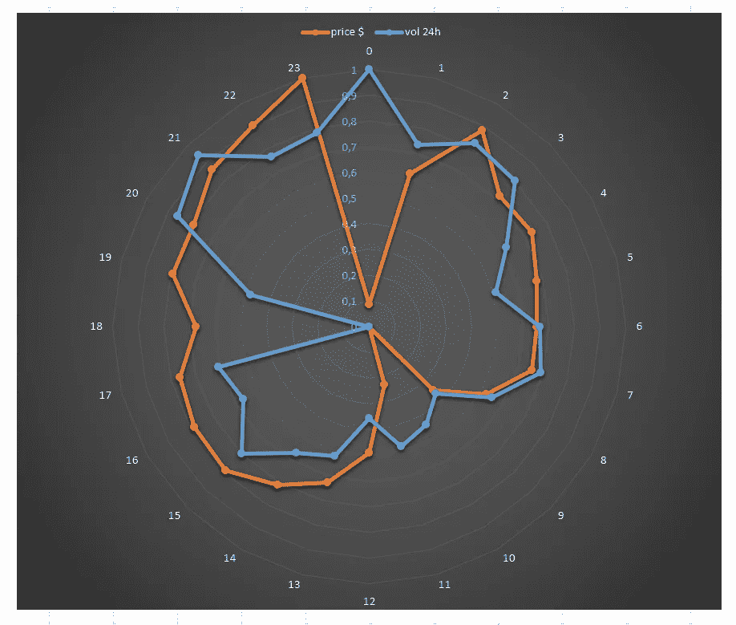
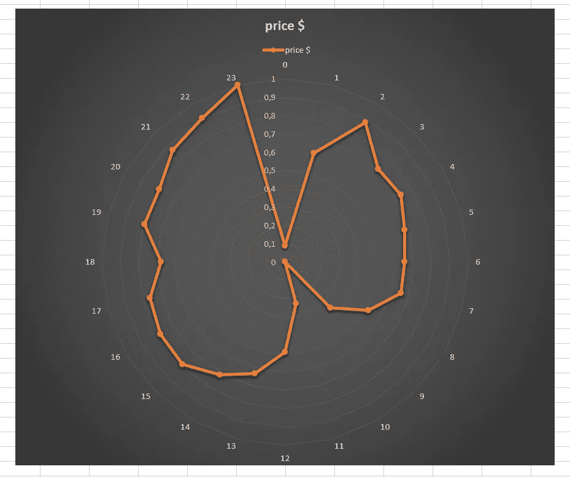
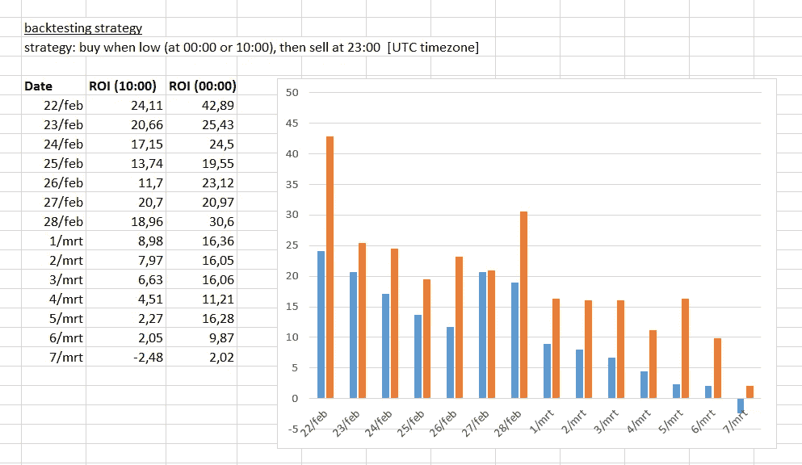
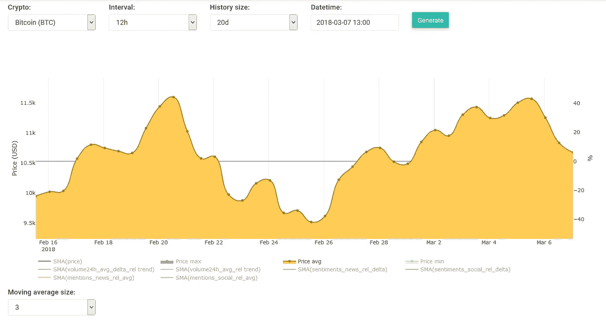

# 什么时候应该考虑买卖比特币

> 原文：<https://medium.com/swlh/when-you-should-consider-buying-and-selling-bitcoins-508a9724de0>

今天，当我在处理数据库中的价格和交易量数据时，我发现了一些非常有价值的信息。我想画出一天中每个小时的不同数据。具体地说，我想看看在一天之内是否有某种模式。

所以我做的是在过去的 14 天里，以 2 分钟为间隔提取所有的价格和交易量数据。这意味着从 2 月 13 日(包括)到 2 月 27 日(不包括)的数据，只是比特币的数据——我还没有做过其他硬币的数据。记住我们有两种交易量:24 小时交易量和 delta 交易量(计算方法是:24(t)-24(t-1))。

还有一点，我想按小时绘图，但由于我们有 2 分钟的间隔，我们需要计算给定小时内所有数据点的平均值。最终结果如下所示:

在左边我们有一个表格，我在其中插入了归一化的平均值，因此它们在范围[0，1]内。通过标准化数据，我们可以轻松地比较它们的趋势/行为(例如，比较价格和数量)。注意:我们的日期和时间对应于 UTC (GMT)时区，因此“小时”字段也是如此。

在右边，我为我们的三个(标准化)数据集绘制了雷达图。橙色是价格(以美元计)，蓝色是 24 小时交易量，绿色是交易量增量。请注意，雷达上的半径从[中心的 0-到外圆的→1]。这对应于我们的[0，1]归一化数据。其中 0 对应最小值，1 对应最大值。通过查看这三个图表，我注意到价格和交易量增量之间似乎没有关系。所以现在让我们去掉这个:

在比较价格和销量时，我们确实看到了一些有趣的(也是相当明显的)事情:

*   当价格非常低时(=午夜 0.1)，则 24 小时交易量处于最高峰(=1)。
*   当价格处于最低点(= 10:00 时为 0)时，交易量也很低(在 0.4 和 0.5 之间)。
*   当价格最高时(=1 在 23:00)，那么交易量相当高，但不是最高(=0.8)。

这些是观察到的有趣事实，但对我们帮助不大。所以接下来的事情是查看时间/小时本身:

*   23:00 价格最高
*   10 点价格最低
*   00:00(午夜)价格很低

这让我非常兴奋，因为我可以用这些发现创造一个超级简单/愚蠢的交易策略。该战略如下:

*   价格最低时买入(10 点)
*   价格最高时卖出(23:00)

几分钟后，我添加了一个新的回溯测试策略，并开始运行测试。我获得的第一个 ROI 结果与您从上图中获得的结果相似。然而，我们的回溯测试系统 100%进入买/卖交易，所以它使用所有的资源进行买/卖交易。所以在我们的例子中，如果它输入 buy，它会在点击 10:00 时这样做，然后在 23:00 之前它不会做任何事情来卖出。

在我发布结果之前还有几件事:

1.  上面的图表是根据特定日期范围(2 月 13 日至 2 月 27 日)内的数据生成的，因此它们只适用于相应的范围。但是我想看看这个交易策略在这个范围之外的表现。
2.  由于我们的系统在一次交易中使用了 100%的资源，我们需要创建两个实验:一个是在最低点交易，另一个是在第二个最低点交易(午夜)。

这是我从回溯测试中得到的结果:

第一个数据列是“日期”。这表示回溯测试进行到哪一天(不包括这一天)。每个回溯测试跨越 14 天，并在指定的日期值结束。例如，2 月 27 日意味着从 2 月 13 日(含)到 2 月 27 日(不含)[这与我们之前的雷达图的数据范围相同]。

第二列和第三列是从回测系统获得的 ROI。有两列，每列代表一个不同的实验，第一列是在 10:00(最低价)进入买入交易的实验；第二个投资回报率来自午夜交易(第二个最低点)。

在右边，我画了一个显示两个 ROI 的 2D 柱形图。蓝色的是 10 点输入的 ROI，橙色的是午夜输入的交易。有趣的是，午夜(第二个最低点)进场的交易的平均回报率更高。在我们的情况下，这可能是真的，但这并不意味着它通常是真的。记住我们的系统在给定的时间进入交易，但是实际的最大值可能在 23:30 到达。为了进行更精确的计算，人们不仅需要包括一天中的小时，还需要包括给定小时的分钟，以获得更清晰的图像。

然而，通过查看 ROI，看到 42%这样大的数字是相当惊人的！如果我们考虑到它每天只做一个完整的交易周期(买入+卖出),那就更令人吃惊了。所以系统总共只做 14 次买入+卖出来获得这些 ROI。随着时间的推移，ROI 降低，我们在这张图表上还看到了其他一些东西。我最初的想法是，与 2 月份相比，BTC 的价格在 3 月份有所下降，但这似乎是错误的:

我们清楚地看到，3 月份的价格在上升，除了 3 月 6 日，价格又开始下降。我不想花太多时间来弄清楚 ROI 发生了什么，但我认为最有可能发生的是:我们正在 14 天的窗口内进行回溯测试，从 ROI 中我们看到它们从 3 月 1 日开始暴跌。因此，2 月 20 日至 2 月 26 日之间的交易很可能对投资回报率有很大影响，因为在这期间出现了下跌(如价格图表所示)，因此这些糟糕的交易很可能导致投资回报率更低。

## **TL；博士**

如果你对我刚刚写的一个字都不理解，请记住:在午夜或上午 10 点(格林威治标准时间时区)买入比特币，这是它最有可能的最低点，然后在晚上 11 点卖出，这是它最有可能的最高点。

***拥有伟大的一天！:)
——伊利亚·内沃林***

## 这篇文章发表在 [The Startup](https://medium.com/swlh) 上，这是 Medium 最大的创业刊物，有 303，461+人关注。

## 在这里订阅接收[我们的头条新闻](http://growthsupply.com/the-startup-newsletter/)。

