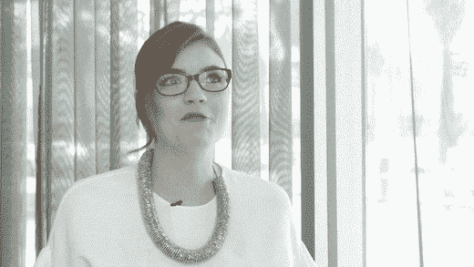

# “当你在一个协作空间中与一个感觉更像家人的团队一起工作时，你能够完成更多的事情”

> 原文：<https://medium.com/swlh/when-you-work-in-a-collaborative-space-with-a-team-that-feels-more-like-family-you-are-able-to-3386f213ee08>

## ModiFace 副总裁 Jennifer Tidy 的 5 条创业建议

> “我最喜欢的事情之一是和我一起工作的团队。你一天中的大部分时间都在工作，当你和一个感觉更像家人的团队在一个协作的空间工作时，你每天都能完成更多的事情。更不用说去工作时看到每个人都很兴奋，真的会让你精神抖擞。”

> 我有幸采访了 [ModiFace](http://modiface.com/) 的合作伙伴高级副总裁詹妮弗·蒂迪。

**非常感谢你和我们一起做这件事！你的“背景故事”是什么？**

我已经在 Modiface 工作了 9 年半。在被收购之前，我是 ModiFace 的第二名员工，帮助团队发展到 65 名员工和 100 多个客户。

**你能分享一下自你开始领导公司以来，发生在你身上最好笑或最有趣的故事吗？**

我工作中最有趣的部分之一是旅行。我有机会去世界各地旅行，会见一些了不起的公司，同时有机会看世界。我也在行业活动中做了很多公开演讲，并且非常喜欢。

**你认为是什么让你的公司脱颖而出？可以分享一个故事吗？**

ModiFace 是领先的 AR 和 AI 公司。我们能够通过不断创新我们的技术和发现我们可以通过 AR 快速满足的行业需求来保持领先地位。让我们脱颖而出的最大动力是团队。ModiFace 团队更像是一个家庭，我们都互相尊重，互相扶持，朝着同一个最终目标努力。我们作为一个有凝聚力的团队合作得非常好，这就是我们如此强大和敏捷的原因。

你现在正在做什么新的或令人兴奋的项目吗？

当然啦！我们一直在创新技术，测试新想法。就像他们说的，技术永远做不完。

**你会给其他首席执行官或创始人什么建议来帮助他们的员工茁壮成长？**

重要的是要反思每一天，回顾高潮和低谷。这将帮助你认识到第二天你可以改进的地方，并感谢你付出的努力。我还要补充一点，你永远不能问太多的问题，也永远不应该停止学习。

没有人能够在前进的道路上获得成功。有没有一个特别让你感激的人帮助你走到了今天？你能分享一个关于这个的故事吗？

我生命中有两个非常重要的人帮助我走到了今天。首先，我非常感谢我的母亲，她灌输给我良好的道德、职业道德和自信。她总是督促我过最好的生活。我也非常感谢我们的首席执行官帕勒姆·阿拉比。他不仅是一位优秀的领导者，还是我的良师益友，没有他，我就不会有今天。

你如何利用你的成功为世界带来好处？

作为一名女性领导者，我喜欢激励各地的女性，从我办公室的女性开始。那里的每一个人都有独特的能力和达到目标的能力，我喜欢能够尽我所能帮助他们，给他们建议，并赋予他们这样做的权力。

**你认为“我希望在成为 CEO 之前有人告诉我的 5 件事”是什么，为什么？**

1.失败是件好事，它帮助你成长。

我听说过很多次，每 9 个不，你得到 1 个是。也就是说，你必须坚持不懈，并记住，当你至少尝试过的时候，你并没有失败，这实际上有助于缩小通往成功的道路。

2.最重要的是有一个好的团队，他们互相支持，为共同的目标而努力。

我最喜欢 ModiFace 的一点是我的团队。你一天中的大部分时间都在工作，当你和一个感觉更像家人的团队在一个协作的空间工作时，你每天都能完成更多的事情。更不用说去工作时兴奋地看到每个人都会让你精神振奋。

3.总是有一个或多个后备计划。

任何人都不应该认为事情每次都会顺利进行。我甚至无法开始计算备用计划派上用场的次数，因为出现了未知情况，或者投出了曲线球。

4.适应性强，敏捷。

成为初创企业的一员需要极大的灵活性。每一天都是一次新的冒险，你需要确保自己准备好迎接挑战，并向你的团队展示积极的态度。

5.养成厚脸皮。

批评对自我发展至关重要，但你不可能总是取悦所有人。厚脸皮可以让你消除一些与批评相伴的压力，让你更好地将注意力集中在目标和自我提升上。重要的是过滤掉消极因素，同时以积极的方式接受和使用批评。

**你能给我们讲讲你最喜欢的“人生格言”吗？**

“去屠龙吧”——我爸爸。这对我意义重大，因为他总是给我生活上的建议，并在事业上鼓励我。每天早上他都会打电话祝我过得愉快，并提醒我要充分利用这一天——“去屠龙吧”。

商业、风险投资、体育和娱乐领域的一些知名人士阅读了这篇专栏文章。在这个世界上，或者在美国，有没有一个人是你愿意与之共进私人早餐或午餐的，为什么？他或她可能只是看到这个:-)

我有一个长长的名单，上面列着我想与之共进午餐的人，但在我人生的这个阶段，我想与简·方达共进午餐。她是一个坚强、勤奋、有创业精神的女性。她是一个全面自信而又谦逊的女人，是这样一个鼓舞人心的人。

## 这篇文章发表在[《创业](https://medium.com/swlh)》上，这是 Medium 最大的创业刊物，拥有 335，210 多名读者。

## 订阅接收[我们的头条新闻](http://growthsupply.com/the-startup-newsletter/)。

