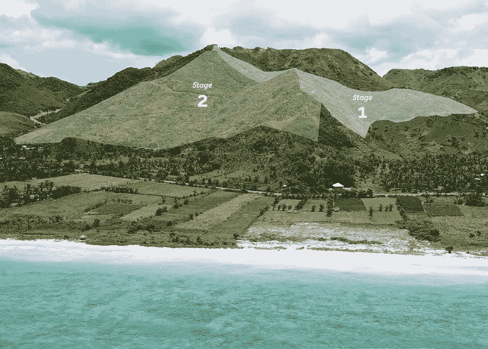
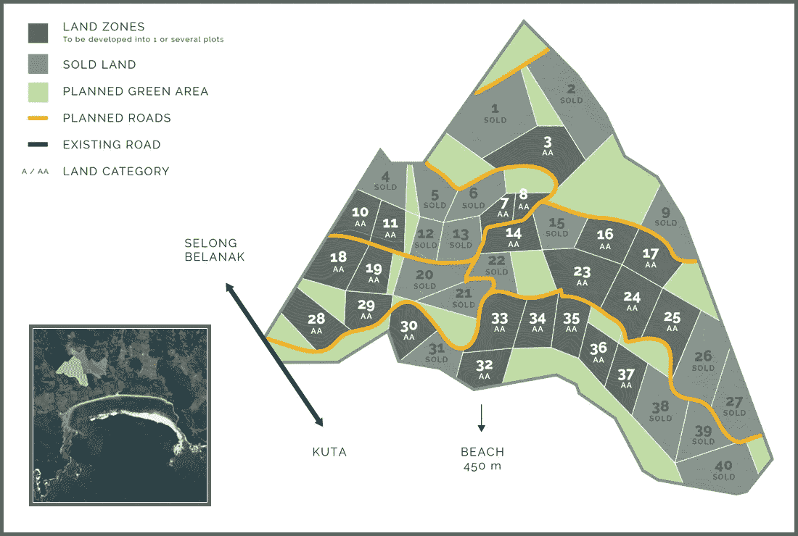
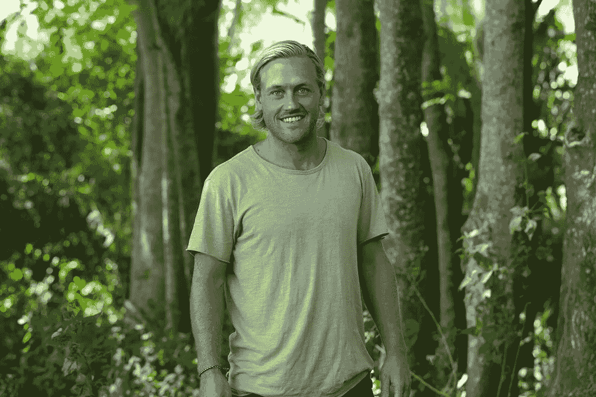

# 当你的事业让你实现梦想时。

> 原文：<https://medium.com/swlh/when-your-business-enables-you-to-live-your-dreams-f525111fb54a>

[Tampah Hills](https://tampahhills.com/) location.

## 与某人的对话，是谁做的。

通过两个我最喜欢的德国 Youtubers 视频，我偶然发现了龙目岛的[海滨社会](https://tampahhills.com/)。当我看到这个项目的时候，我对它的惊人之处感到敬畏。

他们两人一旦亲眼看到这个地方的美丽，就立刻决定搬到那里去。

而且，你必须考虑:

这对他们俩来说一定是个重大的决定。

从一个时刻到另一个时刻，他们已经决定购买龙目岛上的土地，离开他们在德国舒适的家，搬到印度尼西亚的龙目岛。

但我完全理解他们的决定，因为这对任何热爱大自然和炎热天气的人来说都是梦想成真。

从本质上来说，海滨社会，或 Tampah Hills，是一个开放的人社区，居住在龙目岛上最纯净和最原始的海滩之一附近的一座小山上，距离该岛的首都库塔有 15 分钟的路程。

Villa [Sorgas](http://www.villasorgas.com/)

他们正在建造最令人惊叹的别墅，所有的别墅都可以直接看到大海、无限的游泳池和可持续的设计。

这些别墅直接融入了龙目岛的美丽景观，紧邻美丽的蓝色海洋，并可直接到达世界级的冲浪海滩。

但不仅仅是这些别墅，让这个地方变得特别。也是社区本身。所有希望在那里购买土地的人必须首先通过申请程序，表明他们是否适合社区本身。

这是一个由企业家、创意者和各种有远见的人组成的社区。热爱自然、冲浪和可持续发展的人们。人们，正在寻找地球上最纯净的自然景点和令人惊叹的当地和国际社区的结合。

它也将是一个创意中心，有一个内置的共同工作空间和各种设施，允许商业和工作之间的最佳结合。

人们可以工作几个小时，去冲浪，做按摩，打一场网球，然后马上回去工作。

它将允许生活方式和工作之间的最终结合。

另外，整个区域都是以可持续的方式设计的。只使用岛上现有的材料。投资者只能在 30%的购买土地上进行建设。供水将主要依靠雨水。

别墅只会建在不会破坏美妙景色或破坏大部分自然空间的地方。

简而言之，那将是一个你以为只存在于梦中的地方。

# 整个项目是如何开始的。

完成学位后，雅各布·约翰森(现在是 Tampah Hills 的首席执行官)去巴厘岛旅行了六个月。他想在冲浪的同时过着节俭的生活。

只是，他没有留在巴厘岛。

对他来说，巴厘岛游客太多，太拥挤了。

在那里呆了两周后，他的一个朋友打算去龙目岛。所以，他决定加入一会儿。当他去那里冲浪时，他发现了一个小渔村。

他和当地的孩子一起踢足球。并且，他联系了当地的一个家庭。这就是他在剩下的六个月里住的地方——其中一个家庭的出租房。

之后，他回到瑞典，在那里他为天然食品公司做了一段时间的销售工作。

但是有一件事一直萦绕在他的脑海里:

当他在印度尼西亚的时候，他记得曾经买过一双卷边人字拖。考虑到它们非常昂贵，他希望它们能保存相当长的时间。但是三个星期后它们坏掉了。

之后，他买了一双便宜的当地人字拖。令人惊讶的是，它们被证明比 Rip Curl one 的质量好得多，而且它们保持的时间更长。

最终，他联系了生产这些人字拖的公司。该公司总部设在印度尼西亚泗水。

他建议他们开始生产一种新的人字拖，出口到欧洲。那些人字拖会有一些额外的健康益处，因为当使用者行走时，它们使用针压原理来按摩人的脚。

他的想法是，利用这种额外的健康益处作为销售点，他可以利用他在瑞典现有的天然食品商店网络，大规模销售这些人字拖。

这个想法成功了。

三年后，他的企业被一家在瑞典证券交易所上市的公司收购。雅各布留在董事会担任首席执行官。

但是龙目不想离开他的思想。

他真的想重新开始自己的事业。

早些时候，他实际上已经从他的两个姐姐那里借钱买下了龙目岛上的一些土地，并在那里建造了自己的别墅。

他在一家[建筑公司](http://www.tropical-lodging.com/)的帮助下建造了这座别墅，这家公司主要专注于在巴厘岛建造别墅，业主是他的瑞典朋友，他自 1988 年以来一直是巴厘岛的居民(乔纳斯·诺伯格)。

所以他想:

> “为什么不对潜在投资者简化这一过程呢？为什么不为那些希望在海滩附近的美丽地点建造第二个家的人创造一种简单易行的方式，并且所有的工作基本上都是为他们而做的？”

在一个美丽的外国岛屿上建造一个梦想的房子不是一件容易的事情。它包括试图发现一个伟大的位置，解决在外国的所有权问题，并找到值得信赖的建筑公司。

Jakob 的公司将为他们完成所有的工作，而不必经历如此复杂的过程。

因此，雅各布开始寻找最佳地点，就在那个小渔村附近的某个地方，在那里他建造了自己的村庄。他与乔纳斯的建筑公司合作，一起购买了这座山，今天坦帕山就建在这里。

他与一个(景观)建筑师团队一起工作，他们将绘制出该地区的地图，并将其分成不同的地块。这些拍品将被单独出售给不同的投资者。

这意味着，对于每一栋别墅，投资者将直接与内部建筑师团队合作，他们不仅会根据投资者的意愿调整整个设计，还会不断考虑整个地区的设计。

另外，Tampah Hills 还会有一个管理公司，基本上为投资者做所有的工作。

他们不仅负责别墅的管理和维护，还负责整个营销过程，而投资者本人不在他们的(度假)住宅。

通过这种方式，Tampah Hills 对投资者来说是一个机会，不仅可以过上他们梦想的生活方式，还可以最大限度地提高他们的投资回报率。

这对雅各布来说尤其如此，他每年有 9 个月的时间可以在他位于龙目岛的美丽别墅中度过，而其余的时间则与家人在瑞典度过。

一切都是从参观一个小渔村开始的，这个小渔村就在今天的坦帕山所在地附近

# 雅各布为什么要这么做。

Jakob at the Tampah Hills location.

> “现在，我们比以往任何时候都更加生活在一个全球化的社会中。你很了解它，因为你在国外旅行和工作。越来越多的人想这样做。我们将为许多人创造将这变成现实的可能性，以一种让他们更容易的方式。
> 
> 这就是我为什么要这样做的原因，首先，因为我喜欢这个地区，我喜欢做生意。这让我可以把生活和工作结合起来，同时过上自己想过的生活。所以对我来说，Tampah 是一个你可以生活、玩耍和工作的地方。”—雅各布·约翰森

当我通过这两个 Youtubers 用户的眼睛看到 Tampah Hills 时，我马上就能看到这一点。

这也是我如此热爱这个项目的原因。

我真的对雅各布如何能够为自己建立一个企业印象深刻，这将使他能够过上他在最疯狂的梦想中想象的生活方式。没有多少人有能力这样做。

他看到了一个除了原始美什么都没有的地方，并找到了一种将它变成一个项目的方法，这不仅能使他过上他想要的生活，也能使其他人也能这样做。

这就是拥有愿景并将其变为现实的含义。

雅各布不是从一个地方开始的，在那里他有无限的资源。他只是单纯的爱上了龙目岛，一步一步的找到了将这个美丽的小岛融入自己生活的方法。

他建立了一个真正为他自己、他的生活方式和他自己的兴趣而设计的企业。同时，这项业务的存在不仅仅是为了钱。它旨在为各个层面的每个人创造一个双赢的局面。

这将为当地人创造至少 100 个工作岗位。

它会保持这个地方的美丽。

这将为投资者提供一种在一个极其美丽的外国投资房产的简便方法。

但这些都不是凭空而来的。所有这一切都发生在许多年的时间里，在此期间，他采取了不同的步骤，将他带到了 Tampah Hills 的创建。

从第一次去渔村开始。他的人字拖生意。在龙目岛上建造自己的别墅。

一直到这一点，在那里他构思了让他自己的梦想也能为其他人实现的想法，后来又把这个想法变成了现实。

# 结论:

> 最令人惊叹的商业是那些生活和商业交织在一起，形成一个整体，使业主能够把他在生活各个方面的梦想变成现实。

要做到这一点，你需要敏锐地意识到你想要自己的生活是什么样子。你需要不断探索，慢慢了解你是谁，你想从生活中得到什么。

你需要不断问自己:

> 我理想的生活方式是什么样的？我能做什么样的生意，能让我有一天到达那里？

当然，你不能指望事情会很快发生。这是一个过程，需要很多年。

如果你不断探索自己的兴趣，对不同的机会保持开放，不断了解自己，那么你的愿景就会慢慢开始变得越来越清晰。

对某样东西的爱，不管那是什么东西，都可以变成最惊人的机会。

睁大你的眼睛。

也许，有一天，你会建立自己的梦想事业。一个让你既能工作又能娱乐的行业。

页（page 的缩写）学生:

如果你渴望通过乔恩·奥尔森(职业自由滑雪者和 vlogger)的视角来看看坦帕山，他也是坦帕山的投资者，你可以在这里找到他的视频。

*蒂姆·雷蒂格著有《* [*】奋力前行:拥抱奋斗。实现你的梦想*](https://www.amazon.com/dp/B07DK6QSLN) *”。这是一本关于奋斗的心理旅程的书，每个(有创造力的)企业家都必须经历这一过程，然后才能将愿景变成现实。*

## 这篇文章发表在《初创企业》杂志上，这是 Medium 最大的创业刊物，有 333，853 人关注。

## 订阅接收[我们的头条新闻](http://growthsupply.com/the-startup-newsletter/)。

