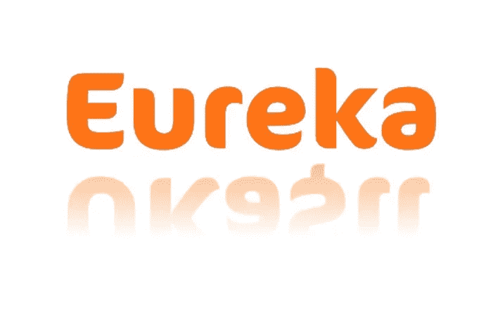

# 当你的创业成为一种思维***！

> 原文：<https://medium.com/swlh/when-your-start-up-becomes-a-mindf-a26cae10d127>

# 区块链奖励和电子商务平台的制作:创业之旅——第三部分

Where to go From Here, by Blaumohn [www.deviantart.com/blaumohn](https://www.deviantart.com/blaumohn/art/Where-to-go-from-here-214712097)

> “我怀疑我是否还会回到公司工作。一旦看到光明，就没有回头路了”。— Magnus Jepson，[*woo commerce*](https://woocommerce.com)*联合创始人。*

我上周提到过，开创自己的事业会给人启发和鼓舞。每一天的每一秒，你都活在你的思想中，呼吸着你的思想。如果你不是，你可能会失败。即使你是，也不能保证成功。如果你是一个有创造力的人，想出点子可能很容易，但是能够执行它们才是最重要的，而且让事情按照你预想的方式发生取决于你自己。你可能会也可能不会依赖他人来完成某些任务。不管怎样，任何偏离你所看到的道路的重大变化都是对你存在的挑战。

试图建立一家初创企业的旅程，在某种程度上成为了教科书上对精神操的定义。就像肉体一样，它可以是伟大的，也可以是可怕的。

我对区块链和智能合约了解得越多，就越让我兴奋。可以做的事情的潜力是巨大的。虽然区块链适合奖励计划是显而易见的，但我开始思考如何利用它来提高生活水平。我住在伊斯坦布尔，那里的交通拥堵问题令人难以忍受，原因是司机公然违反交通规则。如果得到其他政府法规的支持，我可以看到如何通过实施与加密钱包和智能合同挂钩的自动实时罚款系统来根除这一问题。但那不是我要解决的问题，我需要专注于我们之间的问题。最直接的原因是我们还没有成立公司，我们选择的第二个名字是——RiSE！— [已经被另一种加密货币](/@mustafa_ukasii/https-medium-com-mustafa-ukasii-making-of-an-ico-journey-of-a-start-up-part-2-to-blockchain-or-not-9ae17ad42ee2)取走。

另一个电话是与管理团队安排的，他们赞助了一个更大的项目，包括一家航空公司和一个机场。我告诉他们我们不能用“崛起”这个名字因为它已经被使用了。我还没来得及继续，名字又开始被随意提供。这些都和我们设计的程序没有任何关系。

即使在最好的情况下，电话会议也极具挑战性。当你有很多人从不同的地方连接时，情况就更是如此。当你不认识对方，也没有见过面的时候，更是如此。我让自己保持沉默，不相信地听着。

"来点健康的怎么样？"提供给某人。

“Wellness”，这其实是一个很好的名字，”另一个人说。

"像公斤和克这样的东西怎么样……？"(我不骗你！)另一个人说。

显而易见的是，尽管我已经多次分享了[区块链奖励计划和电子商务平台](http://www.ukasii.com)的 POC(概念证明),以及商业案例，但没有人对其进行过任何深入的分析。更重要的是，幸运的是我当时是静音的。

我深吸一口气，按下“取消静音”，跳了进去。

“不好意思，不好意思，我得打断一下！”我说，也许比我预想的更大声、更咄咄逼人。“恕我直言，你们都认为我们是在尝试创建另一个常旅客计划，但我们不是！”

我不知道公斤、克或健康与飞行常客计划有什么关系，但这是我能说的最有外交辞令的话。如果我说出了我的真实想法，桥梁会被烧到需要以纵火罪起诉的程度。

"[这首先是一个移动返现计划，具有强大的奖励计划和电子商务方面的](http://www.ukasii.com)！"

我接着滔滔不绝地列举了一些关于奖励计划的统计数据，以及普通消费者是如何成为 x 个计划的成员的，这些计划中的大多数都被遗忘或很少使用，以及我们如何不想成为其中之一。我们必须成为一个[返现计划](http://www.ukasii.com)，在那里我们的客户每天都在使用我们。如果没有发生这种情况，这个计划注定要失败。这就是为什么我们需要被视为金钱。这就是为什么我们决定利用移动技术和区块链，并为我们的[区块链奖励计划设计概念，这样返现奖励](https://ukasii.com/home-blockchain-rewards-loyalty-ecommerce-en#what-is-ukasii-blockchain-loyalty-rewards-ecommerce-section)代币就可以像“现金”一样使用。

他们拿到了。

然后，我建议他们都认真考虑“UKashi”这个名字，并强调这个名字不是我想出来的，还解释了它是如何从祖鲁语的“Ukheshi”一词演变而来的。

每个人都认为这是独一无二的，也是合适的。没有人反对。然而，需要对这个名字进行尽职调查，以确保它没有被使用。同样，这是项目发起人的责任，通过一个机构来完成。然而，我没有把握他们什么时候会着手做这件事，我在谷歌上快速搜索了一下，结果发现英国已经有一个 Ukash 了！虽然他们已经在 2015 年停止运营，但这个名字太接近了。我崩溃了。

www.ukasii.com

我通过 Skype 给 Rob 发消息告诉他这个消息。

“伙计，英国有家公司叫 Ukash。我们不能使用 UKashi”。

“他妈的没门！!"这是他立即的反应，接着是短暂的停顿，我几乎能听到他透过屏幕在思考。“但是如果它没有在非洲注册，我们就不会有问题”他回复道。

“我不知道这一点，但我们需要着眼于长期，而不仅仅是眼前的市场……”

他的回答出现在我的屏幕上，“你说得对。让我给赞助商发一封电子邮件，请他们检查一下哪些国家我们可以使用 Ukasi，哪些国家不可以……”

他拼错了。罗柏把 UKashi 拼错成了“Ukasi”。

乌卡西…乌卡西…尤里卡！

“大副就是这个名字！你拼错了 UKashi，但你找到了这个名字！我们去掉“h”加一个“I”！ [UKasii](https://www.ukasii.com) ！”

我们立即与项目发起人的负责人通了电话，他同意以 UKa$ii 的名字在伦敦注册公司，并在接下来的一周与我们的潜在投资者会面。事情突然变得更快了。

但是那一周一直没有到来…

[**继续第 4 部分**](/swlh/what-guns-n-roses-and-entrepreneurs-have-in-common-d263e5cc73bc)

[**在 Twitter 上关注我们**](https://twitter.com/UKasii)

## 这篇文章发表在 [The Startup](https://medium.com/swlh) 上，这是 Medium 最大的创业刊物，拥有+385，662 名读者。

## 在此订阅接收[我们的头条新闻](http://growthsupply.com/the-startup-newsletter/)。

