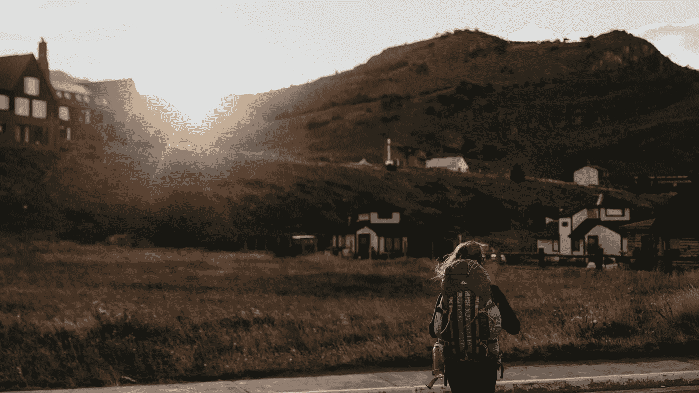

# 当你的整个思维方式突然需要改变的时候。

> 原文：<https://medium.com/swlh/when-your-whole-way-of-thinking-suddenly-needs-to-change-e5d7855c9bc5>

Photo by [Sweet Ice Cream Photography](https://unsplash.com/photos/mve7iIB4DLE?utm_source=unsplash&utm_medium=referral&utm_content=creditCopyText) on [Unsplash](https://unsplash.com/?utm_source=unsplash&utm_medium=referral&utm_content=creditCopyText)

## 我正处于职业生涯的重要十字路口。

直到现在，我一直是孤独的作家。不管我愿不愿意向别人承认，事实是，这就是我过去五六年的生活。

当然，我并不总是专门写作。在这段时间里，我参与了不同的项目和初创企业，其中一些是团队项目。

但在我职业生涯的大部分时间里，只有我一个人。

虽然我可能对职业上的孤独抱怨过很多(我们不是都抱怨太多了吗…？)，总的来说，我对这个角色很满意。其实我自己大概也是这样选择的，即使我自己也不愿意承认。

我坚信应该把一个人的全部注意力集中在创造的过程上。除了你自己，不对任何人承担任何职业责任，这非常有助于把一个人的工作做到最好。

然而，最近我的心态开始慢慢转变。我真的不知道是什么开始了这整个过程。

但是有些事情，我突然意识到:

> 如果你只是一个孤独的作家，坐在你的笔记本电脑前与世界分享你的想法，你怎么能产生真正的影响呢？

当然，会有人喜欢你的作品。人们，几乎消费你生产的所有东西。

**但问题是:**

人们只是消费你的内容，还是真的主动改变自己的生活？

我发现视频制作人比大多数作家更擅长某一件事。他们更擅长建立一个真正的社区，团结在一个共同的目标下。

简而言之，我决定不再做一个孤独的作家，与世界分享自己的想法，而是专注于建立一个人人社区，所有人都和我有着相同的理想。

> 这将是一个创作者的社区，他们互相帮助…
> 
> ……拥抱多年的奋斗，这是建立有意义的东西所必需的。
> 
> …始终专注于向前迈进的过程，一步一个脚印。
> 
> …不是退出。因为只有当你放弃的时候，你才是真正的失败。

# 心态(和行动)的改变。

我很快意识到，我思维方式的这种改变，不仅需要我用我看待职业生涯的方式来看待。这也需要我在日常生活方面做出重大改变。

虽然我以前把 100%的注意力都放在写作过程上，但现在我不得不减少创作时间，以便建立关系，让人们参与到社区中来。

> 我必须从一个孤独的作家转变成一个社区领袖。伴随着这一切。

你可以想象，这对我来说并不容易。

我选择成为一名作家，正是因为我喜欢独处，同时专注于创造性和我的手艺。所以，我热爱创作的过程。但我也是一个性格内向的人。

这并不意味着，我很害羞。

这只是意味着，我从独处中获得能量。*(作为一个小旁注:这一般就是内向的意思。内向的人不一定羞于接近他人。，正如普通的感知告诉我们的那样)。*

**所以，这里有一些具体的变化，这种新的心态将需要:**

1.  从 100%专注于想法的产生和生产，到把我的时间分配在想法产生和帮助他人在他们自己的生活中实现这些想法上。
2.  从完全控制我自己的工作，到依靠我和整个社区的共同创造。
3.  从建立我自己的工作体系，到慢慢建立一个共同的信仰体系，社区成员每天都生活在这个体系中，并互相帮助在他们自己的生活中实现这个体系。
4.  从独自构建我的愿景，转变为让其他人参与进来，一起为共同的事业而努力。
5.  从创造者的心态转变为主要为他人服务的人的心态。

# 以下是我在改变心态的过程中学到的一些经验。

Photo by [Steven Spassov](https://unsplash.com/photos/jtTqIwvGiUg?utm_source=unsplash&utm_medium=referral&utm_content=creditCopyText) on [Unsplash](https://unsplash.com/search/photos/thinking?utm_source=unsplash&utm_medium=referral&utm_content=creditCopyText)

**学到的第一课:**

回到旧习惯是很容易的。大多数时候，我还是想专注于写作。但是我现在不得不抽出时间来思考大问题，或者只是专注于与人建立关系。

简而言之，我需要为这些新行为安排具体的时间。

否则它们将永远不会发生。

**第二个教训:**

当你试图以如此激烈的方式改变你的思维定势时，你会感到非常不舒服。你不断地对你正在做的事情产生怀疑。

你的大脑一直告诉你，坚持旧的方式会容易得多。在这个过程中各种事情都可能出错。你不是这样的人。

我必须认清这些事情的本质:

思念和烦恼，终究会过去。

事实上，我变得不舒服，我开始变得担忧，这告诉我，我走上了正确的道路。我正在离开我的舒适区，在我的职业生涯中做一些真正的改变。

**第三个经验教训:**

一步一个脚印的进步要好得多。我确信，如果我在六个月前，也就是我刚开始在 Medium 上工作的时候，尝试建立这个社区，事情永远不会成功。

在过去的六个月里，我什么也没做，只是专注于创作的过程。我只在 Medium 上写过文章，其他什么都没做过。没有社交媒体。没有营销。没有副业。

现在，我已经准备好接受另一个项目。

> 在这六个月的时间里，我已经养成了每天制作一定量内容的习惯。

现在，我将在现有的工作中增加一项职责。我会稍微少写点东西，并把由此产生的时间投入到社区建设上。

我会慢慢来，对未来不抱任何期望。

就像我六个月前开始在 Medium 上发表文章时一样。

# 结论:

> 有时，我们会到达一个点，在那里我们必须改变我们多年来建立起来的某些思维模式。现在是我们慢慢进入生活新阶段的时候了。

我的才刚刚开始。

但是我的感觉告诉我，这将导致一个明显不同的我。我很想知道这将会如何发展。

“问题”是，这样的转变让我们非常不舒服

这让我们害怕，因为我们无法预测这一切的结果会是什么。它会暂时降低我们的生产力和幸福感，因为我们面对的是自己的负面想法。

在这种时候，我们需要继续努力。

我们需要学会带着所有的怀疑、担忧和负面情绪生活。我们需要拥抱转变成我们自己的新版本的斗争。我们需要相信这个过程，以及它的发展方向。

简而言之，我们需要继续奋斗。因为如果我们这样做了，那么变化最终会转化为进步。

最后，一个更好的自我。

**如果你觉得这篇文章有用请做👏并与你的朋友分享。记住，你最多可以鼓掌 50 次——这对我真的很重要。**

如果你有兴趣加入这个新的社区，你也可以给 rettigtim@gmail.com 发一封电子邮件，了解更多信息。

## 这篇文章发表在 [The Startup](https://medium.com/swlh) 上，这是 Medium 最大的创业刊物，有 323，834+人关注。

## 订阅接收[我们的头条新闻](http://growthsupply.com/the-startup-newsletter/)。

