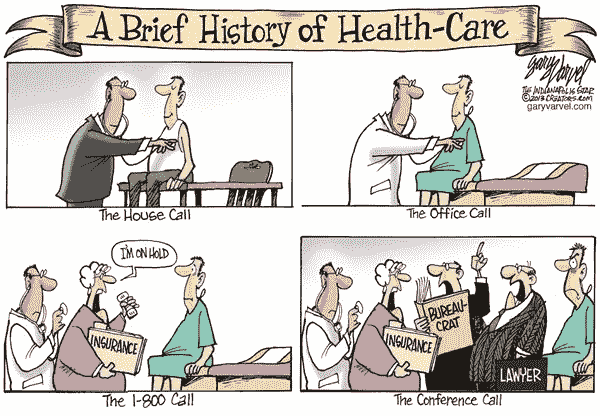
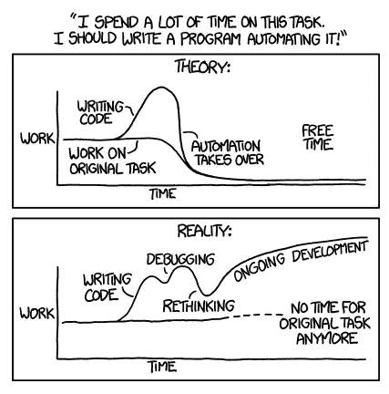
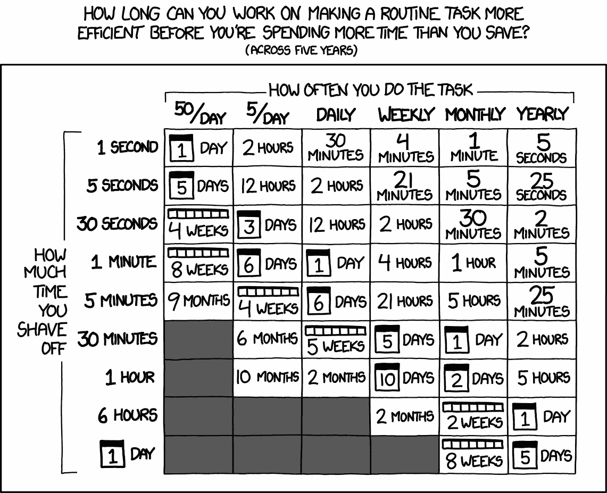

# 我们可以通过自动化在哪些方面降低医疗支出

> 原文：<https://medium.com/swlh/where-can-we-reduce-medical-spending-with-automation-b8e3f895c167>

轻松？

在我们为医院和保险公司工作的这些年里，有许多类似的问题导致了不必要的成本增加。像许多其他行业一样，医疗保健提供商[正面临着成本急剧上升](https://www.pwc.com/us/en/industries/health-industries/library/behind-the-numbers.html)和利润下降的局面。与有能力开发技术来帮助其基本运营自动化和规模化的科技公司不同，医院和医疗保健提供商没有这种能力。由于缺乏自动化和流程改进，这导致多项管理和分析成本逐年增加。我们已经看到给医疗保健提供商带来沉重负担的一些最大成本是计费和财务流程、欺诈检测和第三方合同管理。如果医疗保健提供商希望开始降低一些最大的成本，就需要在这三个领域进行自动化和流程改进。

# 计费和财务分析

管理账单和财务分析可能是非常乏味的任务，需要结合会计纪律和企业家精神。它们是管理支出和收入所必需的实践。

Is this automation?

问题是，即使在[价值数十亿美元的医疗保健组织也缺乏自动计费和财务流程](https://healthitanalytics.com/news/39-of-providers-still-use-excel-for-data-analytics-reports)。相反，数十万到数百万美元通常是在 excel 电子表格中手动管理的。获取数据然后进行分割的过程浪费了分析师的时间。由于这些财务任务不可扩展，因此有很多方式会给财务团队带来压力。随着医院和保险提供商的合并和发展，这个问题变得更加严重，手动管理变得更加困难。通常，医院会通过增加员工来解决这个问题，而不是创建一个可以继续扩展基本财务分析和计费的流程或系统。这导致运营成本增加，在不裁员的情况下很难管理这些成本(这还没有考虑到招聘、解雇、重新招聘等成本)。

解决方案是自动化(麦克风下降…).

好吧，自动化说起来容易做起来难。

它需要多个利益相关方的共同参与，以从财务上支持项目，并获得阅读这些自动化系统的报告和输出的董事和经理的信任。然而，如果执行得好，这些系统可以减少数百小时的人工工作。

这看起来很复杂，但通常自动化，如果做得好，其实并不复杂。很多时候，它实际上简化了分析师的总体工作量。在基本 SQL 中可能需要一些[升级](http://www.acheronanalytics.com/python-sql-and-r-trainings.html)。然而，我们生活在一个数据驱动的世界，SQL 是数据语言(即使是 NOSQL 数据库也有 SQL 层，因为这是我们人类所理解的)。

如果您的团队不具备自己构建工具的技能，那么就去寻找它。[自动化顾问和工程师](http://www.acheronanalytics.com/data-engineering-and-automation.html)可以在内部和外部找到。一旦主要系统建成，就可以由编程和自动化知识较少的人来维护。自动化将有助于提供一致性，减少浪费，并让您的分析师专注于更重要的工作。

# 欺诈检测

[欺诈检测和裁决是保险提供商的必要做法](http://www.acheronanalytics.com/fraud-and-anomaly-detection.html)。这是因为医疗欺诈每年造成数十亿澳元的损失。它来自病人和医疗保健提供者，他们收取数百万美元的升级编码和浪费的程序，纯粹是为了支持他们的底线。事实上，甚至有顾问和网站专门帮助医疗保健提供者创造性地开出账单，并最大限度地满足他们的要求。这些做法不会增加保险提供商的成本，但最终会增加患者的成本。

保险提供商不得不付钱给分析师，让他们花时间人工检查索赔，寻找可能的滥用模式。如果你注意到，这里也发生了同样的问题。问题是手动步骤。医疗帐单和索赔处理变得太大，无法有效地手动处理。手动处理索赔的解决方案无法扩展。这就是自动化、大数据、数据仓库和分析工具发挥作用的地方。它们允许专家创建系统来有效地管理数据，甚至在数据增长时进行扩展。

目前，大多数保险提供商都有欺诈检测团队，但他们通常只能处理一小部分索赔(即使是价值十亿美元的公司通常也只能手动处理大约 5–10%的索赔)。

有时，他们甚至会雇佣外部公司再次手动检查，寻找容易摘到的水果。例如， [billing consultants 发现，在威斯康星州](https://www.compassphs.com/blog/physician-upcoding-does-it-happen-if-so-how/)(最高级别的门诊就诊)的 99215 个代码中，有 78%被错误地使用。这是一个很容易发现的问题，它会很快变得非常昂贵。

所有这些通常仅限于手动流程。将数据库中的数据提取到 excel 中，然后对输出进行切片。自动化方法的美妙之处在于，它们可以快速减少需要手动处理的索赔数量。

更好的是，一旦你创建了一个系统，你就可以有规律地复制结果。即使分析师离开，新员工接替他们的位置，培训他们理解一个有效系统的结果也比让他们重新学习在原始数据中寻找什么要容易得多。这增加了保险提供商裁定的索赔数量，同时提高了流程的效率。

许多人认为，当你刚开始开发模型时，你需要复杂的机器学习算法来检测欺诈，而你的数据甚至还没有分类。然而，在开始的时候，重要的是要集中精力将你的分析师会关注的目标索赔数量减少 60%、70%或 80%。这不需要复杂的算法。它需要开发基本的业务规则来帮助解决误报。

在正确管理索赔并跟踪哪些是欺诈，哪些不是之后，开发机器学习模型就更容易了，因为你的数据是分类的(欺诈，而不是欺诈)。

对于许多医疗保健提供商来说，欺诈检测和裁决是一个缓慢且成本高昂的过程。自动化和执行良好的分析可节省数千至数十万美元。

第三方和合同管理

让一些系统自动化和集成的方法之一是使用第三方。医院、保险提供商和其他医疗保健机构不是科技公司。他们不专注于开发技术工具来帮助他们的日常运作，这是可以的！不可以的是不断与新的第三方签订合同，以获得多余的功能。例如，为多种数据可视化工具付费是没有意义的，比如 Tableau、Quilk 和 OBIEE 都提供了报表功能，然而一些公司使用了所有三种甚至更多。依赖多种金融体系也可以说是类似的事情。

拥有多余的第三方合同会导致几个问题。第一，也是最明显的是不可控的运营成本。除了签署多份合同的前期成本之外，还需要更多的员工来管理系统、管理合同和处理账单。如果不为提前毁约支付高额费用，这些合同也很难毁约。因此，减少冗余非常重要，因为其成本将超过合同成本。

第二个问题是，这些系统没有简单的方法来访问它们背后的数据。无法访问自己的数据是一个问题。如果你不知道你的机构正在发生什么，就很难做出好的财务决策。当您依赖第三方软件时，您需要了解您的合同条款和该软件的功能。否则，你的费用会无处增长，你将无法做出好的决定。

诸如计费、欺诈检测和合同管理等管理成本正在推高保险提供商、医疗保健系统和患者的医疗保健成本。通过一点自动化和流程管理，这些成本中的许多可以开始减轻。通过结合使用 [SQL 和 python](http://www.acheronanalytics.com/python-sql-and-r-trainings.html) ，可以实现计费和财务分析等流程的自动化。合同管理需要结合过程改进和对以前合同的分析。最终，这一切都可以带来可扩展的成本节约，这种节约可以系统地发生，并且不需要持续的手动干预。

## 这篇文章发表在[《创业](https://medium.com/swlh)》上，这是 Medium 最大的创业刊物，拥有+405，714 人关注。

## 订阅接收[我们的头条新闻](http://growthsupply.com/the-startup-newsletter/)。

